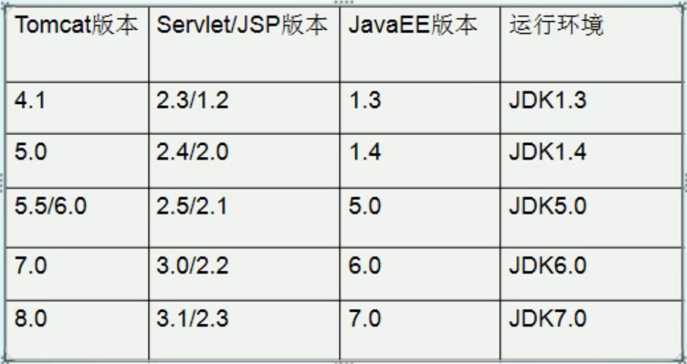
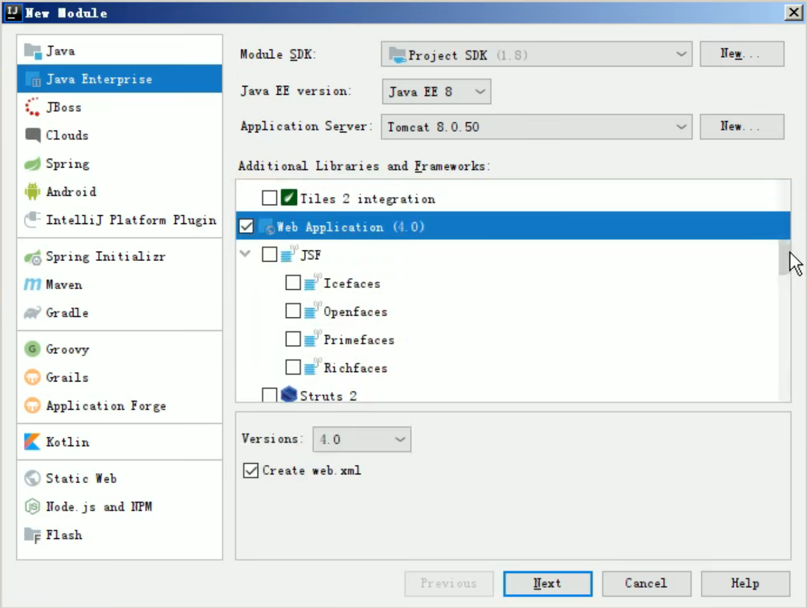
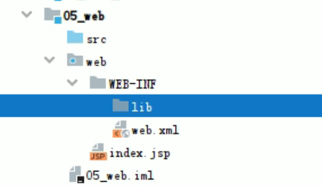
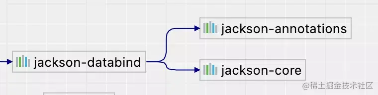

# JavaWeb

## 1 基本概念

## 2 Web 资源的分类

- 静态资源：html、css、js、txt、mp4、jpg
- 动态资源：jsp 页面、servlet 程序

## 3 常用的 Web 服务器

- Tomcat：轻量级的 JavaWeb 容器
- Jboss
- GlassFish
- Resin
- WebLogic

## 4 Tomcat 服务器和 Servlet 版本的对应关系



# Tomcat

## 1 安装

## 2 目录介绍

- `bin`：存放服务器的可执行程序
- `conf`：存放服务器的配置文件
- `lib`：存放服务器的 jar 包
- `logs`：存放服务器运行时输出的日志
- `temp`：存放服务器运行时产生的临时数据
- `webapps`：存放部署的 web 工程（一般这里面每一个目录为一个工程）
- `work`：服务器工作时的目录，存放 Tomcat 运行时 jsp 翻译为 Servlet 的源码，和 Session 钝化的目录

## 3 启动 Tomcat

### 3.1 方式一

双击 Tomcat 中 `bin` 目录下的 `startup.bat` 文件。

在浏览器中输入一下地址进行测试：

- `http://localhost:8080`
- `http://127.0.0.1:8080`
- `http://本机真实ip:8080`

常见启动失败的情况：启动后小黑框一闪而过。

原因：没有配置好 `JAVA_HOME` 环境变量。

### 3.2 方式二

进入 Tomcat 中 `bin` 目录下，执行 `catalina run`。

优点：可以看见错误信息。

## 4 停止 Tomcat

- 直接关闭 Tomcat 服务器窗口
- 把 Tomcat 服务器窗口置为当前窗口，然后按 `Ctrl+C` 结束程序的运行
- 双击 Tomcat 中 `bin` 目录下的 `shutdown.bat` 文件（最常用）

## 5 修改 Tomcat 端口号

> - MySQL 默认的端口号为：3306
> - Tomcat 默认的端口号为：8080

如何修改？

找到 Tomcat 中 `conf` 目录下的 `server.xml` 文件并打开，找到如下位置：

```xml
<Connector port="8080" protocol="HTTP/1.1"
           connectionTimeout="20000"
           redirectPort="8443" />
```

可以修改 `port` 属性为你需要的端口号（1024 - 65535）。

修改完以后需要重启 Tomcat 才能生效。

> Http 协议默认的端口号是：80（浏览器默认访问的端口）
>
> 平时我们访问百度，其实是输入了：`http://www.baidu.com:80`

## 6 部署 web 工程到 Tomcat 上

### 6.1 方式一

把 web 工程的目录拷贝到 Tomcat 的 `webapps` 目录下即可。

访问时在浏览器输入：`http://ip:port/工程名/目录名/文件名`

### 6.2 方式二

在 Tomcat 中 `conf/catalina/localhost` 目录下创建如下配置文件：`xxx.xml`

`xxx.xml` 内容如下：

```xml
<Context path="/abc" docBase="E:\..." />
```

说明：

- `path`：工程的访问路径
- `docBase`：工程目录的位置

## 7 默认工程和页面

- 当我们在浏览器中输入访问地址 `http://ip:port/`，没有工程名，默认访问的是 `ROOT` 工程
- 当我们在浏览器中输入访问地址 `http://ip:port/工程名/`，没有资源名，默认访问的是 `index.html` 页面

## 8 IDEA 整合 Tomcat

在设置里找到 `Application Server` 并添加 `Tomcat Server`。

创建动态 web 工程：

创建一个新模块，如下所示：



创建成功后的目录如下：



说明：

- `src`：存放自己编写的 Java 代码
- `web`：存放 web 工程的资源文件，如：html、css、js 文件
- `WEB-INF`：是一个受服务器保护的目录，浏览器无法直接访问到此目录的内容
- `web.xml`：是整个动态 web 工程的配置部署描述文件，可以在这里配置很多 web 工程的组件
- `lib`：存放第三方 jar 包（还需要自己配置导入）

# JSON

> 如今的 WEB 服务、移动应用、甚至物联网大多都是以 **JSON** 作为数据交换的格式。学习 JSON 格式的操作工具对开发者来说是必不可少的。接下来将介绍如何使用 **Jackson** 开源工具库对 JSON 进行常见操作。

## 1 JSON 介绍

JSON 是 ”**JavaScript Object Notation**“ 的缩写，JSON 是一种基于文本的格式，可以把它理解为是一个结构化的数据，这个结构化数据中可以包含：键值映射、嵌套对象、数组等信息。

示例：

```json
{
  "array": [
    1,
    2,
    3
  ],
  "boolean": true,
  "color": "gold",
  "null": null,
  "number": 123,
  "object": {
    "a": "b",
    "c": "d"
  },
  "string": "www.wdbyte.com"
}
```

## 2 Jackson 介绍

Jackson 和 FastJson 一样，是一个 Java 语言编写的，可以进行 JSON 处理的开源工具库，Jackson 的使用非常广泛，Spring 框架默认使用 Jackson 进行 JSON 处理。

Jackson 有三个核心包，分别是 **Streaming、Databid、Annotations**，通过这些包可以方便的对 JSON 进行操作。

## 3 Jackson Maven 依赖

在使用 Jackson 时，大多数情况下我们只需要添加 `jackson-databind` 依赖项，就可以使用 Jackson 功能了，它依赖了下面两个包。



导入依赖：

```xml
<dependency>
    <groupId>com.fasterxml.jackson.core</groupId>
    <artifactId>jackson-databind</artifactId>
    <version>2.13.3</version>
</dependency>
```

## 4 ObjectMapper 对象映射器

`ObjectMapper` 是 Jackson 库中最常用的一个类，使用它可以进行 Java 对象和 JSON 字符串之间快速转换。如果你用过 FastJson，那么 Jackson 中的 `ObjectMapper` 就如同 FastJson 中的 JSON 类。

这个类中有一些常用的方法：

- `readValue()` 方法可以进行 JSON 的反序列化操作，比如可以将字符串、文件流、字节流、字节数组等常见的形式转换成 Java 对象。
- `writeValue()` 方法可以进行 JSON 的序列化操作，可以将 Java 对象转换成 JSON 字符串。

大多数情况下，`ObjectMapper` 的工作原理是通过 Java Bean 对象的 Get/Set 方法进行转换时映射的，所以正确编写 Java 对象的 Get/Set 方法尤为重要，不过 `ObjectMapper` 也提供了诸多配置，比如可以通过配置或者注解的形式对 Java 对象和 JSON 字符串之间的转换过程进行自定义。

## 5 Jackson JSON 基本操作

### 5.1 序列化

示例：

```java
class PersonTest {

    // 创建对象映射器
    ObjectMapper objectMapper = new ObjectMapper();

    @Test
    void pojoToJsonString() throws JsonProcessingException {
        // 创建 person 对象
        Person person = new Person();
        person.setName("aLng");
        person.setAge(27);
        person.setSkillList(Arrays.asList("java", "c++"));

        // 序列化
        String json = objectMapper.writeValueAsString(person);
        System.out.println(json);
    }
}
```

输出结果：

```json
{
  "name":"aLng",
  "age":27,
  "skillList":["java","c++"]
}
```

Jackson 也可以直接把序列化后的 JSON 字符串写入文件或者读取成字节数组：

```java
// 写入文件
mapper.writeValue(new File("result.json"),
                  myResultObject);
// 转换为字节数组
byte[] jsonBytes = mapper.writeValueAsBytes(
                   myResultObject);
// 转换为字符串
String jsonString = mapper.writeValueAsString(
                    myResultObject);
```

### 5.2 反序列化

```java
class PersonTest {

    ObjectMapper objectMapper = new ObjectMapper();

    // 1.直接将 json 字符串转换为对象
    @Test
    void jsonStringToPojo() throws JsonProcessingException {
        String expectedJson = "{\"name\":\"aLang\",\"age\":27,\"skillList\":[\"java\",\"c++\"]}";
        // 反序列化，需要传入待装换对象的 class 文件
        Person person = objectMapper.readValue(expectedJson, Person.class);
        System.out.println(person);
    }
    
    // 2.读取 json 文件并转换
    @Test
    void testJsonFilePojo() throws IOException {
        File file = new File("src/Person.json");
        Person person = objectMapper.readValue(file, Person.class); 
        // 或者：person = mapper.readValue(new URL("http://some.com/api/entry.json"), MyValue.class);
        System.out.println(person);
    }    
    
}
```

## 6 JSON 转 List

上面演示的 JSON 字符串都是单个对象的情况，如果 JSON 是一个对象列表该怎么处理呢？

`PersonList.json`：

```json
[
  {
    "name": "aLang",
    "age": 27,
    "skillList": [
      "java",
      "c++"
    ]
  },
  {
    "name": "darcy",
    "age": 26,
    "skillList": [
      "go",
      "rust"
    ]
  }
]
```

读取它然后转换成 `List<Person>`：

```java
ObjectMapper objectMapper = new ObjectMapper();

@Test
void fileToPojoList() throws IOException {
    File file = new File("src/EmployeeList.json");
    // 反序列化
    List<Person> personList = objectMapper.readValue(file, new TypeReference<List<Person>>() {});
    // 输出结果
    for (Person person : personList) {
        System.out.println(person);
    }
}
```

## 7 JSON 转 Map

JSON 转 Map 在我们没有一个对象的 Java 对象时十分实用，下面演示如何使用 Jackson 把 JSON 文本转成 Map 对象。

```java
ObjectMapper objectMapper = new ObjectMapper();

@Test
void jsonStringToMap() throws IOException {
    String expectedJson = "{\"name\":\"aLang\",\"age\":27,\"skillList\":[\"java\",\"c++\"]}";
    // 反序列化
    Map<String, Object> employeeMap = objectMapper.readValue(expectedJson, 
                       new TypeReference<Map>() {});
    // 打印结果
    System.out.println(employeeMap.getClass());
    for (Entry<String, Object> entry : employeeMap.entrySet()) {
        System.out.println(entry.getKey() + ":" + entry.getValue());
    }
}

// 输出结果
class java.util.LinkedHashMap
name:aLang
age:27
skillList:[java, c++]
```

## 8 Jackson 忽略字段

如果在进行 JSON 转 Java 对象时，JSON 中出现了 Java 类中不存在的属性，那么在转换时会遇到异常：`com.fasterxml.jackson.databind.exc.UnrecognizedPropertyException`

忽略不存在的属性： `objectMapper.configure(DeserializationFeature.FAIL_ON_UNKNOWN_PROPERTIES, false)`

```java
ObjectMapper objectMapper = new ObjectMapper();

@Test
void jsonStringToPojoIgnoreProperties() throws IOException {
    // person 对象中不存在的属性：yyy
    String json = "{\"yyy\":\"xxx\",\"name\":\"aLang\",\"age\":27,\"skillList\":[\"java\",\"c++\"]}";
   
    // 配置转换时忽略掉 json 中多余的属性    
    objectMapper.configure(DeserializationFeature.
                           FAIL_ON_UNKNOWN_PROPERTIES, 
                           false);
    // 反序列化
    Person person = objectMapper.readValue(json, Person.class);
  	System.out.printf(person.toString());
}

// 输出结果
Person(name=aLang, age=27, skillList=[java, c++])
```

## 9 Jackson 日期格式化

在 Java 8 之前我们通常使用 `java.util.Date` 类来处理时间，但是在 Java 8 发布时引入了新的时间类 `java.time.LocalDateTime`。这两者在 Jackson 中的处理略有不同。

先创建一个有两种时间类型属性的 Order 类：

```java
@Data
@AllArgsConstructor
@NoArgsConstructor
public class Order {
  
    private Integer id;

    private Date createTime;

    private LocalDateTime updateTime;
}
```

### 9.1 Date

```java
class OrderTest {

    ObjectMapper objectMapper = new ObjectMapper();

    @Test
    void testPojoToJson0() throws JsonProcessingException {
        Order order = new Order(1, new Date(), null);
        
        // 序列化
        String json = objectMapper.
                      writeValueAsString(order);
        System.out.println(json);

        // 反序列化
        order = objectMapper.
                readValue(json, Order.class);
        System.out.println(order.toString());

        Assertions.assertEquals(order.getId(), 1);
    }

}

// 输出结果
{"id":1,"createTime":1658320852395,"updateTime":null}
Order(id=1, createTime=Wed Jul 20 20:40:52 CST 2022, updateTime=null)
```

可以看到正常的进行了 JSON 的序列化与反序列化，但是 JSON 中的时间是一个时间戳格式，不具有可读性。

### 9.2 LocalDateTime

为什么没有设置 `LocalDateTime` 类型的时间呢？因为默认情况下进行 LocalDateTime 类的 JSON 转换会遇到报错。

```java
class OrderTest {

    ObjectMapper objectMapper = new ObjectMapper();

    @Test
    void testPojoToJson() throws JsonProcessingException {
        Order order = new Order(1, new Date(), LocalDateTime.now());
        // 序列化
        String json = objectMapper.
                      writeValueAsString(order);
        System.out.println(json);

        // 反序列化
        order = objectMapper.
                readValue(json, Order.class);
        System.out.println(order.toString());
    }
    
}
```

运行后会遇到报错：

```java
com.fasterxml.jackson.databind.exc.InvalidDefinitionException: 
			Java 8 date/time type `java.time.LocalDateTime` not supported by default: 
				add Module "com.fasterxml.jackson.datatype:jackson-datatype-jsr310" 
          to enable handling (through reference chain: com.wdbyte.jackson.Order["updateTime"])

```

这里我们需要添加相应的数据绑定支持包：

```xml
<dependency>
    <groupId>com.fasterxml.jackson.datatype</groupId>
    <artifactId>jackson-datatype-jsr310</artifactId>
    <version>2.13.3</version>
</dependency>
```

然后在定义 ObjectMapper 时通过 `findAndRegisterModules()` 方法来注册依赖：

```java
class OrderTest {

    // 注册依赖
    ObjectMapper objectMapper = new ObjectMapper().findAndRegisterModules();

    @Test
    void testPojoToJson() throws JsonProcessingException {
        Order order = new Order(1, new Date(), LocalDateTime.now());
        // 序列化
        String json = objectMapper.writeValueAsString(order);
        System.out.println(json);

        // 反序列化
        order = objectMapper.readValue(json, Order.class);
        System.out.println(order.toString());

        Assertions.assertEquals(order.getId(), 1);
    }
}
```

运行可以得到正常序列化与反序列化日志，不过序列化后的时间格式依旧奇怪：

```java
{"id":1,"createTime":1658321191562,"updateTime":[2022,7,20,20,46,31,567000000]}
Order(id=1, createTime=Wed Jul 20 20:46:31 CST 2022, updateTime=2022-07-20T20:46:31.567)
```

### 9.3 时间格式化

可以通过在实体类的字段上使用注解 `@JsonFormat` 来自定义时间格式。

```java
@Data
@AllArgsConstructor
@NoArgsConstructor
public class Order {

    private Integer id;

    @JsonFormat(pattern = "yyyy-MM-dd HH:mm:ss", timezone = "Asia/Shanghai")
    private Date createTime;

    @JsonFormat(pattern = "yyyy-MM-dd HH:mm:ss", timezone = "Asia/Shanghai")
    private LocalDateTime updateTime;
}
```

再次运行上面的列子可以得到时间格式化后的 JSON 字符串：

```java
{"id":1,"createTime":"2022-07-20 20:49:46","updateTime":"2022-07-20 20:49:46"}
Order(id=1, createTime=Wed Jul 20 20:49:46 CST 2022, updateTime=2022-07-20T20:49:46)
```

## 10 Jackson 常用注解

### 10.1 @JsonIgnore

使用 `@JsonIgnore ` 可以忽略某个 Java 对象中的属性，它将不参与 JSON 的序列化与反序列化。

```java
@Data
public class Cat {

    private String name;

    @JsonIgnore
    private Integer age;
}

class CatTest {

    ObjectMapper objectMapper = new ObjectMapper();

    @Test
    void testPojoToJson() throws JsonProcessingException {
        Cat cat = new Cat();
        cat.setName("Tom");
        cat.setAge(2);
        String json = objectMapper.
                      writeValueAsString(cat);
        System.out.println(json);

        cat = objectMapper.readValue(json, Cat.class);
    }

}

// 输出结果中不包含 age 属性
{"name":"Tom"}
```

### 10.2 @JsonGetter

使用 `@JsonGetter` 可以在对 Java 对象进行 JSON 序列化时自定义属性名称。

```java
@Data
public class Cat {

    private String name;

    private Integer age;

    // 对象的 name -> json 的 catName
    @JsonGetter(value = "catName")
    public String getName() {
        return name;
    }
}

class CatTest {

    ObjectMapper objectMapper = new ObjectMapper();

    @Test
    void testPojoToJson2() throws JsonProcessingException {
        Cat cat = new Cat();
        cat.setName("Tom");
        cat.setAge(2);
        String json = objectMapper.
                      writeValueAsString(cat);
        System.out.println(json);
    }
    
}

// 输出结果
{"age":2,"catName":"Tom"}
```

### 10.3 @JsonSetter

使用 `@JsonSetter ` 可以在对 JSON 进行反序列化时设置 JSON 中的 key 与 Java 属性的映射关系。

```java
@Data
public class Cat {
    // json 的 catName -> 对象的 name
    @JsonSetter(value = "catName")
    private String name;

    private Integer age;

    @JsonGetter(value = "catName")
    public String getName() {
        return name;
    }
}

class CatTest {

    ObjectMapper objectMapper = new ObjectMapper();

    @Test
    void testPojoToJson2() throws JsonProcessingException {
        String json = "{\"age\":2,\"catName\":\"Tom\"}";
        Cat cat = objectMapper.
                  readValue(json, Cat.class);
        System.out.println(cat.toString());
    }
    
}

// 输出结果
Cat(name=Tom, age=2)
```

### 10.4 @JsonAnySetter

使用 `@JsonAnySetter ` 可以在对 JSON 进行反序列化时，对所有在 Java 对象中不存在的属性进行逻辑处理，下面的代码演示把不存在的属性存放到一个 Map 集合中。

```java
@Data
@AllArgsConstructor
@NoArgsConstructor
public class Student {
    
    private String name;
    
    private Integer age;
    
    private Map<String, Object> diyMap = new HashMap<>();

    @JsonAnySetter
    public void otherField(String key, String value) {
        this.diyMap.put(key, value);
    }
}

class StudentTest {

    private ObjectMapper objectMapper = new ObjectMapper();

    @Test
    void testJsonToPojo() throws JsonProcessingException {
        Map<String, Object> map = new HashMap<>();
        map.put("name", "aLang");
        map.put("age", 18);
        map.put("skill", "java");

        String json = objectMapper.
                      writeValueAsString(map);
        System.out.println(json);

        Student student = objectMapper.
                          readValue(json, Student.class);
        System.out.println(student);
    }

}

// 输出结果中可以看到 JSON 中的 skill 属性因为不在 Java 类 Student 中，所以被放到了 diyMap 集合。
{"skill":"java","name":"aLang","age":18}
Student(name=aLang, age=18, diyMap={skill=java})
```

### 10.5 @JsonAnyGetter

使用 `@JsonAnyGetter ` 可以在对 Java 对象进行序列化时，使其中的 Map 集合作为 JSON 中属性的来源。

```java
@ToString
@AllArgsConstructor
@NoArgsConstructor
public class Student {
    
    @Getter
    @Setter
    private String name;

    @Getter
    @Setter
    private Integer age;
  
    @JsonAnyGetter
    private Map<String, Object> initMap = new HashMap() {{
        put("a", 111);
        put("b", 222);
        put("c", 333);
    }};
}

class StudentTest {

    private ObjectMapper objectMapper = new ObjectMapper();

    @Test
    void testPojoToJsonTest() throws JsonProcessingException {
        Student student = new Student();
        student.setName("aLang");
        student.setAge(20);
        String json = objectMapper.
                      writeValueAsString(student);
        System.out.println(json);
    }

}

// 输出结果
{"name":"aLang","age":20,"a":111,"b":222,"c":333}
```

### 10.6 Jackson 总结

- Jackson 是 Java 中比较主流的 JSON 处理工具之一，它是 Spring 的默认 JSON 处理工具；
- Jackson 主要有三个模块组成，Streaming API、Annotations 和 Data Binding；
- Jackson 中的 ObjectMapper 类十分强大，可以进行 JSON 相关处理，同时可以结合注释以及配置进行自定义转换逻辑；
- Jackson 的扩展性很好，CSV、XML、YAML 等格式的处理都对 Jackson 有相应的适配。

## 11 参考资料

[Jackson 解析 JSON 详细教程 - 掘金 (juejin.cn)](https://juejin.cn/post/7122993335010066463)
