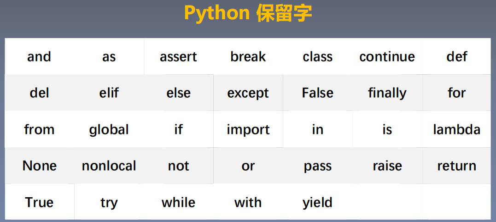
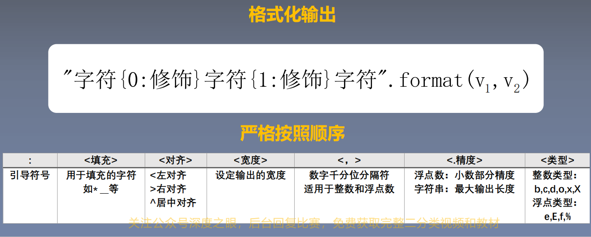
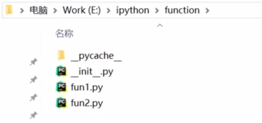
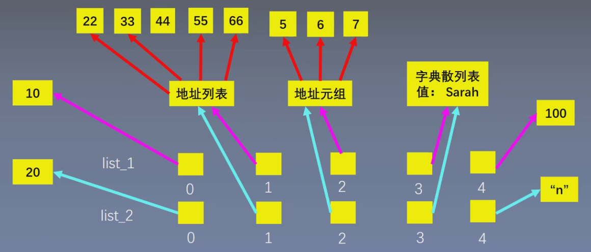
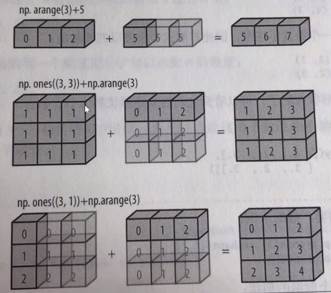
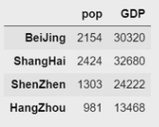
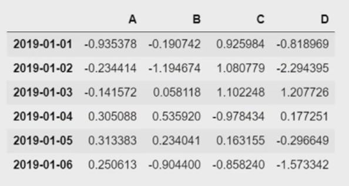
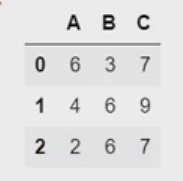
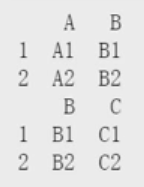
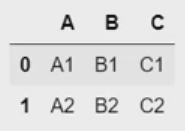

# 基础语法

## 1  数据类型

### 1.1  基本类型

#### 1.1.1  数字

```python
# 1.整型（int）
# 十进制转二进制
a = bin(16) # 0b10000
# 十进制转八进制
b = oct(16) # 0o20
# 十进制转十六进制
c = hex(16) # 0x10

# 转换结果为字符串类型
type(a) # str

# 二进制转十进制
d = int(a, 2) # 16
# 八进制转十进制
e = int(b, 8) # 16
# 十六进制转十进制
f = int(c, 16) # 16

# 2.浮点型（float）
# 计算机采用二进制小数来表述浮点数的小数部分，部分小数不能用二进制小数完全表示，可以四舍五入获得精确解。
(0.1 + 0.2) == 0.3 # False
0.1 + 0.2 # 0.30...04
b = round(0.3, 1) # 只保留1位小数
print(b) # 0.3

# 3.复数（complex）
# j或J都可以
# 虚部为1时，需要显示写出
2+1j
```

> 数据运算：
>
> - 整数与浮点数的运算结果是浮点数。
> - 除法运算的结果是浮点数。（`8/4 = 2.0`）

```python
# 加减乘除
(1+3-4*2)/5

# 乘方
2**3 # 8

# 整数商
13//5 # 2

# 模运算
13%5 # 3

# 绝对值
abs(-5) # 5
abs(3+4j) # 5，对于复数就是求模

# 幂次方
pow(2, 5) # 等价于2**5
pow(2, 5, 3) # 等价于(2**5)%3

# 四舍五入
a = 1.618
print(round(a)) # 2，默认四舍五入为整数
print(round(a, 2)) # 1.62
print(round(a, 5)) # 1.618，位数不足，不会补齐

# 整数商和模运算
divmod(13, 5) # (2, 3)，等价于(x//y, x%y)

# 最大值/最小值
a = [...]
max(a)
min(a)

# 求和
a = [...]
sum(a)
```

#### 1.1.2  字符串

```python
# 用单引号或双引号表示
"abc 123 @ 666"
'abc 123 @ 666'

# 双中有单，单中有双
# 双中有双，单中有单 -> 转义符\ -> 加在"前
print("\"python\" is good")

# 使用转义符\进行换行
s = "py\
thon"
print(s) # python

# 索引
a = "my name is peppa pig"
print(a[0]) # m
print(a[2]) # 空
print(a[5]) # m
# 反向索引
print(a[-1]) # g

# 切片
# 变量名[开始位置:结束位置:间隔]
# 间隔默认为1
# 左闭右开，不包括结束位置
s = "python"
print(s[0:3:1]) # pyt
print(s[0:3]) # pyt
print(s[0:3:2]) # pt
# 起始位置是0时可以省略
print(s[:6]) # python
# 结束位置省略，代表可以取到最后一个字符
print(s[:]) # python
# 可以使用反向索引
print(s[-6:]) # python

# 反向切片
s = "123456789"
# 倒序
print(s[-1:-10:-1]) # 123456789
# 起始位置是-1时可以省略
print(s[:-10:-1]) # 123456789
# 结束位置省略，代表可以取到第一个字符
print(s[::-1]) # 123456789

# 拼接
a = "..."
b = "..."
c = a + b

# 成倍复制
print(c*3)

# 成员运算
# 判断子集
str = "aaa bbb ccc"
"aaa" in str # True
# 遍历元素
for s in "python":
    print(s)

# 长度
s = "python"
len(s) # 6

# 字符编码
# 将中文字库、英文字母、数字、特殊字符等转化成计算机可识别的二进制数
# 每个单一字符对应一个唯一的互不重复的二进制编码
# Python中使用的是Unicode编码
# 字符 -> Unicode码
print(ord("1")) # 49
# Unicode码 -> 字符
print(chr(1010)) # c

# 分割
str = "a b c d"
str_list = str.split(" ") # 按空格进行分割

# 聚合
s = "12345"
s_join = "*".join(s) # "1*2*3*4*5"

# 删除两端特定字符
# 从两侧开始搜索，遇到指定字符执行删除，遇到非指定字符，搜索停止
# 左删除：lstrip
# 右删除：rstrip
s = "   abc   "
print(s.strip(" ")) # "abc"
print(s.lstrip(" ")) # "abc   "
print(s.rstrip(" ")) # "   abc"

# 字符替换
s = "python is good"
s1 = s.replace("python","py")
print(s1) # "py is good"

# 字符统计
s = "python is an excellent language"
print(s.count("an")) # 2

# 全部大写
s.upper()
# 全部小写
s.lower()
# 首字母大写
s.title()
```

#### 1.1.3  布尔

```python
# 布尔值只有True或False
x = 2 < 1 # false

# 只要有一个非0，就是True
# 0 False None 都是 0
print(any([False,1,0,None])) # True

# 全部非0才是True
print(all([False,1,0,None])) # False
```

### 1.2  组合类型

#### 1.2.1  列表

列表（list）：数据有位置顺序。

``` python
a = [1, 2, 3, 4, 5]
a[0] # 1

# 一个列表可以使用多种类型元素
ls = ['python', 1989, True, {"version":3.7}]

# 列表是可变的，可以对元素进行增删改查

# 通过list(可迭代对象)创建列表
# 可迭代对象包括：字符串、元组、集合、range()等。

# 打印0-5，即[0,6)
for i in range(6):
    print(i)
# range(起始数字,终止数字,间隔)
# 起始数字可以省略，默认为0；必须有终止数字；间隔可以省略，默认为1。

# 长度、索引和切片与字符串相同
len(ls)
ls[0]

# 拼接
a = [1, 2]
b = [3, 4]
a + b # [1, 2, 3, 4]

# 成倍复制进行初始化
c = a * 10

# 末尾增加元素
ls.append(...)
# 任意位置插入：insert(插入位置,待插入元素)
ls.insert(1, 8)
# 插入另一个列表
ls.extend([...])

# 根据位置删除元素：pop(删除元素的位置)，默认是删除最后一个元素
ls.pop(1)
# 根据内容删除元素：会删除第一个找到的待删元素
ls.remove(...)

# 查找元素
# 返回列表中第一次出现待查元素的位置：列表.index(待查元素)
languages = ['Python', 'C', 'R', 'Java']
idx = languages.index("R")
print(idx) # 2

# 修改元素
languages[1] = "C++"

# 复制列表（浅拷贝）
# 方式一：copy()
languages_2 = languages.copy()
# 方式二：切片
languages_3 = languages[:]

# 排序（默认递增）
ls = [...]
ls.sort()
# 递减排序
ls.sort(reverse = True)
# 临时排序（原列表保持不变，返回排序后的列表）
ls_2 = sorted(ls)

# 翻转（永久）
ls = [...]
ls.reverse()

# 遍历
for i in ls:
    print(i)
```

#### 1.2.2  元组

元组（tuple）：元素是只读的，不可修改（除了不支持增删改以外，其它的操作和列表完全相同）。

```python
a = (1, 2, 3, 4, 5)
a[0] # 1

# 打包返回
def f(x):
    return x**2, x**3
print(f(3)) # (9, 27)，是一个元组类型
# 解包赋值
a, b = f(3)
print(a) # 9
print(b) # 27

# 打包组合
numbers = [1, 2, 3]
name = ["小明", "小红", "小强"]
list(zip(numbers, name))
# 解包赋值
for number, name in zip(numbers, name):
    print(number, name)
```

#### 1.2.3  字典

字典（dict）：K-V、无序。

```python
students = {111:"小明", 222:"小红", 333:"小强"}
students[111] # 小明

# 长度
len(students) # 3

# 增
students[新键] = 新值

# 删
del students[待删除元素的键]
# 删除的同时获得删除键值对的值
value = students.pop(待删除元素的键)
# 随机删除一个键值对，并以元组返回删除的键值对
k, v = students.popitem()

# 改
students[键] = 新值

# get()
students.get(key, default)

# 分别获取键和值的集合
list(students.keys())
list(students.values())

# 获取键值对的集合并遍历
for k, v in students.items():
    print(k, v)
```

> 注意：字典的键必须唯一，且是不可变类型。
>
> - 不可变类型：数字、字符串、元组。
> - 可变类型：列表、字典、集合。

#### 1.2.4  集合

集合（set）：去重、无序（元素必须是不可变类型：数字、字符串、元组）。

```python
s = {1, 2, 3, 1}
s # {1, 2, 3}

# 取交集
s1 & s2

# 取并集
s1 | s2

# 取s1和s2中的非共同元素
s1 ^ s2

# 取在s1中但不在s2中的元素
s1 - s2

# 增加元素
s.add(...)

# 删除元素
s.remove(...)

# 长度
len(...)
```

## 2  变量

### 2.1  定义

变量的定义：变量名、赋值。

```python
x = 1
```

### 2.2  命名

大写字母、小写字母、数字、下划线、汉字及其组合。

错误命名：

- 第一个字符不能为数字。
- 不能与保留字相同。



命名技巧：

- 变量名、函数名：用 `_` 连接多个单词。
- 类名：驼峰命名。
- 常量：所有字母大写。

### 2.3  赋值

```python
# 1.一般赋值
x = 1 + 2

# 2.增量赋值
x = x + 1
x += 1

# 3.打包赋值
x, y = 1, 2
```

## 3  控制流程

### 3.1  顺序

### 3.2  循环

```python
# for
res = 0
for i in [1, 2, 3, 4, 5]:
    res += i
res # 15

# while
i = 1
res = 0
while i <= 5:
    res += i
    # python没有i++的这种写法
    i += 1
res # 15

# 终止循环：break、continue

# for结合else
# 如果for循环全部执行完毕，没有被break终止，则运行else块。
for i in ...:
    if i == 2:
        break
else:
    # ...

# while结合else（与上面同理）
while ...:
    # ...
else:
    # ...
```

### 3.3  分支

```python
age = 18
if age > 22:
    # ...
elif age > 30:
    #...
else:
    # ...
```

判断是否为空：

```python
# 方式一（最清晰明了）
if x is None

# 方式二
if not x

# 方式三
if not x is None
```

> 注意：在 Python 语言中，`None`、`""`、`0`、`[]`、`{}` 都相当于 `False`。

## 4  IO

### 4.1  读取输入

```python
# input()读取后的数据为字符串类型
x = input("...") # 3
y = input("...") # 4.5
x + y # 34.5
type(x) # str

# 使用eval()去除''
x = eval(input("...")) # 3
y = eval(input("...")) # 4.5
x + y # 7.5
```

### 4.2  打印输出

```python
# 1.一般输出
print("...")
print(123)
x = 123
print(x)
# print()打印后会自动换行
# 使用end控制不换行
print(123, end = 456)
print(789) # 123456789

# 2.组合输出
x = 123
y = 456
print("x = ", x, " y = ", 456) # x = 123 y = 456

# 3.格式化输出
x = 1
y = 2
print("x = {0}, y = {1}".format(x, y)) # x = 1, y = 2
# 保留小数
PI = 3.1415926
print("{0:.2f}".format(PI)) # 3.14
# 百分号
x = 0.81872
print({0:.1%}.format(x)) # 81.9%
# 科学计数法
print({0:.2e}.format(x)) # 8.19e-01
# 进制转换
# ...
```

格式化输出总结：



## 5  函数

### 5.1  定义

函数名使用小写字母、下划线组成。

```python
# 函数的定义
def 函数名(参数):
    # 函数体
    return 返回值

# 函数的调用
函数名(参数)
```

> 注意：多个函数的定义之间一般空两行。

### 5.2  参数

函数的参数：形参、实参。

```python
# 1.位置参数
def function(x, y, z):
    print(x, y, z)
function(1, 2, 3) # x=1, y=2, z=3

# 2.关键字参数
function(y=1, z=2, x=3) # x=3, y=1, z=2
# 混合使用：位置参数必须放在关键字参数的前面。
function(1, z=2, y=3) # x=1

# 3.默认参数
# 位置参数必须在默认参数的前面，调用函数时，可以不对该形参传值。
def register(name, age, sex="male"):
    print(name, age, sex)
register("...", 18)
# 默认参数应该设置为不可变类型（数字、字符串、元组）。
# 默认参数的等号两侧不需要加空格。

# 4.可选参数
def name(first_name, last_name, middle_name=None):
    if middle_name:
        return first_name + middle_name + last_name
    else:
        return first_name + last_name
print("大", "仔")
print("大", "仔", "杰")

# 5.可变长参数
# 不知道会传来多少参数（*args），必须放到参数列表的最后。
def f(x, y, z, *args):
    print(x, y, z)
    print(args)
f(1, 2, 3, 4, 5, 6) # 多余的参数会打包并传递给args
f(1, 2, 3, [4, 5, 6]) # [4, 5, 6]为一个元素
# 实参打散
# 打散的是列表、字符串、元组、集合。
f(1, 2, 3, *[4, 5, 6]) # 4, 5, 6分别是一个元素

# 多余的参数，以字典的形式打包并传递给kwargs。
def f(x, y, z, **kwargs):
    print(x, y, z)
    print(kwargs)
f(1, 2, 3, a=4, b=5, c=6) # {'a':4, 'b'=5, 'c'=6}
# 实参打散
f(1, 2, 3, **{"a":4, "b":5, "c":6}) # {'a':4, 'b'=5, 'c'=6}
```

### 5.3  变量

函数的变量：局部变量、全局变量。

```python
# 使用global在函数体内定义全局变量。
def multipy(x, y):
    global z
    z = x * y
    return z

multipy(2, 9)
print(z) # 18
```

### 5.4  返回值

当函数有多个返回值，使用逗号隔开；函数可以没有返回值。

### 5.5  匿名函数

```python
# 基本形式
lambda 变量: 函数体

# 示例一：排序
ls = [(93, 88), (79, 100), (86, 71)]
ls.sort() # 默认是按每一个元素的第一个数字升序排序
# 使用每一个元素的第二个数字升序排序
ls.sort(key = lambda x: x[1])
# 使用每一个元素两个数字的和升序排序
ls.sort(key = lambda x: x[0]+x[1])

# 示例二：求最大值
# 求每一个元素的第二个数字的最大值
n = max(ls, key = lambda x: x[1])
# 求最小值min同理
```

## 6  面向对象

### 6.1  定义

三要素：类名（驼峰命名法）、属性、方法。

```python
# 创建类
class Cat():
    
    def __init__(self, name):
        self.name = name
        
    def jump(self):
        # ...

        
# 创建对象（实例）   
my_cat = Cat("...")

# 调用属性和方法
print(my_cat.name)
my_cat.jump()
```

> 注意：类的前后都要空两行，清晰美观。

### 6.2  实例

### 6.3  继承

语法：`class 子类名(父类名)`

```python
# 父类
class Car():
    
    def __init__(self, brand, model, year):
        self.brand = brand
        # ...
        self.mileage = 0
        
    def get_main_information():
        # ...
    
    # 其它方法
    

# 子类    
class ElectricCar(Car):
    
    def __init__(self, brand, model, year, battery_size):
        # 声明继承父类的属性
        super().__init__(brand, model, year)
        # 子类特有属性
        self.battery_size = battery_size
        self.electric_quantity = battery_size # 电池容量
        # ...
        
    # 自动继承父类的所有方法（可以重写父类的方法）
    
    # 可以定义子类特有的方法
```

### 6.4  方法

#### 6.4.1  类实例方法

类实例方法的第一个参数 `self` 表示实例本身，通过实例对象调用。

以 `_` 开头的方法，为大家约定俗成的 private 方法，但实际并不影响程序的行为。

#### 6.4.2  类方法

类方法 `@classmethod` 只能访问类变量，并且对类属性进行的处理是有记忆的，在多个实例间共享。

参数 `cls` 指向类本身，允许我们在方法中操作类的属性或调用其他类方法。

类方法可以通过类名或实例对象调用。

```python
class Man:
    id = 0  # 类变量

    def __init__(self, name):
        self.name = name
        self.id = self.id_number()  # self可以访问类变量
    
    @classmethod  # 类方法
    def id_number(cls):
        cls.id += 1
        return cls.id
    
a = Man('A')
print(a.id)  # 1
b = Man('B')
print(b.id)  # 2
```

使用类方法可以提供多个构造函数，提高了实例化对象的灵活性。

```python
class Test:
    def __init__(self, x, y)
        self.x = x
        self.y = y
    
    @classmethod
    def from_string(cls, str):
        x, y = map(int, s.split(','))
        return cls(x, y)
    
obj = Test.from_string('5,10')
```

> 参考资料：
>
> - [python中的类方法(@classmethod)_python class master-CSDN博客](https://blog.csdn.net/leviopku/article/details/100745811)；
> - [深入理解Python中的类方法、类实例方法和静态方法_python 类方法-CSDN博客](https://blog.csdn.net/qq_41586251/article/details/135068371)。

#### 6.4.3  静态方法

静态方法既不需要传递类对象 `cls` 也不需要传递实例对象 `self` 作为第一个参数。

静态方法可以通过类名直接调用，无需创建类的实例，属于类的命名空间中的独立函数。

一般用于工具类中提供的方法。

```python
class Calculator:
    @staticmethod
    def add(x, y):
        return x + y
 
    @staticmethod
    def multiply(x, y):
        return x * y
 
sum_result = Calculator.add(3, 5)
product_result = Calculator.multiply(3, 5)
```

> 参考资料：
>
> - [深入理解Python中的类方法、类实例方法和静态方法_python 类方法-CSDN博客](https://blog.csdn.net/qq_41586251/article/details/135068371)。

#### 6.4.4  魔术方法

魔法方法是方法名前后各有两个下划线的方法，如 `__init__`，可以使用 `类名()` 调用方法。

```python
class MyDict(dict):

    def __add__(self, other):
        self.update(other)
        return MyDict(self)

a = MyDict({'de': 'Germany'})
b = MyDict({'sk': 'Slovakia'})

print(a + b)  # {'de': 'Germany', 'sk': 'Slovakia'}
```

> 参考资料：
>
> - [Python 魔术方法|极客教程 (geek-docs.com)](https://geek-docs.com/python/python-tutorial/python-magicmethods.html)；
> - [《Python进阶系列》十二：最全魔术方法整理_python 魔术方法-CSDN博客](https://blog.csdn.net/qq_37085158/article/details/124986720)。

## 7  文件读写

### 7.1  打开文件

#### 7.1.1  通用格式

```python
# 通用格式
with open("文件路径", "打开模式", encoding = "操作文件的字符编码") as f:
    "对文件进行读写"
# with的特点：执行完毕后会自动close文件。

# 示例
with open("E:\ipython\测试文件.txt", "r", encoding = "gbk") as f:
    text = f.read() # 读取文件
    print(text)
```

> 注意：当程序与要打开的文件在同一文件夹下时，可以直接写文件名，省略路径。

#### 7.1.2  打开模式


#### 7.1.3  字符编码

- 万国码：utf-8
- 中文编码：gbk（Windows 系统默认）

> 注意：
>
> - 建议不要缺省  `encoding` 字段。
> - 当使用 `utf-8` 读取中文时，会出现乱码。

### 7.2  读取文件

```python
# 1.读取文件
f.read()

# 2.逐行读取
f.readline()
# 示例
while True:
    text = f.readline()
    if not text:
        break # 读取完了
    else:
        print(text, end="") # 保留原文的换行，使print()的自动换行失效

# 3.读入所有行，以每行为元素形成一个列表
f.readlines()
# 示例
for text in f.readlines():
    print(text)
```

> 注意：
>
> - 文本中的空行实际是一个 `"\n"`，文本的末尾实际是一个 `""`。
> - 原文每行的末尾已经有了一个 `"\n"`，因此需要取消掉 `print()` 的自动换行。
> - 文件较大时，`read()` 和 `readlines()` 占用内存过大，不建议使用，`readline()` 又不太方便，可以直接迭代 `f` 对象：`for text in f: ...`。

### 7.3  写入文件

```python
# 1.写入字符串或字节流（二进制）
with open("...txt", "w", encoding="utf-8") as f:
    f.write("...")
    # ...
    
# 2.追加写

# 3.将一个元素为字符串的列表整体写入文件
ls = ["...", "...", "..."]
with open(...) as f:
    f.writelines(ls)
```

### 7.4  既读又写

- `"r+"`：指针在文件的开头，需要将指针移动到末尾（`f.seek(...)`）再开始写。
- `"w+"`：若文件已存在，会清空原内容。
- `"a+"`：指针在文件的末尾，添加新内容，不会清空原内容。

```python
# 指针偏移
f.seek(偏移字节数, 位置)
# 位置：
# 0：文件开头
# 1：当前位置
# 2：文件末尾
```

### 7.5  数据的读取与存储

#### 7.5.1  csv

```python
# 读取
with open("xxx.csv", "r", encoding="gbk") as f:
    ls = []
    for line in f:
        # 去掉换行符，然后用","进行分割，每行返回一个列表
        ls.append(line.strip("\n").split(","))

# 写入
ls = [...]
with open("xxx.csv", "w", encoding="gbk") as f:
    for row in ls:
        # 用逗号组合成字符串，并在末尾添加换行符
        f.write(",".join(row) + "\n")
```

> 注意：可以使用 `pandas` 库实现对 `.csv` 文件的读取和写入。

#### 7.5.2  json

```python
# 读取
with open("scores.json", "r", encoding="utf-8") as f:
    scores = json.load(f) # 加载整个对象
    for k,v in scores.items():
        print(k,v)
        
# 写入
socres = {...} # 字典（json对象）
with open("scores.json", "w", encoding="utf-8") as f:
    json.dump(scores, f, indent=4, ensure_ascii=False)
# indent：表示字符串换行+缩进。
# ensure_ascii=False：表示显示中文。
```

## 8  异常处理

### 8.1  常见错误

### 8.2  异常处理

```python
try:
    # ...
except NameError:
    # ...
except IndexError:
    # ...
except KeyError:
    # ...
else:
    # 若try语句块执行正常，则执行else中的内容
finally:
    # 不论是否触发异常，都会得到执行
    
# 万能异常：Exception
# 获取错误的值（不能获取错误的类型）
try:
    # ...
except Exception as e:
    print(e)
```

## 9  模块

### 9.1  分类

- Python 内置模块（time、random、collection、itertools）
- 第三方库（numpy、pandas、matplotlib、scikit-learn、Tensorflow）
- 自定义文件（单独文件、包）

### 9.2  导入

#### 9.2.1  导入整个模块

```python
import time

# 调用方式：模块名.函数名或类名
start = time.time()
time.sleep()
end = time.time()
print("程序运行用时：{:.2f}秒".format(end-start))
```

#### 9.2.2  从模块中导入指定的类或函数

```python
from itertools import product

# 调用方式：函数名或类名（不用再指定模块）
ls = list(product("AB", "123"))
print(ls)

# 从某个包中的模块导入类或函数
from function.fun1 import f1
f1()
# 一次导入多个模块
from function import fun1, fun2
# 调用函数时需要指定其所属的模块
fun1.f1()
fun2.f2()
```

「包」：由多个 `.py` 文件组成，并且一定需要有一个 `__init__.py` 文件，该文件可以为空。



> 注意：这里的模块实际上指的就是 `.py` 文件。

#### 9.2.3  导入模块中所有的类和函数（不推荐）

```Python
from random import *

# 调用方式：函数名或类名
print(random())
```

### 9.3  查找路径

优先级从高到低：

1. 内存中已经加载的模块。
2. 内置模块：Python 启动时，会默认加载一些 modules 存放在 `sys.modules` 中。
3. `sys.path` 路径中包含的模块。
   - `sys.path` 的第一个路径是当前执行文件所在的文件夹。
   - 若需将不在该文件夹内的模块导入，则需要将模块的路径添加到 `sys.path` 中。

# 特殊语法

## 1  解析语法

### 1.1  列表推导

列表推导：使用解析语法创建列表。

#### 1.1.1  基本结构

基本结构：`[expression for value in iterable if condition]`

三要素：

- 表达式
- 可迭代对象
- if 条件（可省略）

#### 1.1.2  执行过程

1. 从可迭代对象中拿出一个元素。
2. 通过 if 条件对元素进行筛选（可省略）：
   - 若为 True，则把元素传递给表达式。
   - 若为 False，则继续进行下一次迭代。
3. 将传递给表达式的元素代入表达式进行处理。
4. 将表达式处理的结果加入列表。

```python
# 等价于如下过程：
list = []
for value in iterable:
    if condition:
        list.append(expression)
```

#### 1.1.3  示例

```python
# 创建一个5行10列，元素全为0的矩阵
ls = [[0]*10 for i in range(5)]

# 求20以内的奇数的平方
ls = [i**2 for i in range(1,21) if i%2 == 1]

# 支持多变量
x = [1, 2, 3]
y = [1, 2, 3]
ls = [i*j for i,j in zip(x, y)] # [1, 4, 9]

# 支持循环嵌套
colors = [...]
sizes = [...]
ls = ["{} {}".format(color, size) for color in colors for size in sizes]
# 等价于如下：
for color in colors:
    for size in sizes:
        # ...
```

### 1.2  字典推导

```python
dic = {i: i**2 for i in range(10)}
```

### 1.3  集合推导

```python
set = {i**2 for i in range(10)}
```

### 1.4  生成器表达式

```python
s = (i**2 for i in range(10))
```

> 注意：不存在元组类型的推导，因为元组是不可变的类型。

## 2  条件表达式

```python
# 如果condition成立，则返回expr1，否则返回expr2。
expr1 if condition else expr2
```

## 3  生成器

### 3.1  基本概念

- 惰性计算。
- 无需一次存储海量数据。
- 一边执行一边计算，只计算每次需要的值。
- 实际上一直在执行 `next()` 操作，直到无值可取。

### 3.2  生成器表达式

```python
s = (i**2 for i in range(10000000))
```

### 3.3  生成器函数

原理：在每次调用 `next()` 的时候，遇到 `yield` 语句则返回，再次执行时会从上次返回的 `yield` 语句处继续执行。

```python
# 生成斐波拉契数列
def fib(max):
    n, a, b = 0, 1, 1
    while n < max:
        yield a
        a, b = b, a + b
        n = n + 1

# 获取生成器
fib(10)

# 获取数列
for i in fib(10):
    print(i)
```

## 4  迭代器

### 4.1  可迭代对象

可迭代对象（iterable）：可用于 for 循环的对象，包括：

- 列表
- 元组
- 字符串
- 字典
- 集合
- 文件

可以使用 `isinstance()` 判断一个对象是否是 `Iterable` 类型的对象。

```python
ls = [...]
isinstance(ls, Iterable)
```

### 4.2  迭代器

生成器不但可以用于 for 循环，还可以被 `next()` 函数调用。

```python
# 创建生成器
s = (i**2 for i in range(5))

# 获取生成器中的元素
print(next(s))
# ...
print(next(s))
# 直到没有数据可取，抛出StopIterable异常
```

可以被 `next()` 函数不断调用并返回下一个值，直到没有数据可取的对象就称为迭代器（Iterator）。

> 生成器是迭代器；列表、元组、字符串、字典、集合不是迭代器。

```python
# 可以通过iter()创建迭代器
iter([1, 2, 3])

# itertools里的函数是迭代器
x = [...]
y = [...]
zip(x, y)
# 枚举
nums = [1, 2, 3]
enumerate(nums)

# 文件是迭代器
with open("xxx.txt", "r", encoding="utf-8") as f:
    # 这里的f是一个迭代器
    
# 迭代器是可耗尽的（取不到值时会抛出异常）
```

> 注意：`range()` 不是迭代器，而是一种序列，它不包含任何内存中的内容，而是通过计算来回答问题。

## 5  装饰器

### 5.1  函数对象

函数是 Python 中的第一类对象（class function）：

- 可以把函数赋值给变量。
- 对该变量进行调用，可以实现原函数的功能。

```python
# square是function类的一个实例
def square(x):
    return x**2

pow_2 = square # 相当于给square函数起了一个别名
print(pow_2(5)) # 25
```

### 5.2  高阶函数

- 接收函数作为参数。
- 返回一个函数。

```python
def square(x):
    return x**2

# 高阶函数
def pow_2(fun):
    return fun

f = pow_2(square)
f(8)
```

### 5.3  嵌套函数

嵌套函数：在函数内部定义一个函数。

```python
def outer():
    # ...
    
    # 嵌套函数
    def inner():
        # ...
        
    inner()

    
outer()
```

### 5.4  闭包

「闭包」：延伸了作用域的函数。如果一个函数定义在另一个函数的作用域内，并且引用了外层函数的变量，则该函数称为闭包。

闭包是由函数及其相关的引用环境组合而成的实体（闭包 = 函数 + 引用环境）。

```python
def outer():
    x = 1
    z = 10
    
    def inner():
        y = x + 100
        return y, z
    
    return inner


# 实际上f包含了inner()函数本身 + outer()函数的环境
f = outer()
print(f)
```

一旦在内层函数重新定义了相同名字的变量，则变量成为局部变量。

```python
def outer():
    x = 1
    
    def inner():
        # 这里x成为了局部变量，后面的x在调用时找不到定义，会报错
        x = x + 100
        return x
    
    return inner


f = outer()
f() # 报错
```

使用 `nonlocal` 允许内嵌的函数来修改闭包变量。

```python
def outer():
    x = 1
    
    def inner():
        nonlocal x
        x = x + 100
        return x
    
    return inner


f = outer()
f()
```

### 5.5  装饰器

```python
import time

def timer(func):
    
    def inner():
        start = time.time()
        func()
        end = time.time()
        # 输出end-start
        
    return inner


# 方式一
def f1():
    time.sleep(1)

    
f1 = timer(f1)

# 方式二：语法糖
@timer # 使用注解指定被修饰的方法
def f1():
    time.sleep(1)


f1()
```

当被修饰函数有参数时，使用 `*arg` 和 `**kwargs` 接收参数。

```python
def outer(func):
    
    def inner(*arg, **kwargs):
        # ...
        func(*arg, **kwargs)
        # ...
        
    return inner


@timer
def f1(n):
    time.sleep(n)
    
    
f1(2)
```

当被修饰函数有返回值时，可以先收集结果再进行返回。

```python
def outer(func):
    
    def inner(*arg, **kwargs):
        # ...
        res = func(*arg, **kwargs)
        # ...
        return res
        
    return inner
```

装饰器本身也可以带有参数，以实现对不同函数进行不同的修饰。

```python
def timer(method):
    
    def outer(func):
        
        def inner(*arg, **kwargs):
            
            if method == "origin":
                # ...
            elif method == "double":
                # ...
            # return ...
        
        return inner
    
    return outer


@timer(method="origin")
def f1():
    time.sleep(1)
    
    
@timer(method="double")
def f2():
    time.sleep(1)
    
    
f1()
f2()
```

> 注意：被修饰函数一经装饰（即加上注解），就已经被调用了。

## 6  魔法方法

```python
import time


class A:
    def __new__(cls, *args, **kwargs):
        print("__new__")
        return super().__new__(cls, *args, **kwargs)

    def __init__(self):
        print("__init__")

    def __del__(self):
        print("__del__")


def main1():
    a = A()  # 分别调用：__new__() 和 __init__() 方法

    b = a
    c = a  # 此时指向 A() 这块内存的引用数为 3

    del a  # 用于删除变量或对象的引用，每次将对象的引用计数减 1
    del b  # 此时指向 A() 这块内存的引用数为 1

    time.sleep(5)
    # main1() 方法执行结束，此时指向 A() 这块内存的引用数为 0，该内存可以被清理，系统自动调用 __del__() 方法


class Person:
    def __init__(self, name, age):
        self.name = name
        self.age = age

    def __repr__(self):
        return f"Person(name={self.name}, age={self.age})"

    def __str__(self):
        return f"{self.name} is {self.age} years old"

    def __call__(self):
        print("__call__")

    def __len__(self):
        print("__len__")
        return 1


def main2():
    person = Person("Alice", 25)

    print(person)  # 调用 __str__() 方法（Alice is 25 years old）

    person()  # 调用 __call__() 方法（__call__）
    '''
    在 Python 中，使用 __call__() 方法可以实现将类的实例对象作为函数调用的效果，类似于调用一个函数。
    当我们调用一个类的实例对象时，Python 会自动调用这个实例对象的 __call__() 方法。
    '''

    len(person)  # 调用 __len__() 方法（__len__）


if __name__ == '__main__':
    main1()
    print("*" * 20)
    main2()
```

> 参考资料：[【python】魔术方法大全——基础篇_python中的魔法方法-CSDN博客](https://blog.csdn.net/bagell/article/details/134965257)。

## 7  `*args` & `**kwargs`

基本概念：

- 位置参数：函数传入的参数与实际函数的参数在位置和定义的含义需要保持一致（按形参声明的先后顺序一一赋值）；
- 关键字参数：调用函数（key=value）以键值对形式（实参的顺序无所谓）。

> 注意：关键字参数必须在位置参数的后面。

- `*args`：参数名前加 `*` 是可变参数，以元组的形式进行存储；
- `**kwargs`：接受任意的关键字参数，会将其参数整体组装成一个字典进行存储。

```python
def func1(a, b):
    print('a: ', a)
    print('b: ', b)


def func2(*args):
    print(type(args))


def func3(**kwargs):
    print(type(kwargs))


def func4(arg, *args, **kwargs):
    print('arg:', arg)
    print('args:', args)
    print('kwargs:', kwargs)


if __name__ == '__main__':
    func1(1, b=1)
    # func(a=1, 1)  # SyntaxError: positional argument follows keyword argument

    func2(1, 2)  # <class 'tuple'>，*args 以元组的形式进行存储
    my_tuple = (1, 2)
    func2(*my_tuple)
    func2(my_tuple)  # 这样也可以

    func3(a=1, b=2)  # <class 'dict'>
    my_dict = {'a': 1, 'b': 2}
    # func3(my_dict)  # TypeError: func3() takes 0 positional arguments but 1 was given
    # func3(*my_dict)  # TypeError: func3() takes 0 positional arguments but 2 were given
    func3(**my_dict)  # <class 'dict'>

    '''
    注意：
    在调用 func2(my_tuple) 时，my_tuple 前可以不加 *，是因为此时 my_tuple 整体被当做了一个元素，传入了可变参数的元组中。
    
    而调用 func3(**my_dict) 时，my_dict 前必须加 **，是因为如果不加 **，此时的 my_dict 整体将被视为一个普通参数。
    而 **kwargs 只能接收键值对参数，因此无法直接接收一个字典元素，会报错。
    '''

    func4(1, 2, a=3)
    # arg: 1
    # args: (2,)
    # kwarg: {'a': 3}

    my_tuple2 = (1, 2)
    my_dict2 = {'a': 1, 'b': 2}
    func4(my_tuple2, my_dict2)
    # arg: (1, 2)
    # args: ({'a': 1, 'b': 2},)
    # kwargs: {}
    '''
    注意：
    这里 my_tuple2 整体被当做了 arg，而 my_dict2 整体被当做了 *args 中的一个可变参数。
    '''
```

> 参考资料：[Python关于 *args 和 **kwargs 参数的详解（全）-CSDN博客](https://blog.csdn.net/weixin_47872288/article/details/125411961?ops_request_misc=%7B%22request%5Fid%22%3A%2210DD4209-96F0-4E7E-B9CB-C16B3991E659%22%2C%22scm%22%3A%2220140713.130102334..%22%7D&request_id=10DD4209-96F0-4E7E-B9CB-C16B3991E659&biz_id=0&utm_medium=distribute.pc_search_result.none-task-blog-2~all~top_click~default-1-125411961-null-null.142^v100^pc_search_result_base5&utm_term=python)。

# 底层实现

## 1  列表

### 1.1  底层实现

列表存储的实际上是其元素的地址，即是一个「引用数组」。

> 引用数组：
>
> - 列表内的元素可以分散地存储在内存中。
> - 地址的存储在内存中是连续的。

### 1.2  浅拷贝

```python
list_1 = [1, [22, 33, 44], (5, 6, 7), {"name": "sarah"}]

# 错误！只是重新取了个别名
list_2 = list_1

# 浅拷贝
list_3 = list_1.copy() # 或：list_1[:]、list(list_1)
list_3[1].append(55)
# list_1、list_2中的第二个元素都变为了[22, 33, 44, 55]
```

初始列表：


将两个列表中的第一个元素分别修改为 10 和 20：


将列表二的第二个元素（地址列表）进行修改，列表一的第二个元素也会发生变化：



将列表二的第三个元素（地址元组）进行修改，列表一的第三个元素却不会发生变化：


原因：元组是不可变的类型，当对其进行修改（例如增加元素）时，会产生一个新的元组。

将列表二的第四个元素（字典散列表）进行修改，列表一的第四个元素也会发生变化。

> 总结：
>
> - 可变类型：如列表、字典，其内容可以发生变化，而地址不变。
> - 不可变类型：如数字、字符串、元组，一旦其内容发生变化，则地址也会发生变化（会创建一个新的）。

### 1.3  深拷贝

```python
import copy

# 深拷贝
list_2 = copy.deepcopy(list_1)
```

## 2  字典

### 2.1  底层实现

通过「稀疏数组」来实现值的存储与访问。

> 稀疏数组：数组的许多元素为空，即稀疏的数组。

### 2.2  创建过程

## 3  字符串

### 3.1  底层实现

通过「紧凑数组」实现字符串的存储，数据（字符）在内存中是连续存放的。

## 4  不可变类型

不可变类型在其生命周期中保持内容不变，如果改变了（如 `+=` 操作）就不是它自己了（创建了一个新的对象），如：数字、字符串、元组。

# 标准库

## 1  time

### 1.1  获取当前时间

```python
# 本地时间
time.localtime()

# UTC世界统一时间（北京时间比UTC世界统一时间早8小时）
time.gmtime()

# 本地时间字符串（形式更直观）
time.ctime()
```

### 1.2  时间戳与计时器

```python
# 返回自纪元以来的秒数，记录sleep()
time.time()

# 随意选取一个时间点，记录当前时间到该时间点的间隔秒数，记录sleep
# 精度比time()更高
time.perf_counter()

# 随意选取一个时间点，记录当前时间到该时间点的间隔秒数，不记录sleep
time.process_time()
```

### 1.3  格式化输出

```python
lctime = time.localtime()
time.strftime("%Y-%m-%d %A %H:%M:%S", lctime)
```

### 1.4  休眠

```python
time.sleep()
```

## 2  random

### 2.1  随机种子

- 伪随机数：相同的种子会产生相同的随机数。
- 如果不设置随机种子，以系统当前时间为默认值。

```python
from random import *

seed(10)
print(random) # num1
seed(10)
print(random) # num2与num1相等
```

### 2.2  随机整数

```python
# randint(a, b)：产生[a,b]之间的随机整数
nums = [randint(1, 10) for i in range(10)]

# randrange(a)：产生[0,a)之间的随机整数
nums = [randrange(10) for i in range(10)]

# randrange(a, b, step)：产生[a,b)之间以step为步长的随机整数
nums = [randrange(0, 10, 2) for i in range(10)] # 只取偶数
```

### 2.3  随机浮点数

```python
# random()：产生[0.0, 1.0]之间的随机浮点数
nums = [random() for i in range(10)]

# uniform(a, b)：产生[a,b]之间的随机浮点数
nums = [uniform(2.1, 3.5) for i in range(10)]
```

### 2.4  序列随机元素

```python
# choice(seq)：从序列类型中随机返回一个元素
seq = ['a', 'b', 'c']
choice(seq)

# choices(seq, weights=None, k)：对序列类型进行k次重复采样，可设置权重
choices(seq, k=5)
choices(seq, [4, 4, 2], k)

# shuffle(seq)：将序列类型中的元素随机排列，返回打乱后的序列
shuffle(seq)

# sample(pop, k)：从pop类型中随机选取k个元素，以列表类型返回
sample(seq, k=3)
```

### 2.5  概率分布

```python
# guass(mean, std)：产生一个符合高斯分布的随机数
num = gauss(0, 1)
```

## 3  collections

### 3.1  具名元组

具名元组（`namedtuple`）：构建一个新的元组子类。

定义方法：

- `typename`：元组的名字。
- `field_names`：域名，即元组中元素的名字。

```python
# 点的坐标，仅看数据，很难知道这是一个点的坐标
p = (1, 2)

# 定义具名元组
Point = collections.namedtuple("Point", ["x", "y"])
p = Point(1, y=2)

# 通过域名调用属性
print(p.x)
print(p.y)

# 或者使用元组的方式调用
print(p[0])
print(p[1])

# 赋值
x, y = p
```

### 3.2  计数器

计数器（Counter）：是字典的一个子类。

```python
from collections import Counter

s = "..."
cnt_str = Counter(s)

ls = [...]
cnt_list = Counter(ls)

# 统计n个频率最高的元素和记数
cnt_list.most_common(1)

# 元素展开
list(cnt_list.elements())
```

### 3.3  双向队列

双向队列（`deque`）：可以方便地在队列两边高效、快速地增加和删除元素。

```python
from collections import deque

d = deque('cde')

# 右端增加
d.append(...)
# 左端增加
d.appendleft(...)

# 右端删除
d.pop()
# 左端删除
d.popleft()
```

## 4  itertools

### 4.1  排列组合迭代器

#### 4.1.1  笛卡尔积

```python
from itertools

for i in itertools.product('ABC', '01'): # 共6种组合
    print(i)
    
for i in itertools.product('ABC', repeat=3): # ABC重复3次
    print(i)
```

#### 4.1.2  排列

```python
for i in itertools.permutations('ABCD', 3): # 3是排列的长度
    print(i)
    
for i in itertools.permutations(range(3)) # 0、1、2进行排列
```

> 注意：排列的元素是有顺序（先后）的。

#### 4.1.3  组合

```python
for i in itertools.combination('ABCD', 2): # 2是组合的长度
    print(i)
    
for i in itertools.combination(range(4), 3)

# 元素可重复的组合
for i in itertools.combination_with_replacement('ABC', 2):
    print(i)
```

### 4.2  拉链

#### 4.2.1  短拉链

```python
for i in zip("ABC", "012", "xyz"):
    print(i)
# ('A', '0', 'x')
# ('B', '1', 'y')
# ('C', '2', 'z')

# 长度不一时，执行到最短的对象处就停止
for i in zip("ABC", "012345"):
    print(i)
# ('A', 0)
# ('B', 1)
# ('C', 2)
```

#### 4.2.2  长拉链

```python
# 长度不一时，执行到最长的对象处就停止，缺省元素用None替代
for i in itertools.zip_longest("ABC", "012345"):
    print(i)
    
# 缺省元素用指定字符替代
for i in itertools.zip_longest("ABC", "012345", fillvalue = "?"):
    print(i)
```

### 4.3  无穷迭代器

#### 4.3.1  计数

```python
# 创建一个迭代器，从start开始，返回均匀间隔的值
itertools.count(10)
# 10 11 12 ...
```

#### 4.3.2  循环

```python
# 创建一个迭代器，返回迭代器中所有的元素，无限重复
itertools.cycle("ABC")
# A B C A B C ...
```

#### 4.3.3  重复

```python
# 创建一个迭代器，不断重复object，除非设定参数times，否则无限循环
for i in itertools.repeat(10, 3):
    print(i)
# 10 10 10 ...
```

### 4.4  其它

#### 4.4.1  锁链

```python
# 把一组迭代对象串联起来，形成一个更大的迭代器
for i in itertools.chain('ABC', [1, 2, 3]):
    print(i)
# A B C 1 2 3
```

#### 4.4.2  枚举

```python
# 产出由两个元素组成的元组，结构是(index,item)，其中index从start开始，item从iterable中取
for i in enumerate("Python", start=1): # 是Python内置的
    print(i)
# (1, 'P') (2, 'y') (3, 't') ...
```

#### 4.4.3  分组

```python
# 创建一个迭代器，按照key指定的方式，返回iterable中连续的键和组
# 一般来说，需要预先对数据进行排序
# key为None时，默认把连续重复元素分组
for key, group in itertools.groupby('AAABBBBCCCDDDAAABB'):
    print(key, list(group))
# A ['A', 'A', 'A']
# B ['B', 'B', 'B', 'B']
```

# Numpy

## 1  特点

- 底层使用 C 语言实现。
- Numpy 数组内的数据类型必须统一（Python 列表支持任意类型），且数据连续存储在内存中（Python 列表的数据分散在内存中），有利于底层的高效处理。
- Python 有线程锁，无法实现真正的多线程并行，而 C 语言可以。

> 当遇到需要使用 for 循环实现一些向量化、矩阵化操作的时候，要优先考虑使用 Numpy，如：两个向量的点乘、矩阵相乘。

## 2  创建数组

### 2.1  从列表创建

```python
import numpy as np

# 创建一维数组
x = np.array([1, 2, 3, 4, 5])

# 设置数组的数据类型
x = np.array([1, 2, 3, 4, 5], dtype="float32")

# 创建二维数组
x = np.array([[1, 2, 3],
             [4, 5, 6],
             [7, 8, 9]])
```

### 2.2  直接创建

```python
import numpy as np

# 创建长度为5的数组，值全为0
np.zeros(5, dtype=int)

# 创建一个2*4的浮点型数组，值全为1
np.ones((2, 4), dtype=float)

# 创建一个3*5的数组，值全为8
np.full((3, 5), 8)

# 创建一个3*3的单位矩阵
np.eye(3)

# 创建一个线性序列数组，[1,15)，步长为2
np.arange(1, 15, 2)

# 创建一个有4个元素的数组，均匀分布在0到1之间
np.linspace(0, 1, 4) # 0 0.33.. 0.66.. 1

# 创建一个有10个元素的数组，从10的0次方到10的9次方
np.logspace(0, 9, 10)

# 创建一个3*3的数组，元素为在0到1之间均匀分布的随机数
np.random.random((3, 3))

# 创建一个3*3的数组，元素为均值为0且标准差为1的随机数
np.random.normal(0, 1, (3, 3))

# 创建一个3*3的数组，元素为[0,10)的随机数
np.random.randint(0, 10, (3, 3))

# 随机重排列
x = np.array(...)
np.random.permutation(x) # 不改变原数组
np.random.shuffle(x) # 会改变原数组

# 随机采样
x = np.array(...)
# 按指定形状采样
np.random.choice(x, size=(4, 3))
# 按概率采样
np.random.choice(x, size=(4, 3), p=x/np.sum(x))
```

## 3  数组操作

### 3.1  属性

```python
import numpy as np

x = np.array(...) # 3*4

# 形状
x.shape # (3, 4)

# 维度
x.ndim # 2

# 大小
x.size # 12

# 数据类型
s.dtype # dtype('int32')
```

### 3.2  索引

```python
import numpy as np

# 一维数组
x1 = array(...)
x1[0] = ...

# 二维数组
x2 = array # m*n
x2[0, 0] = ...
x2[0][0] = ...
```

> 注意：Numpy 数组的数据类型是固定的，当向一个整型数组插入一个浮点值时，浮点值会向下进行取整。

### 3.3  切片

```python
import numpy as np

# 一维数组
x1 = np.arange(10) # 0 1 2 ... 9
x1[:3] # 0 1 2
x1[3:] # 3 4 5 ... 9
x1[::-1] # 9 8 7 ... 0

# 二维数组
x2 = np.random.randint(20, size=(3, 4)) # 3*4，元素随机从0到20中取
x2[:2, :3] # 取前2行，前3列
x2[:2, 0:3:2] # 取前2行，前3列（步长为1列）
x2[::-1, ::-1] # 行逆序，列逆序

# 获取第1行
x2[0, :]
# 简写如下：
x2[0]

# 获取第1列
x2[:, 0]
```

> 注意：切片获取的是「视图」，而非副本，若视图元素发生变化，则原数组也会进行相应的修改。
>
> 修改切片的安全方式：`x3 = x2[:2, :2].copy()`。

### 3.4  变形

```python
import numpy as np

# 一维向量
x1 = np.random.randint(0, 10, (12,))

# 一维向量转3*4的矩阵
x2 = x1.reshape(3, 4) # 返回的是视图

# 一维向量转行向量
x3 = x1.reshape(1, x1.shape[0])
# 或：
x4 = x1[np.newaxis, :]

# 一维向量转列向量
x5 = x1.reshape(x1.shape[0], 1)
# 或：
x6 = x1[:, np.newaxis]

# 多维向量
x7 = np.random.randint(0, 10, (3, 4))

# 多维向量转一维向量
x8 = x7.flatten() # 返回的是副本
x9 = x7.ravel() # 返回的是视图
x10 = x7.reshape(-1) # 返回的是视图
```

### 3.5  拼接

```python
import numpy as np

x1 = np.array([[1, 2, 3],
              [4, 5, 6]])
x2 = np.array([[7, 8, 9],
              [0, 1, 2]])

# 水平拼接（非视图）：要求两个矩阵行数相同
x3 = np.hstack([x1, x2])
# 或：
x4 = np.c_[x1, x2]
# [[1, 2, 3, 7, 8, 9],
# [4, 5, 6, 0, 1, 2]]

# 垂直（非视图）：要求两个矩阵列数相同
x5 = np.vstack([x1, x2])
# 或：
x6 = np.r_[x1, x2]
# [[1, 2, 3],
# [4, 5, 6],
# [7, 8, 9],
# [0, 1, 2]]
```

### 3.6  分裂

```python
import numpy as np

# 分割一维数组
x1 = np.arrange(10) # [0 1 ... 9]
x1, x2, x3 = np.split(x1, [2, 7]) # 分别以下标为2和7的元素进行分割
# [0 1] [2 3 4 5 6] [7 8 9]

# 垂直分割二维数组
x4 = np.arange(1, 26).reshape(5, 5)
left, middle, right = np.hsplit(x4, [2, 4])
# left：第0-1列
# middle：第2-3列
# right：第4列

# 水平分割二维数组
upper, middle, lower = np.vsplit(x4, [2, 4])
# left：第0-1行
# middle：第2-3行
# right：第4行
```

## 4  运算

### 4.1  向量运算

「向量运算」：每一次操作都是对矩阵中所有的元素进行操作。

```python
import numpy as np

x1 = [...]

# 加减乘除
x1+5
x1-5
x1*5
x1/5
-x1
x1**2
x1//2 # 除后取整
x1%2 # 取余

# 取绝对值
abs(x1)

# 三角函数
np.sin(x1)
np.cos(x1)
np.tan(x1)
np.arcsin(x)
np.arccos(x)
np.arctan(x)

# 指数运算
np.exp(x)

# 对数运算
np.log(x) # ln(x)
np.log2(x)
np.log10(x)

# 两个数组的运算
x1 = [...]
x2 = [...]
x1+x2
x1-x2
x1*x2
x1/x2
```

### 4.2  矩阵运算

```python
import numpy as np

# 转置
x = np.arange(9).reshape(3, 3)
y = x.T

# 相乘
x = np.array([1, 0],
            [1, 1])
y = np.array([0, 1],
            [1, 1])
x.dot(y)
```

> 注意：`x.dot(y)` 是矩阵乘法，而 `x*y` 只是将两个矩阵对应位置上的元素直接相乘。

### 4.3  广播运算

如果两个数组的形状在维度上不匹配，那么数组的形式会沿着维度为 1 的维度进行扩展以匹配另一个数组的形状。

原理如下：



### 4.4  比较运算和掩码

```python
import numpy as np

x1 = np.random.randint(10, size(10, 10))

# 比较运算
x1>5 # 10*10，布尔类型

# 统计大于5的元素个数
np.sum(x1>5)

# 判断是否所有元素都大于0
np.all(x1 > 0)

# 判断是否有元素等于6
np.any(x1 == 6)

# 按行判断，是否每行的元素都小于8
np.all(x1 < 8, axis=1)
# 按列判断，...
np.all(x1 < 8, axis=0)

# 判断同时大于5且小于9的元素
(x1 > 5) & (x1 < 9)

# 掩码操作
x2 = [...]
# 获取x2中所有大于5的元素
x2[x2 > 5]
```

### 4.5  索引补充

```python
import numpy as np

# 一维数组
x1 = [...]

# 获取索引为2、6、9的元素
ind = [2, 6, 9]
x1[ind]

# 二维数组
x2 = [...] # 3*4
row = np.array([0, 1, 2])
col = np.array([1, 3, 0])
# 获取：x2(0,1) x2(1,3) x2(2,0)
x[row, col]

row[:, np.newaxis] # 列向量
# [[0],[1],[2]]

# 获取：
# x2(0,1) x2(0,3) x2(0,0)
# x2(1,1) x2(1,3) x2(1,0)
# x2(2,1) x2(2,3) x2(2,0)
x[row[:, np.newaxis], col] # 广播机制
```

## 5  其它函数

### 5.1  排序

```python
import numpy as np

x = [...]

# 产生新的排序数组
np.sort(x)

# 覆盖原数组
s.sort()

# 获得排序索引
i = np.argsort(x)
```

### 5.2  极值

```python
import numpy as np

x = [...]

# 获取最大值
np.max(x)

# 获取最小值
np.min(x)

# 获取最大值的索引
max_index = np.argmax(x)

# 获取最小值的索引
min_index = np.argmin(x)
```

### 5.3  求和

```python
import numpy as np

x = [...]

# 求和
x.sum()
np.sum(x)

# 按行求和
np.sum(x, axis=1)
# 按列求和
np.sum(x, axis=0)
```

### 5.4  求积

```python
import numpy as np

x = [...]

# 求积
x.prod()
np.prod(x)
```

### 5.5  统计

```python
import numpy as np

x = [...]

# 中位数
np.median(x)

# 均值
x.mean()
np.mean(x)

# 方差
x.var()
np.var(x)

# 标准差
s.std()
np.std(x)
```

# Pandas

## 1  对象创建

### 1.1  Series

Series 对象是带标签数据的一维数组。

通用结构：`pd.Series(data, index=index, dtype=dtype)`。

- `data`：数据，可以是列表、字典或 Numpy 数组。
- `index`：索引，可选（默认为：0、1、2、...）。
- `dtype`：数据类型，可选。

#### 1.1.1  通过列表创建

```python
import pandas as pd

data = pd.Series([1.5, 3, 4.5, 6])

# 增加index
data = pd.Series([1.5, 3, 4.5, 6], index=["a", "b", "c", "d"])

# 增加dtype
data = pd.Series([1.5, 3, 4.5, 6], index=["a", "b", "c", "d"], dtype="float")

# 支持多种数据类型
data = pd.Series([1, 2, "3", 4], index=["a", "b", "c", "d"])
# dtype：object

# 获取索引
data["a"] # 1

# 强制改变数据类型
data = pd.Series([1, 2, "3", 4], index=["a", "b", "c", "d"], dtype=float)
# "3"变为3.0
```

#### 1.1.2  通过Numpy一维数组创建

```python
import pandas as pd
import numpy as np

x = np.arange(5)
pd.Series(x)
```

#### 1.1.3  通过字典创建

```python
import pandas as pd

dict = {...}

# 默认以字典的键为 index（标签），字典的值为 data
pd.Series(dict)

# 如果指定index，则会到字典的键中筛选，找不到的则将其值设为NaN
pd.Series(dict, index=[...])
```

#### 1.1.4  通过标量创建

```python
import pandas as pd

pd.Series(5, index=[1, 2, 3])
# 标量值会自动进行复制：
# 1 5
# 2 5
# 3 5
```

### 1.2  DataFrame

DataFrame 对象是带标签数据的多维数组。

通用结构：`pd.DataFrame(data, index=index, columns)`。

- `data`：数据，可以是列表、字典或 Numpy 数组。
- `index`：索引，可选。
- `columns`：列标签，可选（默认为 0）。

#### 1.2.1  通过Series对象创建

```python
import pandas as pd

population_dict = {...}

population = pd.Series(population_dict, columns=["population"])
pd.DataFrame(population)
```

#### 1.2.2  通过Series对象字典创建

```python
import pandas as pd

GDP = pd.Series(GDP_dict)
pd.DataFrame({"population": population, "GDP": GDP})
"""
           population     GDP
beijing       ...         ...
shanghai      ...         ...
shenzhen      ...         ...
"""

# 数量不够的会自动补齐
pd.DataFrame({"population": population, "GDP": GDP, "country": "China"})
"""
            population     GDP     country
beijing        ...         ...      China
shanghai       ...         ...      China
shenzhen       ...         ...      China
"""
```

#### 1.2.3  通过字典列表对象创建

```python
import pandas as pd

# 字典的索引为index，字典的键为columns
data1 = [{"a": i, "b": 2*i} for i in range(3)]
pd.DataFrame(data1)
"""
       a       b
0      0       0
1      1       2
2      2       4
"""

# 不存在的键，其值默认为NaN
data2 = [{"a": 1, "b": 1}, {"b": 3, "c": 4}]
pd.DataFrame(data2)
"""
        a        b        c
0       0        1       NaN
1      NaN       3       4.0
"""
```

#### 1.2.4  通过Numpy二维数组创建

```python
import pandas as pd

pd.DataFrame(np.random.randint(10, size=(3, 2)), column=["foo", "bar"], index=["a", "b", "c"])
```

## 2  DataFrame的性质

### 2.1  属性

```python
import pandas as pd

data = pd.DataFrame(...)

# 使用numpy数组表示的数据
data.values

# 行索引
data.index

# 列索引
data.columns

# 形状
data.shape

# 大小
data.size

# 每列的数据类型
data.types
```

### 2.2  索引

> 数据表如下：
>
> 

```python
import pandas as pd

data = pd.DataFrame(...)

# 获取列
# 字典式：返回的数据带有标签，是Series类型
data["pop"]
# 一次获取多列
data[["pop", "GDP"]]
# 对象属性式：将列当作对象的属性
data.GDP

# 获取行
# 绝对索引
data.loc["BeiJing"]
data.loc[["BeiJing", "HangZhou"]]
# 相对索引
data.iloc[0]
data.iloc[[1, 3]]

# 获取标量值
# 通过[行,列]索引
data.loc["BeiJing", "GDP"]
data.iloc[0, 1]
# 先获取numpy数组再索引
data.values[0][1]
# 先获取Series对象再索引
data.GDP["BeiJing"]
```

### 2.3  切片

> 数据表如下：
>
> 

```python
import pandas as pd
import numpy as np

dates = pd.date_range(start='2019-01-01', periods=6)
df = pd.DataFrame(np.random.randn(6, 4), index=dates, columns["A", "B", "C", "D"])

# 行切片
df["2019-01-01": "2019-01-03"]
df.loc["2019-01-01": "2019-01-03"]
df.iloc[0: 3]

# 列切片（取所有的行）
df.loc[:, "A": "C"]
df.iloc[:, 0: 3]

# 行列同时切片
df.loc["2019-01-01": "2019-01-02", "C": "D"]
df.iloc[1: 3, 2:]

# 行切片，列分散取值
df.loc["2019-01-04": "2019-01-06", ["A", "C"]]
df.iloc[3:, [0, 2]]

# 行分散取值，列切片
df.loc[["2019-01-04", "2019-01-06"], "C": "D"] # 报错
df.iloc[[1, 5], 0: 3]

# 行、列均分散取值
df.loc[["2019-01-04", "2019-01-06"], ["A", "C"]] # 报错
df.iloc[[1, 5], [0, 2]]
```

### 2.4  布尔索引

布尔索引：即掩码操作。

```python
import pandas as pd
import numpy as np

dates = pd.date_range(start='2019-01-01', periods=6)
df = pd.DataFrame(np.random.randn(6, 4), index=dates, columns["A", "B", "C", "D"])

# 获取掩码
df > 0
# 获取元素，掩码为False的元素的位置上为NaN
df[df > 0]

# 获取某一列的掩码
df.A > 0
# 获取元素
df[df.A > 0]

# 新增一列
df2 = df.copy()
df2['E'] = ['one', 'one', 'two', 'tree', 'four', 'tree']

# 获取掩码
ind = df2["E"].isin(["two", "four"])
# 获取元素
df2[ind]
```

### 2.5  赋值

```python
import pandas as pd
import numpy as np

dates = pd.date_range(start='2019-01-01', periods=6)
df = pd.DataFrame(np.random.randn(6, 4), index=dates, columns["A", "B", "C", "D"])

# 增加新列
s1 = pd.Series([1, 2, 3, 4, 5, 6], index=pd.date_range('20190101', periods=6))
df["E"] = s1

# 修改赋值
df.loc["2019-01-01", "A"] = 0
df.iloc[0, 1] = np.nan # 即NaN，表示空

# 修改一列的值
df["D"] = np.array([5]*len(df))
# 或：
df["D"] = 5

# 修改index
df.index = [i for i in range(len(df))]

# 修改columns
df.columns = [i for i in range(df.shape[1])]
```

## 3  数值运算及统计分析

### 3.1  查看数据

```python
import pandas as pd
import numpy as np

dates = pd.date_range(start='2019-01-01', periods=6)
df = pd.DataFrame(np.random.randn(6, 4), index=dates, columns["A", "B", "C", "D"])

# 查看前面的行（默认5行）
df.head()
# 指定具体行数
df.head(2)

# 查看后面的行（默认5行）
df.tail()
# 指定具体行数
df.tail(3)

# 查看总体信息
df.info()
```

### 3.2  Numpy通用函数

#### 3.2.1  向量化运算

```python
import pandas as pd
import numpy as np

x = pd.DataFrame(np.arange(4).reshape(1, 4))
x+5

np.exp(x)

y = pd.DataFrame(np.arange(4, 8).reshape(1, 4))
x*y
```

#### 3.2.2  矩阵化运算

```python
import pandas as pd
import numpy as np

# 创建DataFrame对象
x = ... # 30*30
y = ... # 30*30

# 矩阵点乘
x.dot(y)

# 性能对比
%timeit x.dot(y)
%timeit np.dot(x, y) # 更快！
```

> 注意：
>
> - Numpy 更侧重于计算，计算速度快。
> - Pandas 是基于 Numpy 的，计算速度比 Numpy 慢，更侧重于数据的分析和处理。

#### 3.2.3  广播运算

> 数据表如下：
>
> 

```python
import pandas as pd
import numpy as np

# 按行广播：每一行都除以第一行
x/x.iloc[0]
x.div(x.iloc[0], axis=1) # axis默认为1，即按行广播

# 按列广播：每一列都除以第一列
x.div(x.A, axis=0)
x.div(x.iloc[0], axis=1)
# add() sub() div() mul()
```

### 3.3  特有方法

#### 3.3.1  索引对齐

```python
import pandas as pd
import numpy as np

A = pd.DataFrame(...) # 2*2
B = pd.DataFrame(...) # 3*3

# pandas会自动对齐两个对象的索引，A中没有的值，在结果中用np.nan表示
A+B

# A中没有的值也可以指定填充值
A.add(B, fill_value=0)
```

#### 3.3.2  统计

```python
import pandas as pd
import numpy as np
from collections import Counter

# 数据种类统计
y = np.random.randint(3, size=20)
np.unique(y) # array([0, 1, 2])

# 分别统计0、1、2的数量
Counter(y)

# 将numpy对象装换pandas对象
y1 = pd.DataFrame(y, columns=["A"])
# 数据种类统计
np.unique(y1)
# 或：
y1["A"].value_counts()

# 按某一列进行排序（默认递增）
y.sort_values(by="列名")
# 递减排序
y.sort_values(by="列名", ascending=False)

# 行排序
y.sort_index()

# 列排序
y.sort_index(axis=1)
# 递减排序
y.sort_index(axis=1, ascending=False)

# 非空个数
y.count()

# 求和
# 对每一行求和，即对每一行的所有列求和
y.sum()
# 对每一列求和，即对每一列的所有行求和
y.sum(axis=1)

# 极值
# 求每一行的最大值、最小值
y.max()
y.min()
# 求每一行的最大值、最小值的坐标
y.idmax()
y.idmin()
# 求每一列的最大值、最小值
y.max(axis=1)
y.min(axis=1)

# 求每一行的均值
y.mean()

# 求每一行的方差
y.var()

# 求每一行的标准差
y.std()

# 求每一行的中位数
y.median()

# 求每一行的众数
y.mode()

# 求每一行的75%分位数
y.quantile(0.75)

# 获取以上信息的汇总
y.describe()

# 相关性系数和协方差
y.corr()
y.corrwith(df["A"])

# 自定义输出
def my_describe(x):
    return pd.Series([x.count(), x.mean(), x.max(), x.idxmin(), x.std()], index=["count", "mean", "max", "min", "idxmin", "std"])
# apply(method)：使用method方法对每一列进行相应的操作
y.apply(my_describe)
```

## 4  缺失值处理

### 4.1  发现缺失值

```python
import pandas as pd
import numpy as np

# 判断哪些元素是缺失值
data.isnull()

# 判断哪些元素不是缺失值
data.notnull()
```

> 注意：
>
> - `NaN` 即 `np.nan`，是一种特殊的浮点数。
> - 有 `None`、字符串等类型时，数据类型将全部变为 `object` 类型，它比 `int` 和 `float` 更加消耗资源。

### 4.2  删除缺失值

```python
import pandas as pd
import numpy as np

# 删除有缺失值（NaN）的一整行
data.dropna()

# 删除有缺失值（NaN）的一整列
data.dropna(axis="columns")

# 当某一列全为缺失值（NaN）时才删除该列
data.dropna(axis="columns", how="all")

# 当某一列只要有一个缺失值（NaN）就删除该列
data.dropna(axis="columns", how="any")
```

### 4.3  填充缺失值

```python
import pandas as pd
import numpy as np

# 使用固定值填充
data.fillna(value=5)

# 使用每一行的均值填充
data.fillna(value=data.mean())

# 使用所有数据的均值填充
data.fillna(value=data.stack().mean())
```

## 5  合并数据

```python
import pandas as pd

# 垂直合并（在行的方向上扩展）
# 前提：df_1和df_2具有相同的列标签
pd.concat([df_1, df_2])

# 水平合并（在列的方向上扩展）
# 前提：df_3和df_4具有相同的行标签
pd.concat([df_3, df_4], axis=1)

# 垂直合并，且重新设置行标签
pd.concat([df_5, df_6], ignore_index=True)

# 对齐合并（根据相同的列进行合并）
pd.merge(df_7, df_8)
```

> 对齐合并：
>
> 
>
> 

## 6  分组

```python
import pandas as pd

# 分组
df.groupby("列名")
# 按行计算
df.groupby("列名").sum()
df.groupby("列名").mean()

# 按列计算
df.groupby("列名")["列名2"].sum()

# 按组迭代
for data, group in df.groupby("列名"):
    # ...
    
# 调用方法
df.groupby("列名")["列名2"].describe()

# 自定义输出
df.groupby("列名").aggregate(["min", "median", "max"])

# 过滤（筛选标准差大于3的组）
def filter_func(x):
    return x["列名"].std() > 3

df.groupby("列名").filter(filter_func)

# 转换（每组元素都减去本组的平均值）
df.groupby("列名").transforms(lambda x: x - x.mean())

# apply()方法
def func(x):
    x["列名1"] /= x["列名2"].sum()
    return x

df.groupby("列名").apply(func)

# 自定义分组键
L = [0, 1, 0, 1, 2, 0]
df.groupby(L).sum()
```

## 7  数据透视表

```python
import pandas as pd

data.pivot_table("要分析的列名", index="列名1", columns="列名2")

# aggfunc：设置对数据要应用的方法
# margins：添加一列总和列
data.pivot_table("要分析的列名", index="列名1", columns="列名2", aggfunc="mean", margins=True)

# 需要分析的数据包含多个列
# 分别为每一个列设置要应用的方法
data.pivot_table(index="列名1", columns="列名2", aggfunc={"列名3": "sum", "列名4": "mean"})
```

## 8  其它

# Matplotlib

## 1  环境配置

### 1.1  自动显示

在 Jupiter 中，可以通过在代码开头加上 `%matplotlib inline`，使我们绘制的图像自动进行显示。

在 pycharm 中需要手动添加 `plt.show()`。

### 1.2  设置样式

```python
import matplotlib.pyplot as plt

# 显示可用样式
plt.style.available[:5]

# 设置临时样式
with plt.style.context("seaborn-white"):
    plt.plot(x, y)
    
# 设置永久样式
plt.style.use("seaborn-whitegrid")
```

### 1.3  保存文件

```python
import matplotlib.pyplot as plt

plt.savefig("my_figure.png") # 需要加上文件后缀
```

## 2  库函数

### 2.1  折线图

#### 2.1.1  线条样式

```python
import matplotlib.pyplot as plt
import numpy as np

x = np.linspace(0, 2*np.pi, 100)
plt.plot(x, np.sin(x))
plt.plot(x, np.cos(x))
plt.show()

# 设置线条颜色
plt.plot(x, np.sin(x), color="...")
# color可以简写为c
# color包括："blue"、"g"、"r"、"yellow"、"pink"、……（某些颜色可以简写为一个字母，具体地需要查阅官方文档）

# 设置线条风格
plt.plot(x, np.sin(x), linestyle="...")
# linestyle可以简写为ls
# linestyle包括："solid"、"dashed"、"dashdot"、"dotted"、"-"、"--"、"-."、"："、……

# 设置线条宽度
plt.plot(x, np.sin(x), linewidth="数字")
# linewidth可以简写为lw

# 设置数据点样式
plt.plot(x, np.sin(x), marker="...")
# marker包括："*"、"+"、"o"、"s"（方形）、……
# 同时设置大小
plt.plot(x, np.sin(x), marker="...", markersize=10)
# markersize可以简写为ms

# 同时设置线条颜色+线条风格
plt.plot(x, np.sin(x), color_linestyle)
# color_linestyle可以是："g-"、"b--"、"r:"、……

# 同时设置线条颜色+标记形状+线条风格
plt.plot(x, np.sin(x), color_marker_linestyle)
# color_linestyle可以是："g*-"、"b+--"、"rs:"、……
```

#### 2.1.2  坐标轴

```python
import matplotlib.pyplot as plt
import numpy as np

x = np.linspace(0, 2*np.pi, 100)
plt.plot(x, np.sin(x))

# 限制坐标范围
plt.xlim(-1, 7)
plt.ylim(-1.5, 1.5)
# 同时设置x和y的范围
plt.axis([-2, 8, -2, 2])

# 设置坐标轴样式
plt.axis("tight") # 紧凑
plt.axis("equal") # 扁平

# 查看帮助
?plt.axis

# 设置对数坐标（1、1的10次方，1的100次方、……）
plt.xscale("log")

# 设置坐标轴刻度
plt.xticks(np.arange(0, 12, step=1), fontsize=15)
plt.yticks(...)

# 设置刻度样式
plt.tick_params(axis="both", labelsize=15)
```

#### 2.1.3  图形标签

```python
import matplotlib.pyplot as plt
import numpy as np

x = np.linspace(0, 2*np.pi, 100)
plt.plot(x, np.sin(x))

# 设置图像标题
plt.title("...", fontsize=20)

# 设置刻度标签
plt.xlabel("x", fontsize=15)
plt.ylabel("sin(x)", fontsize=15)
```

#### 2.1.4  图例

```python
import matplotlib.pyplot as plt
import numpy as np

x = np.linspace(0, 2*np.pi, 100)
plt.plot(x, np.sin(x))

# 设置图例
plt.plot(x, np.sin(x), "b--", label="sin")
plt.plot(x, np.cos(x), "r--", label="cos")
# 显示图例
plt.legend()

# 设置图例属性
plt.legend(loc="upper center", frameon=True, fontsize=15)
# loc：位置
# frameon：边框
# fontsize：大小
```

#### 2.1.5  文字

```python
import matplotlib.pyplot as plt

plt.text(3.5, 0.5, "y=sin(x)", fontsize=15)
# 3.5、0.5：文字的位置
# "..."：文字的内容
# fontsize：文字的大小
```

#### 2.1.6  箭头

### 2.2  散点图

```python
import matplotlib.pyplot as plt

x = np.linspace(0, 2*np.pi, 100)

plt.scatter(x, np.sin(x), marker="o", s=30, c="r")
# s：数据点大小
# c：颜色

# 设置颜色随数据动态变化
y = x**2
plt.scatter(x, y, c=y, cmap="Blues")
# 设置颜色随y变化而变化
# cmap：映射关系
# 显示映射关系柱状图
plt.colorbar()

# 设置数据点大小随数据动态变化
plt.scatter(x, y, c=y, s="数组", cmap="Blues")

# 设置透明度
plt.scatter(x, y, c=y, s="数组", cmap="Blues", alpha=0.3)
# alpha：0-1，默认为1，0为完全透明
```

### 2.3  柱形图

#### 2.3.1  普通柱形图

```python
import matplotlib.pyplot as plt
import numpy as np

x = np.arange(1, 6)

plt.bar(x, x*2, align="center", width=0.5, alpha=0.5, color="yellow", edgecolor="red")
# align="center"：使横坐标位于柱体中间
# edgecolor：边框颜色

# 设置刻度大小
plt.tick_params(axis="both", labelsize=15)
# 为横坐标的数字设置别名
plt.xticks(x, ("G1", "G2", ...))
```

#### 2.3.2  累加柱形图

```python
import matplotlib.pyplot as plt
import numpy as np

x = np.arange(5)
y1 = np.random.randint(20, 30, size=5)
y2 = np.random.randint(20, 30, size=5)

plt.bar(x, y1, width=0.5, label="man")
plt.bar(x, y2, width=0.5, bottom=y1, label="woman")
plt.legend()
```

#### 2.3.3  并列柱形图

```python
import matplotlib.pyplot as plt
import numpy as np

x = np.arange(5)
y1 = np.random.randint(20, 30, size=5)
y2 = np.random.randint(20, 30, size=5)

plt.bar(x, y1, width=0.5, label="man")
plt.bar(x+0.5, y2, width=0.5, label="woman")
plt.legend()
```

#### 2.3.4  横向柱形图

```python
import matplotlib.pyplot as plt
import numpy as np

x = ['G1', 'G2', ..., 'G5']
y = 2*np.arange(1, 6)

plt.barh(x, y, align="center", height=0.5, alpha=0.8, color="blue", edgecolor="red")

plt.tick_params(axis="both", labelsize=15)
```

### 2.4  多子图

#### 2.4.1  普通多子图

```python
import matplotlib.pyplot as plt

# 绘制2*2的第一个子图
plt.subplot(221)
# ...

# 绘制2*2的第二个子图
plt.subplot(222)
# ...

# 绘制2*2的第三个子图
plt.subplot(223)
# ...

# 绘制2*2的第四个子图
plt.subplot(224)
# ...
```

#### 2.4.2  不规则多子图

```python
import matplotlib.pyplot as plt

# 创建网格
grid = plt.GridSpec(2, 3, wspace=0.4, hspace=0.3)

# 绘制子图
plt.subplot(grid[0, 0])
plt.subplot(grid[0, 1:])
plt.subplot(grid[1, :])
```

### 2.5  直方图

#### 2.5.1  普通直方图

```python
import matplotlib.pyplot as plt

plt.hist(x, bins=50, facecolor='g', alpha=0.75)
```

#### 2.5.2  概率

```python
import matplotlib.pyplot as plt

# 概率密度图
plt.hist(x, 50, destiny=True, color="r")

# 累计概率分布图
plt.hist(x, 50, destiny=True, cumulative=True, color="r")
```

### 2.6  误差图

### 2.7  面向对象

### 2.8  三维图像

```python
from mpl_toolkits import mplot3d

# 三维线条
ax = plt.axes(projection="3d")
zline = np.linespace(0, 15, 1000)
xline = np.sin(zline)
yline = np.cos(zline)
ax.plot3D(xline, yline, zline)

# 三维散点
zdata = 15*np.random.random(100)
xdata = np.sin(zdata)
ydata = np.sin(zdata)
ax.scatter3D(xdata, ydata, zdata, c=zdata, cmap="spring")

# 三维曲面
def f(x, y):
    return np.sin(np.sqrt(x**2 + y**2))

x = np.linspace(-6, 6, 30)
y = np.linspace(-6, 6, 30)
X, Y = np.meshgrid(x, y)
Z = f(X, Y)

ax = plt.axes(projection="3d")
ax.plot_surface(X, Y, Z, camp="viridis")
```

## 3  Seaborn

Seaborn 是一个基于 matplotlib 且数据结构与 pandas 统一的统计图制作库。

## 4  Pandas绘图函数

```python
import pandas as pd

df = pd.DataFrame(...)

# 线形图
df.plot()

# 柱状图
df.plot.bar()
# 累加柱状图
df.plot.bar(stacked=True)
# 累加柱状图（横向）
df.plot.barh(stacked=True)

# 直方图
df.plot.hist(bins=20)
# 累加直方图
df['列名'].plot.hist(cumulative=True)

# 概率密度图
df['列名'].plot(kind="kde")

# 散点图
df.plot(kind="scatter", x="median_income", y="median_house_value", alpha=0.8)

# 多子图
df.plot(subplot=True, figsize=(6, 16))
# 自定义布局
df.plot(subplot=True, layout=(2, 2), figsize=(6, 16), sharex=False)
```

# Sklearn

## 1  数据预处理

```python
import seaborn as sns
import pandas as pd

from sklearn.preprocessing import LabelEncoder
from sklearn.preprocessing import StandardScaler
from sklearn.model_selection import train_test_split

# 导入数据集
iris = sns.load_dataset("iris")

# 查看数据集
type(iris)
iris.head()
iris.info()
iris.describe()
iris.species.value_counts()
sns.pairplot(data=iris, hue="species")

# 标签清洗
# 丢弃对分类效果不明显的特征
iris_simple = iris.drop(["sepal_length", "sepal_width"], axis=1)

# 标签编码
# 将花的三种种类分别编码为：0、1、2
encoder = LabelEncoder()
iris_simple["species"] = encoder.fit_transform(iris_simple["species"])

# 数据集标准化
# 防止一些值比较大的特征掩盖掉值比较小的特征的影响
trans = StandardScaler()
_iris_simple = trans.fit_transform(iris_simple[["petal_length", "petal_width"]])
_iris_simple = pd.DataFrame(_iris_simple, columns = ["petal_length", "petal_width"])

# 构建训练集（80%）和测试集（20%）
train_set, test_set = train_test_split(iris_simple, test_size=0.2)

iris_x_train = train_set[["petal_length", "petal_width"]]
iris_y_train = train_set["species"].copy()

iris_x_test = test_set[["petal_length", "petal_width"]]
iris_y_test = test_set["species"].copy()
```

## 2  基本分类算法

### 2.1  k近邻算法

#### 2.1.1  基本思想

在训练数据集中，找到与带预测点最近的 k 个邻居，把这 k 个邻居中最常见的类别预测为该待预测点的类别。

#### 2.1.2  sklearn实现

```python
from sklearn.neighbors import KNeighborsClassifier

# 构建分类器对象
clf = KNeighborsClassifier()

# 训练（特征值，标签）
clf.fit(iris_x_train, iris_y_train)

# 预测
res = clf.predict(iris_x_test)
print(res)
print(iris_y_test.values)

# 翻转（标签反编码：数字->字符串）
encoder.inverse_transform(res)

# 评估
accuracy = clf.score(iris_x_test, iris_y_test)

# 保存数据
out = iris_x_test.copy()
out["y"] = iris_y_test
out["pre"] = res
out.to_csv("iris_predict.csv")

# 可视化
draw(clf)
```

### 2.2  朴素贝叶斯算法

#### 2.2.1  基本思想

当 X=(x1, x2, ...)（特征）发生的时候，求哪一个 yk（类别）发生的概率最大。

#### 2.2.2  sklearn实现

```python
from sklearn.naive_bayes import GaussianNB

# 构建分类器对象
clf = GaussianNB()

# 训练
clf.fit(iris_x_train, iris_y_train)

# 预测
res = clf.predict(iris_x_test)
print(res)
print(iris_y_test.values)

# 评估
accuracy = clf.score(iris_x_test, iris_y_test)

# 可视化
draw(clf)
```

### 2.3  决策树算法

#### 2.3.1  基本思想

CART 算法：每次通过一个特征，将数据尽可能的分为纯净的两类，并一直递归地分下去。

#### 2.3.2  sklearn实现

```python
from sklearn.tree import DecisionTreeClassifier

# 构建分类器对象
clf = DecisionTreeClassifier()

# 训练
clf.fit(iris_x_train, iris_y_train)

# 预测
res = clf.predict(iris_x_test)
print(res)
print(iris_y_test.values)

# 评估
accuracy = clf.score(iris_x_test, iris_y_test)

# 可视化
draw(clf)
```

### 2.4  逻辑回归算法

#### 2.4.1  基本思想

- 训练：通过一种映射方式，将特征 X=(x1, x2) 映射为概率 P(y=ck)，并求使得所有概率之积最大化的映射方式里的参数。
- 预测：计算 P(y=ck)，并取概率最大的那个类别作为预测对象的分类。

#### 2.4.2  sklearn实现

```python
from sklearn.linear_model import LogisticRegression

# 构建分类器对象
clf = LogisticRegression(solver='saga', max_iter=1000)
# solver：解决器
# max_iter：最大迭代次数

# 训练
clf.fit(iris_x_train, iris_y_train)

# 预测
res = clf.predict(iris_x_test)
print(res)
print(iris_y_test.values)

# 评估
accuracy = clf.score(iris_x_test, iris_y_test)

# 可视化
draw(clf)
```

### 2.5  支持向量机算法

#### 2.5.1  基本思想

以二分类为例，假设数据集可以完全分开。

用一个超平面将两类数据完全分开，且最近点到平面的距离最大。

#### 2.5.2  sklearn实现

```python
from sklearn.svm import SVM

# 构建分类器对象
clf = SVM()

# 训练
clf.fit(iris_x_train, iris_y_train)

# 预测
res = clf.predict(iris_x_test)
print(res)
print(iris_y_test.values)

# 评估
accuracy = clf.score(iris_x_test, iris_y_test)

# 可视化
draw(clf)
```

## 3  集成方法

### 3.1  随机森林

#### 3.1.1  基本思想

对于训练集 m，有放回地随机抽取 m 个数据构成一组，共抽取 n 组采样集。

n 组采样集训练得到 n 个弱分类器，弱分类器一般用决策树或神经网络。

将 n 个弱分类器进行组合得到强分类器。

#### 3.1.2  sklearn实现

```python
from sklearn.ensemble import RandomForestClassifier

# 构建分类器对象
clf = RandomForestClassifier()

# 训练
clf.fit(iris_x_train, iris_y_train)

# 预测
res = clf.predict(iris_x_test)
print(res)
print(iris_y_test.values)

# 评估
accuracy = clf.score(iris_x_test, iris_y_test)

# 可视化
draw(clf)
```

### 3.2  Adaboost

#### 3.2.1  基本思想

对于训练集 m，用初始数据权重训练得到第一个弱分类器，根据误差率计算弱分类器的系数，并更新数据的权重。

使用新的权重来训练数据，得到第二个弱分类器，以此类推。

根据各自的系数，将所有弱分类器加权求和获得强分类器。

#### 3.2.2  sklearn实现

```python
from sklearn.ensemble import AdaBoostClassifier
from sklearn.naive_bayes import GaussianNB

# 构建分类器对象
clf = AdaBoostClassifier()

# 训练
clf.fit(iris_x_train, iris_y_train)

# 预测
res = clf.predict(iris_x_test)
print(res)
print(iris_y_test.values)

# 评估
accuracy = clf.score(iris_x_test, iris_y_test)

# 可视化
draw(clf)
```

### 3.3  梯度提升树

#### 3.3.1  基本思想

对于训练集 m，获得第一个弱分类器，计算残差，然后不断地拟合残差。

将所有的弱分类器相加得到强分类器。

#### 3.3.2  sklearn实现

```python
from sklearn.ensemble import GradientBoostingClassifier

# 构建分类器对象
clf = GradientBoostingClassifier()

# 训练
clf.fit(iris_x_train, iris_y_train)

# 预测
res = clf.predict(iris_x_test)
print(res)
print(iris_y_test.values)

# 评估
accuracy = clf.score(iris_x_test, iris_y_test)

# 可视化
draw(clf)
```

## 4  改进方法

### 4.1  XGBoost

- 梯度提升树的损失函数只对误差部分做负梯度（一阶泰勒）展开。
- XGBoost 的损失函数对误差部分做二阶泰勒展开，更加准确，更加收敛。

### 4.2  lightgbm

lightgbm 是由微软发布的，快速的、分布式的、高性能的基于决策树算法的梯度提升框架。

### 4.3  stacking

堆叠（模型融合）是指先建立几个简单的模型进行训练，第二级学习器会基于前级模型的预测结果进行再训练。

### 4.4  神经网络

# 刷题常用

## 1  常用数据结构

### 1.1  列表

```python
import copy

# 创建列表
ls = [0, 1, 2, 3, 4, 5]

# 获取列表的最大值、最小值
max(ls)
min(ls)

# 列表翻转、部分翻转（切片法）
# 列表[终点:起点:-1] -> 翻转(起点,终点]
ls_1 = ls[5::-1]
print(ls_1) # [5, 4, 3, 2, 1, 0]
ls_2 = ls[4:2:-1]
print(ls_2) # [4, 3]

# 创建二维数组
grid = [[1, 2, 3], [4, 5, 6], [7, 8, 9]]

# 浅拷贝
# 当列表嵌套时，只有第一层是深拷贝，实际拷贝的是地址，修改内层元素，实际修改的是同一份数据。
grid_1 = grid.copy()
grid_1[0][1] = 0
print(grid) # [[1, 0, 3], [4, 5, 6], [7, 8, 9]]
print(grid_1) # [[1, 0, 3], [4, 5, 6], [7, 8, 9]]

# 深拷贝
grid_2 = copy.deepcopy(grid)
grid_2[1][1] = 0
print(grid) # [[1, 0, 3], [4, 5, 6], [7, 8, 9]]
print(grid_2) # [[1, 0, 3], [4, 0, 6], [7, 8, 9]]

# 删除元素
del grid_2[0]
```

### 1.2  集合

特点：无序、去重。

```python
# 创建集合
# 方式一
set_1 = {1, 2, 3}
# 方式二
# 注意：创建一个空集合必须用set()，因为{}创建的是一个空字典。
set_2 = set()

# 判断元素是否在集合中
if 4 in set_1:
    print("4 is in set_1")

# 可以直接传入一个字符串，并对其中的字符去重
set_3 = set('abracadabra')
print(set_3) # {'c', 'a', 'd', 'b', 'r'}

# 集合推导式
set_4 = {x for x in 'abracadabra' if x not in 'abc'}
print(set_4) # {'r', 'd'}

# 添加元素
# 方式一：如果元素已存在，则不进行任何操作。
set_1.add(4)
# 方式二：参数可以是列表，元组，字典等
set_1.add({5, 6})
print(set_1) # {1, 2, 3, 4, 5, 6}

# 移除元素
# 方式一：如果元素不存在，则会发生错误。
set_1.remove(7) # 报错
# 方式二：如果元素不存在，不会发生错误。
set_1.discard(7)
# 方式三：随机删除集合中的一个元素。
set_1.pop()

# 清空集合
set_1.clear()
```

### 1.3  字典

```python
# 创建空字典
dict_1 = {}
dict_2 = dict()
"""
注意：
1.字典值可以是任何的python对象，既可以是标准的对象，也可以是用户自定义的，但键不行。
2.键必须是唯一的，但值则不必。
3.键必须不可变，所以可以用数字、字符串或元组充当，而用列表就不行。
"""
dict_3 = {'Name': 'Runoob', 'Age': 7, 'Class': 'First'}

# 访问元素
print(dict_3['Name']) # Runoob

# 修改元素
dict_3['Name'] = 'W3'
print(dict_3['Name']) # W3

# 删除元素（键）
del dict_3['Name']
print(dict_3) # {'Age': 7, 'Class': 'First'}

# 清空字典
dict_3.clear()
# 或：del dict_3
print(dict_3) # {}

# 遍历字典
dict_4 = {'Name': 'Runoob', 'Age': "7", 'Class': 'First'}
# 方式一：默认遍历的是key
for k in dict_4:
    print(k)
# 方式二：遍历key
for k in dict_4.keys():
    print(k)
# 方式三：遍历value
for v in dict_4.values():
    print(v)
# 方式四：遍历entry
print(dict_4.items()) # [('Name', 'Runoob'), ('Age', "7"), ('Class', 'First')]
for k, v in dict_4.items():
    print(k + ": " + v)
# 方式五：
for k, v in zip(dict_4.keys(), dict_4.values()):
    print(k + ": " + v)
    
# 为字典中的键赋值时，一定要先判断这个键是否存在，否则会出现错误（KeyError:1）
if 'Score' not in dict_4:
    dict_4['Score'] = 10
else:
    dict_4['Score'] += 10
    print(dict_4) # {'Name': 'Runoob', 'Age': '7', 'Class': 'First', 'Score': 10}
```

### 1.4  栈

```python
# 可以直接使用列表来模拟栈
stack = []

# 压栈
stack.append(1)
stack.append(2)
stack.append(3)
print(stack) # [1, 2, 3]

# 弹栈
print(stack.pop()) # 3

# 获取栈顶元素
print(stack[-1]) # 2

# 判空
if len(stack) != 0:
    print("stack is not empty")
```

### 1.5  队列

```python
import collections
import queue

# 普通列表可以作为队列，但从性能角度来看并不理想，因此不推荐用列表来实现队列（除非只处理少量元素）。
queue_list = [1, 2, 3]
# 入队
queue_list.append(4)
print(queue_list) # [1, 2, 3, 4]
# 出队
print(queue_list.pop(0)) # 1

# 先进先出队列（默认）
queue_1 = queue.Queue()
# 入队
queue_1.put(1)
queue_1.put(2)
queue_1.put(3)
# 出队
print(queue_1.get()) # 1

# 后进先出队列（栈）
queue_2 = queue.LifoQueue()

# 优先级队列（堆）
queue_3 = queue.PriorityQueue()

# 双端队列
queue_4 = collections.deque()
# 右边入队
queue_4.append(1)
queue_4.append(2)
# 右边出队
print(queue_4.pop()) # 2
# 左边入队
queue_4.appendleft(3)
queue_4.appendleft(4)
# 左边出队
print(queue_4.popleft()) # 4
```

### 1.6  堆

```python
import heapq

# 创建堆（默认是小根堆）
heap_1 = []

# 添加元素
heapq.heappush(heap_1, 1)
heapq.heappush(heap_1, 5)
heapq.heappush(heap_1, 2)
print(heap_1) # [1, 5, 2]

# 根据列表创建堆
heap_2 = [2, 3, 1, 4]
heapq.heapify(heap_2)
print(heap_2) # [1, 3, 2, 4]

# 弹出堆顶元素
print(heapq.heappop(heap_2)) # 1
print(heapq.heappop(heap_2)) # 2
print(heapq.heappop(heap_2)) # 3

heap_3 = [7, 6, 3, 2, 9, 0, 1, 5, 4]

# 返回堆中最大的n个元素
print(heapq.nlargest(3, heap_3)) # [9, 7, 6]

# 返回堆中最小的n个元素
print(heapq.nsmallest(3, heap_3)) # [0, 1, 2]
```

### 1.7  排序

#### 1.7.1  列表排序

```python
# 按每组的第二个元素排序（默认为升序）
ls = [[1, 9], [2, 8], [3, 7]]
ls.sort(key=lambda x: x[1])
print(ls)  # [[3, 7], [2, 8], [1, 9]]

# 按每组的第二个元素排序（降序）
ls_1 = sorted(ls, key=lambda x: x[1], reverse=True)
print(ls_1)  # [[1, 9], [2, 8], [3, 7]]
print(ls)  # [[3, 7], [2, 8], [1, 9]]

"""
注意：
1.sort() 是直接原地修改列表。
2.sorted() 会创建一个新的列表（浅拷贝）-> 内部嵌套的数组实际复制的是其地址，指向的还是同一块内存。
"""
ls_1[0][1] = 6
print(ls_1)  # [[1, 6], [2, 8], [3, 7]]
print(ls)  # [[3, 7], [2, 8], [1, 6]]，原数组也发生了变化
```

#### 1.7.2  字典排序

```python
import functools

# 注意：在my_cmp()函数中只能用"-"进行判断，不能用"<"，否则得到的排序结果不正确。
def my_cmp(o1, o2):
    if o1[1] != o2[1]:
        return o1[1] - o2[1]
    else:
        return o2[0] - o1[0]

# 创建字典
dict_1 = {1: 100, 2: 98, 3: 99}

# 按键排序（默认升序）
dict_2 = sorted(dict_1.items(), key=lambda x: x[0])
print(dict_2) # [(1, 100), (2, 98), (3, 99)]

# 按值排序（降序）
dict_3 = sorted(dict_1.items(), key=lambda x: x[1], reverse=True)
print(dict_3) # [(1, 100), (3, 99), (2, 98)]

# 先按值升序，再按键降序
# 可以先转换为列表再排序，方便后续按顺序取值。
dict_1[4] = 99
dict_ls = list(dict_1.items())
dict_4 = sorted(dict_ls, key=functools.cmp_to_key(my_cmp))
print(dict_4) # [(2, 98), (4, 99), (3, 99), (1, 100)]
print(dict_4[0][0]) # 2
```

#### 1.7.3  堆排序

```python
import heapq

class Student:
    def __init__(self, name: str, age: int, score: int):
        self.name = name
        self.age = age
        self.score = score

    # 重载 < 运算符
    # 注意：与my_cmp()函数不同，这里只能用"<"或">"进行比较，不能用"-"，否则得到的排序结果不正确。
    def __lt__(self, other):
        if self.age != other.age:
            return self.age < other.age # < 是升序，> 是降序
        else:
            return other.score < self.score

# 创建堆
heap_stu = []
heapq.heappush(heap_stu, Student("张三", 3, 100))
heapq.heappush(heap_stu, Student("李四", 4, 80))
heapq.heappush(heap_stu, Student("王五", 4, 90))

# 先按年龄升序排序，再按分数降序排序
heap_sort = sorted(heap_stu)
print(heap_sort[0].name) # 张三
print(heap_sort[1].name) # 王五
print(heap_sort[2].name) # 李四
```

## 2  常用函数

### 2.1  print()

```python
# 默认是换行的
print("abc")
# 等价于
print("abc", end="\n")

# 自定义分隔方式
print("abc", end="") # abc
print("abc", end=" ") # a b c
```

## 3  字符串

### 3.1  字符串的分割

```python
my_str = 'https://www.baidu.com/pdf/abcdefg.pdf'

# split()默认以所有的空字符（空格、换行\n、制表符\t）进行分割
print(str.split())

print(str.split('/')) # ['https:', '', 'www.baidu.com', 'pdf', 'abcdefg.pdf']
print(str.split('/')[0]) # https:
print(str.split('/')[-1].split('.')[0]) # abcdef
```

### 3.2  str转int

```python
import string

a = "123"

# 方式一：
int(a)
# 方式二：
string.atoi(a)
```

### 3.3  判断相等

在 Python 中，`==` 被用来判断两个对象的值是否相等，内容相同的字符串实际上就是同一个对象（与 Java 不同，Java 中的 `==` 被用来判断是否是同一个对象）。

```python
str_1 = "abc"
str_2 = "abc"

print(str_1 == str_2)  # True
print(str_1 is str_2)  # True
```

## 4  类型提示

Python 是动态类型语言，运行时不需要指定变量类型。Python 3.5 引入了一个类型系统，允许开发者指定变量类型（类型提示）。

使用方式：

- 声明函数的参数类型：在参数名称的后面加上 `:`，并带上类型的名称；
- 声明函数的返回值类型：在函数声明结束之前，也就是 `:` 之前加入一个 `->`，并在箭头的后面带上类型的名称。

常用数据类型：

- 基本类型：`int`、`long`、`float`；
- 集合类型：`List`、`Tuple`、`Dict`、`Set`；
- 布尔类型：`bool`、`str`；
- 迭代器类型：`Iterable`、`Iterator`；
- 生成器类型：`Generator`。

示例：

```python
from typing import Dict, Tuple, Sequence

ConnectionOptions = Dict[str, str]
Address = Tuple[str, int]
Server = Tuple[Address, ConnectionOptions]

def broadcast_message(message: str, servers: Sequence[Server]) -> None:
    # ...

def broadcast_message(message: str, servers: Sequence[Tuple[Tuple[str, int], Dict[str, str]]]) -> None:
    # ...
```
