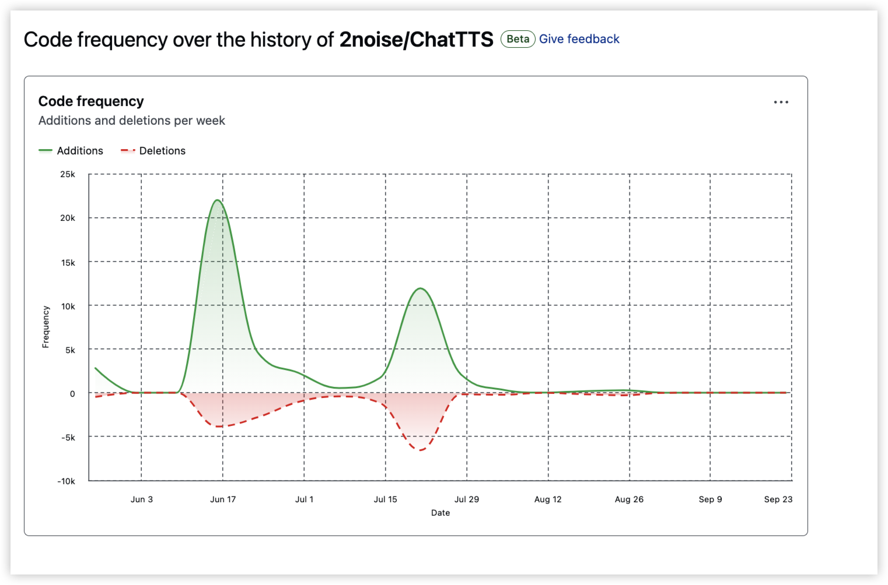

# ChatTTS 洞察报告

## 总览

| 洞察项 | 洞察内容 |
| :- | :- |
| Name | ChatTTS |
| 开源治理 | 公司或组织 |
| 开源治理主体 | 2noise |
| 类型 | 语音模型 |
| 功能 | text-to-speech 模型，支持汉语、英语，可识别停顿、笑声 |
| DEMO 验证 | ... |
| star/fork | 31k / 3.4k |
| 分析 | 基于 transformers 和 pytorch 搭建，预计可通过 torch-npu 适配，待验证是否存在算子缺失等问题 |
| 优先级排序 | ... |
| 使用场景 | 语音模型 ChatTTS 推理 |
| 预计工作量（人月） | 1 |
| 来源 | ... |
| 客户 | ... |
| 使用场景 | ... |
| 社区合入友好程度 | 项目 README 里写到：GitHub issues/PRs are always welcomed. |
| 社区是否合入 | ... |
| 责任人 | 申杉杉 |
| 进展 | 洞察中 |
| 预处理 | ... |
| 训练 | ... |
| 微调 | ... |
| 推理 | ... |
| 评估 | ... |
| 部署 | ... |

## 项目背景

对话式高可控的语音合成模型。

[<u>ChatTTS GitHub 地址</u>](https://github.com/2noise/ChatTTS)。

### 主要特性

- 能够完成基于对话式的语音合成任务，支持多个说话者进行交互式对话的语音生成；
- 能够在生成的语音中加入细粒度的韵律特征，比如：笑声、停顿以及语气词，在韵律方面超过了大多数的开源 TTS 模型，但暂不支持对语音的情感特征进行控制；
- 支持中文和英文；
- 提供 Web UI 进行推理使用。

### 支持的模型

……

### 系统及硬件支持

- 操作系统：Windows、Linux；
- 底层硬件：Nvidia GPU (cuda)、Apple GPU (mps)、CPU。

> 说明：MPS 指的是 "Metal Performance Shaders"，这是苹果平台上的一种图形和计算框架。它允许 PyTorch 在 macOS 上使用 Apple 的 GPU 进行加速计算。

### 研发机构

该项目由 `2noise` 组织研发，该组织目前总共只有 3 个人。

## 版本发布策略

无明确周期，目前只发布过一个 release 版本：`v0.1.1`。

## 依赖

### PyTorch 系列

- `torch`；
- `torchaudio`：用于处理音频数据和进行音频相关的深度学习任务，提供了音频数据的加载和保存、频谱分析、预训练的音频模型（支持音频分类、语音识别等任务）、与 PyTorch 的数据集和数据加载器集成等功能（官方文档：[<u>TorchAudio Documentation</u>](https://pytorch.org/audio/stable/index.html)）；
- `vector-quantize-pytorch`：向量量化库，主要用于减少数据表示的复杂性，通过将连续的数据点映射到离散的向量集合，从而减少内存占用，提高模型的效率和速度。

### 语音处理

- `av`：用于加载并播放音频、音频文件格式转换等；
- `pydub`：用于音频文件的读取和写入、剪辑拼接、音量调整等；
- `vocos`：用于音频处理和合成任务，可以支持声码器（vocoder）模型的训练和推理。声码器支持：实现了多种声码器模型，如 WaveNet 和 WaveRNN，能够将梅尔谱（Mel-spectrogram）转换为音频波形；音频处理：提供了一些音频预处理和后处理的工具，以便于输入和输出音频；模型训练：支持声学模型的训练和评估。

### NLP 相关

- `transformers`：已支持昇腾 NPU；
- `nemo-text-processing`：是 NVIDIA 的 NeMo 框架中的一个模块，主要用于文本处理和 NLP 任务。它提供了一系列工具和功能，可以帮助用户进行文本的预处理、特征提取、数据增强等；
- `pynini`：用于构建和操作有限状态机（FSM）和有限自动机（FSA），可以实现复杂的语言规则和模式匹配，适合于处理形式语言或构建复杂语言处理的系统；
- `wetextprocessing`：用于社交媒体和网络文本的处理。文本清理：提供工具去除噪音、特殊字符、HTML 标签等；分词和标记化：支持将文本拆分成单词或句子，便于进一步分析；情感分析和特征提取：可以进行基本的情感分析以及从文本中提取特征；多语言支持：适用于多种语言的文本处理。

### 运行加速

- `numba`：是一个用于加速 Python 数值计算的编译器，可以通过将 Python 代码编译为机器代码（JIT，即时编译）来提高代码执行的性能；可以加速 NumPy 数组操作，适用于数值计算和科学计算任务；可以将代码编译为运行在 NVIDIA GPU 上的 CUDA 代码，进一步加速计算（官方文档：[<u>Numba Documentation</u>](https://numba.readthedocs.io/en/stable/index.html)）。

> _**TODO**_：Numba 能够支持 CUDA GPU 编程，能够自动地在 host 与 device 之间传递 Numpy 数组。是否需要考虑对 numba 提供昇腾 NPU 的支持？

### 可视化

- `gradio`：提供 Web UI。

## 昇腾接入方式

- 使用 `torch_npu` 替代 cuda 相关的 torch 代码。

## 紧要程度及工作量

- star 31k，无客户需求。
