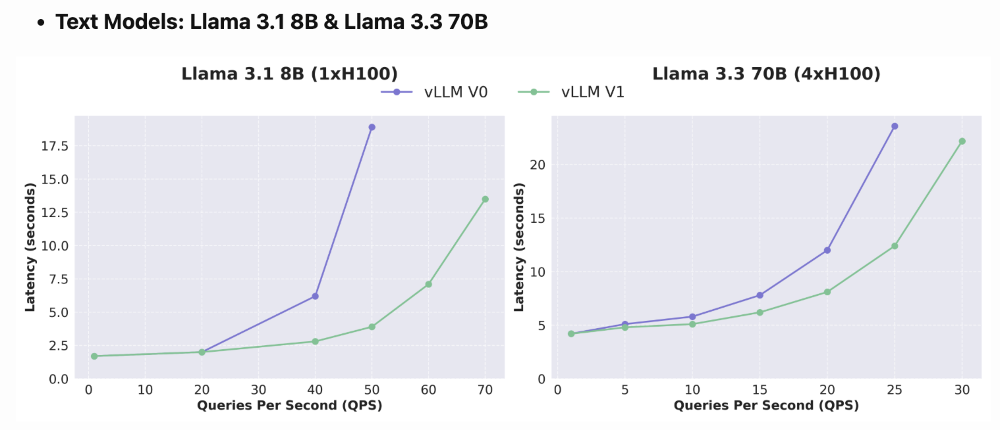

# V1 Engine Introduction

---

[toc]

---

## Why vLLM V1?

vLLM V0 successfully supported a wide range of models and hardware, but as new features were developed independently, the system grew increasingly complex.

**V1 aims to:**

- Provide a simple, modular, and easy-to-hack codebase.
- Ensure high performance with near-zero CPU overhead.
- Combine key optimizations into a unified architecture.
- Require zero configs by enabling features/optimizations by default.

**Performance:**

vLLM V1 achieves state-of-the-art throughput and latency, delivering up to **1.7x higher throughput** compared to V0.



---

## What's different between V0 and V1?

**V1 retains:**

- models
- kernels
- utilities

**V1 re-architects:**

- scheduler
- KV cache manager
- worker / model runner
- sampler
- API server

---

## V1 for Ascend NPU


**New components for V1:**

- worker_v1
- model_runner_v1
- attention_v1

---

### Worker Changes

| V0 | V1 |
|:---|:---|
| `start_profile()` + `stop_profile()` | `profile()` |
| `save_sharded_state()` | ❌ |
| `save_tensorized_model()` | ❌ |
| `initialize_cache()` 主要逻辑封装在 Worker 中 | `initialize_cache()` 主要逻辑下沉到 Model Runner 中 |
| `do_metadata_broadcast()` | ❌ |
| `kv_cache()` | `get_kv_cache_spec()` 主要逻辑下沉到 Model Runner 中 |
| `prepare_worker_input()` | ❌ |
| `execute_worker()` | ❌ |
| `_get_cached_seq_group_metadata()` | ❌ |
| `_execute_model_spmd()` | ❌ |
| `xxx_lora()` | ❌ |
| `xxx_prompt_adapter()` | ❌ |
| `max_model_len()` | ❌ |
| `vocab_size()` | ❌ |
| `get_cache_block_size_byte()` | ❌ |

Worker 代码大幅度精简，并且去掉了 `CacheEngine`，KVCache 由 `KVCacheManager` 进行管理。

---

### ModelRunner Changes

| V0 | V1 |
|:---|:---|
| `save_sharded_state()` | ❌ |
| `save_tensorized_model()` | ❌ |
| `get_max_block_per_batch()` | ❌ |
| `xxx_lora()` | ❌ |
| `xxx_prompt_adapter()` | ❌ |
| `make_model_input_from_broadcasted_tensor_dict()` | ❌ |
| `prepare_model_input()` | ❌ |
| `need_recv_kv()` | ❌ |
| `need_send_kv()` | ❌ |
| ❌ | `make_attention_mask()` |
| ❌ | `generate_draft_token_ids()` |
| ❌ | `initialize_cache()` |
| ❌ | `get_kv_cache_spec()` |

更多逻辑从 Worker 下沉到 Model Runner 中。

---

### Attention Changes

**AscendMetadata:**

| V0 | V1 |
|:---|:---|
| `xxx_prefill_xxx` | ❌ |
| `xxx_decode_xxx` | ❌ |
| `prefill_metadata()` | ❌ |
| `decode_metadata()` | ❌ |

V0 区分 PD，V1 不区分 PD 且 `AscendMetadata` 内容大幅度精简。

**AscendAttentionBackendImpl:**

V0 需要分别对 P 和 D 进行处理：

```python
class AscendAttentionBackendImpl(...):

    def forward(...):
        if attn_metadata.num_prefills > 0:
            # 处理 prefill ...
            torch_npu._npu_flash_attention(...)
        elif attn_metadata.decode_metadata:
            # 处理 decode ...
            torch_npu._npu_paged_attention(...)
```

V1 不区分 P 和 D，统一进行处理：

```python
class AscendAttentionBackendImpl(...):

    def forward(...):
        # ...
        torch_npu._npu_paged_attention_splitfuse(...)
```

---

## How to use V1?

### Installation

We can use `main` branch of vllm and vllm-ascend for a try:

```bash
# Install vLLM (latest)
git clone --depth 1 https://github.com/vllm-project/vllm
cd vllm
VLLM_TARGET_DEVICE=empty pip install . --extra-index https://download.pytorch.org/whl/cpu/

# Install vLLM Ascend (latest)
git clone --depth 1 https://github.com/vllm-project/vllm-ascend.git
cd vllm-ascend
pip install -e . --extra-index https://download.pytorch.org/whl/cpu/
```

Find more details [<u>here</u>](https://vllm-ascend.readthedocs.io/en/latest/installation.html).

### Usage

Before using V1, you need to set environment `VLLM_USE_V1=1` and `VLLM_WORKER_MULTIPROC_METHOD=spawn`.

If you are using vllm for offline inferencing, you need to add a `__main__` guard like as well:

```bash
if __name__ == '__main__':

    llm = vllm.LLM(...)
```

Find more details [<u>here</u>](https://docs.vllm.ai/en/latest/getting_started/troubleshooting.html#python-multiprocessing).

### Test

Run the command shown below to test V1 on vllm-ascend:

```bash
VLLM_USE_V1=1 VLLM_WORKER_MULTIPROC_METHOD=spawn pytest -sv tests
```

---

## Future Work

- **Align with vLLM**: we will actively promote the key features of vLLM v0.8.x/v1 to production availability.
- **Performance Optimization**: We will focus on the performance optimization of dense models (Qwen/Llama/Qwen-VL) and MOE models (DeepSeek V3/R1).
- ...

---

## References

- [<u>vLLM V1 User Guide</u>](https://docs.vllm.ai/en/stable/getting_started/v1_user_guide.html)
- [<u>vLLM V1: A Major Upgrade to vLLM's Core Architecture</u>](https://blog.vllm.ai/2025/01/27/v1-alpha-release.html)
- [<u>vLLM Ascend Roadmap Q2 2025</u>](https://github.com/vllm-project/vllm-ascend/issues/448)
