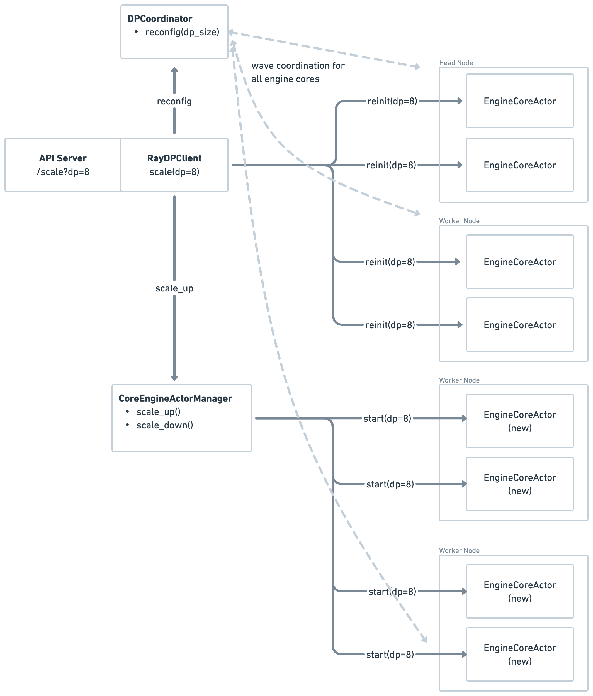
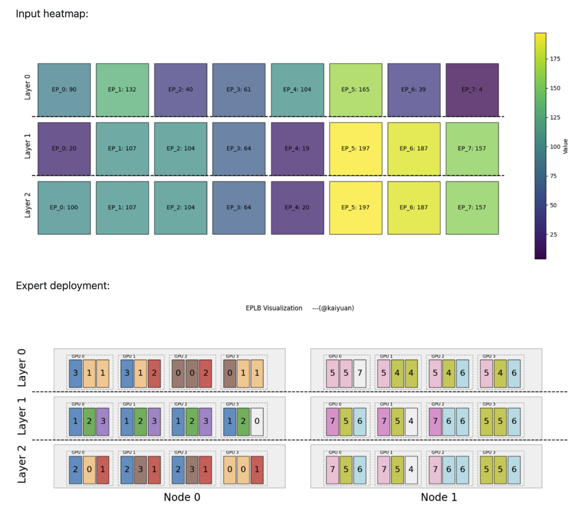
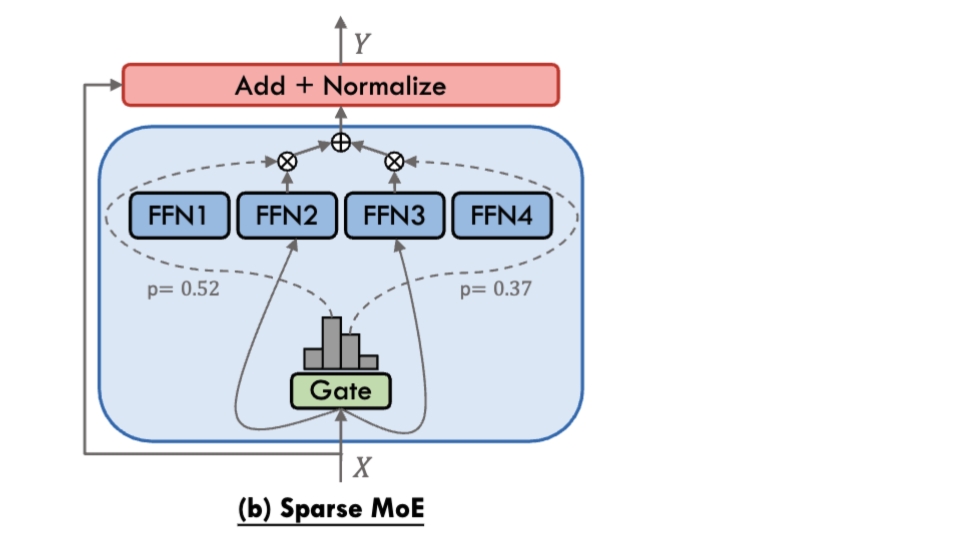
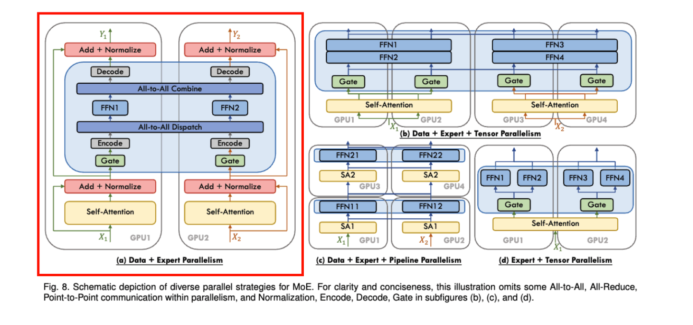
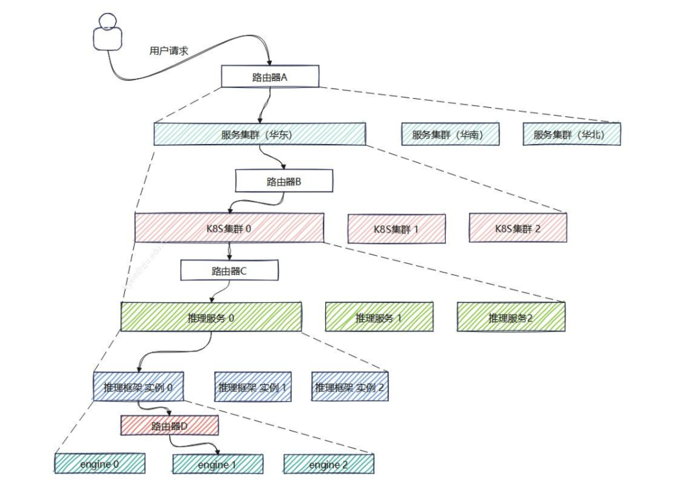

# VLLM 弹性推理 - EEP

---

## 背景 & 现状

Expert parallelism (EP) is a key technique in enabling high-throughput, low-latency large scale LLM serving of Mixture-of-Expert models such as DeepSeek-V3/R1. However, EP today is **static** in vLLM as well as many other inference frameworks: when there are more requests that exceed the current serving capacity, vLLM **could not scale up to meet the demand**; and when there are less requests, vLLM **could not scale down to reduce GPU usage and cost**. The only viable solution today is to **perform a complete restart with a new configuration**, which is quite slow and would drop a lot of traffic.

---

## EEP 方案

**EEP (Elastic Expert Parallelism):** With Elastic EP, vLLM will be able to dynamically scale up or down based on workload fluctuations, with minimal interruption to serving.

- [RFC](https://github.com/vllm-project/vllm/issues/20323)
- [PR: Elastic Expert Parallel Initial Support](https://github.com/vllm-project/vllm/pull/20775)

**主要功能：**

- Bring up new DP engine-cores (in the case of **upscaling**), or tear down a portion of old DP engine-cores (in the case of **downscaling**).
- Update the **states** of retained engine-cores.

The **states** of engine-core:

- **Distributed environment & communicators** (include engine-core’s communicator (DP), as well as worker’s model parallel communicators (TP, PP, DP, EP)).
- **Model structure & weights:** Rebalance expert loads upon scale up/down using Expert Parallel Load Balance (EPLB) algorithms.
- **Cudagraphs and torch.compile caches**.

---



**主要组件：**

- **Engine-core and worker states management:**
  - Destroy & reinitialization of the states.
- **Upscale/downscale scheduling:**
  - We will leverage Ray **EngineCoreActorManager** as the coordinator, but it can be extended to other DP engine-core managers.
  - **Upscale:** coordinate startup of new engine-cores and reinitialization of existing engine-cores.
  - **Downscale:** coordinate shutdown of old engine-cores and reinitialization of retained engine-cores.
- **New API Server endpoint** to trigger upscale/downscale.

**基本功能：**

- **Retained engine-core state destroy & reinitialization:**
  - Distributed environment.
  - Distributed communicators.
  - Model structure & weights: including EPLB.
  - Cudagraph & torch.compile caches.
- **New engine-core startup:**
  - KV cache initialization: use available GPU memory information from existing engine-core to skip expensive profiling.
- **Unneeded engine-core shutdown**
- **Control plane:**
  - API server endpoint: handle scale up/down request.
  - DP engine-core scheduling: e.g. collective operations (from retained and new engine-cores) need to happen at the same time.

...

**高级特性：**

- **Fault-tolerance:** replacement of faulty engine-cores.
- **Autoscaling:** auto trigger of upscale/downscale.
- Integrate with **prefill disaggregation**.

---

**EPLB 补充:**



> PR: EPLB [#18343](https://github.com/vllm-project/vllm/pull/18343)

---

## Q & A

**Q: 为什么是 Bring up/tear down **DP** engine-cores？不是 Elastic EP 吗？**

对于 MoE 模型，由于 expert 的稀疏性，导致 MoE 部分的 MFU 很难打满。



在 AF 不分离的情况下，一个经典的组合是 DP+EP，来增大输入的 batchsize，从而提高 MoE 的算力利用率。



所以，EP 的弹性，需要依赖于 DP engine-cores 的缩放。

---

**Q: 为什么不直接在 K8s 层面实现服务的缩放？**

用户的推理请求进入到最终运算单元可能经历了多层分发，每层分发都涉及负载均衡的问题。如下图所示是一个简化的推理请求分发系统模型，用户的推理请求需要经过：服务区域、k8s集群、推理服务实例、vLLM引擎实例、引擎的选择。每一层的“路由器”即请求分发者，将请求分配到最合适的处理模块上。



- **K8s**：对容器实例进行伸缩，控制粒度更粗；
- **vLLM**：框架内部，对 engine-core 个数进行伸缩，控制粒度更细，切换成本更低：
  - 新 engine-core 不需要执行 `dummy_run()` 来估算 KV Cache 显存容量，可直接复用其它引擎的配置；
  - 可以根据多种特性，实现定制化的伸缩策略，比如 EPLB：涉及 redundant expert（expert map）的重新统计和分配。

---

## 代码实现

### 1. API Server

`vllm/entrypoints/openai/api_server.py` 新增可供用户调用的 API：

- `/scale_elastic_ep`: 调用 `client.scale_elastic_ep(new_data_parallel_size, drain_timeout)`；
- `/is_scaling_elastic_ep`：伸缩期间，不处理新的请求；

### 2. Async LLM

`vllm/v1/engine/async_llm.py`:

1. `wait_for_requests_to_drain(drain_timeout)`：先等待当前所有请求处理完成，再进行伸缩；
2. `engine_core.scale_elastic_ep(new_data_parallel_size)`；

### 3. EngineCoreClient

`vllm/v1/engine/core_client.py`: DPLBAsyncMPClient

- new_data_parallel_size > cur_data_parallel_size --> `_scale_up_elastic_ep()`
- 反之 --> `_scale_down_elastic_ep()`

**scale_up 流程：**

(1) Send reconfigure messages to all existing engines:

```python
for engine in self.core_engines:
    reconfig_request = ReconfigureDistributedRequest(
        new_data_parallel_size=new_data_parallel_size,
        new_data_parallel_rank=ReconfigureRankType.KEEP_CURRENT_RANK,
        new_data_parallel_rank_local=ReconfigureRankType.KEEP_CURRENT_RANK,
        new_data_parallel_master_ip=self.vllm_config.parallel_config.data_parallel_master_ip,
        new_data_parallel_master_port=self.vllm_config.parallel_config.data_parallel_master_port)
```

(2) Create new engines:

CoreEngineActorManager (for RayDPClient) call `scale_up_elastic_ep()`.

> CoreEngineActorManager: Utility class to handle creation, readiness, and shutdown of core engine Ray actors used by the AsyncLLM and LLMEngine.

创建 Ray 执行器，并等待新 engine 初始化完成：

```python
actor = ray.remote(DPEngineCoreActor)
ray.get(actor.wait_for_init.remote())
```

(3) Wait for all existing engines to complete reconfiguration.

**scale_down 流程：**

(1) Send reconfigure messages:

1. 需要保留的 engine：`ReconfigureRankType.KEEP_CURRENT_RANK`；
2. 需要移除的 engine：`SHUTDOWN_CURRENT_RANK`。

(2) CoreEngineActorManager call `scale_down_elastic_ep()`:

```python
ray.util.remove_placement_group(pg)
```

### 4. EngineCore

`vllm/v1/engine/core.py`:

KV Cache 配置复用：

```python
def _initialize_kv_caches(...):
    if os.environ.get("VLLM_ELASTIC_EP_SCALE_UP_LAUNCH") == "1":
        dp_group = getattr(self, "dp_group", None)
        assert dp_group is not None
        self.available_gpu_memory_for_kv_cache = \
            ParallelConfig.sync_kv_cache_memory_size(dp_group, -1)
        available_gpu_memory = [
            self.available_gpu_memory_for_kv_cache
        ] * len(kv_cache_specs)
    else:
        # Profiles the peak memory usage of the model to determine how
        # much memory can be allocated for kv cache.
        available_gpu_memory = (
            self.model_executor.determine_available_memory())
        self.available_gpu_memory_for_kv_cache = \
            available_gpu_memory[0]


# vllm/config.py
@staticmethod
def sync_kv_cache_memory_size(dp_group: "ProcessGroup",
                                kv_cache_memory: int) -> int:
    if kv_cache_memory == -1:
        kv_cache_memory = torch.iinfo(torch.int64).max
    tensor = torch.tensor([kv_cache_memory],
                            dtype=torch.int64,
                            device="cpu")
    # we cannot use broadcast for stateless dp group since it depends
    # on global rank
    torch.distributed.all_reduce(tensor, op=ReduceOp.MIN, group=dp_group)
    return tensor.item()
```

### 5. Executor

`vllm/v1/executor/ray_distributed_executor.py`:

call `reinitialize_distributed()`.

### 6. Worker

`vllm/v1/worker/gpu_worker.py`:

`reinitialize_distributed()`:

接收 reconfig_request，判断 scale up/down：

- if new_ep_size < old_ep_size: `_eplb_before_scale_down()`；
- if new_ep_size > old_ep_size: `_eplb_after_scale_up()`。

调整 `rank_mapping` --> `model_runner.eplb_state.rearrange()`。

`_reconfigure_parallel_config()`: Update parallel config with provided reconfig_request.

`_reconfigure_moe()`: Reconfigure MoE modules with provided reconfig_request.

<!-- ### 7. ModelRunner

### 8. Model

### 9. Layer -->
