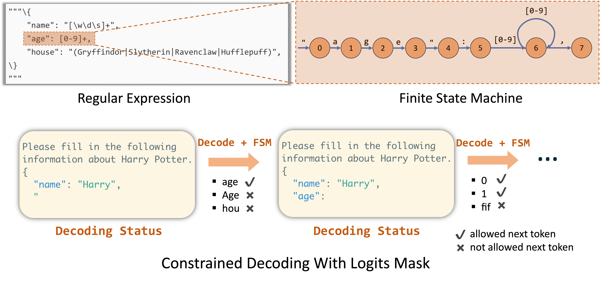
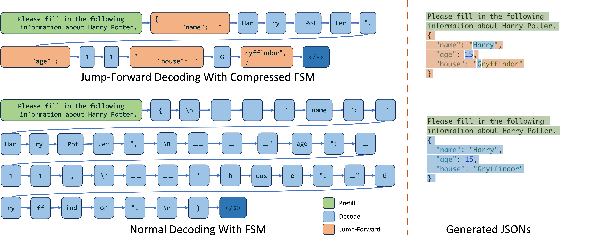

# Guided Decoding

## 基本原理

……

## vLLM

**backend：**

- [outlines](https://github.com/dottxt-ai/outlines)
- lm-format-enforcer
- xgrammar

参数配置：`sampling_params.py/GuidedDecodingParams`

代码位置：`vllm/model_executor/guided_decoding`

**测试脚本：**

- example（online）：`examples/online_serving/openai_chat_completion_structured_outputs.py`
- example（offline）：`examples/offline_inference/structured_outputs.py`

**参考资料：**

- [vLLM 官方文档 - Structured Outputs](https://docs.vllm.ai/en/stable/features/structured_outputs.html#structured-outputs)

## outlines

**原理：**

For every state within the FSM, we can calculate the permissible transitions and identify the acceptable next tokens. This allows us to track the current state during decoding and filter out invalid tokens by applying logit bias to the output.



**缺点：**

Since the FSM is constructed at the token level, it can transition the state by only one token at each step. Consequently, it can decode only one token at a time, which results in slow decoding.

**代码：**

You can install the latest version of Outlines from the repository's `main` branch:

```bash
pip install git+https://github.com/dottxt-ai/outlines.git@main
```

**参考资料：**

- 官方文档：[contributing doc](https://dottxt-ai.github.io/outlines/latest/community/contribute/)
- 论文：[Outlines](../../../../../Research/Papers/Papers/Outlines.pdf)

## fast-forward tokens

llguidance

## SGLang

[Fast JSON Decoding for Local LLMs with Compressed Finite State Machine](https://lmsys.org/blog/2024-02-05-compressed-fsm/)

Jump-Forward Decoding With a Compressed Finite State Machine:



代码实现：`https://github.com/sgl-project/sglang/blob/main/python/sglang/srt/constrained/outlines_backend.py`
