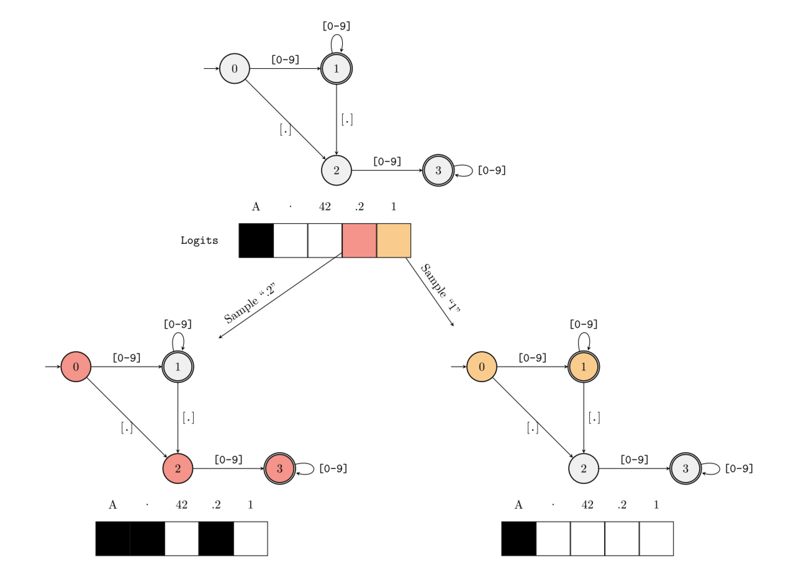
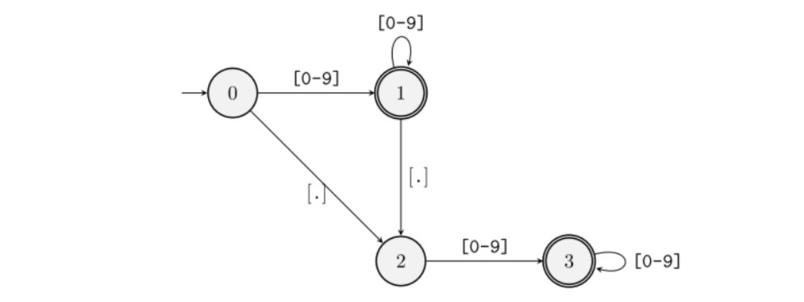

# vLLM 学习笔记 ｜ Guided Decoding

[toc]

## 一、引言

……

## 二、什么是 Guided Decoding？

一般来说，LLM 的输出通常是一段符合人类表达习惯的文本序列，这让我们可以利用 LLM 来回答问题或是创作内容。然而，当我们需要 LLM 的输出符合特定的格式（如：JSON、SQL、正则表达式等）时——例如希望 LLM 根据我们的需求生成查询数据库的 SQL 语句，通过微调的方法通常很难达到我们预期的效果。这时，就需要用到 Guided Decoding 技术，它可以通过影响模型输出层的 Logits 分布（施加 Mask 过滤不满足要求的 Token）来达到规范模型输出格式的效果。

**🌰 举个例子：**

我们可以向 LLM 输入一个 Prompt 以及对应的格式数据：

```python
# Guided decoding by JSON using Pydantic schema
class CarType(str, Enum):
    sedan = "sedan"
    suv = "SUV"
    truck = "Truck"
    coupe = "Coupe"


class CarDescription(BaseModel):
    brand: str
    model: str
    car_type: CarType


json_schema = CarDescription.model_json_schema()


prompt = ("Generate a JSON with the brand, model and car_type of"
          "the most iconic car from the 90's, think in 100 tokens")
```

此时，LLM 就会根据我们的要求生成一个 JSON 格式的输出：

```json
content: {
    "brand": "Levels",
    "model": "racing equation",
    "car_type": "sedan"
}
```

## 三、Outlines 原理详解

目前，实现了 Guided Decoding 支持的后端有 `outlines`、`xgrammar` 以及 `lm-format-enforcer` 等，下面将以 Outlines 为例，深入介绍 Guided Decoding 背后的实现原理。

**Outlines 的核心技术点包括：**

- **基于 FSM（Finite-State Machine，有限状态机）**，实现了当前输入与对应状态的匹配，并可以根据状态转移函数确定对应的 Mask；
- **建立了 FSM 的状态与其可接受 Token 的 Map**，并为这些 Token 建立索引，从而避免了在每次 Decode 中遍历整个 Vocabulary 进行匹配，加快了匹配的速度。

下面，为了让大家更快速、更直观地理解 Outlines 的原理，本文将尽力避免大段公式和算法的罗列，而是尽量使用具体的例子进行讲解。

### 3.1 FSM 的工作原理

**🌰 举个例子：**

假设我们需要模型输出一个浮点小数，即输出需要匹配的正则表达式为 `([0-9]*)?\.?[0-9]*`，并给定一个仅包含 `A`、`.`、`42`、`.2` 和 `1` 的 Vocabulary。

> “正则表达式”符号说明：
>
> - `*`：匹配前面的子表达式零次或多次；
> - `?`：匹配前面的子表达式零次或一次；
> - `.`：匹配除换行符 `\n` 之外的任何单字符；
> - `\.`：匹配小数点符号 `.`（需要使用 `\` 进行转义）。

当 LLM 开始 Decode 时，FSM 位于初始状态（`0`，用整数表示不同的状态），根据状态 `0` 的转移函数可知，当前状态可以接受的字符模式为 `[0-9]` 和 `[.]`，而在我们所给的词表中，只有 `A` 不符合，此时 FSM 会针对词表 `['A', '.', '42', '.2', '1']` 生成一个值为 `[0, 1, 1, 1, 1]` 的 Mask，即模型在本轮迭代进行采样时会排除掉 `A`（图中用黑色表示），如下图所示。



接下来，有两种情况：

1. **模型本轮的采样值为 `.2`（图中用红色表示）**，此时 `.2` 同时满足从状态 `0` 过渡到状态 `2` 再到状态 `3` 的条件，因此 FSM 的当前状态会跳转到状态 `3` 并生成下一次采样的 Mask。由于状态 `3` 可接受的字符模式仅为 `[0-9]`，只有 `42` 和 `1` 满足，因此此时的 Mask 为 `[0, 0, 1, 0, 1]`；
2. **模型本轮的采样值为 `1`（图中用黄色表示）**，同理，此时 FSM 会跳转到状态 `1` 并生成对应的 Mask，其值为 `[0, 1, 1, 1, 1]`。

不断循环此过程，最终就能得到满足该正则表达式的输出。

> 补充：在 vLLM 的实现中，其 Mask 使用 `0` 表示接受的 Token，用 `-inf`（负无穷）表示要排除的 Token，然后再将输出的 Logits 分布与 Mask 相加，从而达到屏蔽不满足要求的 Token 的效果。

### 3.2 FSM 的构建过程

在了解了 Outlines 中 FSM 的基本工作原理之后，接下来我们再看下，针对一个给定的正则表达式与 Vocabulary，Outlines 是如何构建这个 FSM 的。

FSM 的构建过程主要分为两步：

1. **收集每个 Token 能够匹配的状态转换路径**：给定一个 Token，遍历所有状态，并从每一个状态开始，看是否存在能够完整接受该 Token 的路径，若存在，则将该路径记录到该 Token 对应的列表中；若不存在这样一条路径，则跳过当前状态，继续收集以下一个状态作为开始状态的可能路径；
2. **收集每个状态能够接受的所有 Token**：遍历每一个 Token，并针对该 Token 执行步骤一，获取该 Token 能够匹配的状态转换路径，然后遍历每一条路径并取路径中的第一个节点（开始状态），将该状态与该 Token 进行绑定（将该 Token 添加到该状态的集合中）。

**🌰 举个例子：**

这里我们继续使用上面的例子进行说明：



**对于 Token `A`，遍历每个状态：**

1. 从状态 `0` 开始，不满足，pass；
2. 从状态 `1` 开始，不满足，pass；
3. 从状态 `2` 开始，不满足，pass；
4. 从状态 `3` 开始，不满足，pass。

**对于 Token `.`，遍历每个状态：**

1. 从状态 `0` 开始，可以转换到状态 `2`，记录路径 `0 -> 2`；
2. 从状态 `1` 开始，可以转换到状态 `2`，记录路径 `1 -> 2`；
3. 从状态 `2` 开始，不满足，pass；
4. 从状态 `3` 开始，不满足，pass。

此时，我们可以收集到对于 Token `.`，其所能匹配到的所有状态转换路径集合：

```
0 -> 2
1 -> 2
```

然后，将每条路径的起始状态与该 Token 进行绑定（一个 HashMap）：

```
状态 0 <-> set(".")
状态 1 <-> set(".")
```

**对于 Token `42`，遍历每个状态：**

1. 从状态 `0` 开始，可以转换到状态 `1`，记录路径 `0 -> 1`；
2. 从状态 `1` 开始，可以转换到状态 `1`，记录路径 `1`；
3. 从状态 `2` 开始，可以转换到状态 `3`，记录路径 `2 -> 3`；
4. 从状态 `3` 开始，可以转换到状态 `3`，记录路径 `3`。

Token `42` 能匹配到的所有路径集合如下：

```
0 -> 1
1
2 -> 3
3
```

同理，将所有起始状态与该 Token 进行绑定：

```
状态 0 <-> set(".", "42")
状态 1 <-> set(".", "42")
状态 2 <-> set("42")
状态 3 <-> set("42")
```

**对于 Token `.2`，遍历每个状态：**

1. 从状态 `0` 开始，记录路径 `0 -> 2 -> 3`；
2. 从状态 `1` 开始，记录路径 `1 -> 2 -> 3`；
3. 从状态 `2` 开始，不满足，pass；
4. 从状态 `3` 开始，不满足，pass。

绑定状态与 Token：

```
状态 0 <-> set(".", "42", ".2")
状态 1 <-> set(".", "42", ".2")
状态 2 <-> set("42")
状态 3 <-> set("42")
```

**对于 Token `1`，遍历每个状态：**

1. 从状态 `0` 开始，记录路径 `0 -> 1`；
2. 从状态 `1` 开始，记录路径 `1`；
3. 从状态 `2` 开始，记录路径 `2 -> 3`；
4. 从状态 `3` 开始，记录路径 `3`。

绑定状态与 Token：

```
状态 0 <-> set(".", "42", ".2", "1")
状态 1 <-> set(".", "42", ".2", "1")
状态 2 <-> set("42", "1")
状态 3 <-> set("42", "1")
```

最后，我们就得到了每个 FSM 状态能够匹配的所有 Token 集合。

在实际过程中，当 LLM 生成的内容进行到某一个状态时（比如：状态 `2`），Outlines 就能快速通过该 Map 获取到当前状态所能接受生成的 Token 集合（`42` 和 `1`），搜索的时间复杂度为 `O(1)`，并生成下一步 Decode 的 Mask（为 `[0, 0, 1, 0, 1]`，即过滤掉了其它 3 个 Token）。

### 3.3 总结

**Outlines 的优缺点：**

- **优点：不会引入额外的推理延迟**。FSM Map 的构建过程会在真正进行 Decode 之前就完成，因此并不会给实际运行时的推理过程引入太多额外的延迟（引入的额外计算仅包括生成 Mask 等，几乎可以忽略）；
- **缺点：会引入额外的内存占用**。保存并加载这个 Map 会带来额外的内存占用，因此在实际应用中，我们需要对推理速度和内存占用这两方面做一个权衡。

另外，Outlines 不仅可以支持使用正则表达式来限定模型的输出，还支持 **CFGs（Context-Free Grammars，上下文无关文法）**，比如：JSON、SQL 以及 Python 等语言。关于 CFGs 生成的原理，这里不再详细展开，感兴趣的读者可以自行阅读 Outlines 的[<u>论文</u>](https://arxiv.org/abs/2307.09702)与[<u>源码</u>](https://github.com/dottxt-ai/outlines)。

## 四、vLLM Guided Decoding 源码解读

……

### Reasoning

支持 Reasoning。
[PR](https://github.com/vllm-project/vllm/pull/12955)
[Ce Gao](https://github.com/gaocegege)

## 五、SGLang Jump-Forward Decoding

对比 Outlines 的缺点。

……

## 六、参考资料

- [<u>Robust Text-to-SQL Generation with Execution-Guided Decoding</u>](https://arxiv.org/abs/1807.03100)
- [<u>Efficient Guided Generation for Large Language Models</u>](https://arxiv.org/abs/2307.09702)
- [<u>vLLM Docs - Structured Outputs</u>](https://docs.vllm.ai/en/stable/features/structured_outputs.html#structured-outputs)
- [<u>Fast JSON Decoding for Local LLMs with Compressed Finite State Machine</u>](https://lmsys.org/blog/2024-02-05-compressed-fsm/)

---

介绍 vllm-ascend 项目。
