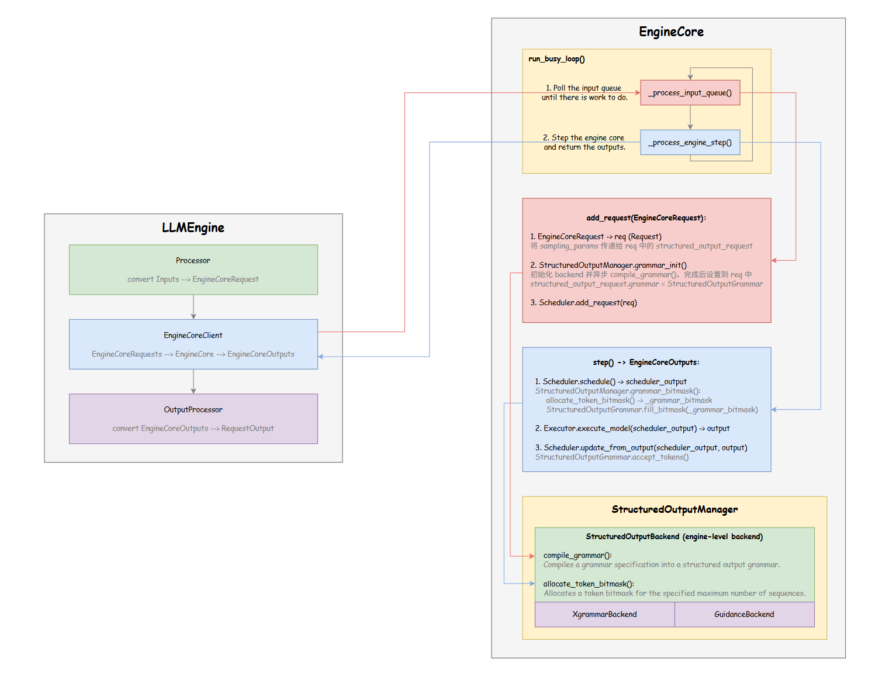
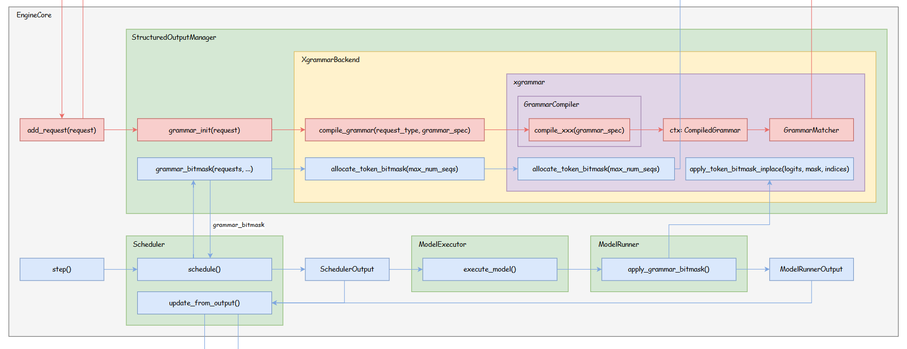

# vLLM 学习笔记｜Guided Decoding (V1)

[toc]

## 一、引言

**Guided Decoding**，又叫 **Structured Output**，是大模型推理领域中非常重要的一个特性，主要用于引导大模型输出符合某种特定格式（如：SQL、Json）的结果，以便更好地将大模型落地到具体的应用场景中。

在我的上一篇文章中，简要地介绍了 Guided Decoding 的原理，并详细分析了 vLLM 中相关代码的实现（V0），文章链接如下：

……

自从 vLLM **v0.8.x** 之后，**V1 Engine** 将作为 vLLM 启动时的默认选项。关于 V1 Engine 的系统设计以及具体的优化点，我将会在之后逐步梳理并分享出来（~~如果有空的话~~）。而在本文中，我将针对 V1 Engine，分享 Structured Output 模块的整体设计与具体实现。

## 二、V1 Engine 整体架构

在介绍 Structured Output 模块的设计之前，让我们先来看下 vLLM V1 Engine 的整体架构。在 V1 中，vLLM 将不同类型的 CPU 密集型操作拆分到了两个相互独立的进程中，以便能够异步执行不同的 CPU 操作，减少了不同步骤之间相互等待的时间，因此能够更好地压榨硬件的计算性能。

- `Process 0` 主要负责请求的预处理（如：参数校验）、Tokenization 以及 Detokenization 等操作；
- `Process 1` 主要负责请求的调度和推理执行等操作。

在优化前（V0），`Process 0` 和 `Process 1` 中的操作顺序执行，因此存在许多 CPU 空闲等待的时间，而在 V1 中则是并行执行上面两个进程中的操作，因此极大地提升了整体的推理效率。

## 三、V1 Engine 整体流程

在了解了 V1 Engine 的整体架构之后，接下来我们再看一下 V1 Engine 的整体推理流程：

> 高清图片链接：[<u>link</u>](https://github.com/shen-shanshan/cs-self-learning/tree/master/Open_Source/Projects/vLLM/Features/Guided_Decoding/posts/vLLM%E5%AD%A6%E4%B9%A0%E7%AC%94%E8%AE%B0%E2%80%94%E2%80%94Guided_Decoding_V1/images)，画图不易，走过路过欢迎点一个 Star！

- `LLMEngine` 属于 `Process 0`，主要用于与推理引擎外部进行交互（如：接收用户请求、输出推理结果等）。vLLM 的离线推理引擎 `LLM` 和在线推理引擎 `AsyncLLMEngine` 都是基于 `LLMEngine` 的封装；
- `EngineCore` 属于 `Process 1`，是推理引擎的核心，包含了请求调度、模型前向推理等关键实现。

### 3.1 LLMEngine 整体流程

1. 当一个新的 prompt 输入到 vLLM 后，`LLMEngine` 会调用 `Processor` 的 `process_inputs()` 方法，对输入数据进行一些校验和预处理。其中，有一个步骤叫做 `_validate_structured_output()`，会对 Structured Output 后端的设置进行检查（目前 V1 只支持 **engine-level** 的后端，即全局只能使用同一个后端，不允许针对不同的请求使用不动的后端进行处理），并判断输入内容是否能被转换成 Structured Output 后端能够识别的语法；
2. `LLMEngine` 调用 `step()`，并通过 `get_output()` 方法从 `EngineCoreClient` 获取推理结果（`EngineCoreClient` 是 `LLMEngine` 中专门用于与 `EngineCore` 进行通信的类）；
3. `LLMEngine` 调用 `OutputProcessor` 中的 `process_outputs()` 方法，对推理结果进行后处理，比如：Detokenization、准备 `RequestOutput` 对象以及终止已经生成结束符的请求。

### 3.2 EngineCore 整体流程

当 `LLMEngine` 调用 `make_client()` 方法创建 `EngineCoreClient` 时，可以根据配置创建不同的 `EngineCoreClient`，用户可以选择继续使用 V0-style 的 Engine，也可以采用 V1-style（本文仅讨论 V1）。当使用 V1 Engine 时，会创建一个新的进程，运行 `EngineCoreProc` 中的 `run_engine_core()` 方法，并开启一个 busy loop。

`run_busy_loop()` 主要分为两步：

1. `_process_input_queue()`：处理来自 `EngineCoreClient` 的请求。当有新的请求到来时，调用 `add_request()` 方法：（1）将 `EngineCoreRequest` 转换为 `Request`；（2）异步编译 Structured Output Grammar；（3）将请求添加到 `Scheduler` 中。
2. `_process_engine_step()`：执行调度和推理。

> 注意：本文主要聚焦于 Structured Output 特性，前面只是大致介绍下 V1 Engine 的整体情况，更多具体的内容（如：调度流程、解码算法等）后面有空再单独写文章进行分享。

## 四、Structured Output 代码实现

> 高清图片链接：[<u>link</u>](https://github.com/shen-shanshan/cs-self-learning/tree/master/Open_Source/Projects/vLLM/Features/Guided_Decoding/posts/vLLM%E5%AD%A6%E4%B9%A0%E7%AC%94%E8%AE%B0%E2%80%94%E2%80%94Guided_Decoding_V1/images)，画图不易，走过路过欢迎点一个 Star！

### 4.1 请求预处理

### 4.2 异步编译 Grammar

### 4.3 分配并应用 Mask

## 五、总结

目前，vLLM 的 V1 Engine 还在积极开发中（变动频繁），其 Structured Output 特性也还只支持 `xgrammar` 和 `guidance` 后端。本文中介绍的内容，仅代表写下这篇文章时代码的状态（`v0.8.4`），后面 Structured Output 模块如果还有大的更新，再考虑另写文章进行分享。

## 六、参考资料

- [<u>vLLM V1: A Major Upgrade to vLLM's Core Architecture</u>](https://blog.vllm.ai/2025/01/27/v1-alpha-release.html)
- [<u>vLLM Docs | Structured Outputs</u>](https://docs.vllm.ai/en/stable/features/structured_outputs.html#structured-outputs)
- [<u>vLLM GitHub</u>](https://github.com/vllm-project/vllm)
- [<u>XGrammar API Reference</u>](https://xgrammar.mlc.ai/docs/api/python/index.html)
