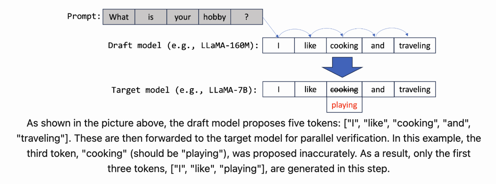
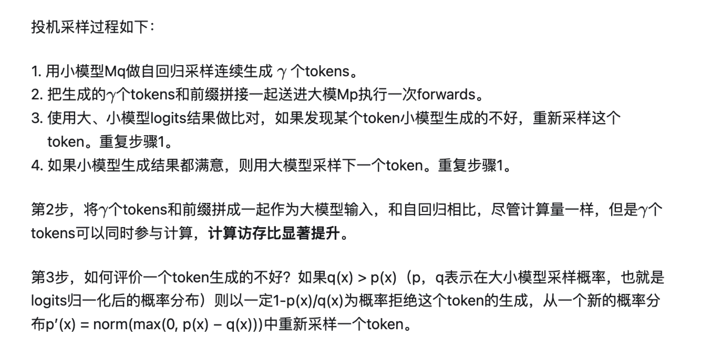
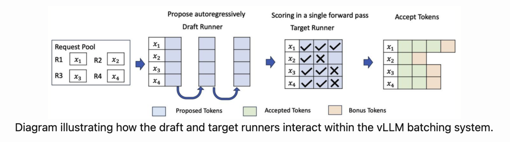
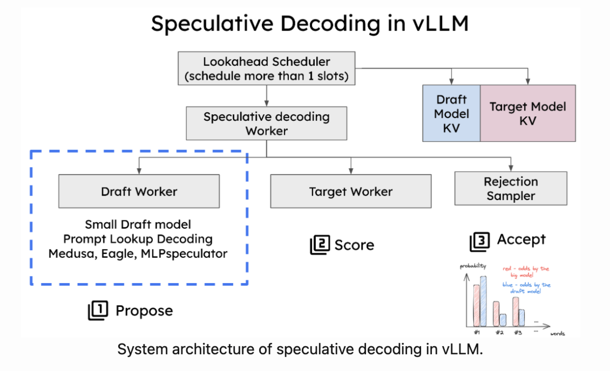
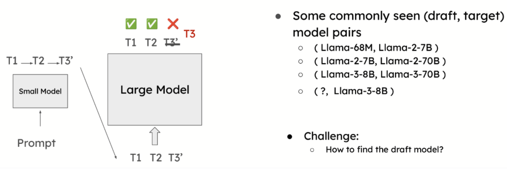
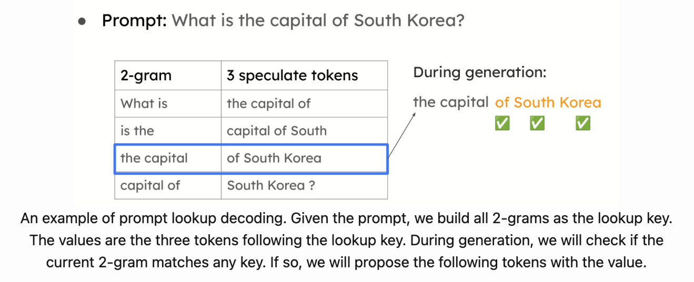
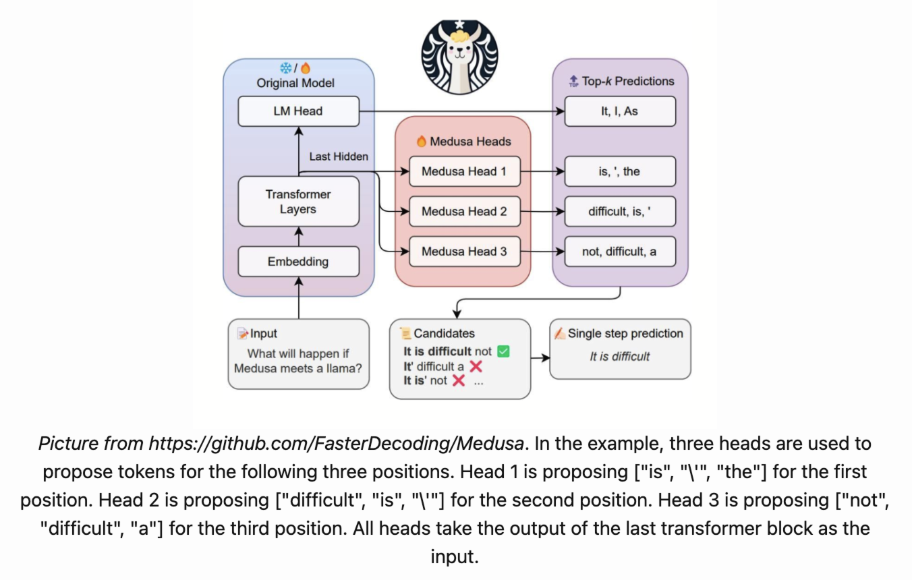

# Speculative Decoding

---

## 基本原理

This approach leverages smaller models to handle simpler token predictions while utilizing larger models to verify or adjust those predictions. By doing this, speculative decoding accelerates generation without sacrificing accuracy, making it a lossless yet highly efficient method for optimizing LLM performance.

**Why can speculative decoding reduce latency?**

Traditionally, LLMs generate tokens one at a time in an autoregressive manner. For example, given a prompt, the model generates three tokens T1, T2, T3, each requiring a separate forward pass. Speculative decoding transforms this process by allowing multiple tokens to be proposed and verified in one forward pass.

- **自回归采样**：生成的 token 一个一个地蹦出来，因为每次只对序列长度为 1 的部分进行有效计算，但是却需要对全部前缀对应位置的 activations 进行访问，因此计算访存比很低；
- **投机采样（Speculative Decoding）**：使用两个模型，一个是原始目标模型，另一个是比原始模型小得多的近似模型。近似模型用于进行自回归串行采样，而大型模型则用于评估采样结果。这里的小型模型可以采用与原始模型相同的结构，但参数更少，或者干脆使用 n-gram 模型。

> 什么是 n-gram 模型？

**推理流程：**

1. **Draft Model:** A smaller, more efficient model proposes tokens one by one.
2. **Target Model Verification:** The larger model verifies these tokens in a single forward pass. It confirms correct tokens and corrects any incorrect ones.
3. **Multiple Tokens in One Pass:** Instead of generating one token per pass, this method processes multiple tokens simultaneously, reducing latency.

**补充说明：**

`p(x)<q(x)` 的时候应该是小模型分布和大模型的分布存在突变（小模型出错的地方）, 需要一定概率放弃, 然后从正常部分 `[p(x)>q(x)]` 的分布中去采样。

计算访存比低的原因是因为每生成一个 token，全部 weight 都要从显存 load 一遍。每生成一个 token 都要访问前缀信息，只不过可以访问 KVCache，在生成句子长度不太长或 BS 不是特别大的时候，KVCache 的访存相比 weight 要小很多。

这里其实计算量不是不变，而是增大了的。只是因为大模型顺序执行输出一个 token 和并行输出所有 token 时间成本是一致的。利用了"冗余算力"换取时间。

---

## vLLM

### Introduction

In vLLM, speculative decoding is integrated with the system’s **continuous batching** architecture.

**Components:**

- **Draft Runner:** This runner is responsible for executing the smaller model to propose candidate tokens.
- **Target Runner:** The target runner verifies the tokens by running the larger model.

Two crucial components had to be modified:

- **Scheduler:** The scheduler was adjusted to **handle multiple token slots within a single forward pass**, enabling the simultaneous generation and verification of several tokens.
- **Memory Manager:** The memory manager now **handles the KV cache for both the draft and target models**, ensuring smooth processing during speculative decoding.

### Types of Speculative Decoding Supported in vLLM

**1. Draft Model-Based Speculative Decoding:**

A smaller model predicts the next tokens, and a larger model verifies them.

The draft model needs to be **small** enough to avoid creating significant overhead but still **accurate** enough to provide a meaningful performance boost.

However, selecting the right draft model can be challenging.

- Differences in **vocabulary size** (the draft and target models should share the same vocabulary)

Resolution -> **draft-model free** speculative decoding methods.

**2. Prompt Lookup Decoding:**

Known as **n-gram** matching.

This approach is effective for use cases like **summarization** and **question-answering**, where there is a significant overlap between the prompt and the answer. (prompt -> n-gram lookup)

This works particularly well when the large model repeats parts of the prompt in its answers.

**3. Medusa / Eagle / MLPSpeculator:**

In this method, additional layers (or heads) are added to the large model itself, allowing it to predict multiple tokens in a single forward pass. This reduces the need for a separate draft model, instead leveraging the large model’s own capacity for parallel token generation.

### Conclusion

However, in **high-QPS** environments, the extra compute required to propose and verify tokens can sometimes slow down the system when it is already **compute-bound**. In such cases, the overhead of speculative decoding can outweigh its benefits, leading to reduced performance.

-> **dynamic speculative decoding:** adjust the number of speculative tokens based on system load and the accuracy of the draft model.

---

## 参考资料

**官方文档：**

- [vLLM 官方文档 - Speculative Decoding](https://docs.vllm.ai/en/stable/features/spec_decode.html#speculative-decoding)
- [vLLM 官方博客 - Speculative Decoding](https://blog.vllm.ai/2024/10/17/spec-decode.html)
- [What is Lookahead Scheduling in vLLM?](https://docs.google.com/document/d/1Z9TvqzzBPnh5WHcRwjvK2UEeFeq5zMZb5mFE8jR0HCs/edit?tab=t.0#heading=h.1fjfb0donq5a)
- [Optimizing attention for spec decode can reduce latency / increase throughput](https://docs.google.com/document/d/1T-JaS2T1NRfdP51qzqpyakoCXxSXTtORppiwaj5asxA/edit?tab=t.0#heading=h.kk7dq05lc6q8)

**学习资料：**

- [A Hitchhiker’s Guide to Speculative Decoding (PyTorch)](https://pytorch.org/blog/hitchhikers-guide-speculative-decoding/)
- [大模型推理妙招—投机采样（Speculative Decoding）](https://zhuanlan.zhihu.com/p/651359908)
- [GitHub: Fast inference from transformers via speculative decoding](https://github.com/feifeibear/LLMSpeculativeSampling)

**参考论文：**

- [Speculative Decoding 论文阅读合订本](https://zhuanlan.zhihu.com/p/684217993)
- Fast Inference from Transformers via Speculative Decoding
- SpecInfer: Accelerating Generative Large Language Model Serving with Tree-based Speculative Inference and Verification
- Chimera: A Lossless Decoding Method for Accelerating Large Language Models Inference by Fusing all Tokens
- Lossless Acceleration for Seq2seq Generation with Aggressive Decoding
