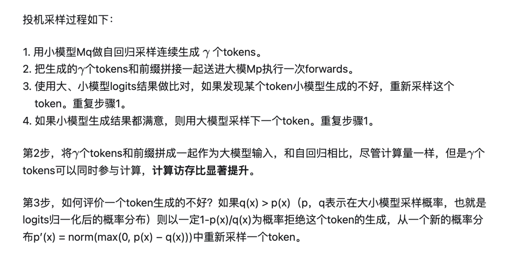

# Speculative Decoding

## 基本原理

**自回归采样**：生成的 token 一个一个地蹦出来，因为每次只对序列长度为 1 的部分进行有效计算，但是却需要对全部前缀对应位置的 activations 进行访问，因此计算访存比很低。

**投机采样（Speculative Decoding）**：使用两个模型，一个是原始目标模型，另一个是比原始模型小得多的近似模型。近似模型用于进行自回归串行采样，而大型模型则用于评估采样结果。这里的小型模型可以采用与原始模型相同的结构，但参数更少，或者干脆使用 n-gram 模型。

> 疑问：什么是 n-gram 模型？

> 补充说明：
>
> `p(x)<q(x)` 的时候应该是小模型分布和大模型的分布存在突变（小模型出错的地方）, 需要一定概率放弃, 然后从正常部分 `[p(x)>q(x)]` 的分布中去采样。
>
> 计算访存比低的原因是因为每生成一个 token，全部 weight 都要从显存 load 一遍。每生成一个 token 都要访问前缀信息，只不过可以访问 KVCache，在生成句子长度不太长或 BS 不是特别大的时候，KVCache 的访存相比 weight 要小很多。
>
> 这里其实计算量不是不变，而是增大了的。只是因为大模型顺序执行输出一个 token 和并行输出所有 token 时间成本是一致的。利用了"冗余算力"换取时间。

## vLLM

speculative models 不支持 tensor parallelism，但主模型支持。

核心实现：`_run_speculative_decoding_step`。

## 参考资料

**官方文档：**

- [vLLM 官方文档 - Speculative Decoding](https://docs.vllm.ai/en/stable/features/spec_decode.html#speculative-decoding)
- [A Hitchhiker’s Guide to Speculative Decoding](https://pytorch.org/blog/hitchhikers-guide-speculative-decoding/)

**学习资料：**

- [大模型推理妙招—投机采样（Speculative Decoding）](https://zhuanlan.zhihu.com/p/651359908)
- [GitHub: Fast inference from transformers via speculative decoding](https://github.com/feifeibear/LLMSpeculativeSampling)

**参考论文：**

- [Speculative Decoding 论文阅读合订本](https://zhuanlan.zhihu.com/p/684217993)
- Fast Inference from Transformers via Speculative Decoding
- SpecInfer: Accelerating Generative Large Language Model Serving with Tree-based Speculative Inference and Verification
- Chimera: A Lossless Decoding Method for Accelerating Large Language Models Inference by Fusing all Tokens
- Lossless Acceleration for Seq2seq Generation with Aggressive Decoding
