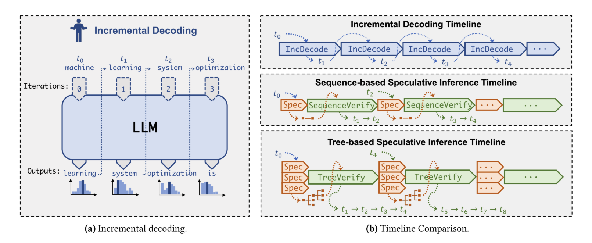

# Speculative Decoding 论文阅读

---

## Roadmap

Break the Sequential Dependency of LLM Inference Using Lookahead Decoding (第一篇引入 candidate pool 的工作)

**原模型 + 新预测头 作为 Draft Model：**

- Medusa: Simple LLM Inference Acceleration Framework with Multiple Decoding Heads
- Exploring and Improving Drafts in Blockwise Parallel Decoding (N-gram)
- Break the Sequential Dependency of LLM Inference Using Lookahead Decoding (N-gram)
- Ouroboros: Speculative Decoding with Large Model Enhanced Drafting (N-gram)

**Target Model 知识（除了 logits 以外的信息）复用：**

- EAGLE: Speculative Sampling Requires Rethinking Feature Uncertainty (hidden states)
- GliDe with a CaPE: A Low-Hassle Method to Accelerate Speculative Decoding (KV cache)

MLP speculators: Accelerating Production LLMs with Combined Token/Embedding Speculators

> Reference: [Speculative Decoding 论文阅读合订本 - 灰瞳六分仪的文章 - 知乎](https://zhuanlan.zhihu.com/p/684217993)

---

## Speculative Sampling

### Fast Inference from Transformers via Speculative Decoding

**Observations:**

- Hard language-modeling tasks often include easier subtasks that can be approximated well by more efficient models.
- We can make exact decoding from the large models faster, by running them **in parallel** on the outputs of the approximation models, potentially **generating several tokens concurrently**.

**Main contributions:**

- A novel sampling method we call **speculative sampling**.
- A decoding mechanism we call **speculative decoding** that can accelerate decoding from autoregressive models, without any change to the model architectures, training regimes and output distributions.

**Speculative sampling:**

**Speculative decoding:**

> Let `Mp` be the target model, Let `Mq` be a more efficient approximation model for the same task.

1. Use the more efficient model `Mq` to generate completions.
2. Use the target model `Mp` to evaluate all of the guesses and their respective probabilities from `Mq` **in parallel**, accepting all those that can lead to an identical distribution.
3. Sampling an additional token from an adjusted distribution to fix the first one that was rejected, or to add an additional one if they are all accepted.

**Limitation:**

Latency is improved through increased concurrency at the cost of an increased number of arithmetic operations. (需要耗费更多的计算资源来减少推理时延)

但通常情况下，**memory bandwidth** is the bottleneck（因为 decode 阶段是 **memory-bound** 的）。

**Benefits:**

- The model architecture doesn’t change.
- Retraining isn’t required.
- The output distribution is guaranteed to stay the same.
- Easy to implement, and can be used to speedup inference using out-of-the-box models without developing and evaluating custom schemes.

---

## Tree Attention

### SpecInfer: Accelerating Generative Large Language Model Serving with Tree-based Speculative Inference and Verification

SpecInfer, a tree-based speculative inference and verification system for LLM serving.

**Main contributions:**

- To **maximize speculative performance**, we propose **a merge- and an expansion-based method** to construct token trees by exploiting diversity within and across SSMs, respectively.
- To **minimize verification cost**, we introduce **a tree-based parallel decoding mechanism** to simultaneously verify all tokens of a token tree.

**SpecInfer’s overview:**

- **Learning-based Speculator:** produces a speculated token tree. The goal of the speculator is to predict the LLM’s output by maximizing the overlap between the speculated token tree and the tokens generated by the LLM using incremental decoding.
- **Token Tree Verifier:** verifies a speculated token tree against the LLM’s output. For each token, SpecInfer computes its activations by considering all of its ancestors in the token tree as its preceding tokens. (tree-based parallel decoding)

**Key advantages:**

- **Reduced memory accesses to LLMparameters:** Reduced accesses to GPU device memory and reduced data transfers between GPU and CPU memory.
- **Reduced end-to-end inference latency:** takes a speculated token tree as an input and can simultaneously examine all tokens in the token tree by making a single verification pass.

> Background knowledge: serve LLMs by utilizing **CPU DRAM and persistent storage** to **save model parameters** and **loading these parameters** to **GPU’s high bandwidth memory (HBM)** for computation.

---

## N-gram

## Medusa

## EAGLE

## MLP Speculators
