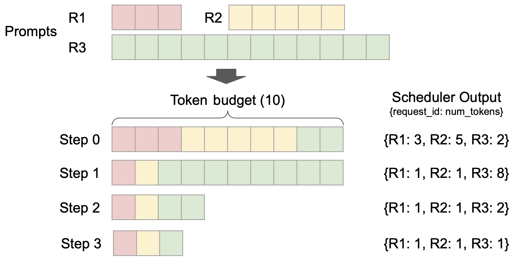
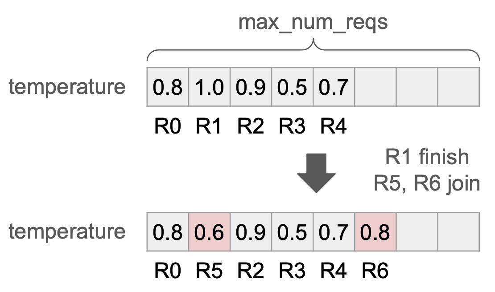

# V1 Engine

## 核心特性

### 1. Optimized Execution Loop & API Server


vLLM V1 extends this by integrating the multiprocessing architecture deeper into the core of AsyncLLM, creating an **isolated `EngineCore` execution loop** that focuses exclusively on the **scheduler** and **model executor**.

This design allows for greater overlap of **CPU-intensive tasks**—such as tokenization, multimodal input processing, de-tokenization, and request streaming—with the core execution loop, thereby maximizing model throughput.

### 2. Simple & Flexible Scheduler



It removes the traditional distinction between “prefill” and “decode” phases. (**combining prefill and decode within the same batch**)

Scheduling decisions: `{request_id: num_tokens}`, which specifies the number of tokens to process for each request at each step.

**Chunked-prefill** scheduling is seamlessly implemented: with a fixed token budget, the scheduler dynamically decides how many tokens to allocate to each request.

### 3. Zero-Overhead Prefix Caching

In V1, we optimize the data structure for constant-time cache eviction and carefully minimize Python object creation overhead.

### 4. Clean Architecture for Tensor-Parallel Inference


V1 overcomes this by **caching request states on the worker side** and **transmitting only incremental updates** (diffs) at each step. This optimization minimizes inter-process communication, allowing the scheduler and Worker 0 to operate in separate processes, resulting in a clean, symmetric architecture. Moreover, V1 **abstracts away most distributed logic**, enabling workers to operate the same way for both single-GPU and multi-GPU setups.

### 5. Efficient Input Preparation



V1 implements the **Persistent Batch** technique, which caches the input tensors and only applies the diffs to them at each step. (utilizing Numpy operations)

### 6. torch.compile and Piecewise CUDA Graphs

V1 leverages vLLM’s `torch.compile` integration to automatically optimize the model. This allows V1 to efficiently support a wide variety of models while minimizing the need of writing custom kernels. Furthermore, V1 introduces **piecewise CUDA graphs** to alleviate the limitations of CUDA graphs.

### 7. Enhanced Support for Multimodal LLMs

**First**, V1 optimizes multimodal input preprocessing by moving it to a **non-blocking process**. V1 offloads the preprocessing task to a separate process, preventing it from blocking the GPU worker, and adds a **preprocessing cache** so that processed inputs can be reused across requests if they share the same multimodal input.

**Second**, V1 introduces **prefix caching** for multimodal inputs. In addition to the hash of token IDs, **image hashes** are used to identify the KV cache for image inputs.

**Third**, V1 enables **chunked-prefill** scheduling for MLLMs with the **“encoder cache”**. With the encoder cache, V1 temporarily stores the vision embeddings, allowing the scheduler to split the text inputs into chunks and process them across multiple steps without needing to regenerate vision embeddings every step.

### 8. FlashAttention 3

The final piece of the puzzle for vLLM V1 was integrating **FlashAttention 3**.

## 使用教程

### 设置环境

```bash
export VLLM_USE_V1=1
export VLLM_WORKER_MULTIPROC_METHOD=spawn
```

## 参考资料

- [vLLM V1: A Major Upgrade to vLLM's Core Architecture](https://blog.vllm.ai/2025/01/27/v1-alpha-release.html)
