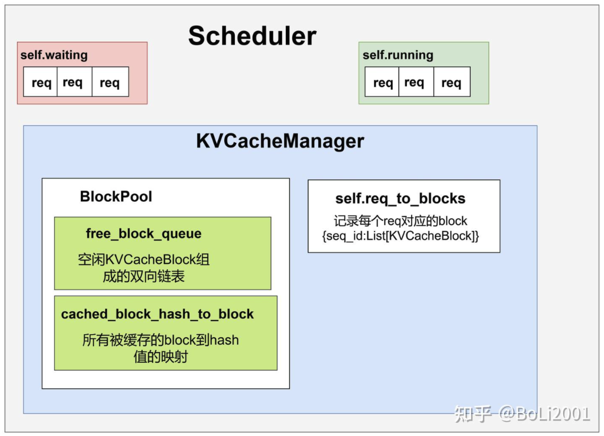

# 调度流程

## 基本原理

### V0

> 参考资料：[LLM 高速推理框架 vLLM 源代码分析 - Scheduler](https://me.tric.space/2023/07/10/vllm/#Scheduler)

### V1

V1 版本的 prefill 和 decoding 部分没有区别了吗？——对，不存在 prefill 和 decoding 的区别了。

每次调度的时候有一个 **token budget**，限制这一次最多调度多少个 token，比如说 8192，然后调度器会遍历 running 和 waiting 队列中的 req，判断每一条 req 需要计算的 token 数量是否小于 budget，如果小于的话就调度它所有需要计算的 token；如果大于的话就对需要计算的 token 截断。

这里的 req 需要计算的 token 数量就是 req 的 token 总数（prompt 的 token 数量加上输出的 token 数量）减去 `num_computed_tokens`，基本上这个数值对 decode 阶段的 req 来说就是 1，对 prefill 阶段的 req 来说就是整个 prompt 的长度（除了上一次调度超过 budget 被截断的 req）。这样直到把 budget 打满调度就停止了。

V1 的调度器不区分 prefill 和 decode 阶段，调度决策以一个简单的字典形式表示，例如 `{请求 ID: token 数量}`，调度的过程中，每个请求只记录已处理的 token 数量和需要处理的 token 数量，调度器尝试在每次调度时让已处理 token 数量追上需要处理的 token 数量。

> 参考资料：[vLLM V1 源码阅读 - Scheduler](https://zhuanlan.zhihu.com/p/32045324831)
