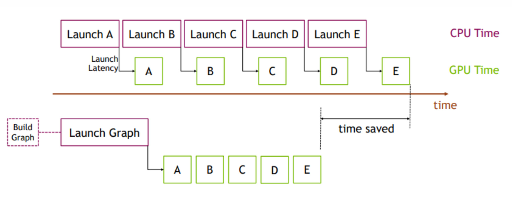

# vLLM 多模态推理｜ViT Full CUDA Graph

---

大纲：

- [x] 引言（病）：Motivation
- [x] CUDA Graph 基本原理（vLLM Decoder-Only 模型入图设计）
- [ ] ViT Full CUDA Graph 介绍（药）：Introduction
  - [ ] 整体设计（关键类、接口、流程）：画调用关系图、流程图直接用 AI 生成的
  - [ ] 关键算法：Budget-Based 多图捕获策略、greedy packing
  - [ ] 图像推理（Qwen3-VL）
  - [ ] 视频推理（Qwen3-VL）
  - [ ] DP Mode
  - [ ] Dual-Path Graph（DeepSeek-OCR / Step3-VL：介绍 tiling 策略、画图解释 dual-path packing）
  - [ ] 已支持模型、新模型适配
  - [ ] FAQ
- [ ] Benchmark 结果（效）& 性能调优建议
- [ ] 实际业务场景（托）？

问题：

- [x] 为什么 capture 之前需要 warmup？
- [ ] ViT 部分为什么不用 piecewise graph？
- [ ] 为什么要用 greedy packing（交换论证）？

---

## 一、引言

在多模态大模型的推理过程中，ViT（Vision Transformer）视觉编码器需要处理大量的图像和视频 patch。以 Qwen3-VL 为例，一张 336×336 的图像会产生约 576 个 patch tokens，多图或视频场景下 patch 数量更是成倍增长。在传统 eager 模式下，每个 CUDA kernel 的启动都需要 host 侧 CPU 发起，kernel launch overhead 在 patch 数量多但每个 kernel 计算量相对较小的场景下尤为显著。

在 vLLM 中，早已为 LLM-Backbone（即 text-only）的部分引入了 CUDA Graph，并且支持针对 Prefill / Decode 设置不同的策略，包括：`PIECEWISE`、`FULL`、`FULL_DECODE_ONLY` 以及 `FULL_AND_PIECEWISE` 四种模式。而 ViT Full CUDA Graph 则将 CUDA Graph 的覆盖范围从语言模型扩展到了 ViT Encoder，两者相互独立、可以同时启用。

它们解决的问题不同：

- Decoder CUDA Graph：主要优化的是 decode 阶段中 memory-bound 的小 batch 场景；
- Encoder CUDA Graph：主要优化的是 ViT forward 过程中 patch 数量多变导致的 kernel launch 开销。

ViT Full CUDA Graph 的引入为 vLLM 的多模态推理能力补齐了关键的一角，极大地提高了视觉输入的推理性能，可以与 Decoder CUDA Graph 一起使用。

本文将从 CUDA Graph 的基本原理开始介绍，并以 vLLM 中 decoder-only CUDA Graph 的设计作为参考，深入解析 ViT Full CUDA Graph 的整体设计、关键算法、扩展功能、模型集成以及性能调优等内容。

## 二、CUDA Graph 基本原理

> NOTE：对 CUDA Graph 的基本原理已经非常熟悉了的读者可以跳过本节，直接从第三节开始阅读。

### 2.1 Motivation：为什么需要 CUDA Graph？

随着现代 GPU 性能的不断提升，单个 GPU 操作（如 Kernel 执行或内存拷贝）的耗时已经降低到微秒级。然而，CPU 每次向 GPU 提交任务时仍需经历参数准备、Kernel 调度以及 Python、C++ 和 CUDA Driver 等软件栈的处理，这些提交开销同样处于微秒级。当计算包含大量小型 Kernel 时，CPU 的启动开销逐渐成为整体性能瓶颈。

CUDA Graph 正是为了解决这一问题而提出，它将多个 GPU 操作及其依赖关系预先组织成一个计算图，并在运行时通过一次 `cudaGraphLaunch` 调用即可完成整个计算图的提交与执行。



由于 Graph 中的 Kernel 和参数在创建后保持固定，Graph 重放（Replay）无需重复执行参数设置和 Kernel 调度等流程，从而显著减少 CPU 开销，提高 CPU 与 GPU 的协同效率。虽然 Graph 中的 Kernel 在 GPU 上通常也会获得一定的执行效率提升，但 CUDA Graph 最主要的优势在于消除频繁的 CPU → GPU 提交开销，从而提升整体执行性能。

### 2.2 Workflow：怎么使用 CUDA Graph？

一个使用 CUDA Graph 的基本工作流如下：

1. **Graph 捕获**：在 `cudaStreamBeginCapture` 和 `cudaStreamEndCapture` 之间，对提交到 CUDA Stream 上的 GPU 操作进行捕获（capture），从而生成 Graph；
2. **Graph 实例化**：调用 `cudaGraphInstantiate` 对 Graph 进行实例化。该过程会创建并预初始化所有 Kernel 的 work descriptors，使得该 Graph 能够在后续被尽可能快速地重复启动；
3. **Graph 重放**：调用 `cudaGraphLaunch` 提交并执行该 Graph。

相比于直接使用这些底层的 CUDA 接口，像 vLLM 这种上层的推理框架会更倾向于直接使用 PyTorch 已经封装好的能力，从而带来更好的开发体验。

PyTorch 提供了对 CUDA Graph 的原生支持，可以通过 `torch.cuda.graph` 将一段 CUDA 工作负载捕获为可重复执行的计算图。Graph 创建完成后，可通过 Replay 重复执行相同的 GPU 计算，而无需重新进行 Kernel 调度和参数设置。由于每次 Replay 使用固定的内存地址，因此只需更新输入 Tensor 中的数据即可处理新的输入。

示例代码：

```python
g = torch.cuda.CUDAGraph()

# Placeholder input used for capture
static_input = torch.empty((5,), device="cuda")

# Warmup before capture
s = torch.cuda.Stream()
s.wait_stream(torch.cuda.current_stream())
with torch.cuda.stream(s):
    for _ in range(3):
        static_output = static_input * 2
torch.cuda.current_stream().wait_stream(s)

# Captures the graph
# To allow capture, automatically sets a side stream as the current stream in the context
with torch.cuda.graph(g):
    static_output = static_input * 2

# Fills the graph's input memory with new data to compute on
static_input.copy_(torch.full((5,), 3, device="cuda"))
g.replay()
# static_output holds the results
print(static_output)  # full of 3 * 2 = 6

# Fills the graph's input memory with more data to compute on
static_input.copy_(torch.full((5,), 4, device="cuda"))
g.replay()
print(static_output)  # full of 4 * 2 = 8
```

### 2.3 Constraints：什么时候不能用 CUDA Graph？

CUDA Graph 通过将多个 GPU 操作打包为一次提交，大幅降低了 CPU 调度开销，但这种高性能是以牺牲一定灵活性为代价的。

Graph 在 Capture 时就已经确定了执行流程，因此后续 Replay 只能按照预先记录的计算图执行。如果计算过程中需要 CPU 根据运行结果动态决定后续执行逻辑，就必须退出 Graph，重新回到传统的 Eager 执行模式。

为了保证 Graph 能够正确地捕获和重放，PyTorch 对 Capture 的代码提出了许多限制：

- **地址固定**：每次 Replay 必须使用相同的内存地址，因此 Capture 使用的输入、输出 Tensor 需要保持长期存活，并在 Replay 时复用；
- **形状固定**：不支持动态 Shape，即每次 Replay 中所有 Tensor 的形状、布局和数据类型都必须与 Capture 时保持一致；
- **无 D2H 同步**：Capture 期间不能发生 CPU 与 GPU 的同步操作，例如调用 `tensor.item()`、`torch.cuda.synchronize()` 等需要等待 GPU 完成计算的操作；
- **无动态控制流**：不允许包含基于运行时数据的动态控制流（如 `if`、`for` 等），除非使用 `torch.cond()` 等基于 GPU 的控制流机制。

下面我们将通过一些具体的例子来说明到底什么情况下是不能使用 CUDA Graph 的。

**❌️ 动态显存分配：**

```python
y = torch.cat([a, b], dim=0)
```

`torch.cat()` 本身并不是不能 Capture，但它通常会创建新的 Tensor，并触发显存分配。如果 Capture 或 Replay 时发生新的内存分配，就可能导致地址不稳定，从而 Capture 失败。

因此，在推理框架中更推荐提前分配 Buffer，再使用原地写入：

```python
out[:len(a)].copy_(a)
out[len(a):].copy_(b)
```

**❌️ 动态 Shape 或动态图：**

```python
torch.cat([a[:k], b], dim=0)
```

或：

```python
xs = []
for i in range(n):
    xs.append(...)
y = torch.cat(xs)
```

这里输出 Shape 或输入 Tensor 数量依赖运行时数据，每次执行的 Graph 拓扑都可能不同，因此无法进行 Capture。

**❌️ GPU → CPU 同步：**

```python
x.item()
x.tolist()
x.cpu()
x.numpy()
print(x)
```

这些操作都会把 GPU 数据同步到 CPU，甚至创建 Python 对象。CUDA Graph Replay 只会重新执行 GPU Kernel，不会重新执行 Python，因此这类操作不能出现在 Capture 过程中。

正确的做法是：

```python
with torch.cuda.graph(g):
    output.copy_(x.sum())

g.replay()
value = output.item()  # 在 Graph 外读取
```

**❌️ 根据 GPU 结果执行 Python 逻辑：**

```python
if x.sum() > 0:
    ...
```

或：

```python
idx = x.argmax().item()
```

这里需要先将 GPU 计算结果同步回 CPU，再决定后续执行路径，因此也无法被 CUDA Graph 捕获。

**⭐ 总结：CUDA Graph 并不是禁止 Python API，而是禁止“运行时的动态行为”。凡是涉及动态分配、动态 Shape、GPU→CPU 同步、或依赖 GPU 结果进行 Python 控制流的操作，都不适合放在 CUDA Graph 的 Capture 路径中。**

### 2.4 Tricks：CUDA Graph 的显存管理

CUDA Graph 每次 Replay 都会访问与 Capture 时完全相同的虚拟内存地址，如果 Capture 期间使用的内存被 PyTorch 释放，Replay 时就可能访问非法地址；如果这些内存被重新分配给其他 Tensor，则 Replay 可能会覆盖这些 Tensor 的数据，导致结果错误。因此，Graph 使用的内存必须在整个 Graph 生命周期内保持有效，并在每次 Replay 时保持相同的地址。

为了解决这一问题，PyTorch 的 Caching Allocator 在检测到 CUDA Graph Capture 开始后，会为当前 Graph 创建一个**私有内存池（Graph-private Memory Pool）**。Capture 过程中所有新的 GPU 内存分配都来自该私有内存池，而不会被普通的内存分配器复用。该内存池会一直保留，直到对应的 CUDAGraph 对象以及 Capture 期间创建的所有 Tensor 都被释放，从而保证 Graph Replay 始终能够访问正确的内存地址。

默认情况下，每一次 Capture 都会创建一个独立的私有内存池。这种方式能够完全避免不同 Graph 之间的内存相互干扰，但当一个程序包含多个 CUDA Graph 时，也可能导致 GPU 内存占用增加。

为了减少内存开销，PyTorch 提供了**共享私有内存池（Shared Private Memory Pool）**，多个 CUDA Graph 可以共享同一个内存池，但必须满足以下条件：

- 这些 Graph 不会并发执行；
- 如果 Graph 之间存在依赖关系，则必须始终按照 Capture 时相同的顺序进行 Replay；
- 如果 Graph 之间没有数据依赖，也可以共享内存池，但需要注意，一个 Graph 的 Replay 可能会覆盖另一个 Graph 的输出，因此如果需要保留输出结果，应提前对输出 Tensor 调用 `clone()`。

这种共享内存池的方式能够在保证正确性的前提下显著降低 CUDA Graph 的额外内存开销，在 vLLM 等需要维护多个 Graph（针对不同 Batch Size）的推理框架中被广泛采用。

### 2.5 FAQ

**💡 Q1：在 Capture 之前为什么还需要 Warmup？**

Warmup 并不是 CUDA Graph 本身的要求，而是 PyTorch（以及其他深度学习框架）为了保证 Capture 得到一个稳定、可复用的 Graph 而必须做的准备工作。

在 Capture 之前，通常需要先对模型执行若干次 Warmup。其原因在于，CUDA Graph 希望捕获的是一段稳定、可重复执行的 GPU 工作负载，而首次执行模型时往往伴随着大量一次性的初始化操作，例如 CUDA Context 创建、Kernel 加载、cuBLAS/cuDNN 等计算库的 Handle 初始化、算法自动选择（Autotuning）、GPU 内存池建立以及 Workspace 分配等。

如果直接进行 Capture，这些初始化操作也会被记录到 Graph 中，不仅增加额外开销，还可能导致 Graph 无法正确复用。

因此，Warmup 的作用就是提前完成这些一次性的初始化工作，使 Capture 阶段仅记录真正需要重复执行的 Kernel 和内存操作，从而保证后续 Graph Replay 能够以固定的执行流程和内存地址高效运行，充分发挥 CUDA Graph 降低 CPU 调度开销的优势。

**💡 Q2：CUDA Graph 和 `torch.compile` 的区别是什么？**

它们解决的是不同层面的问题：

- **CUDA Graph 是运行期的优化**：在第一次运行时，把 GPU 上所有的 kernel 启动序列“捕获”下来，之后每次推理直接“回放”这段录像，省掉了 CPU 侧反复下发 kernel 的开销。它不关心你的代码写得好不好、有没有优化过，它只管“一次性下发”；
- **`torch.compile` 是编译期的优化**：把你写的 Python 代码追踪（trace）成一张计算图（FX Graph），然后在这张图上做各种变换：算子融合、内存优化、最后直接生成更贴近硬件的 kernel 代码（比如 GPU 上的 Triton kernel）。即使不配合 CUDA Graph，仅仅以普通的 eager 路径去执行这些编译后的子图，性能也可能比原始 eager 执行更好。但当它和 CUDA Graph 叠加时，重点就不再是 CPU 侧的 launch 开销，而是 fusion、codegen 以及调度优化带来的收益。

它们二者可以结合起来进行使用：CUDA Graph 让计算的启动开销趋近于零，而 `torch.compile` 则让你的计算本身跑得更快（更少的 kernel、更少的中间张量，不同资源的利用效率更高）。

## 三、vLLM 中的 CUDA Graph

> NOTE：

### 3.1 Challenge：动态 Shape 下的 Bucketing 策略

CUDA Graph 在大模型推理场景下的关键挑战：推理请求的 `num_tokens` 是动态的，而 CUDA Graph 需要静态 Shape。为了解决这个问题，vLLM 采用了 Bucketing 策略：**预先为多个固定桶大小分别捕获 Graph，运行时将实际请求向上对齐到最近的桶，并通过 padding 补齐。**

该策略本质上是 Padding 开销与 Graph 收益的权衡：

- **桶粒度过粗**：Padding 冗余计算增加；
- **桶粒度过细**：需要维护更多的 Graph，增加显存和捕获成本。

因此，在 vLLM 中，小 Batch 的请求更适合使用 CUDA Graph，大 Batch 的请求一般直接走 Eager 更划算。

### 3.2 Flexibility：四种 Graph Mode

目前，vLLM 提供了四种 Graph Mode，本质上是在权衡性能和兼容性：

- `PIECEWISE`：Attention 保持 Eager，其余部分入图，兼容性最高，但无法消除 Attention 的 launch overhead；
- `FULL`：整个 Forward 入图，性能最佳，但对 Attention backend 和 Shape 要求最高；
- `FULL_DECODE_ONLY`：仅 Decode 使用整图，Prefill 回退 Eager，利用 Decode Shape 更规整的特点获取稳定收益；
- `FULL_AND_PIECEWISE`（默认）：Decode 使用 `FULL`，Prefill 使用 `PIECEWISE`，在性能与兼容性之间取得最佳平衡。

> NOTE：最终能否使用某种模式，还受 Attention backend、模型结构和运行时 Shape 限制，不满足条件时会自动降级或回退 Eager。

### 3.3 FAQ

**💡 Q1：为什么要将 Attention 排除在 Graph 之外？**

因为 Attention 是整个推理过程中动态性和实现复杂度最高的模块：

- 依赖不同的 Attention Backend（如：FlashAttention、FlashInfer、Triton、ROCm AIter 等），且不同 Backend 对 CUDA Graph 的支持能力差异较大；
- Attention 的输入 Shape（如 KV Cache 长度、BlockTable、PageTable 等）变化也最频繁，更容易触发 Graph 捕获限制。

所以 vLLM 的 `PIECEWISE` 模式选择将 Attention 保留在 Eager 路径，仅将 MLP、LayerNorm 等 Shape 更稳定的部分纳入 CUDA Graph，以较小的性能损失换取更好的兼容性和更高的 Graph 命中率。

**💡 Q2：为什么默认使用 `FULL_AND_PIECEWISE` 模式？**

因为 Decode 和 Prefill 对 CUDA Graph 的适配性不同：

- Decode 阶段每步通常只生成 1 个新 Token，`query_len` 基本固定为 1，输入 Shape 的变化主要来自 Batch Size 和 KV Cache 长度，动态性相对较小，更容易通过 Bucketing 实现 CUDA Graph 的复用；
- Prefill 阶段需要一次性处理不同长度的 Prompt，`query_len` 变化范围很大，Shape 更加动态，Attention 兼容性也更复杂，因此采用 `PIECEWISE` 能获得更高的 Graph 命中率和更好的稳定性。

所以 vLLM 默认使用 `FULL_AND_PIECEWISE`：即 Decode 追求性能最大化，Prefill 兼顾兼容性与稳定性，在收益、兼容性和工程复杂度之间取得了最佳平衡。

**💡 Q3：为什么小 Batch 比大 Batch 更适合使用 CUDA Graph？**

因为 CUDA Graph 消除的是 CPU 侧的 kernel launch 开销，而不是 GPU 计算本身：

- **小 Batch 时**：每个 Kernel 的计算量较小，launch overhead 占比较高，因此 Graph 带来的收益更明显；
- **大 Batch 时**：Kernel 执行时间本身已经占据主要开销，即使消除了 launch overhead，整体加速也有限。
  
此外，大 Batch 往往需要更大的 Bucket 和更多 padding，会引入额外冗余计算，因此收益可能进一步下降。

## 四、ViT Full CUDA Graph

### 4.1 Overview：整体设计

[RFC: Support ViT Full CUDA Graph](https://github.com/vllm-project/vllm/issues/38175)

### 4.2 Workflow：执行流程

### 4.3 Algorithm：关键算法

Greedy Bin-Packing

### 4.4 Example：Qwen3-VL 图像推理

### 4.5 扩展：视频推理

### 4.6 扩展：ViT DP Mode

### 4.6 扩展：Dual-Path Graph

### 4.7 新模型适配

### 4.8 FAQ

为什么不用 piecewise graph？

为什么要用 greedy packing？

## 五、Evaluation

### 5.1 Benchmark

### 5.2 用户配置 & 调优建议

## 六、总结

## 七、参考资料

- [NVIDIA Docs - Getting Started with CUDA Graphs](https://developer.nvidia.com/blog/cuda-graphs/?utm_source=chatgpt.com)
- [NVIDIA Docs - Enabling Dynamic Control Flow in CUDA Graphs with Device Graph Launch](https://developer.nvidia.com/blog/enabling-dynamic-control-flow-in-cuda-graphs-with-device-graph-launch/)
- [Accelerating PyTorch with CUDA Graphs](https://pytorch.org/blog/accelerating-pytorch-with-cuda-graphs/)
- [PyTorch Docs - CUDA Graphs](https://docs.pytorch.org/docs/2.13/notes/cuda.html)
- [vLLM Docs - CUDA Graphs](https://docs.vllm.ai/en/stable/design/cuda_graphs/)
- [从 vLLM Ascend 的图模式聊开去：扩大视野，来聊聊编译](https://yiz-liu.github.io/blog/graphs-in-vllm-ascend-1/)
- [从 vLLM Ascend 的图模式聊开去：理解全局后，再看设计方案](https://yiz-liu.github.io/blog/graphs-in-vllm-ascend-2/)
- [RFC: Support ViT Full CUDA Graph](https://github.com/vllm-project/vllm/issues/38175)
- [Qwen3-VL Technical Report](https://arxiv.org/pdf/2511.21631)
- [Step3-VL-10B Technical Report](https://arxiv.org/pdf/2601.09668)
- [DeepSeek-OCR: Contexts Optical Compression](https://arxiv.org/pdf/2510.18234)
