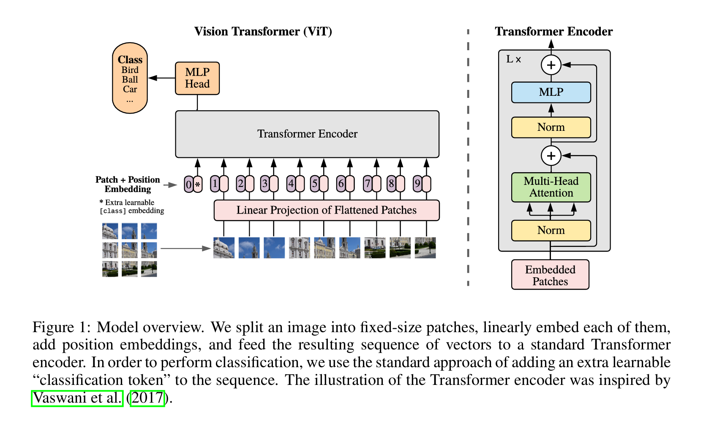

# vLLM 多模态推理｜ViT 性能优化

## 一、引言

目前，以 vLLM 和 SGLang 为首的开源推理框架针对纯语言模型的特性和优化已愈发完善，而随着多模态模型的快速发展，涌现出了诸如 VL、Omni、TTS 以及 Diffusion 等各式各样的模型，这些开源推理框架针对多模态理解或生成的推理技术还有待完善。本文将以 vLLM 为例，分享我在工作中学习并积累到的一些针对 ViT（Vision Transformer）的性能优化手段。

## 二、多模态模型概述

### 2.1 多模态模型的分类

大体来说，根据模型输入和输出所支持的模态，多模态模型可以分为多模态理解模型、多模态生成模型以及多模态理解与生成统一模型。

- **多模态理解模型**：输入为“文本/图像/视频/音频”，输出为“文本”，模型的任务是理解而不是创造图像或视频。一般由 ViT + 自回归的 LLM 组成，比如：Qwen3-VL、Intern3-VL、DeepSeek-OCR 等；
- **多模态生成模型**：输入为“文本/图像/视频/音频”，输出为“图像/视频/音频”，这些模型一般理解能力较弱，但生成图像或视频的能力很强。一般由 DiT（Diffusion Transformer）作为视觉等多模态生成的组件，比如：Stable Diffusion 等；
- **多模态理解与生成统一模型**：输入为“文本/图像/视频/音频”，输出为“文本/图像/视频/音频”，模型不再区分 Encoder 和 Generator，而是将所有模态都看作是 Token，统一放到同一个表示空间中进行处理。一般由自回归的 LLM + DiT 组成，包括多种模型架构，比如：Qwen3-Omni、Qwen-Image、BAGLE 等。

对于“多模态理解与生成统一模型”，我们更进一步，再看看 Qwen3-Omni、Qwen-Image、BAGLE 这三条技术路线的区别。

- **Qwen3-Omni**：以 LLM 作为主结构，采用 Thinker–Talker 架构，其中 Thinker 负责思考（跨模态理解、推理），Talker 负责表达，Codec 支持低延迟流式语音生成；
- **Qwen-Image**：以 DiT 作为主结构用于多模态生成，以 LLM 作为多模态理解组件，跨模态推理能力弱，但图像生成能力更强；
- **BAGLE**：以 LLM 作为主结构，以 DiT 作为视觉等多模态生成的组件，是一种统一生成世界模型，可以直接预测多模态 Token，理解能力和生成能力都比较强。

### 2.2 多模态理解模型的推理流程

本文将主要聚焦于“多模态理解模型”，以 VL 模型为例，其推理流程大致如下：

1. **多模态输入预处理**：推理引擎的 Preprocessor 将现实世界数据（图像或视频）整理成模型输入格式（Tensor），包括：图像的 Resize 和 Pad、归一化、处理 Prompt 中的模态占位符 Token（比如：`<image>`、`<audio>`）等；
2. **多模态输入编码**：（1）ViT 先将输入的视觉张量切分为许多固定大小的 Patch（即图像 Token），再将这些 Patch 展平为向量后通过 Patch Embedding 映射为 `hidden_states`，整个过程其实就是一种卷积运算；（2）ViT Attention 对 `hidden_states` 进行编码，最终生成图像特征序列；
3. **文本输入与图像特征合并**：将输入 Prompt 中为多模态特征预留的位置替换为我们编码过后的视觉 Embedding；
4. **LLM Prefill**：将合并后的输入整个喂给语言模型，让它去做 Prefill 计算，生成初始的 KV Cache；
5. **LLM Decode**：语言模型自回归地生成后续 Token，并更新 KV Cache。

### 2.3 多模态推理的性能瓶颈

还是以 VL 模型为例，对于短输出请求（即 `max_completion_tokens` 较小），在其推理的整个 Pipeline 中，耗时主要集中在输入预处理、ViT 计算以及 LLM Prefill 这三个阶段。其中，ViT 部分为 Compute-Bound（类似于 LLM Prefill，不需要读取 KV Cache），直接对整个输入进行计算并生成对应的视觉特征。稍后我们将介绍针对 ViT 部分常见的一些性能优化手段（主要是框架侧的优化、不涉及算子的优化）。

另外，在整个推理引擎层面，vLLM 通过将预处理进程与模型实际推理进程分离（异步处理、互相掩盖）、视觉预处理 Cache、视觉 Embedding Cache 跨请求共享以及 EPD（Encoder-Prefill-Decode）分离等手段极大地优化了多模态推理的性能。关于这一部分，后面有机会再另写文章做详细的介绍。

## 三、ViT 性能优化手段

### 3.1 使用 img2col 算法优化卷积计算

### 3.2 使用融合算子减少 Host 侧 Kernel Launch 开销

### 3.3 使用 Cos/Sin Cache 优化 Rope 计算

### 3.4 使用异步 Copy 掩盖 H2D 同步流

### 3.5 使用 Encoder DP 替代 TP 减少通信开销

https://github.com/vllm-project/vllm/pull/22742

### 3.6 Ascend NPU 特定优化

FA 算子输入 padding
CPU cache 减少 d2h copy

## 四、总结

profiling 指导

## 五、参考资料

- [An Image is Worth 16x16 Words: Transformers for Image Recognition at Scale](https://arxiv.org/pdf/2010.11929)
- [VILA: OnPre-training for Visual Language Models](https://arxiv.org/pdf/2312.07533)
- [Qwen3-Omni：新一代原生全模态大模型！](https://qwen.ai/blog?id=65f766fc2dcba7905c1cb69cc4cab90e94126bf4&from=research.latest-advancements-list)
