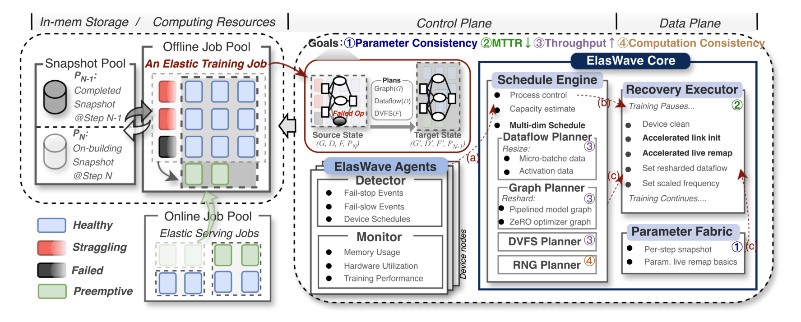

# ElasWave: An Elastic-Native System for Scalable Hybrid-Parallel Training

## What is the paper about?

ElasWave achieves all four goals simultaneously in large-scale LLM pretraining:

- Parameter Consistency
- Low Mean Time to Recovery (MTTR)
- High Post-Change Throughput
- Computation Consistency

## What is new compared to prior work?

**Main Contributions:**

- **Scheduling:**
  - **Multi-Dimensional Scheduling:** jointly reasons about data, model, hardware, and RNG to navigate trade-offs that one-dimensional approaches cannot handle.
- **Communication:**
  - **Dynamic Communicator:** edits groups in place for sub-second recovery.
- ...

**ElasWave System:**

**Components:**

- **ElasWave Agent:** detects interruptions.
- **ElasWave Core:** plans and executes elastic responses.

## What experiments were run to support the arguments in this paper?

...

## What are the shortcomings/limitations of this paper?

...

## What is a reasonable next step to build upon this paper?

...

## Basic Concepts (Related Knowledge)

...

## References (Related Works)

...
