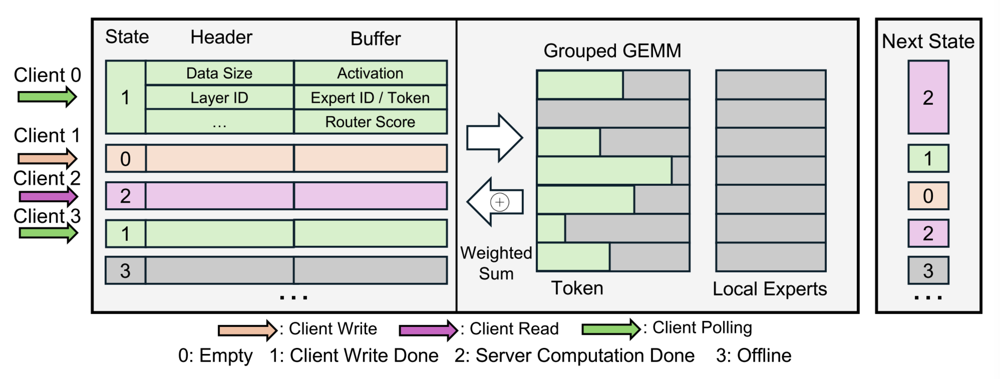
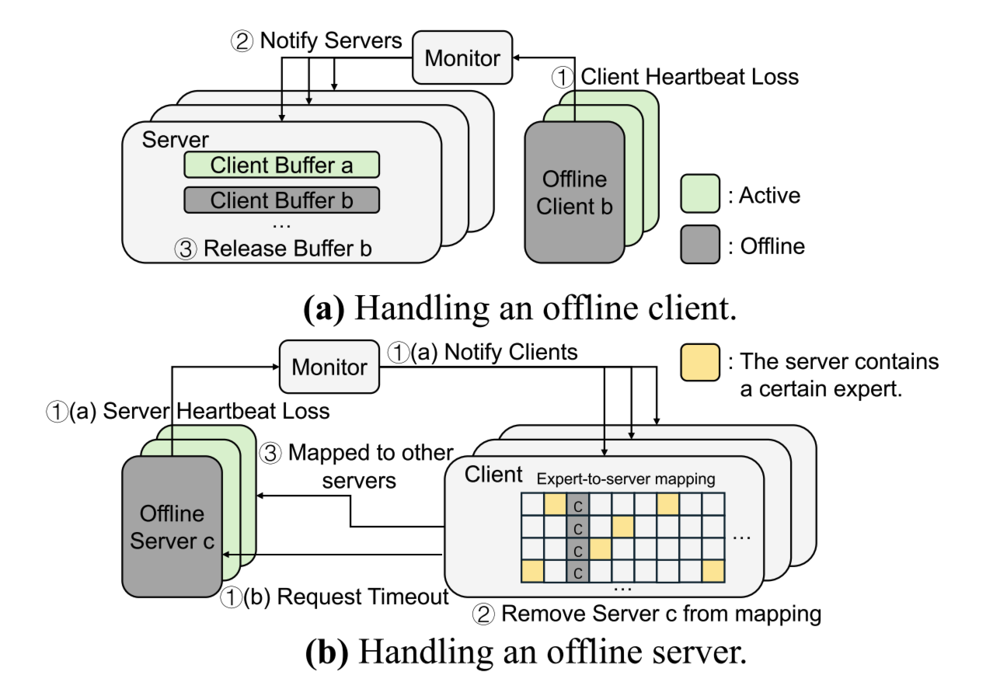

# Expert-as-a-Service: Towards Efficient, Scalable, and Robust Large-scale MoE Serving

## What is the paper about?

Our system disaggregates MoE modules into independent, stateless services. This design enables **fine-grained resource scaling** and provides **inherent fault tolerance** by decoupling compute units.

## What is new compared to prior work?

**研究现状/当前问题：**

**Monolithic Architecture:**

- **Inefficient Provisioning and High Operational Costs:**
  - **Inefficient resource allocation:** Systems must be over-provisioned for peak demand.
- **Poor Fault Tolerance and High Recovery Overhead:**
  - **Static, group-based collective communication:** The failure of a single GPU or network link within the static group will cause the `All-to-All` operation to hang or fail, bringing the entire serving instance to a halt.
- **Static Load Balancing and Performance Bottlenecks:**
  - The mapping of experts to GPUs is fixed when the service is launched.
  - This static assignment cannot adapt to dynamic workload patterns.

**主要贡献/创新点：**

**Service-Oriented Architecture:**

We decouple the MoE layers from the rest of the model, such as the attention layers, treating the pool of experts as dynamically accessible and independent services. (treats experts as the independent, **stateless** services they truly are.)

- **Fine-grained Elasticity:**
  - Removes the need for static communication group establishment between GPUs.
- **Improved Robustness:**
  - Replacing collective communication with **peer-to-peer (P2P)** interactions between attention clients and expert servers.
  - Removes the dependency on fragile, static communication groups for expert parallelism.
  - A new server only needs to register its availability to be integrated into the system.
- **Dynamic Load Balancing:**
  - New expert instances can be added to the serving pool without interrupting the overall service.

**System Design:**

- **Attention Clients:**
  - The client’s router dispatches activations to the appropriate expert servers via asynchronous peer-to-peer (P2P) communication.
- **Expert Servers:**
  - Hosts a subset of experts.

Both clients and servers can be scaled independently to meet dynamic workloads.

Shared communication buffer (slots on MoE server):

- **Buffer State:** Ensure proper synchronization without direct communication.
- **Header:** metadata
- **Data Payload:** token activation/expert mapping/router score

**Communication:**

CPU-free, asymmetric asynchronous peer-to-peer communication library.

**Fault Tolerance:**

## What experiments were run to support the arguments in this paper?

- **Performance:**
  - Throughput / Total Number of Requests
  - Inter-Token Latency / Total Number of Requests
- **Scalability:**
  - Throughput / Different **GPU counts** configurations & Total Number of Requests
- **Fault Tolerance:**
  - Randomly disable ten GPUs, one at a time.
  - Measure the average decoding throughput during recovery.

## What are the shortcomings/limitations of this paper?

**Dynamic Load Balancing for Experts (load-balancing algorithms):**

- 初始化时，如何决定每个 MoE server 上分配哪些专家（如何分组到每个 server 上）？
- Scaling 时，何时应该调整 server 数量，何时应该调整每个 server 上的专家分配？
- 权重加载：每个 MoE server 上只需要加载分配的专家的权重？需不需要存储其它未加载专家的权重？
- 恢复策略？

## What is a reasonable next step to build upon this paper?

In future work, we plan to investigate **expert load balancing strategies** specifically tailored for EaaS.

**Workload:** [ShareGPT](https://huggingface.co/collections/bunnycore/sharegpt-datasets-66fa831dcee14c587f1e6d1c) / BurstGPT.

## Basic Concepts (Related Knowledge)

static communication group establishment between GPUs
static, group-based collective communication
static process group
Existing Expert Parallelism requires sharing communication groups with other collective parallelisms

Group-free Async P2P
asynchronous peer-to-peer (P2P) communication
动态通信链

one-sided RDMA operations

long-tail effects

## References (Related Works)

...
