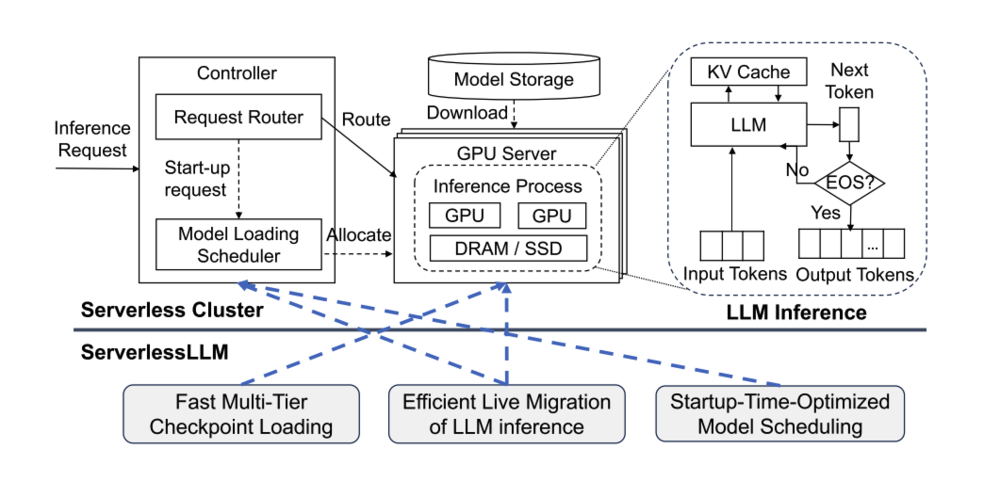
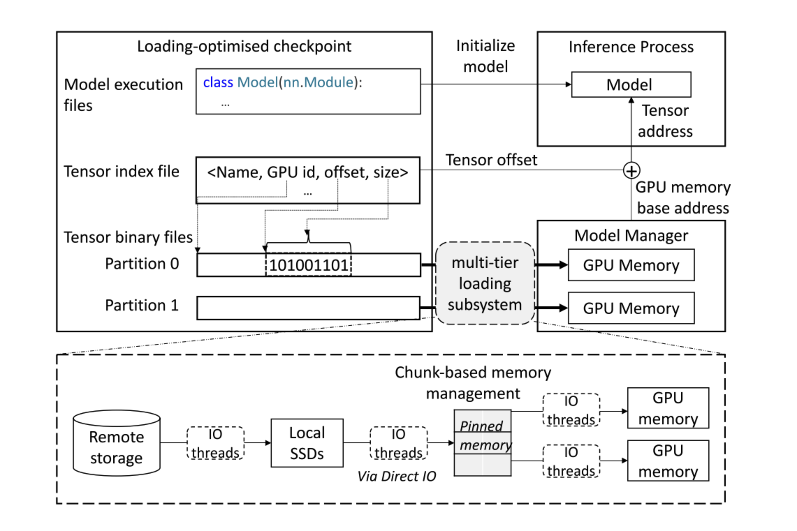
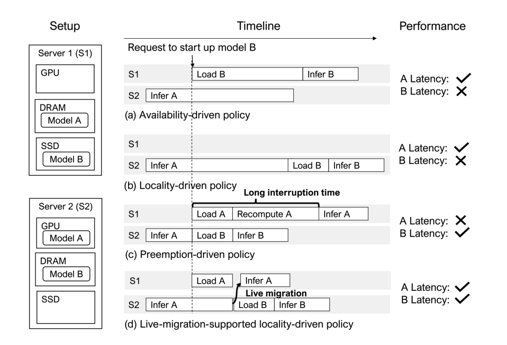
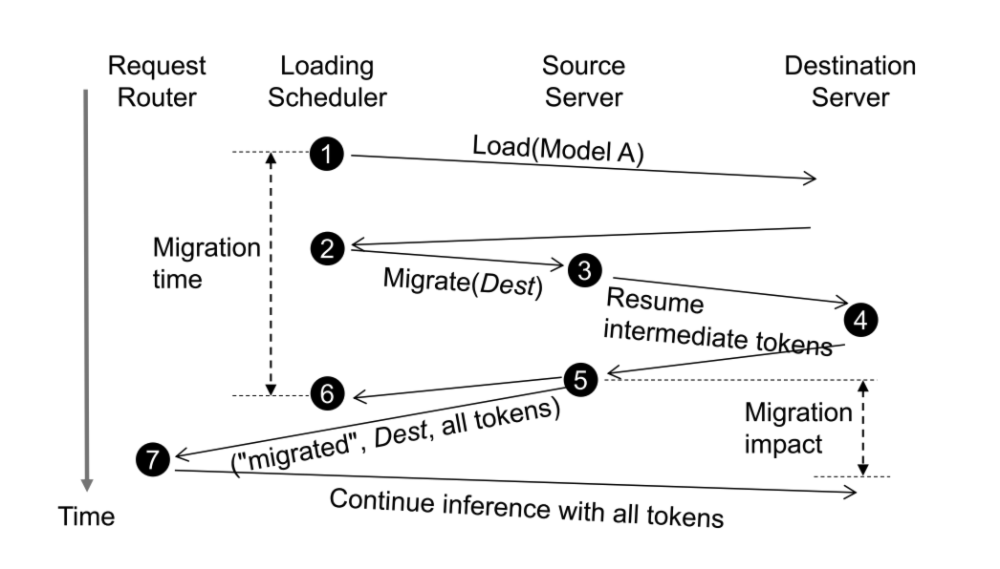
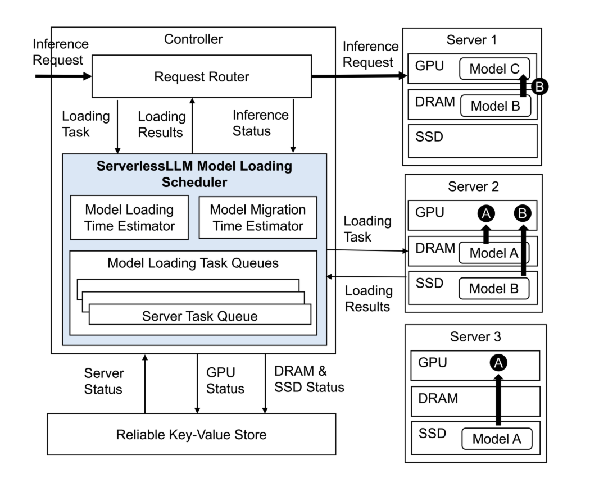

# ServerlessLLM: Low-Latency Serverless Inference for Large Language Models

## What is the paper about?

**研究背景：**

**Serverless inference** can significantly reduce costs for LLM users by charging only for the **duration of inference** and the **volume of processed data**.

- **Elastic:** auto-scaling
- **Fault-tolerance:** auto-failure-recovery

For **dynamic** and **unpredictable** workloads.

## What is new compared to prior work?

**研究现状：**

1. **Cold starts:** notable delays.
   - High **model download** times
   - High **model loading** times
2. A significant portion of the **host memory** and **storage devices** in GPU servers **remains underutilized**. Current serverless inference systems often only utilize a fraction of the available host memory and minimally employ SSDs for caching checkpoints from the model repository.
3. Which servers should be **strategically selected** to minimize the time required to start a model inference?

**主要贡献：**

1. **fast multi-tier checkpoint loading**, featuring a new **loading-optimized check-point format** and a **multi-tier loading system**, fully utilizing the bandwidth of complex storage hierarchies on GPU servers.
2. **efficient live migration of LLM inference**, which enables newly initiated inferences to **capitalize on local checkpoint storage** while ensuring minimal user interruption.
3. **startup-time-optimized model scheduling**, which assesses the locality statuses of checkpoints on each server and schedules the model onto servers that minimize the time to start the inference.

**核心技术：**

1. **Fast multi-tier checkpoint loading:**
   - a new **loading-optimized checkpoint**
      - sequential, chunk-based reading
      - efficient tensor in-memory addressing
   - an efficient **multi-tier checkpoint storage system**
      - an in-memory data chunk pool
      - memory-copy efficient data path
      - a multi-stage data loading pipeline
2. **Efficient live migration of LLM inference:**
   - the source server **migrates only the tokens**, rather than the large kv-cache -> reduce network traffic
   - it triggers an efficient **re-computation of the kv-cache** at the destination server -> migrate in time
3. **Startup-time-optimized model scheduling:**
   - **latency-preserving, locality-aware model scheduling** -> choose server, minimize startup latency
     - estimating the **time of loading checkpoints** from different tiers in the storage hierarchy.
     - estimating the **time of migrating an LLM inference** to another server.

### 1. Fast Multi-Tier Checkpoint Loading

**Loading-Optimized Checkpoints:**

1. Sequential chunk-based reading.
2. Direct tensor addressing.

ServerlessLLM allows **checkpoint loading** to be pre-scheduled and overlapped with the **initialization of the inference process**.

- **Model manager:** load tensor data.
  - Allocates **memory** on GPUs and loads the **binary data** of the checkpoint via a fast **multi-tier loading subsystem**.
- **Inference process:** initializing the model by setting the data pointers for each tensor.
  1. Initializes the model object (`nn.Module`).
  2. Sets the GPU memory address for each tensor (**base addresses** for each GPU + **tensor offset** from index file).

> NOTE: Synchronization (model manager & inference process) before inference.

**Multi-Tier Loading Subsystem:**

1. **Chunk-based data management:**
   - Utilizing parallel PCIe links: **parallel DRAM-to-GPU PCIe links** to facilitate concurrent checkpoint loading across GPUs.
   - Supporting application-specific controls: **APIs** for the allocation and deallocation of memory.
   - Mitigating memory fragmentation: using **fixed-size memory chunks**.
2. **Predictable data path:**
   - Exploiting **direct file access**: avoid excessive data copying by directly reading data into user space.
   - Exploiting **pinned memory**: eliminate redundant data copying between DRAM and GPU.
3. **Multi-tier loading pipeline:**
   - Support for multiple storage interfaces.
   - Support for intra-tier concurrency.
   - Flexible pipeline structure.

### 2. Efficient Live Migration of LLM Inference

**Multi-Round Live Migration Process:**

1. The destination server **recomputes the KV cache** using the **intermediate tokens** sent by the source server.
2. the src server **stops generating** and **sends all tokens to the dest** via the request router, ensuring minimal interruption on ongoing inference during migration.

> **Intermediate tokens:** input tokens and the output tokens produced before step 3.
>
> **All tokens:** the intermediate tokens together with the remaining tokens produced between step 3 and step 5.

### 3. Startup-Time-Optimized Model Scheduling

Distinct loading task queues for each server.

1. Assign a task.
2. Updates the server status (GPU and DRAM/SSD status) -> reliable key-value store (etcd/ZooKeeper).

## What experiments were run to support the arguments in this paper?

...

## What are the shortcomings/limitations of this paper?

...

## What is a reasonable next step to build upon this paper?

**Integrate into vLLM:**

- checkpoint loading
- LoRA adaptors
- benchmark with real-world serverless workloads
- overlap: checkpoint loading and initialization of the inference process

## Basic Concepts (Related Knowledge)

- SSD and DRAM
- PCIe
- Pinned Memory (in-memory storage)

## References (Related Works)

...
