# Speculative Decoding 论文阅读

---

[toc]

---

## Roadmap

Break the Sequential Dependency of LLM Inference Using Lookahead Decoding (第一篇引入 candidate pool 的工作)

**原模型 + 新预测头 作为 Draft Model：**

- Medusa: Simple LLM Inference Acceleration Framework with Multiple Decoding Heads
- Exploring and Improving Drafts in Blockwise Parallel Decoding (N-gram)
- Break the Sequential Dependency of LLM Inference Using Lookahead Decoding (N-gram)
- Ouroboros: Speculative Decoding with Large Model Enhanced Drafting (N-gram)

**Target Model 知识（除了 logits 以外的信息）复用：**

- EAGLE: Speculative Sampling Requires Rethinking Feature Uncertainty (hidden states)
- GliDe with a CaPE: A Low-Hassle Method to Accelerate Speculative Decoding (KV cache)

MLP speculators: Accelerating Production LLMs with Combined Token/Embedding Speculators

> Reference: [Speculative Decoding 论文阅读合订本 - 灰瞳六分仪的文章 - 知乎](https://zhuanlan.zhihu.com/p/684217993)

---

## Speculative Sampling

### Fast Inference from Transformers via Speculative Decoding

**Observations:**

- Hard language-modeling tasks often include easier subtasks that can be approximated well by more efficient models.
- We can make exact decoding from the large models faster, by running them **in parallel** on the outputs of the approximation models, potentially **generating several tokens concurrently**.

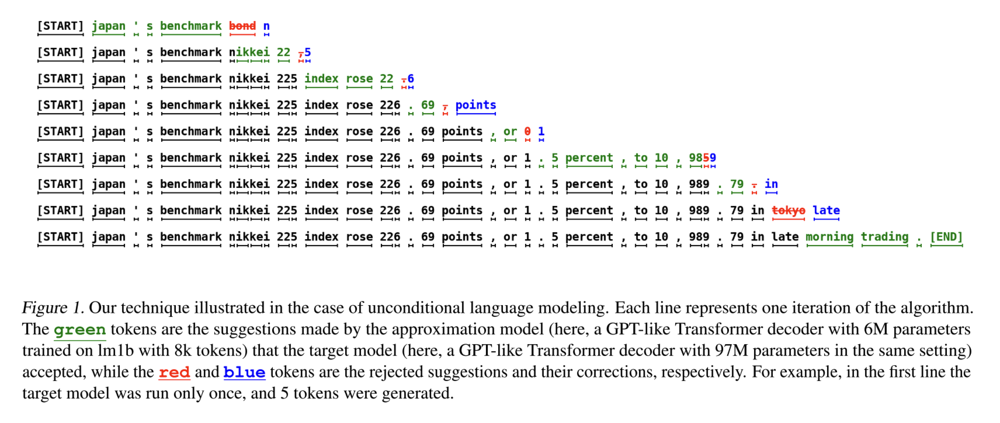

**Main contributions:**

- A novel sampling method we call **speculative sampling**.
- A decoding mechanism we call **speculative decoding** that can accelerate decoding from autoregressive models, without any change to the model architectures, training regimes and output distributions.

**Speculative sampling:**

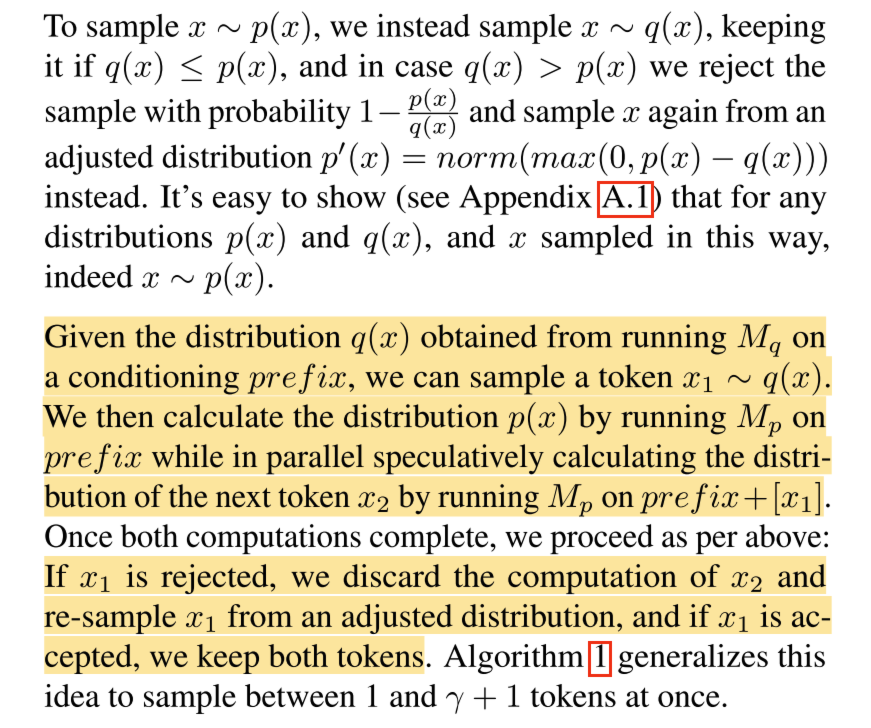

**Speculative decoding:**

> Let `Mp` be the target model, Let `Mq` be a more efficient approximation model for the same task.

1. Use the more efficient model `Mq` to generate completions.
2. Use the target model `Mp` to evaluate all of the guesses and their respective probabilities from `Mq` **in parallel**, accepting all those that can lead to an identical distribution.
3. Sampling an additional token from an adjusted distribution to fix the first one that was rejected, or to add an additional one if they are all accepted.

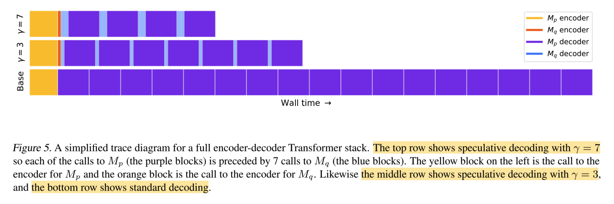

**Limitation:**

Latency is improved through increased concurrency at the cost of an increased number of arithmetic operations. (需要耗费更多的计算资源来减少推理时延)

但通常情况下，**memory bandwidth** is the bottleneck（因为 decode 阶段是 **memory-bound** 的）。

**Benefits:**

- The model architecture doesn’t change.
- Retraining isn’t required.
- The output distribution is guaranteed to stay the same.
- Easy to implement, and can be used to speedup inference using out-of-the-box models without developing and evaluating custom schemes.

### Supplements to Speculative Sampling

**Stages:**

1. Low-cost draft stage. (often involving a lower-parameter version from the same LLM series)
2. Parallelized verification stage. (ensures that the text distribution aligns precisely with the decoding results of the original LLM)

**The key to enhancing acceleration:**

- Reducing the time overhead.
- Improving the acceptance rate of the draft by the original LLM.

---

## Tree Attention

### Self-Attention Causal Mask

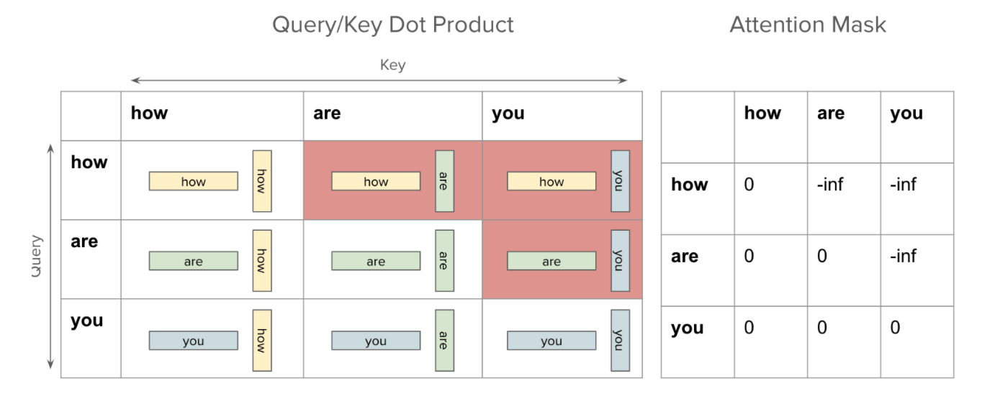

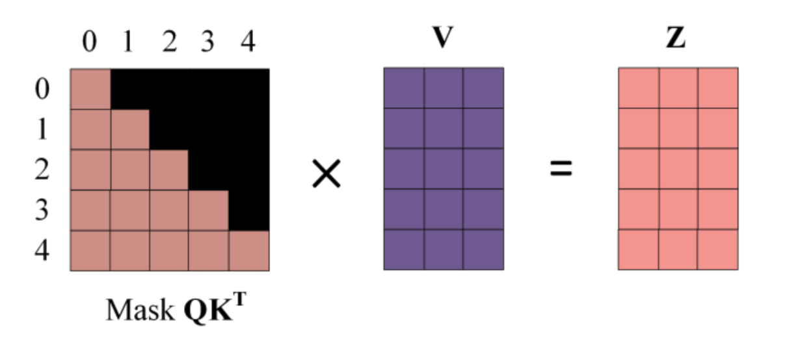

### SpecInfer: Accelerating Generative Large Language Model Serving with Tree-based Speculative Inference and Verification

SpecInfer, a tree-based speculative inference and verification system for LLM serving.

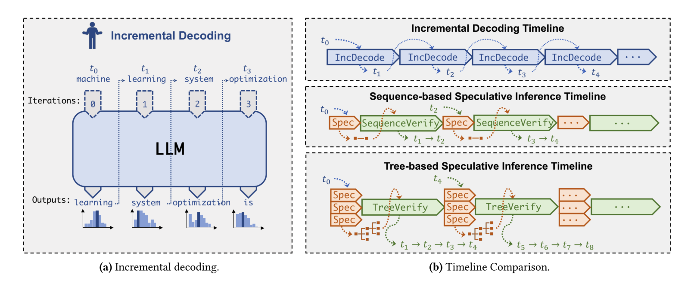

**Main contributions:**

- To **maximize speculative performance**, we propose **a merge- and an expansion-based method** to construct token trees by exploiting diversity within and across SSMs, respectively.
- To **minimize verification cost**, we introduce **a tree-based parallel decoding mechanism** to simultaneously verify all tokens of a token tree.

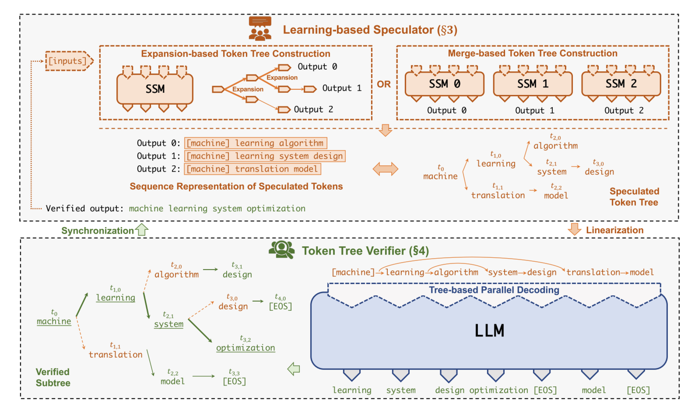

**SpecInfer’s overview:**

- **Learning-based Speculator:** produces a speculated token tree. The goal of the speculator is to predict the LLM’s output by maximizing the overlap between the speculated token tree and the tokens generated by the LLM using incremental decoding.
- **Token Tree Verifier:** verifies a speculated token tree against the LLM’s output. For each token, SpecInfer computes its activations by considering all of its ancestors in the token tree as its preceding tokens. (tree-based parallel decoding)

**Key advantages:**

- **Reduced memory accesses to LLMparameters:** Reduced accesses to GPU device memory and reduced data transfers between GPU and CPU memory.
- **Reduced end-to-end inference latency:** takes a speculated token tree as an input and can simultaneously examine all tokens in the token tree by making a single verification pass.

> Background: We serve LLMs by utilizing **CPU DRAM and persistent storage** to **save model parameters** and **loading these parameters** to **GPU’s high bandwidth memory (HBM)** for computation.

**Learning-based Speculator:**

SpecInfer’s learning-based speculator aggregates the predictions of one or multiple SSMs to maximize speculative performance while maintaining low memory overhead and inference latency.

- **Expansion-based** token tree construction (using one SSM)
- **Merge-based** token tree construction (using multiple SSMs)

**1. Expansion-based Speculator:**

> Observation: The token selected by the LLM is generally among the top-𝑘 tokens from the SSM for very small values of k.

Directly selecting the top-𝑘 tokens ❌ -> 生成的 token 太多（随着 step 指数级增加），显著增加了推理时延和内存开销。

**Resolution:** A static strategy, using a **preset expansion configuration** represented as a vector of integers **⟨𝑘1, 𝑘2, ..., 𝑘𝑚⟩**, where **𝑚** denotes the maximum number of speculative decoding steps, and **𝑘𝑖** indicates the number of tokens to expand in the 𝑖-th step. -> A simple strategy can generate **highly accurate** speculative results.

Example with expansion configuration ⟨2, 2, 1⟩:

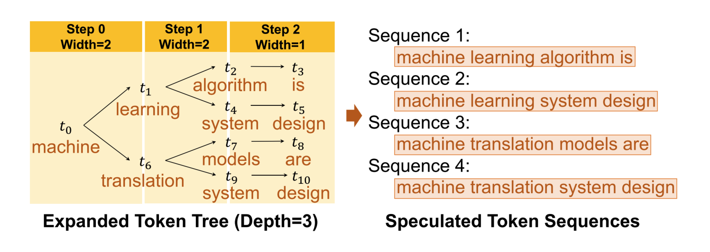

> Future work: Dynamically expanding a token tree from an SSM is an opening research problem.

**2. Merge-based Speculator:**

Combine multiple SSMs to jointly predict an LLM’s output.

SpecInfer uses an **unsupervised** method to **collectively boost-tune a pool of SSMs** to align their outputs with that of the LLM by leveraging adaptive boosting.

Workflow of training:

1. SpecInfer converts a text corpus into a collection of **prompt samples** and use the LLM to generate a token sequence for each prompt.
2. SpecInfer first **fine-tunes one SSM at a time** to the fullest and **marks all prompt samples** where the SSM and LLM generate identical subsequent tokens.
3. Next, SpecInfer **filters all marked prompt samples** and **uses all re-maining samples** in the corpus to fine-tune the next SSM to the fullest.

Merge trees when Inferencing:

In the case where multiple SSMs are employed, the output of each SSM is considered as a token tree, and SpecInfer performs **token tree merge** to aggregate all speculated tokens in a single tree structure.

**Token Tree Verifier:**

Compared with sequence-based decoding (using a different key-value cache for each sequence):

- Computationally very expensive and involves redundant computation.
- Launching one kernel for each token sequence introduces additional kernel launch overhead.

Tree-based parallel decoding:

- **Depth-first search to update key-value cache:** following a depth-first order to traverse the token tree and update the shared key-value cache. (reuses the same key-value cache across all token sequences)
- **Topology-aware causal mask:** fuse tree attention computation of all tokens in a single kernel.

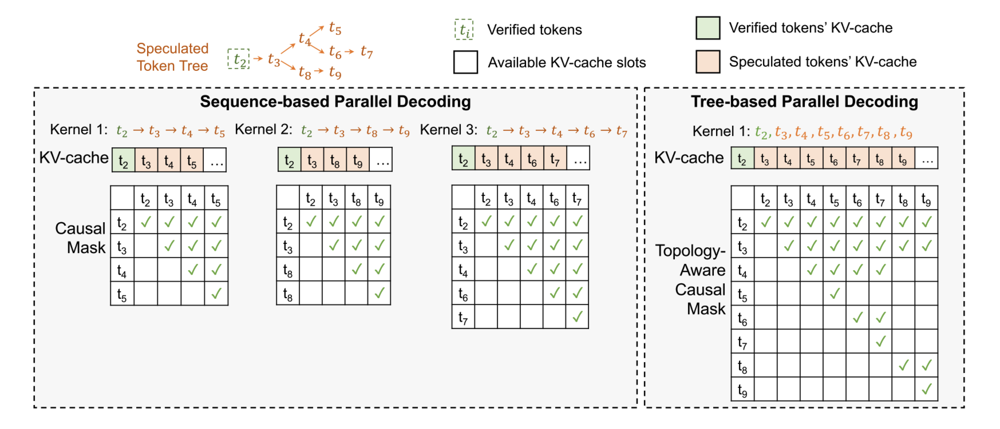

Token Verification:

- **Greedy decoding:** greedily selects the token with the highest likelihood in each decoding step. -> **naive sampling (NS):** directly sampling the next token 𝑥 ∼ 𝑃(𝑢𝑖 | 𝑈; Θ𝐿𝐿𝑀) and examining whether 𝑥 is a child node of 𝑢𝑖−1 in the speculated token tree.
- **Stochastic decoding:** samples a token from a probability distribution. -> **multi-step speculative sampling (MSS):** lower rejection probability.

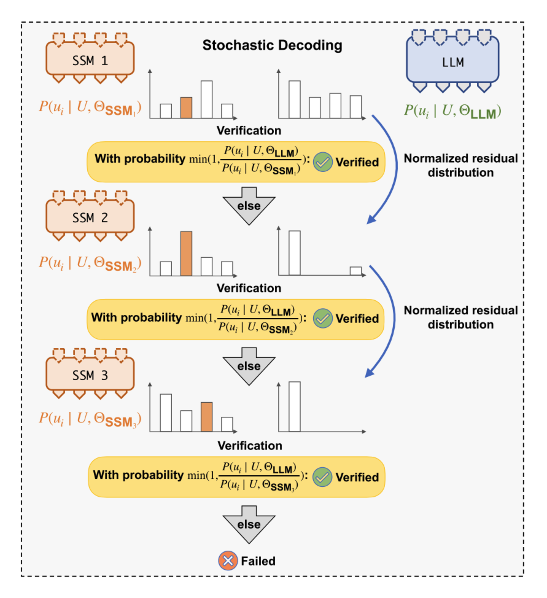

**Summary (Workflow, details: Algorithm 2 in the paper):**

1. Speculate
2. Tree parallel decode
3. Verify (Greedy or Stochastic)

System design:

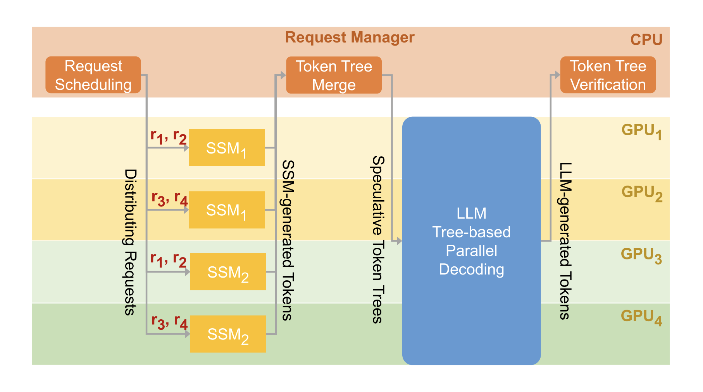

---

## Medusa

### Medusa: Simple LLM Inference Acceleration Framework with Multiple Decoding Heads

> **Background / Bottleneck:**
>
> From a system perspective, LLM inference is predominantly **memory-bandwidth-bound**, with the main latency bottleneck stemming from accelerators’ memory bandwidth rather than arithmetic computations.
>
> Each step necessitates moving the full model parameters from High-Bandwidth Memory (HBM) to the accelerator’s cache.
>
> **Resolution:**
>
> - Increasing the arithmetic intensity.
> - Reducing the number of decoding steps.
>
> **-> Speculative Decoding**
>
> Challenges: acquiring and maintaining a separate draft model.
>
> Obtaining an appropriate draft model remains challenging, and it’s even harder to integrate the draft model into a distributed system.
>
> **-> Medusa**

**Medusa:**

Integrating additional decoding heads to concurrently predict multiple tokens. These heads are fine-tuned in a parameter-efficient manner and can be added to any existing model.

**Advantages:**

- With no requirement for a draft model.
- Offers easy integration into current LLM systems, including those in distributed environments, ensuring a user-friendly experience.

**Key insights:**

- Generating **multiple candidate** continuations using the MEDUSA heads and verifying them concurrently. (generating a single candidate continuation at each decoding step leads to inefficient use of computational resources.)
- A typical **acceptance scheme** that selects reasonable candidates from the MEDUSA head outputs. (can accelerate the decoding speed further while maintaining a similar generation quality.)

To equip LLMs with predictive MEDUSA heads -> two distinct **fine-tuning** procedures:

- **MEDUSA-1:** MEDUSA is directly fine-tuned on top of a frozen backbone LLM, enabling lossless inference acceleration. (with **limited** computational resources)
- **MEDUSA-2:** MEDUSA is fine-tuned together with the backbone LLM, enabling better prediction accuracy of MEDUSA heads and higher speedup but needing a special training recipe that preserves the model’s capabilities. (with **ample** computational resources)

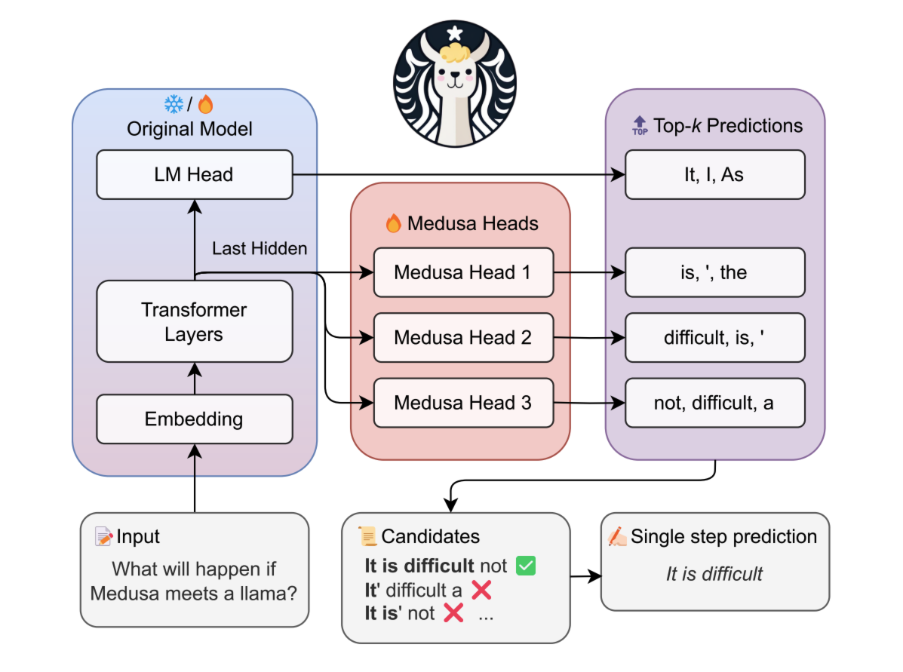

> NOTE: MEDUSA introduces **multiple heads** on top of **the last hidden states** of the LLM, enabling the prediction of several subsequent tokens in parallel. During inference, **each head generates multiple top predictions** for its designated position. These predictions are assembled into candidates, which are processed in parallel using a **tree-based attention** mechanism. The final step is to verify the candidates and accept a continuation. The longest accepted candidate prefix will be used for the next decoding phase.

> Speculative decoding steps:
>
> 1. generating candidates -> MEDUSA Heads
> 2. processing candidates -> Tree Attention
> 3. accepting candidates -> Rejection Sampling or Typical Acceptance

**Key Components:**

- MEDUSA Heads
- Tree Attention

**MEDUSA Heads:**

We add K decoding heads to original model’s last hidden states. The **k-th** head is used to predict the token in the **(t + k + 1)-th** position of the next tokens.

We utilize a single layer of feed-forward network with a residual connection for each head.

**Tree Attention:**

We employ a tree-structured attention mechanism to **process multiple candidates** concurrently.

Only tokens from the same continuation are regarded as historical data. (The attention is only applied on a token’s predecessors.)

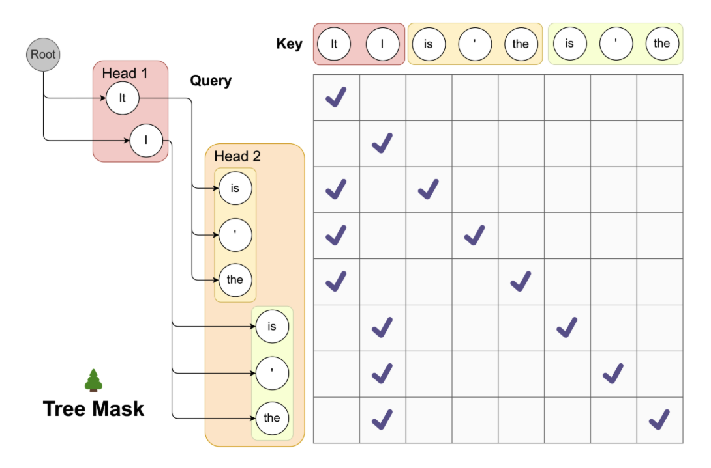

---

## Eagle

### EAGLE: Speculative Sampling Requires Rethinking Feature Uncertainty

> **Background:**
>
> Lookahead decoding (n-gram) and Medusa: their effectiveness is limited by the **lower accuracy** of the resulting drafts.
>
> **-> EAGLE (Extrapolation Algorithm for Greater Language-model Efficiency)**

**Key insight (Observations):**

- Autoregression at the feature (second-to-top-layer) level is more straightforward than at the token level. (Feature sequences exhibit more regularity) (Autoregressively predicting features yields better performance)
- The inherent uncertainty in feature (second-to-top-layer) level autoregression constrains its performance. (EAGLE inputs the token sequence from one time step ahead, which includes the sampling outcomes, into the draft model)

Uncertainty in feature sequences:

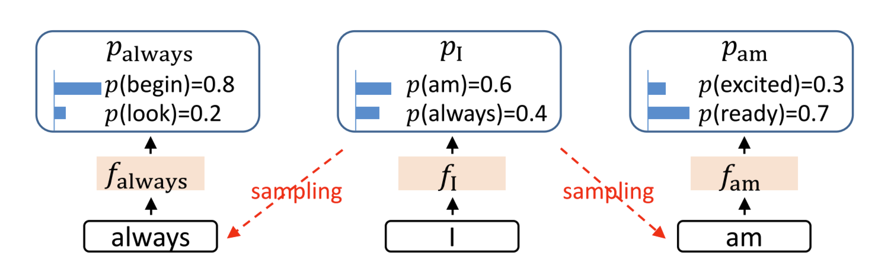

> The **next feature** following fI is contingent on the **sampling outcome** and cannot be determined solely based on fI.

**Advantages:**

- **Performance:** ⬆️
- **Generality:** EAGLE is applicable to any autoregressive LLMs.
- **Reliability:** EAGLE does not involve any fine-tuning of the original LLM. (Lookahead and Medusa do not guarantee the preservation of distribution)

**Pipeline:**

1. Drafting phase.
2. Training of the draft models.
3. Verification phase.

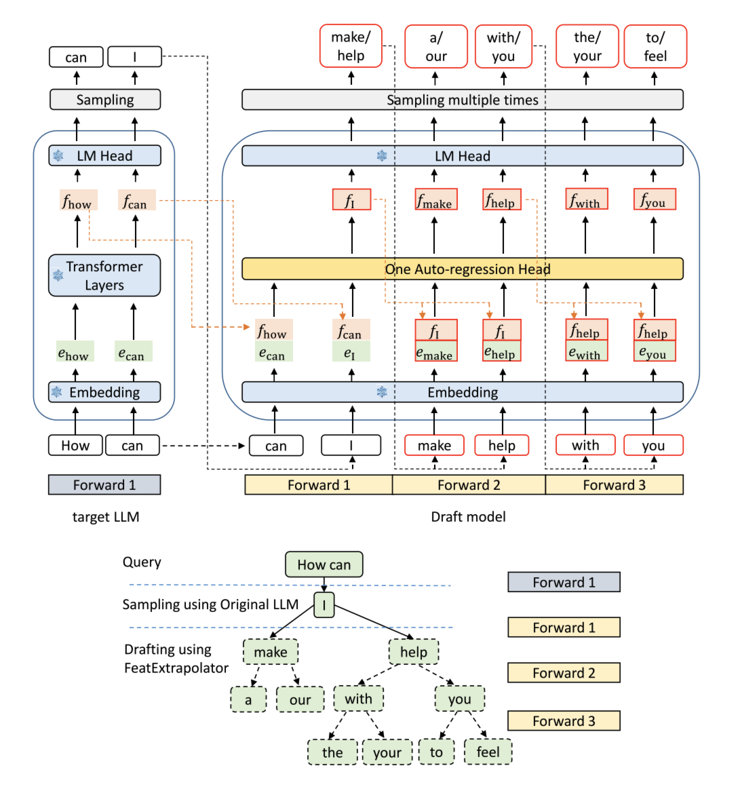

**1. Drafting phase:**

- **Speculative sampling** and **Lookahead** predict tokens based on **tokens**.
- **Medusa** independently predicts t4 and t5 using the **feature** f2 from the target LLM.
- **EAGLE** predicts f3 using the **feature sequence** (f1, f2) and the **token sequence** (t2, t3), advanced by one time step. From p4 = LM Head(f3), t4 is sampled. Subsequently, f3 and t4 are concatenated into the input sequence to predict the next feature f4 and sample the subsequent token t5.

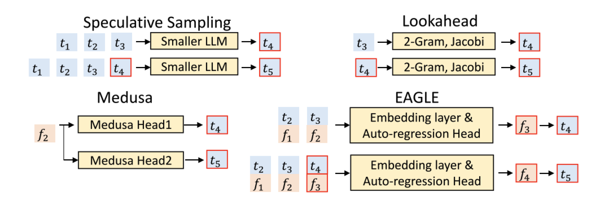

> **t:** token, **f:** features, **red border:** predictions of the draft model.

**EAGLE’s draft model:**

- **Embedding layer:** (from target LLM)
  1. token sequence -> token embedding sequence.
  2. feature sequence + token embedding sequence -> fused sequence.
- **Autoregression Head:**
  1. FC layer: reduces the dimensionality of the fused sequence.
  2. Decoder layer: predict the next feature.
- **LM Head:** (from target LLM)
  1. calculates the distribution based on the predicted feature.

predicted feature + sampled token (embedding) -> fused sequence (next input of Autoregression Head).

EAGLE creates a tree-structured draft using tree attention.

**2. Training of the draft models**

**3. Verification phase:**

Employing tree attention, consistent with SpecInfer, ensuring that the distribution of the output text aligns with that of the target LLM.

**Conclusion:**

EAGLE conducts the drafting process autoregressively at the more structured (second-to-top-layer) feature level and mitigates sampling uncertainty in predicting the next feature by incorporating tokens from one time step ahead.

EAGLE is guaranteed to preserve the output distribution of the LLM while significantly enhancing generation speed.

**感悟：一般的 Speculative Decoding 是直接根据当前的 token 序列去预测下一个 token，由于每一次预测都有多种可能的结果，导致我们预测的下一个 token 不一定和当前更早之前的 token 序列在语义上高度相关；而 EAGLE 联合上一轮预测的特征序列和当前采样的 token 序列一起去进行预测，使输入特征中包含了一定程度的语义连续信息，减少了连续预测的 token 之间的不相关性（不确定性），从而提高了 draft token 的接受率，进而可以优化模型推理的性能（速度）。**

---

## MLP Speculators

### Accelerating Production LLMs with Combined Token/Embedding Speculators

...

---

## N-gram

### Break the Sequential Dependency of LLM Inference Using Lookahead Decoding

> **Background:**
>
> - Autoregressive decoding generates only one token at a time.
> - Each decoding step largely underutilizes the parallel processing capabilities of modern accelerators.
>
> **-> speculative decoding (guess-and-verify)**
>
> Bounded by:
>
> - Token acceptance rate.
> - Training a draft model to achieve a high acceptance rate is non-trivial.
>
> Jacobi decoding?
>
> **-> Lookahead Decoding (without needing auxiliary models or data stores)**

Lookahead Decoding consists of a **lookahead branch** that generates n-grams and a **verification branch** that verifies n-grams, both executing in a single step.

**Advantages:**

- More parallelizable.
- Compatible with concurrent memory-efficient attentio (e.g., FlashAttention).
- Scale with compute resource (it linearly reduces the number of decoding steps according to per-step log(FLOPs)).

**Workflow:**

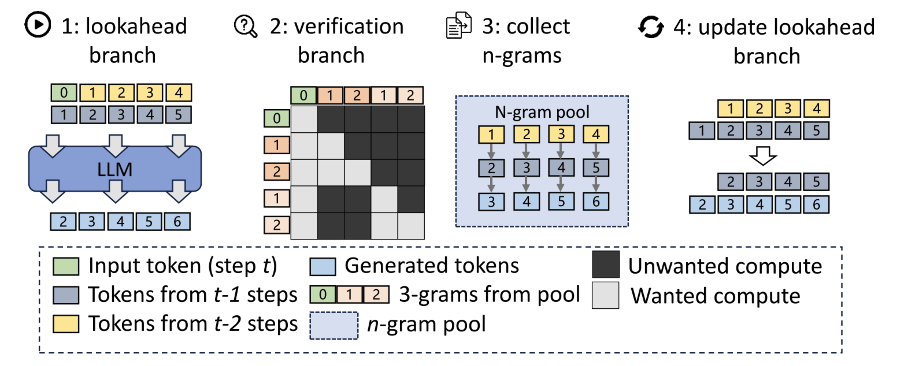

> with W = 5, N = 3, and G = 2.

For each decoding step, we do the following:

1. Generate one token at each position in the lookahead branch.
2. Verify and accept 3-grams (searched from the 3-gram pool) with the verification branch.
3. Collect and cache newly generated 3-grams in the pool from lookahead branch trajectories.
4. Update the lookahead branch to maintain a fixed window size.

**Lookahead Branch:**

fixed-sized 2D window:

- **W** defines the **lookahead** size into future token positions to conduct parallel decoding.
- **N** defines the **lookback** steps into the past Jacobi trajectory to retrieve n-grams.

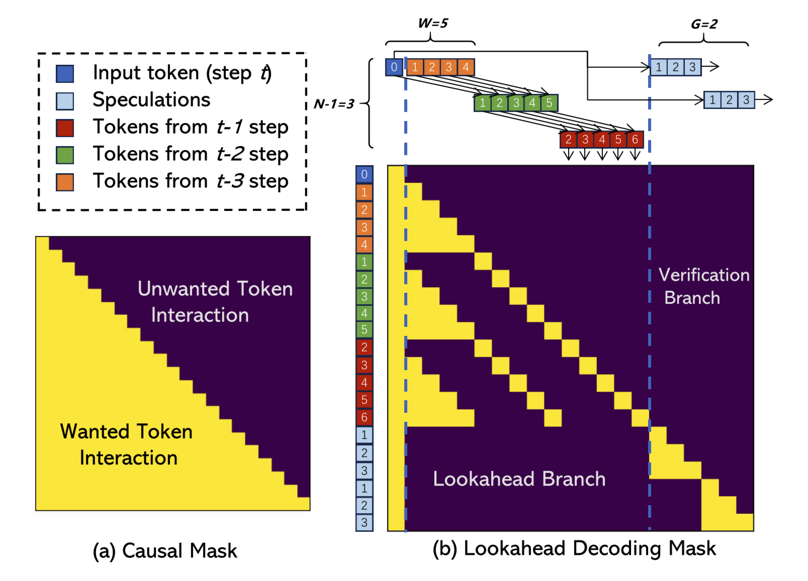

> with W = 5, N = 4, and G = 2.

**Verification Branch:**

...

**References:**

- [ ] [速览 Medusa 与 Lookahead 投机推理](https://zhuanlan.zhihu.com/p/675406771)
- [ ] [Lookahead Decoding 图文详解](https://zhuanlan.zhihu.com/p/701015670)

---
