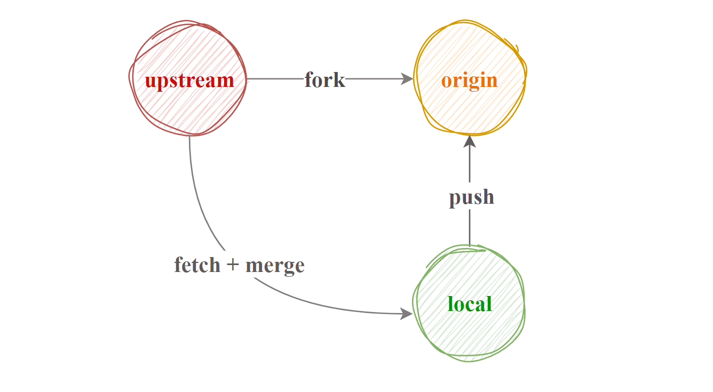
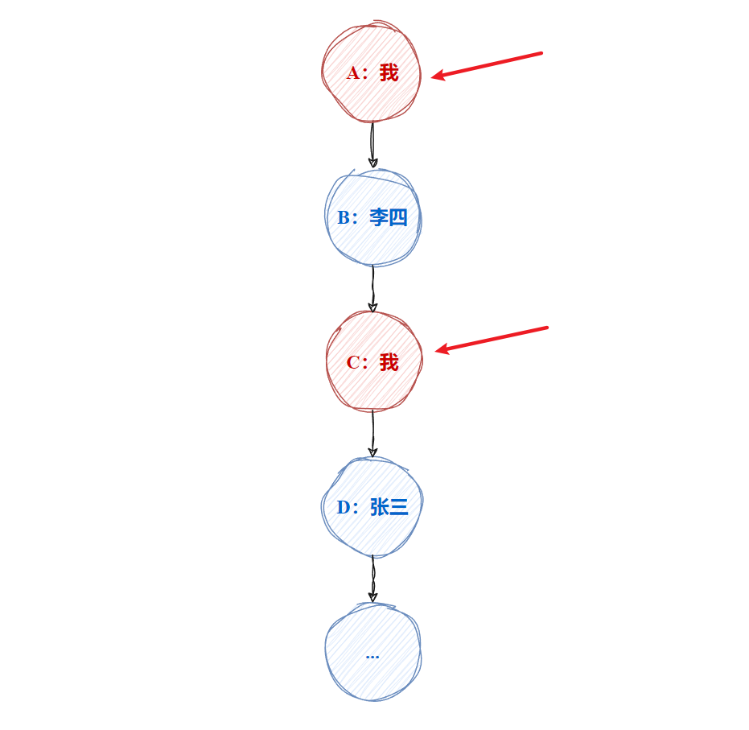
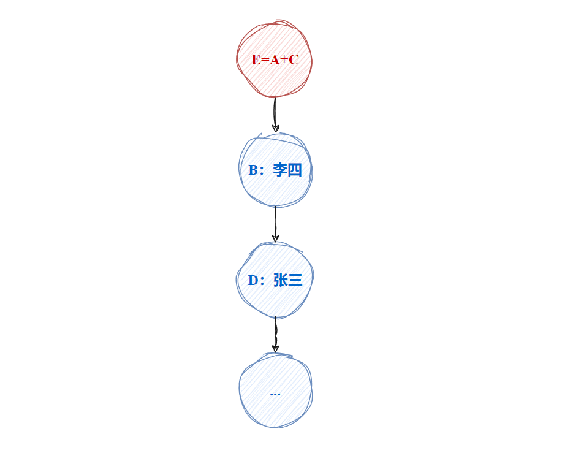

# Git 实践案例——合并多个分散的 commit 节点

[toc]

## 一、概述

本文记录了我在开源贡献的过程中遇到的一个小问题（使用 git 调整 commit 的顺序，并整合多个 commit 节点）以及最后是怎么解决的。

## 二、背景介绍

一般在进行开源贡献提交 PR 之前，我们需要先 fork 想要贡献的仓库到我们自己的 GitHub 仓库中。

首先，将上游仓库关联到我们的 remote 中，可以使用如下命令：

```bash
git remote add upstream <xxx.git>  # 新增想要 fork 的仓库的 url
git remote -v  # 查看 remote 中所有的 url，可以看到 origin 和 upstream（共 4 个 url）
git branch -vva  # 查看本地和远程的所有分支
```

然后，将上游仓库中最新的改动同步到自己的远程仓库，可以使用如下命令：

```bash
git fetch upstream  # 将上游所有最新的改动下载到本地的一个新分支中，但不更新本地分支
git checkout <branch>  # 签出本地分支
git merge upstream/<branch>  # 合并上游分支
git push origin <branch>  # 推送本地分支
```



> 关于 git fetch 的详细原理，可以参考：[<u>Git fetch 原理解析</u>](https://zhuanlan.zhihu.com/p/636158655)。
> 总结：git pull = git fetch + git merge。

## 三、我的问题

当我基于上游分支进行了一段时间的开发，并且已经多次 commit，还 push 到了我的 origin 中时，我 merge 了上游分支最新的修改，然后发现在我的多次 commit 中，穿插有其他人的 commit。

当前本地分支的 git log 情况如下：



> 注意：上图中，B 和 D 是已经合入上游仓库中的 commit；A 和 C 是只 push 到了我个人的远程仓库，还未合入上游的 commit。

我的诉求：将 A 和 C 这两个我的 commit 节点合并，并放到 B 之后，然后更新到我的远程仓库。

期望的 git log 是这样：



## 四、解决方法

先将本地分支回退到 D 节点，然后暂存当前 A + C 的修改，重新 merge 上游分支，然后恢复暂存的修改，最后提交并推送到远程仓库。

使用的命令如下：

```bash
git reset --soft <commit_id>  # 当前所有修改内容前最近的一个提交节点（D）
git fetch upstream  # 再同步一下上游仓库
git stash  # 暂存 A 和 C 修改的内容
git merge upstream/<branch>  # 合并上游分支最新的修改（B），此时 git log 变为：【B->D->...】
git stash pop  # 恢复 A 和 C 修改的内容
git add .
git commit -am "A + C 的提交信息"  # 此时 git log 变为：【E->B->D->...】
git push origin <branch> --force  # 推送到自己的远程仓库
```

> 注意：最后 push origin 时必须加上 --force，因为此时 origin 中的 commit 顺序为：【A->B->C->D->...】（因为之前已经 push 过一次 origin 了），而本地分支现在是：【E->B->D->...】，会发生冲突。此时，Git 会提示你需要先合并 origin 中的内容才能 push，这样的话 commit 的顺序就又乱了！因此，我们直接加上 --force 选项，用本地分支直接覆盖 origin 中的分支。

最后，我们成功将 A + C 的 commit 节点合并，并放到了 B 节点的后面。

**为什么要这样做呢？**

因为我的 A 和 C 提交属于同一个内容，如果中间又穿插了一个别人提交的 B，那么同一个改动的相关内容就被分隔开了，这样不利于内容管理以及问题回溯。
