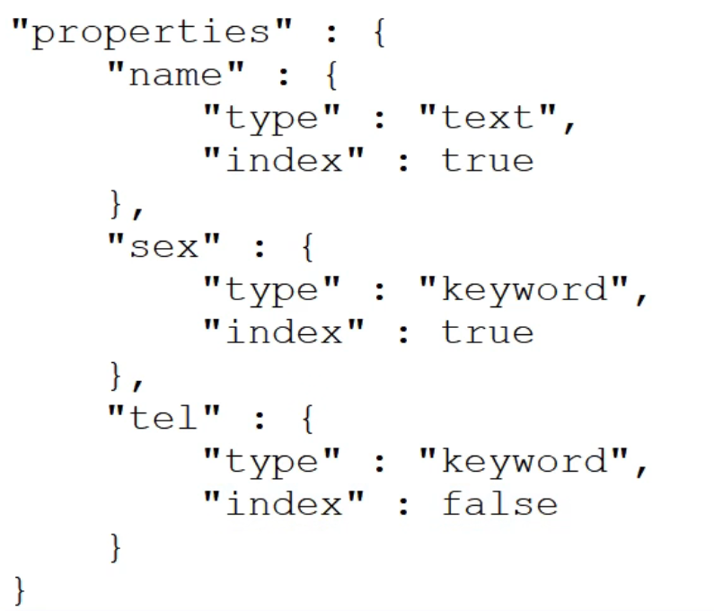
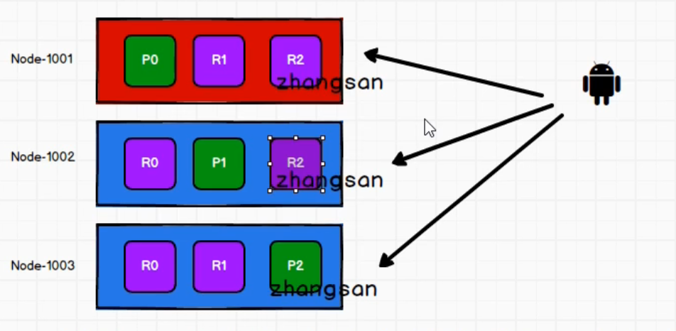
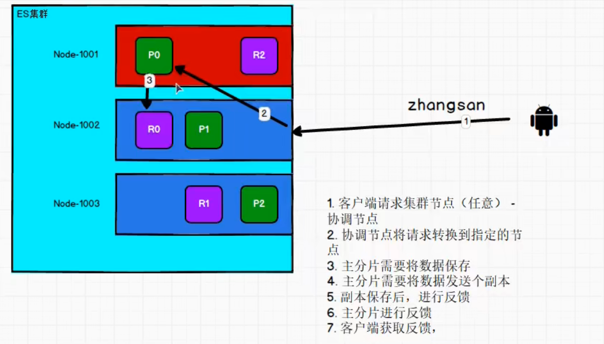
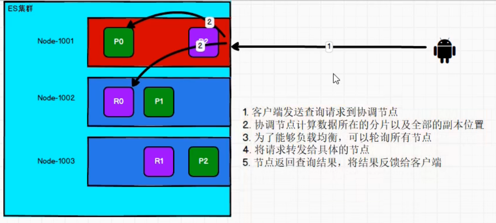
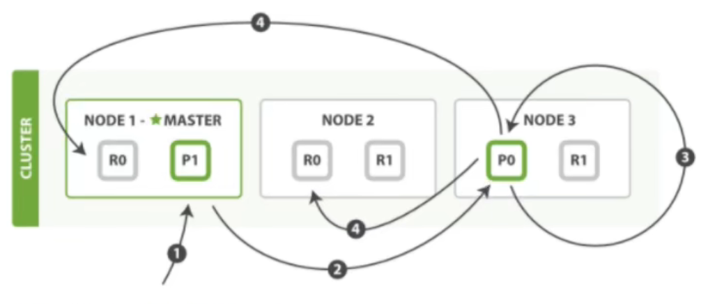

# 引言

ES 的业务场景主要为超大数据量的查询，当在日常业务中对千万级别的数据量进行分页查询时，使用 Mysql 进行处理很可能出现会超时，此时就可以考虑使用 ES 来进行搜索。

# 入门

## 1  倒排索引

- 正排索引：通过 id（主键，索引）查找内容，再从内容中查找关键字。
- 倒排索引：通过 keyword（关键字，索引）关联 id。

> PUT 方法具有幂等性，发送同样的内容，返回的结果一样。简单理解，你创建 index 不能创建两个一样的，所以需要符合幂等性（使用 PUT），但是添加数据可以有多条一样的数据，这违反了幂等性所以添加数据不需要使用 PUT，而可以使用 POST。

## 2  分词器

- 当保存文档数据时，ES 会将文字进行分词，并将拆解后的数据保存到倒排索引中。
- 当进行查询时，ES 也会将查询内容进行分词，并在倒排索引中去进行匹配（全文检索匹配：`match`，类似于模糊查询）。

## 3  其它

- 完全匹配（精确查询）：`match_phrase`。
- 关键字高亮：`highlight`。

- 聚合操作（分组、求平均）：`aggs`。

> 创建索引时，可以设置各个字段的属性：
>
> - `text`：可以被分词。
> - `keyword`：不能被分词，需要完整匹配。
> - `index`：是否能被索引。
>
> 
>

# 进阶

## 1  集群部署

### 1.1  索引分片

- 同一个索引的数据分为 P0、P1、P2 三个分片。
- 每个分片都可以分为：1 主 + N 备（绿色为主（master），紫色为副本）。

- 新增数据：路由算法（`hash(主键id) % 分片数`）。
- 查询数据：可以查每一个节点（轮询策略）。

> 注意：同一分片的主备数据不能放在同一个节点上。

### 1.2  写入数据

### 1.3  读取数据

### 1.4  更新数据

- P1 协调节点将更新请求转发到目标节点 P0（主）。
- 考虑到并发写加锁的问题，需要不断地更新（主），并将更新同步到副本。

> 延时 = 主分片的延时 + 并行写入副本的最大延时。

## 2  倒排索引

### 2.1  基本概念

- 词条：索引中存储和查询的最小单元。
- 词典：字典、词条的集合（底层可以是 B+ 树、哈希表）。
- 倒排表：……。

### 2.2  搜索原理

1. 判断当前搜索的词汇是否在词典中，若是则进行下一步。
2. 找到当前词汇在倒排表中的指针，通过倒排列表去获取当前词汇对应的文档 id 的列表。
3. 通过文档 id 去查找对应的数据（文档）。

## 3  文档分析

# 参考资料

## 1  学习视频

[【尚硅谷】ElasticSearch教程入门到精通（基于ELK技术栈elasticsearch 7.x+8.x新特性）_哔哩哔哩_bilibili](https://www.bilibili.com/video/BV1hh411D7sb/?spm_id_from=333.999.0.0)

## 2  技术博客

[肝了两小时的 Elasticsearch 保姆级入门 (qq.com)](https://mp.weixin.qq.com/s/O7dv7Np_PDPpDSSOSsiQtg)