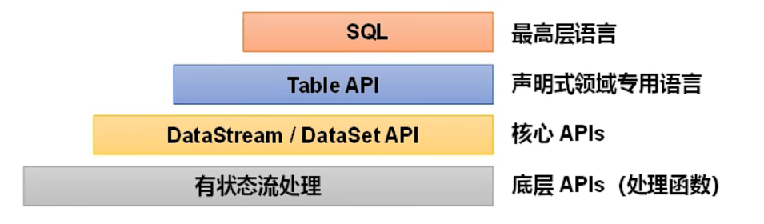
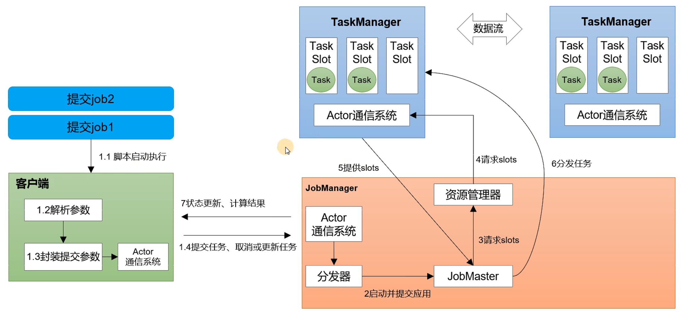

# 概述

## 1  Flink 的优点

- 批流统一：同一套代码（或 SQL），既可以跑流，也可以跑批；
- 性能卓越：高吞吐、低时延，每秒可以处理数百万个事件，毫秒级延迟；
- 规模计算：支持水平扩展架构，支持超大状态与增量检查机制；
- 高可用性：具有故障自动重试等机制。

## 2  基本概念

Flink 是一个框架和分布式处理引擎，用于对数据流进行有状态计算。

> 数据流分为无界和有界：
>
> - 无界数据流：有流的开始，但没有流的结束，会无休止地产生数据；
> - 有界数据流：有流的开始，也有流的结束，可以在接收所有数据后再进行计算。

Flink 的特点：

- 事件驱动型应用（只会被动响应）；
- 流&批数据分析；
- 有状态的流处理；
- 时间语义（事件时间、处理时间）；
- 窗口多、灵活；
- 流式 SQL；

「有状态」的流处理：把流处理需要的额外数据保存成一个「状态」，然后针对这条数据进行处理并更新状态。

> 状态一般存储在内存中，速度快，但可靠性差。

## 3  分层 API

- DataStream API：流处理；
- DataSet API：批处理。

> Flink 1.12 以后，DataStream API 已经实现了真正的流批一体，DataSet API 已经过时了。

# 部署

## 1  集群角色

- 客户端（Client）：获取代码并做转换，之后提交给协调调度中心；
- 协调调度中心（JobManager）：对作业进行中央调度管理，当它获取到要执行的作业后，会进一步做处理转换，然后分发给众多的工作节点；
- 工作节点（TaskManager）：对数据进行处理。

## 2  集群搭建

# 运行时架构

## 1  系统架构

> 一个 Job（作业）对应 JobManager 中的一个 JobMaster。

## 2  基本概念

### 2.1  并行度

将一个算子操作复制多份到多个节点，数据可以到其中任意一个节点去执行，这样一来一个任务就被拆分为了多个并行的子任务，实现了并行计算。

当一个作业包含多个算子时，该作业的并行度为所有的算子中最大的并行度。

### 2.2  算子链

一个数据流在算子之间传输数据的形式可以是一对一的直通模式，也可以是打乱的重分区模式，具体是哪一种形式，取决于算子的种类。

- 一对一模式：直接发送数据，不需要重新分区，也不需要调整数据的顺序（如：map、filter、flatmap）；
- 重分区模式：每一个算子的子任务，会根据数据传输的策略，把数据发送到不同的下游目标任务（一对多）。

合并算子链（Operator Chain）：并行度相同的一对一算子，可以直接链接在一起形成一个更大的任务（task），每个子任务会被一个线程执行（合并后并行度不变）。

> 合并算子链的优点：可以减少线程之间的切换和基于缓存区的数据交换，在减少时延的同时提升吞吐量。

# DataStream API

# 窗口

# 时间语义

# 水位线

# 双流联结

# 处理函数

# 状态管理

# 容错机制

# Flink SQL