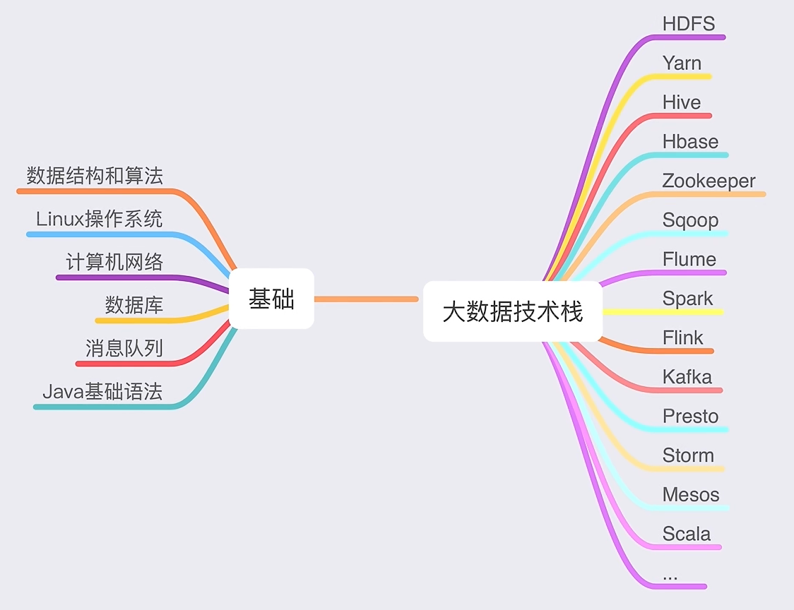

# 大数据开发 - 学习路线

## 1  核心基础

- Java 基础
- MySQL 基础
- Linux + Shell
- Maven
- Git

## 2  核心框架

- Hadoop
- Spark（离线计算）
- Flink（实时计算）
- Kafka（消息队列）
- Zookeeper
- Hive
- Flume
- Hbase
- Kylin
- Hudi（数据湖）
- ElasticSearch（搜索引擎）

## 3  项目实战

## 4  学习视频

- [2023最新大数据学习路线图 - 哔哩哔哩 (bilibili.com)](https://www.bilibili.com/read/cv5213600)