# 1 概述

## 1.1 大纲

- 常用功能：仓库管理、文件管理、分支管理、标签管理、远程操作
- 进阶功能：IDE 集成 Git、访问 GitHub、Gitee 等代码托管平台
- 功能指令：add、commit、log、branch、tag、remote、status

## 1.2 安装

git 官网：[Git (git-scm.com)](https://git-scm.com/)

# 2 客户端

## 2.1 安装

客户端软件：GUI Clients - GitHub Desktop

## 2.2  基本使用

设置个人信息：


创建本地仓库：


## 2.3 文件操作

创建文件后，git 客户端会识别出文件的变化，提交（commit）后与仓库达成一致。


修改文件后，git 客户端会识别出文件的变化，提交（commit）后与仓库达成一致。


版本号：40 个 16 进制的数字组成的版本号（提交码）


删除文件后，git 客户端会识别出文件的变化，提交（commit）后与仓库达成一致。

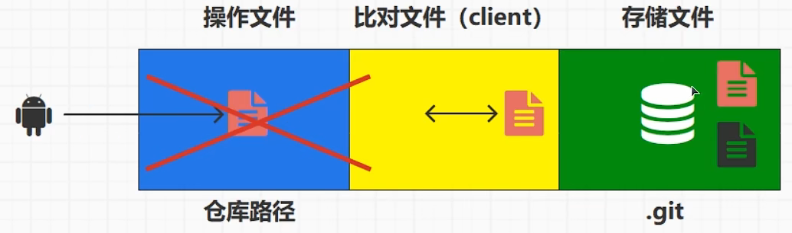

> git 客户端的比对功能仅能识别文本文件，不能识别如 word 等文件发生的变化。

## 2.4 分支操作

为什么需要分支？便于模块化开发。


创建分支：

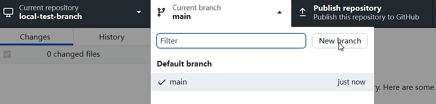

提交到当前分支：


合并到主分支：


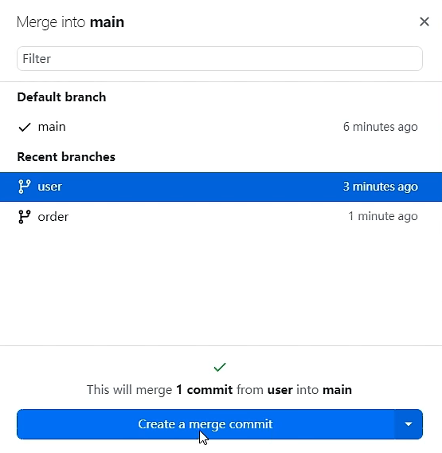

合并分支时文件出现冲突：

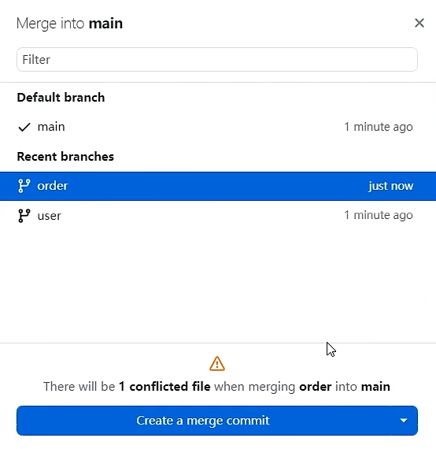


查看发生冲突的文件：

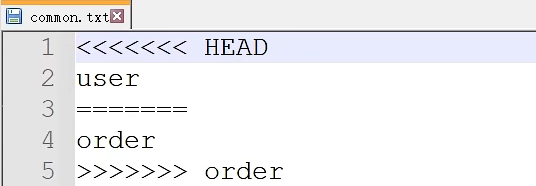

手动解决冲突：


## 2.5 标签操作

创建标签：

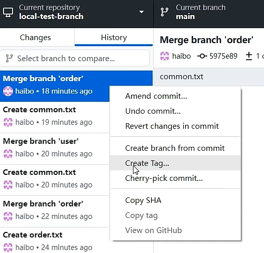

## 2.6 远程仓库

创建仓库：


或者：


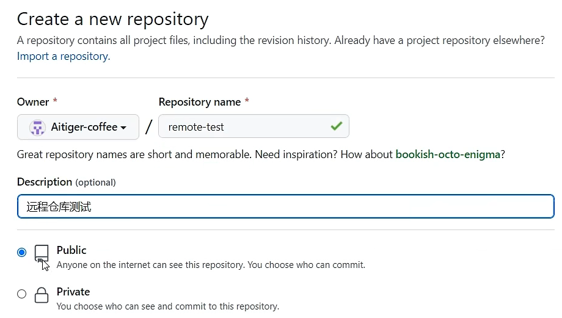

创建文件并提交：


创建新的分支：


删除仓库：


下载（克隆）仓库到本地（需要先在客户端登录自己的账号）：

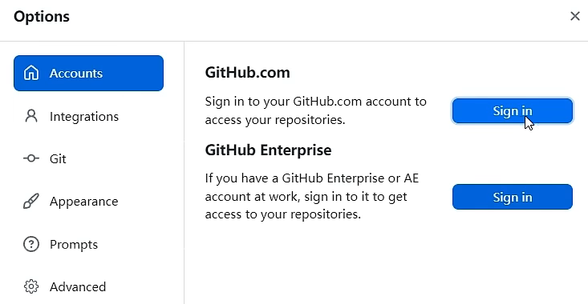

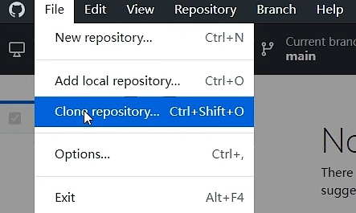


提交代码时，客户端设置的 email 应与 GitHub 的账号保持一致。


这里的提交只是将文件提交到了本地，并未同步到远程仓库。


将本地文件推送到远程仓库：

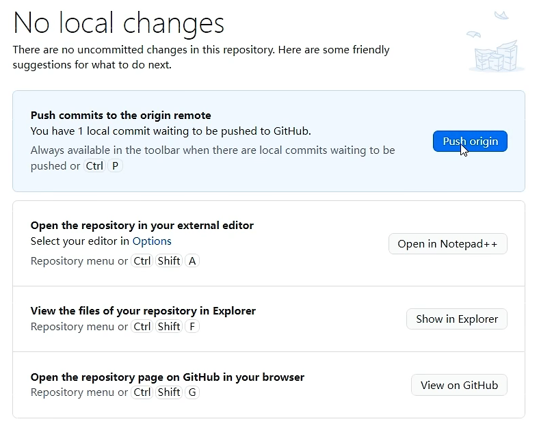

> 国内的远程仓库：https://gitee.com/

## 2.7 Git ignore

忽略某一个文件：


忽略某一类文件（如下图中的 .bak 文件）：


## 2.8 比对功能

- 删除文件：红
- 修改文件：黄
- 新增文件：绿

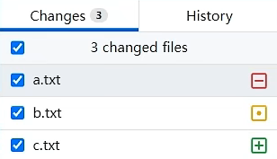

- -1：第一行删除了内容
- +1,2：第一行和第二行增加了内容

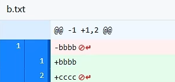

# 3 IDEA 集成 Git

## 3.1 发布项目

创建仓库：

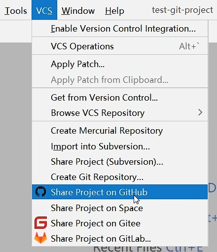

登录 GitHub 账号（授权）：


提交文件到本地仓库（Commit）：


提交文件到本地仓库并上传到远程仓库（Commit and Push）：


拉取远程仓库的文件到本地（Pull）：

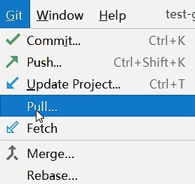


## 3.2 下载项目

将远程仓库的项目克隆到本地：

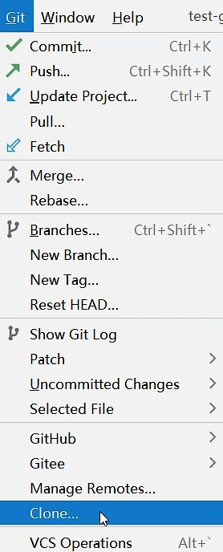

> 克隆之后会直接创建一个新的项目。

## 3.3 集成 Gitee

需要先安装对应的客户端插件：

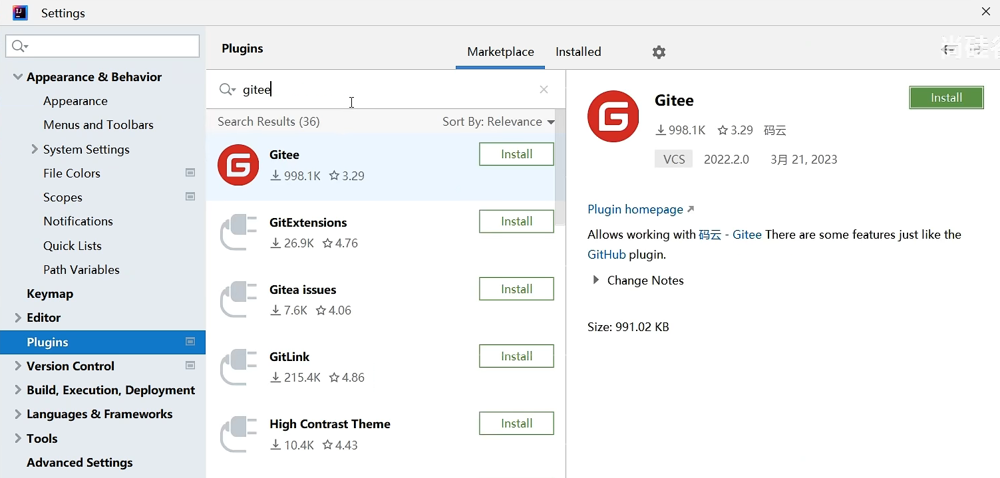

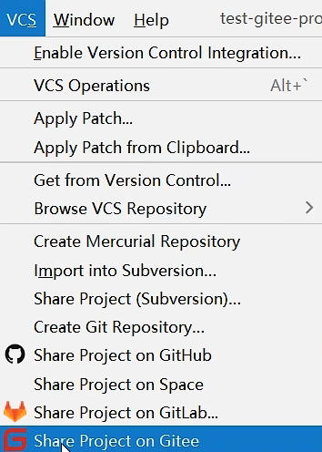

登录账号：

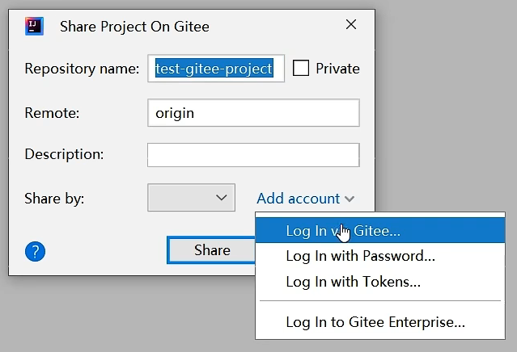

下载项目：

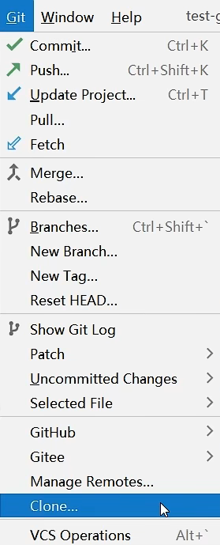

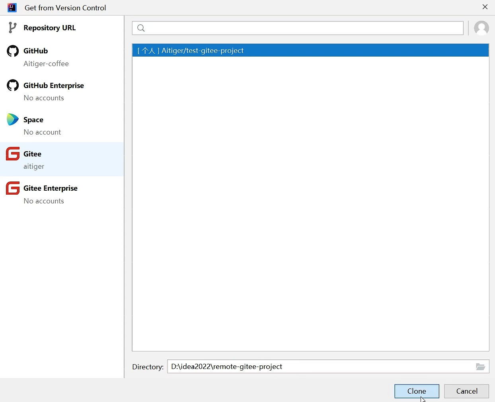

# 4 版本号

## 4.1 文件操作

一个版本号对应一次提交（commit），使用 SHA-1 进行加密（40 位），可以用于定位仓库中的文件：2（`.git` 文件夹的 `Object` 中的文件夹名）+ 38（文件名）。

根据版本号查看文件：

- 打开 git bash 窗口
- 查看文件：`git cat-file -p [版本号]`

## 4.2 分支操作

`.git/refs/heads` 文件夹中保存的是当前仓库的分支信息。每一个分支为一个文件，文件内容为最后一次提交的版本号。

> 不同分支可以指向不同的版本号。

`.git/HEAD` 文件中保存的是当前版本所引用的分支，如下所示。

```
ref: refs/heads/master
```


# 5 常用命令

## 5.1 概述


## 5.2 仓库操作

创建仓库：

- 新建文件夹
- 打开终端窗口：`git bash here`
- 初始化仓库：`git init`（此时还没有提交任何内容，没有分支信息）

下载远程仓库到本地：

- 克隆：`git clone [远程仓库URL]`
- 或者：`git clone [远程仓库URL] [自定义的本地仓库名称]`


配置仓库：

- `git config user.name [用户名]`
- `git config user.email [用户邮箱]`

或者：

- `git config --global user.name [用户名]`
- `git config --global user.email [用户邮箱]`

> --global：表示对整个 git 软件中所有的仓库应用该配置。

查看配置（系统文件）：`C/用户/xxx/.gitconfig`

查看配置（客户端工具）：

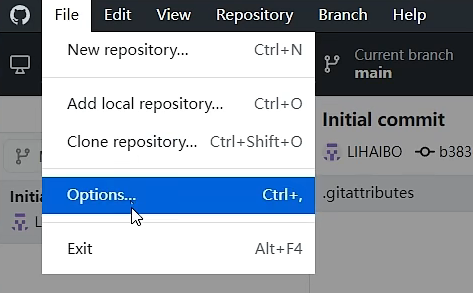

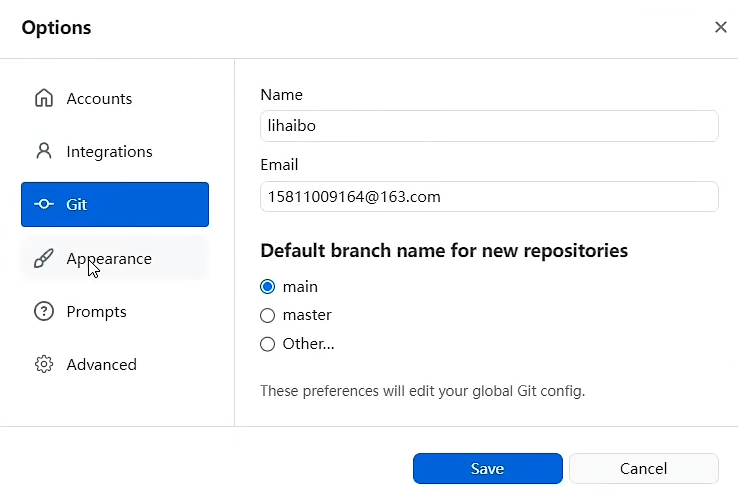

另一个地方：


查看日志：`git log (--oneline)`

## 5.3 文件操作


查看暂存区的状态：`git status`

添加所有文件（工作区 -> 暂存区）：`git add *`

提交所有文件（暂存区 -> 工作区）：`git commit -m [提交信息]`

恢复文件（误删除已经提交的文件）：`git restore [文件名]`

> 删除文件是在工作区进行的，由于文件已经提交，存储区里保存有被删除的文件，因此可以直接恢复。
>
> 若操作顺序为：删除文件 -> add -> commit，则此时文件不能被恢复。（该文件在仓库中的最新版本已经被删除了）

重置仓库版本：

```bash
$ git log --oneline
4db7600 (HEAD -> master) ddddd
078f1a7 aaa

$ git reset --hard 078f1a7

$ git log --oneline
4db7600 (HEAD -> master) aaa
```

> 这里的 git log 只能查看当前指针所在版本及之前的版本，所以删除的版本是不显示的。
>
> 使用 git reflog -v 命令可以查看到所有的版本信息，包括刚才删除的版本也会显示出来。

还原（恢复到某一次提交之前的版本）：

```bash
$ git log --oneline
20eb1ef (HEAD -> master) ddddd
078f1a7 aaa

$ git revert 20eb1ef

$ git log --oneline
d7583ad (HEAD -> master) revrert "ddddd" 
20eb1ef ddddd
078f1a7 aaa
```

> git revert 就相当于将版本（078f1a7）又重新提交了一次，并不会删除之前已经提交过的记录。

## 5.4 分支操作

创建分支：`git branch [分支名称]`

> git 中的分支是基于提交的，不能直接创建分支（至少需要有一个分支后才能创建其它的分支）。

查看分支：`git branch -v`

> `*` 表示当前分支。

切换分支：`git checkout [分支名称]`

创建并切换分支：`git checkout -b [分支名称]` 

删除分支：`git branch -d [分支名称]`

合并分支：`git merge [被合并的分支名称]`

> 在合并分支时，若文件之间（同名文件）发生冲突，则需要人工判断进行取舍（内容），并将修改后的（冲突）文件 add 并 commit，此时合并就完成了。

## 5.5 标签操作

查看所有标签：`git tag`

创建标签：`git tag [标签名称] [版本号]`

查看某一次提交之前的日志：`git log [标签名称] `

使用客户端创建标签：


## 5.6 远程仓库

手动配置远程仓库：`.git/config/remote`

下图表示可以使用名称 `origin` 来代替其中的 URL。


创建远程仓库：`git remote [远程仓库名称] [远程仓库URL]`

修改远程仓库名称：`git remote rename [远程仓库名称]`

推送到远程仓库：`git push [远程仓库名称]`

> 当 URL 为 SSH 形式时，不能直接向远程仓库进行推送，还需要进行安全认证。
>
> 生成安全证书：`ssh-keygen -t rsa -C [SSH形式的URL]`
>
> 查看安全认证的公钥（`id_rsa.pub`）：
>
> 
>
> 拷贝到如下位置：
>
> 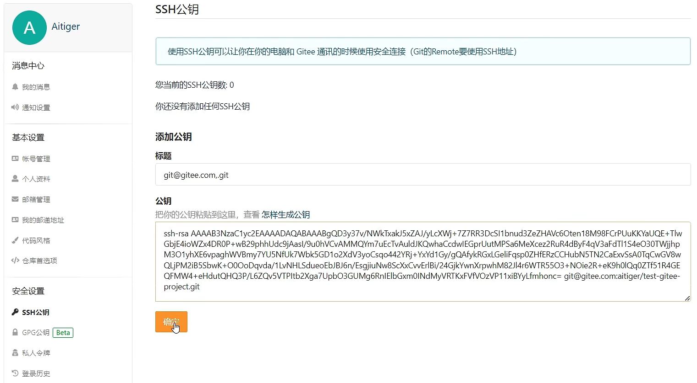