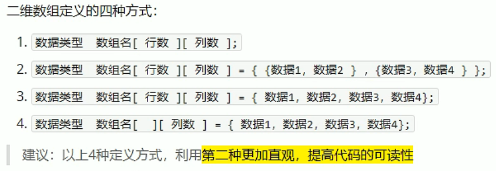

# C++基础入门

## 1 C++初识

### 1.1 第一个C++程序

```c++
#include<iostream>
#include<string>

using namespace std;

int main()
{
    ...
    system("pause");
    return 0;
}
```

### 1.2 注释

### 1.3 变量

### 1.4 常量

```c++
#define 常量名 常量值

const 数据类型 常量名 = 常量值
```

### 1.5 关键字

### 1.6 标识符命名规则

- 不能是关键字
- 只能由字母、数字、下划线组成
- 第一个字符必须为字母或下划线
- 区分大小写

## 2 数据类型

### 2.1 整型

| 数据类型  |                      占用空间                       |
| :-------: | :-------------------------------------------------: |
|   short   |                       2 字节                        |
|    int    |                       4 字节                        |
|   long    | Win 4 字节，Linux 4 字节（32 位）或 8 字节（64 位） |
| long long |                       8 字节                        |

### 2.2 sizeof

### 2.3 浮点型

| 数据类型 | 占用空间 |
| :------: | :------: |
|  float   |  4 字节  |
|  double  |  8 字节  |

小数默认是双精度，可以在数字后面加上 f 转换为单精度。

小数在输出时默认最多只有 6 位有效数字。

科学计数法：`3e-2 = 3 * 0.1 ^ 2`

### 2.4 字符型

单引号括起来，只能有一个字符。

查看字符 ch 对应的 ASCII 编码值：(int) ch

常用：a - 97、A - 65

### 2.5 转义字符

- `\n`：换行
- `\\`：输出 `\`
- `\t`：水平制表符
- ……

### 2.6 字符串

```c++
char str1[] = "abc";

// 需要包含头文件：#include <string>
string str2 = "abc";
```

### 2.7 布尔类型

占用空间：1 字节

0 代表 false，除 0 以外的都代表 true。

注意：布尔类型本质是整形，只能依靠整数转换，当输入 0.1 时，被编译后会被直接去掉小数点，即 0.1 变 0，因此还是代表 false。

### 2.8 数据的输入

从键盘获取输入：cin >> 变量

## 3 运算符


### 3.1 算术运算符


### 3.2 赋值运算符


### 3.3 比较运算符


### 3.4 逻辑运算符


## 4 程序流程结构

### 4.1 选择结构

#### 4.1.1 if

#### 4.1.2 三目运算符

#### 4.1.3 switch

```c++
switch(表达式)
{
    case 结果1: 执行语句; break;
    case 结果2: 执行语句; break;
    ...
    default: 执行语句; break;
}
```

注意：

- switch 中的表达式只能是整型或字符型
- 若 case 里没有写 break，则程序会一直向下执行

### 4.2 循环结构

#### 4.2.1 while

#### 4.2.2 do while

#### 4.2.3 for

### 4.3 跳转结构

#### 4.3.1 break

#### 4.3.2 continue

#### 4.3.3 goto

## 5 数组

### 5.1 一维数组

### 5.2 二维数组



二维数组数组名：

- 查看该数组所占内存空间：元素类型大小 * 元素个数
- 获取该数组首地址

```c++
// 行数
sizeof(arr) / sizeof(arr[0])

// 列数
sizeof(arr[0]) / sizeof(arr[0][0])
```

## 6 函数

### 6.1 定义

### 6.2 调用

### 6.3 值传递

### 6.4 常见样式

- 无参无返：void function(){...}
- 无参有返
- 有参无返
- 有参有返

### 6.5 声明

### 6.6 分文件编写

## 7 指针

### 7.1 基本概念

### 7.2 指针变量的定义和使用

```c++
&：取地址
*：解引用
```

### 7.3 指针所占的内存空间

在 32 位操作系统下，指针变量占 4 个字节（大多数都是 32 位），64 位操作系统的指针变量的大小为 8 字节。

### 7.4 空指针和野指针

**空指针**：指向内存中编号为 0 的空间（不可以被访问），用于初始化指针变量。

```c++
int * p = NULL;
```

0 - 255 之间的内存编号是系统占用的，因此不可以访问。

**野指针**：指向非法的内存空间。

### 7.5 const 修饰指针

```c++
// 常量指针
// const 修饰指针
// 指针的指向可以修改，但是指针指向的值不可以改
const int *p = &a;

// 指针常量
// const 修饰常量
// 指针的指向不可以改，但是指针指向的值可以改
int * const p = &a;.
    
// const 同时修饰指针和常量
// 指针的指向和指针指向的值都不可以改
const int * const p = &a;
```

### 7.6 指针和数组

```c++
int arr[10] = {...};
// arr 就是数组的首地址
int *p = arr;
```

### 7.7 指针和函数

利用指针作为函数的参数，可以修改实参的值。

### 7.8 指针、数组、函数

数组在作为函数参数传入时，默认传入的是其首地址，不用再加 `&` 取地址符。

## 8 结构体

### 8.1 基本概念

结构体是用户自定义的数据类型。

### 8.2 定义和使用

```c++
struct Student
{
    string name;
    int age;
    int score;
}s3;

int main()
{
    // 在创建结构体变量时，struct 关键字可以省略
    struct Student s1;
    s1.name = "张三";
    s1.age = 18;
    s1.score = 100;
    
    struct Student s2 = {"李四", 19, 80};
    
    s3.name = "王五";
    s3.name = 20;
    s3.score = 50;
}
```

### 8.3 结构体数组

数组中存放的元素是结构体变量。

### 8.4 结构体指针

```c++
struct student s = {...};
struct student *p = &s;
p->name = "...";
p->age = 1;
p->score = 1;
```

### 8.5 结构体嵌套结构体

### 8.6 结构体做函数参数

值传递和引用传递。

将函数中的形参改为指针，可以减少内存空间（一个结构体变量可能很大，但指针只会占用 4 字节的空间），而且不会复制新的副本出来。

### 8.7 结构体中 const 的使用场景

```c++
void printStudents(const student *s)
{
    // 加入 const 后，修改的操作会报错，可以防止我们的误操作
    s->age = 100; // 错
}
```

# C++核心编程

## 1 内存分区模型

- 代码区：存放函数体的二进制代码，由操作系统进行管理
- 全局区：存放全局变量、静态变量以及常量
- 栈：由编译器自动分配释放，存放函数的参数值、局部变量等
- 堆：由程序员分配和释放，若程序员不释放，程序结束时由操作系统回收

分区的意义：不同区域存放的数据，赋予不同的生命周期，使编程更加灵活。

### 1.1 程序运行前

程序编译后，生成了 `.exe` 可执行文件，且还未执行该程序时，内存分为两个区域。

代码区：

- 存放 CPU 执行的机器指令（二进制的）
- 是共享、只读的

全局区：

- 存放全局变量、静态变量
- 还包含了常量区（字符串常量、其它常量（被 const 修饰的变量））
- 该区域的数据在程序结束后由操作系统释放

### 1.2 程序运行后

栈区：

- 由编译器自动分配和释放，存放函数的参数值、局部变量等
- 注意：不要返回局部变量的地址，栈开辟的数据由编译器自动释放
- 局部变量存放在栈上，函数执行完后自动释放

堆区：

- 由程序员分配和释放，若程序员不释放，程序结束时由操作系统回收
- 用 new 关键字在堆中开辟内存

### 1.3 new 操作符

开辟内存：new

释放内存：delete

```c++
// 在堆区开辟数据
// 返回的是数据的地址，应该用指针来接收
int * p = new int(10);

// 释放内存
delete p;

// 在堆区开辟数组
// 返回的是这一片连续空间的首地址
int * arr = new int[10];

// 释放数组，要加 []
delete[] arr;
```

## 2 引用

### 2.1 基本使用

作用：给变量起别名

语法：`数据类型 &别名 = 原名`

### 2.2 注意事项

- 引用必须要初始化
- 引用一旦初始化后，就不可以再更改

```c++
int a = 10;
// int &b （错误）
int &b = a;

int c = 20;
b = c;

// a = 20, b = 20, c = 20
// 别名赋值后，原名也会变为别名赋值的值
```

### 2.3 引用做函数参数

函数传参时，可以利用引用的技术让形参修饰实参，可以简化指针修改实参。

```c++
void swap1(int a, int b)
{
    int tmp = a;
    a = b;
    b = tmp;
}

void swap2(int *a, int *b)
{
    int tmp = *a;
    *a = *b;
    *b = tmp;
}

void swap3(int &a, int &b)
{
    int tmp = a;
    a = b;
    b = tmp;
}

int main()
{
    int a = 10;
    int b = 20;
    
    // 值传递
    // 形参不会修饰实参，实际没有交换
    swap1(a, b);
    
    // 地址传递
    // 形参会修饰实参，实际发生了交换
    swap2(&a, &b);
    
    // 引用传递
    // 形参会修饰实参，实际发生了交换
    swap3(a, b);
}
```

总结：通过引用参数产生的效果同按地址传递是一样的，但引用的语法更清楚简单。

### 2.4 引用做函数的返回值

注意：

- 不要返回局部变量的引用
- 函数的调用可以作为左值

```c++
int& test1()
{
    int a = 10;
    return a;
}

int& test2()
{
    // 静态变量，存放在全局区
    // 该数据在程序结束后由系统释放
    static int a = 10;
    return a;
}

int main()
{
    // 这里的 ref 就相当于 a
    // int &ref = test1();
    // 这样不安全
    
    int &ref = test2();
    
    // 可以作为左值
    // 函数返回的是 a 的别名，这里就相当于 a = 1000;
    test2() = 1000;
}
```

### 2.5 引用的本质

引用在 C++ 内部的实现是一个指针常量。

```c++
int &ref = a;
// 相当于：int * const ref = &a;

ref = 20;
// 相当于：*ref = 20;
```

### 2.6 常量引用

作用：主要用来修饰形参，防止误操作。

在函数参数列表中，可以加 const 修饰形参，防止形参改变实参。 

```c++
int a = 10;

int &ref = 10; 
// 错误
// 引用必须引一块合法的内存空间

const int &ref = 10;
// 正确
// 加上 const 之后，编译器会自动将代码修改为：
// int tmp = 10;
// const int &ref = tmp;
ref = 20;
// 错误
// 加入 const 之后 ref 变为只读，不可以修改

void showValue(const int &val){
    // val = 1000;
    // 在该函数体中，val 的值不能修改
    cout << val << endl;
}
```

## 3 函数高级

### 3.1 函数默认参数

函数的形参列表是可以有默认值的。

```c++
int func(int a, int b = 20, int c = 30)
{
    return a + b + c;
}    

int main()
{
    cout << func(10) << endl; // 60
}    
```

注意：

- 在函数的参数列表中，如果某个位置已经有了默认值，那么从这个位置往后，从左到右都必须有默认值。
- 如果一个函数在声明的时候有默认参数，实现的时候就不能在有默认参数了。声明和实现只能有一个有默认参数。

### 3.2 函数占位参数

函数的形参列表里可以有占位参数，用来做占位，调用函数时必须填补该位置。

```c++
void func(int a, int)
{
    // ...
}

int main()
{
    func(10, 10);
}    
```

占位参数还可以有默认参数。

### 3.3 函数重载

满足条件：

- 同一个作用域下
- 函数名称相同
- 函数参数类型不同，或个数不同，或顺序不同

注意事项：

- 引用作为函数重载条件
- 函数重载碰到函数默认参数

```c++
// 引用作为函数重载条件
void func1(int &a){...}
void func1(const int &a){...}

// 函数重载碰到函数默认参数
void func2(int a){...}
void func2(int a, int b = 10){...}

int main()
{
    int a = 10;
    func(a); // 执行的是第一个函数
    func(10); // 执行的是第二个函数
    
    func2(10); // 报错，当函数重载碰到默认参数，会出现二义性，应尽量避免
}    
```

## 4 类和对象

### 4.1 封装

#### 4.1.1 封装的意义

- 将属性和行为作为一个整体，表现事物
- 把属性和行为放在不同的权限下，加以控制

访问权限：

- public
- protected
- private

#### 4.1.2 struct 和 class 的区别

默认的访问权限不同：

- struct：public
- class：private

#### 4.1.3 成员属性设置为私有

可以自己控制读写权限。

### 4.2 对象的初始化和清理

#### 4.2.1 构造函数和析构函数

如果我们自己不提供构造和析构函数，编译器会提供默认的（空实现）。

- 构造函数：在创建对象时为对象的成员属性赋值，由编译器自动调用
- 析构函数：在对象销毁前系统自动调用，执行一些清理工作

构造函数：

- 没有返回值，也不写 void
- 名称与类名相同
- 可以有参数，可以重载
- 程序在创建对象时会自动调用构造，无须手动调用，而且只会调用一次

析构函数：

- 没有返回值，也不写 void
- 名称为 `~类名`
- 不可以有参数，不可以重载
- 程序在对象销毁前会自动调用析构，无须手动调用，而且只会调用一次

#### 4.2.2 构造函数的分类及调用

- 按参数：有参构造、无参构造
- 按类型：普通构造、拷贝构造

```c++
class Person
{
public:    
    // 无参构造函数
    Person() {...}
    // 有参构造函数
    Person(int age) {...}
    // 拷贝构造函数
    Person(const Person &p)
    {
        age = p.age;
    }
    // 析构函数
    ~Person() {...}
    // 成员变量
    int age;
};

int main()
{
    // 1.括号法
    Person p1; // 默认构造函数
    Person p2(10); // 有参构造函数
    Person p3(p2); // 拷贝构造函数
    
    // 2.显示法
    Person p4 = Person(10); // 有参构造函数
    Person p5 = Person(p1); // 拷贝构造函数
    
    // 匿名对象
    // 当前行执行结束后，该对象就会被系统回收
    Person(10);
    // 不要用拷贝构造函数初始化匿名对象
    Person(p1); // 错误
    // 编译器会认为：Person(p1) === Person p1; 
    
    // 3.隐式转换法
    Person p6 = 10; // 有参构造方法
    // 等价于：Person p6 = Person(10); 
    Person p7 = p6; // 拷贝构造方法
}
```

注意：

- 调用默认构造函数的时候，不要加 `()`，因为加了 `()` 以后会被编译器认为是一个函数的声明
- 不要用拷贝构造函数初始化匿名对象

#### 4.2.3 拷贝构造函数的调用时机

- 使用一个已经创建完毕的对象来初始化一个新对象
- 值传递的方式给函数参数传值
- 以值方式返回局部对象

```c++
class Person
{
    ...
};

// 2.值传递的方式给函数参数传值
// 值传递的形参会拷贝一个变量的副本，相当于是新建了一个 Person 类型的变量
void doWork(Person p)
{
    ...
}

void test2()
{
    Person p; // 调用默认构造函数
    doWork(p) // 调用拷贝构造函数
}

// 3.以值方式返回局部对象
Person doWork2()
{
    Person p1; // 局部变量的生命周期为当前函数
    return p1; // 这里返回的 p1 不是上面的 p1，而是会拷贝一个新的对象给外面返回
}

void test3()
{
    Person p = doWork2(); // 调用拷贝构造函数
}
```

#### 4.2.4 构造函数调用规则

默认情况下，C++的编译器会至少给一个类添加 3 个函数：

- 默认构造函数（无参，函数体为空）
- 默认析构函数（无参，函数体为空）
- 默认拷贝构造函数，对属性进行值拷贝

构造函数调用规则如下：

- 如果用户定义有参构造函数，C++不再提供默认无参构造，但是会提供默认拷贝构造
- 如果用户定义拷贝构造函数，C++不会再提供其它构造函数

#### 4.2.5 深拷贝与浅拷贝

- 浅拷贝：简单的赋值拷贝操作
- 深拷贝：在堆区重新申请空间，进行拷贝操作

```c++
class Person
{
public:
    // ...
        
    Person(int age, int height)
    {
        m_Age = age;
        m_Height = new int(height);
        // 为什么开辟到堆区：因为堆区的数据可以手动释放，在函数体外也可以使用，实际应用中会用到堆区，用到堆区而且又需要拷贝的时候要防止指针悬挂的问题。
    }
    
    ~Person()
    {
        // 将堆区开辟的数据释放
        if(m_Height != NULL)
        {
            delete m_Height;
            m_Height = NULL; // 避免出现野指针
        }
    }
    
    int m_Age;
    int* m_Height;
    
    // ...
};

void test()
{
    Person p1(18, 160);
    Person p2(p1); // 默认的拷贝构造函数
    
    cout << *p1.m_Height << endl; // 160
    cout << *p2.m_Height << endl; // 160
    
    // 这里会造成堆区的内存重复释放而出错
    // 这里两个对象的指针是独立的，但是指针指向的堆区数据是共享的
}
```

如果利用编译器提供的拷贝构造函数，会做浅拷贝操作。

对于栈上的对象，先进后出，先构造的会后析构。


解决：深拷贝，被拷贝的指针会指向堆区中新的内存，但内容与原来相同。

```c++
class Person
{
    ...
    // 自己实现拷贝构造函数
    Person(const Person &p)
    {
        m_Age = p.m_Age;
        // m_Height = p.m_Height; 编译器的默认实现
        // 实现深拷贝
        m_Height = new int(*p.m_Height);
    }
    ...
};
```

总结：如果属性有在堆区开辟的，一定要自己提供拷贝构造函数，防止浅拷贝带来的问题。

#### 4.2.6 初始化列表

```c++
class Person
{
public:
    // 初始化列表
    Person(int a, int b, int c): m_A(a), m_B(b), m_C(c)
    {
        // ...
    }
    
    // ...
    
    int m_A;
    int m_B;
    int m_C;
};
```

#### 4.2.7 类对象作为类成员

```c++
class Phone
{
public:
    Phone(string pName): m_Phone(pName)
    {
        // ...
    }
};

class Person
{
public:
    Person(string name, string pName): m_Name(name), m_Phone(pName)
    {
        // ...
    }
    
    // ...
    
    string m_Name;
    // 其它类对象作为本类成员
    Phone m_Phone;
};
```

总结：

- 当其它类对象作为本类成员，构造的时候会先构造其它类对象，再构造自身
- 析构的顺序与构造相反

#### 4.2.8 静态成员

带有 `static` 关键字的成员：

- 静态成员变量：
  - 所有对象共享同一份数据
  - 在编译阶段分配内存
  - 类内声明，类外初始化（必须有一个初始值）
- 静态成员函数：
  - 所有对象共享同一个函数
  - 静态成员函数只能访问静态成员变量

```c++
class Person
{
public:
    static int m_A;
private:
    // 静态成员变量也有访问权限
    static int m_B;
};
// 必须进行类外初始化后，该变量才能被使用
int Person::m_A = 100;
int Person::m_B = 200;

int main()
{
    // 通过对象进行访问
    Person p;
    cout << p.m_A << endl;
    // 通过类名进行访问
    cout << Person::m_A << endl;
    
    // 不能访问
    // cout << Person::m_B << endl;
}
```

静态成员有两种访问方式：

- 通过对象进行访问
- 通过类名进行访问

### 4.3 C++ 对象模型和 this 指针

#### 4.3.1 成员变量和成员函数分开存储

- 只有非静态成员变量才属于类的对象上
- 静态成员变量、静态/非静态成员函数都不属于类的对象上

空对象占用的内存空间为：1 字节。（是为了区分空对象占内存的位置，每个空对象应该有一个独一无二的内存地址）

如果对象包含有非静态的成员变量，则不算占用的这 1 字节。

#### 4.3.2 this 指针

this 指针指向被调用的成员函数所属的对象。

特点：

- this 指针隐含在每一个非静态成员函数内
- this 指针不需要定义，直接使用即可

用途：

- 当形参和成员变量同名时，可以用 this 指针来区分
- 在类的非静态成员函数中返回对象本身，可以 `return *this`

```c++
class Person
{
public:
    Person(int age)
    {
        this->age = age;
    }
    
    void PersonAddAge(Person &p)
    {
        this->age = age;
        // this 是指向调用该方法的对象的指针
        // *this 就是这个对象本体
        return *this;
    }
    
    int age;
}
```

#### 4.3.3 空指针访问成员函数

C++ 中是可以使用空指针去调用成员函数的，但是也要注意有没有用到 this 指针（需要加以判断）。

```c++
class Person
{
public:
    void showClassName()
    {
        cout << "Person" << endl;
    }
    
    void showPersonAge()
    {
        // if(this == NULL)
        // {
        //     return;
        // }
        cout << age << endl;
    }
    
    int age;
}

int main()
{
    Person * p = NULL;
    
    p->showClassName(); // 可以正常执行 
    p->showPersonAge(); // 报错
}
```

错误原因：此时的 this 指针为 NULL，不能用 `NULL->age` 去访问成员变量，因为根本就没有这个对象。

#### 4.3.4 const 修饰成员函数

常函数：

- 成员函数加 `const` 后，这个函数我们称为常函数
- 常函数内不可以修改成员属性
- 成员属性声明时加关键字 `mutable` 后，在常函数中依然可以修改

常对象：

- 声明对象前加 `const` 称该对象为常对象
- 常对象不能调用普通的成员方法、成员变量
  - 常对象只能调用常函数
  - 只能修改常对象的被 `mutable` 修饰的成员变量

### 4.4 友元

在程序里，类中某些私有的属性，想让类外特殊的一些函数或者类进行访问，就需要用到友元的技术。

友元的目的就是让一个函数或者类访问另一个类中的私有成员。

友元的关键字：`friend`

友元的三种实现：

- 全局函数做友元
- 类做友元
- 类的成员函数做友元

#### 4.4.1 全局函数做友元

```C++
class Building
{
    // 该全局函数是 Building 的友元，可以访问该类中的私有成员
    // 不用写在 public 里
    friend void goodGay(Building * building);
public:
    Building()
    {
        m_SittingRoom = "客厅";
        m_Bedroom = "卧室";
    }  
public:
    // 客厅
    string m_SittingRoom; 
private:
    // 卧室
    string m_Bedroom;
};

// 全局函数
void goodGay(Building *building)
{
    cout << building->m_SittingRoom << endl;
    // 只有将当前函数添加为 Building 类的友元后才能访问其私有属性
    cout << building->m_Bedroom << endl;
}

void test01()
{
    // 实例化对象
    Building building;
    goodGay(&building);
}
```

#### 4.4.2 类做友元

```c++
// 先声明 Building 类
class Building;

// 友元类
class GoodGay
{
public:
    // 构造函数
    GoodGay(); 
    void visit();
    Building * building;
};

class Building
{
    // GoodGay 是本类的友元类
    friend class GoodGay; 
public:
    // 构造函数
    Building();   
public:
    // 客厅
    string m_SittingRoom;   
private:
    // 卧室
    string m_Bedroom;    
};

// 类外实现成员函数
Building::Building()
{
    m_SittingRoom = "客厅";
    m_Bedroom = "卧室";
}

GoodGay::GoodGay()
{
    building = new Building;
}

void GoodGay::visit()
{
    cout << building->m_SittingRoom << endl;
    // 只有当 GoodGay 类是 Building 类的友元时，才可以访问其私有成员
    cout << building->m_Bedroom << endl;
}

void test01()
{
    GoodGay gg;
    gg.visit();
}
```

#### 4.4.3 类的成员函数做友元

```c++
// 先声明 Building 类
class Building;

class GoodGay
{
public:
    // 构造函数
    GoodGay();
    // 可以访问 Building 中的私有成员
    void visit();
    // 不可以访问 Building 中的私有成员
    void visit2();
    Building * building;
};

class Building
{
    // 将该函数作为本类的友元，可以访问本类的私有成员
    friend void GoodGay::visit();   
public:
    // 构造函数
    Building();   
public:
    // 客厅
    string m_SittingRoom;  
private:
    // 卧室
    string m_Bedroom;    
};

// 成员函数类外实现
Building::Building() {...}

GoodGay::GoodGay() {...}

void GoodGay::visit()
{
    cout << building->m_SittingRoom << endl;
    // 可以访问
    cout << building->m_Bedroom << endl;
}

void GoodGay::visit2()
{
    cout << building->m_SittingRoom << endl;
    // 不可以访问
    // cout << building->m_Bedroom << endl;
}

void test01()
{
    GoodGay gg;
    gg.visit();
}
```

> 其实可以不用在友元成员函数所在的类里面创建对象，直接给友元成员函数传参会更好一点。

### 4.5 运算符重载

### 4.6 继承

#### 4.6.1 基本语法

语法：`class 子类 : 继承方式 父类`

示例：`class A : public B`

- 子类也称为：派生类
- 父类也称为：基类

#### 4.6.2 继承方式

- public 继承
- protected 继承
- private 继承


#### 4.6.3 继承中的对象模型

从父类继承过来的成员，哪些属于子类对象中？

- 父类中所有非静态的成员属性都会被子类继承下去
- 父类的私有成员属性也会被子类继承，只不过是被编译器给隐藏起来了，无法被访问。

#### 4.6.4 继承中构造和析构顺序

子类继承父类后，当创建子类对象，也会调用父类的构造函数。

执行顺序：

- 先构造父类，再构造子类
- 析构的顺序与构造的顺序相反

#### 4.6.5 继承同名成员处理方式

当子类与父类出现同名的成员，如何通过子类对象，访问到子类或父类中同名的数据呢？

- 子类对象访问子类同名成员：直接访问即可（`子类对象.成员`）
- 子类对象访问父类同名成员：需要加作用域（`子类对象.父类::成员`）
- 当子类与父类拥有同名的成员函数，子类会隐藏父类中同名的成员函数，加作用域可以访问到父类中的同名函数。

#### 4.6.6 继承同名静态成员处理方式

静态成员和非静态成员出现同名，处理方式一致。

- 子类对象访问子类同名成员：直接访问即可（`子类对象.成员`）
- 子类对象访问父类同名成员：需要加作用域（`子类对象.父类::成员`）

也可以直接通过类名来访问：

- `Son::成员变量`
- `Father::成员变量`：通过父类的类名访问父类的成员
- `Son::Father::成员变量`：通过子类的类名访问父类作用域下面的成员

当子类与父类拥有同名的静态成员函数，子类也会隐藏父类中同名的静态成员函数，加作用域可以访问到父类中的同名静态函数。

#### 4.6.7 多继承语法

语法：`class 子类 : 继承方式 父类1，继承方式 父类2 ...`

多继承可能会引发父类中有同名成员出现，需要加作用域区分。实际开发中不建议使用多继承。

#### 4.6.8 菱形继承

菱形继承（钻石继承）：

- 两个派生类继承同一个基类
- 又有某个类同时继承这两个派生类

当两个父类拥有相同的数据，需要加作用域区分。这份数据其实在子类中只需要一份即可，菱形继承导致数据有两份，资源浪费。

解决：虚继承

虚继承：

- 在继承方式之前，加上关键字 `virtual`，变为虚继承
- 最顶部的类叫做：虚基类

```c++
// 虚基类
class Father 
{
public:
    int m_Age;
};

// 虚继承
class Son1 : virtual public Father {};
class Son2 : virtual public Father {};

// 该类中只会有一份 m_Age 变量
class Sson : public Son1, public Son2 {};
```

### 4.7 多态

#### 4.7.1 基本概念

多态的分类：

- 静态多态：
  - 函数重载和运算符重载属于静态多态，复用函数名
  - 函数地址早绑定，编译阶段确定函数地址

- 动态多态：
  - 派生类和虚函数实现运行时多态
  - 函数地址晚绑定，运行阶段确定函数地址


实现动态多态：

- 子类重写父类方法
- 父类引用（指针）指向子类对象
- 对父类中的方法加 `virtual` 关键字（虚函数），实现晚绑定，执行子类的版本；否则为早绑定，只会执行父类的版本

#### 4.7.2 纯虚函数和抽象类

纯虚函数：`virtual 返回值类型 函数名 (参数列表) = 0;`

带有纯虚函数的类，这个类就叫做抽象类。

抽象类特点：

- 无法实例化对象
- 子类必须重写抽象类中的纯虚函数，否则也属于抽象类

#### 4.7.3 虚析构和纯虚析构

多态时，如果子类中有属性开辟到堆区，那么父类指针在释放时无法调用到子类的析构代码。

```c++
Animal * animal = new Cat();
delete animal;
```

原因：父类指针在析构时，不会调用子类中的析构函数，导致子类中如果有堆区属性，会出现内存泄露。

解决：

- 将父类中的析构函数改为虚析构或者纯虚析构
- 虚析构和纯虚析构只能有一个

虚析构和纯虚析构：

- 共性：
  - 可以使用父类指针释放子类对象
  - 都需要有具体的函数实现
- 区别：
  - 如果是纯虚析构，该类属于抽象类，无法实例化对象

```c++
class Animal
{
public:
    // ...
    
    // 纯虚析构
    // 有了纯虚析构之后，这个类也属于抽象类，无法实例化对象
    virtual ~Animal() = 0;
}

// 类外实现
Animal::~Animal()
{
    // ...
}
```

总结：

- 若既要使用纯虚函数，又要释放父类在堆区中的数据，就需要使用类内纯虚函数声明，类外写实现的写法
- 如果子类中没有堆区数据，可以不写虚析构或纯虚析构

## 5 文件操作

### 5.1 文本文件

#### 5.1.1 写文件

#### 5.1.2 读文件

### 5.2 二进制文件

# C++提高编程

## 1 模板

### 1.1 模板的概念

C++ 的另一种编程思想被称为泛型编程，主要利用的技术就是模板。

C++ 提供两种模板机制：函数模板、类模板

### 1.2 函数模板

#### 1.2.1 函数模板语法

函数模板作用：建立一个通用函数，其函数返回值类型和形参类型可以不具体指定，用一个虚拟的类型来代表。

语法：

```c++
template<typename T>
// 函数声明或定义
```

解释：

- `template`：声明创建模板
- `typename`：表明其后面的符号是一种数据类型，可以用 `class` 代替
- `T`：通用的数据类型，名称可以替换，通常为大写字母

```c++
template<typename T>
void mySwap(T& a, T& b)
{
    T tmp = a;
    a = b;
    b = tmp;
}

int main()
{
    int a = 10;
    int b = 20;
    
    // 两种调用方式
    mySwap(a,b);
    mySwap<int>(a,b);
}
```

#### 1.2.2 函数模板的注意事项

- 自动类型推导：必须推导出一致的数据类型 T，才可以使用
- 模板必须要确定出 T 的数据类型，才可以使用
- 创建模板时，typename 可以替换成 class

#### 1.2.3 普通函数与函数模板的区别

区别：

- 普通函数调用时可以发生自动类型转换（隐式类型转换）
- 函数模板调用时，如果利用自动类型推导，不会发生隐式类型转换
- 如果利用显示指定类型的方式，可以发生隐式类型转换

```c++
int myAdd(int a, int b)
{
    return a + b;
}

int main()
{
    int a = 10;
    char b = 'c';
    // char 会自动转换为 int 类型
    cout << myAdd(a, b) << endl;
}
```

#### 1.2.4 普通函数与函数模板的调用规则

调用规则：

- 如果函数模板和普通函数都可以实现，优先调用普通函数
- 可以通过空模板参数列表来强制调用模板函数
- 函数模板也可以发生重载
- 如果函数模板可以产生更好的匹配，优先调用函数模板

#### 1.2.5 模板的局限性

模板的通用性并不是万能的，C++ 提供模板的重载，可以为一些特定的类型（如：数组、自定义数据类型等）提供具体化的模板。

学习模板并不是为了写模板，而是在 STL 能够运用系统提供的模板。

```c++
// 比较两个 Person 对象是否相等
template<> bool myCompare(Person &p1, Person &p2)
{
    if(p1.m_Name == p2.m_Name && p1.m_Age == p2.m_Age)
    {
        return true;
    } else {
        return false;
    }
}
```

### 1.3 类模板

#### 1.3.1 类模板语法

类模板作用：建立一个通用类，类中的成员、数据类型可以不具体指定，用一个虚拟的类型来代表。

语法：

```c++
template<typename T>
// 类
```

示例：

```c++
template<class NameType, class AgeType>
class Person
{
public:
    // ...
    NameType m_Name;
    AgeType m_Age;
};

int main()
{
    Person<string,int> p1("张三", 18);
}
```

#### 1.3.2 类模板与函数模板的区别

区别：

- 类模板没有自动类型推导的使用方式
- 类模板在模板参数列表中可以有默认参数

```c++
template<class NameType, class AgeType = int>
class Person
{
    ...
};
    
int main()
{
    Person<string> p("...", 99);
}
```

#### 1.3.3 类模板中成员函数的创建时机

与普通类中成员函数的区别：

- 普通类中的成员函数一开始就可以创建
- 类模板中的成员函数在调用时才创建

#### 1.3.4 类模板对象做函数参数

三种传入方式：

- 指定传入的类型：直接显示对象的数据类型（最常用）
- 参数模板化：将对象中的参数变为模板进行传递
- 整个类模板化：将这个对象类型模板化进行传递

```c++
template<class T1, class T2>
class Person
{
    ...
};

// 1.指定传入类型
void printPerson1(Person<string, int> &p) 
{
    ...
}

// 2.参数模板化
template<class T1, class T2>
void printPerson2(Person<T1, T2> &p) 
{
    cout << typeid(T1).name() << endl;
    cout << typeid(T2).name() << endl;
}

// 3.整个类模板化
template<class T>
void printPerson1(T &p) 
{
    cout << typeid(T).name() << endl;
}

int main()
{
    Person<string, int> p("...", 100);
    printPerson1(p);
    printPerson2(p);
    printPerson3(p);
}
```

#### 1.3.5 类模板与继承

当类模板遇到继承时需要注意：

- 当子类继承的父类是一个类模板时，子类在声明的时候，要指定出父类中 T 的类型
- 如果不指定，编译器无法给子类分配内存
- 如果想灵活地指定出父类中 T 的类型，子类也需要变为类模板

```c++
template<class T>
class Base
{
    T m;
};

// 1.当子类继承的父类是一个类模板时，子类在声明的时候，要指定出父类中 T 的类型
class Son1 : public Base<int>
{
    ...
};

// 2.如果想灵活地指定出父类中 T 的类型，子类也需要变为类模板
template<class T1, class T2>
class Son2 : public Base<T2>
{
    T1 obj;
};

int main()
{
    Son2<int, char> s2;
}
```

#### 1.3.6 类模板成员函数的类外实现

```c++
template<class T1, class T2>
class Person
{
public:
    Person(T1 name, T2 age);
    void showPerson();
    ...
};

// 构造函数类外实现
template<class T1, class T2>
Person<T1,T2>::Person(T1 name, T2 age)
{
    ...
}

// 成员函数类外实现
template<class T1, class T2>
void Person<T1,T2>::showPerson()
{
    ...
}
```

#### 1.3.7 类模板分文件编写

问题：类模板中成员函数的创建时机是在调用阶段，导致分文件编写时链接不到。

解决：

- 将包含 `.h` 改为包含 `.cpp` 源文件
- 将声明和实现写到同一个文件中，并改名为 `.hpp` 文件，hpp 是约定的名称，并不是强制

#### 1.3.8 类模板与友元

- 全局函数类内实现：直接在类内声明友元即可
- 全局函数类外实现：需要提前让编译器知道全局函数的存在

```c++
// 提前让编译器知道 Person 类的存在
template<class T1, class T2>
class Person;

// 类外实现
template<class T1, class T2>
friend void printPerson2(Person<T1, T2> p)
{
    ...
}

template<class T1, class T2>
class Person
{
    // 全局函数
    friend void printPerson1(Person<T1, T2> p)
    {
        // 类内实现
    }
    
    // 全局函数
    // 如果是类外实现，需要让编译器提前知道这个函数的存在
    friend void printPerson2<>(Person<T1, T2> p);
    
public:
    ...
};

int main()
{
    Person<string, int> p("...", 20);
    
    printPerson1(p);
    printPerson2(p);
}
```

注意：

- 这里的 `printPerson()` 函数不加 `friend` 时是一个成员函数（只要不加 `static` 就是成员函数），但加了 `friend` 之后就变成了一个全局函数
- 因为自身的成员函数默认就可以调用自身的成员属性不需要友元，反之需要友元的都不是成员函数

## 2 STL 初识

### 2.1 STL 的诞生

### 2.2 基本概念

STL：标准模板库，分为容器、算法、迭代器。

容器和算法之间通过迭代器连接。

STL 几乎所有的代码都采用了模板类或者模板函数。

### 2.3 六大组件

- **容器**：各种数据结构，如：vector、list、deque、set、map 等，用来存放数据
- **算法**：各种常用的算法，如：sort、find、copy、for_each 等
- **迭代器**：连接容器和算法
- **仿函数**：行为类似函数，可以作为算法的某种策略
- **适配器**：一种用来修饰容器、仿函数或迭代器接口的东西
- **空间配置器**：负责空间的配置与管理

### 2.4 容器、算法、迭代器


算法通过迭代器访问容器中的数据。


可以将迭代器当作指针去使用。


### 2.5 容器、算法、迭代器初识

#### 2.5.1 vector 存放内置数据类型

- 容器：`vector`
- 算法：`for_each`
- 迭代器：`vector<int>::iterator`

```c++
#include<iostream>
#include<vector>
// 标准算法头文件
#include<algorithm>

using namespace std;

void myPrint(int val)
{
    cout << val << endl;
}

void test01()
{
    // 创建一个 vector 容器，可以当作是一个数组
    vector<int> v;
    
    // 插入数据
    v.push_back(1);
    v.push_back(2);
    v.push_back(3);
    
    // 通过迭代器访问数据
    // 1.第一种遍历方式
    // 起始迭代器：指向容器中的第一个元素
    vector<int>::iterator itBegin = v.begin();
    // 结束迭代器：指向容器中的最后一个元素的下一个位置
    vector<int>::iterator itEnd = v.end(); 
    while(itBegin != itEnd)
    {
        cout << *itBegin << endl;
        itBegin++;
    }
    
    // 2.第二种遍历方式
    for(vector<int>::iterator it = v.begin(); it != v.end(); it++)
    {
        cout << *it << endl;
    }
    
    // 3.第三种遍历方式
    // 利用 STL 提供的遍历算法
    // 原理：在遍历的时候，回调 myPrint 函数
    for_each(v.begin, v.end(), myPrint);
}
```

`for_each` 底层源码：


#### 2.5.2 vector 存放自定义数据类型

```c++
class Person
{
public:
    // 构造函数
    Person(...) {}
    string m_Name;
    int m_Age;
};

void test01()
{
    vector<Person>v;
    
    Person p1(...);
    Person p2(...);
    Person p3(...);
    
    // 添加数据
    v.push_back(p1);
    v.push_back(p2);
    v.push_back(p3);
    
    // 遍历数据
    for(vector<Person>::iterator it = v.begin(); it != v.end(); it++)
    {
        // 两种访问成员的方式
        cout << (*it).m_Name << endl;
        cout << it->m_Age << endl;
    }  
}

void test01()
{
    // 存放的是指针类型
    vector<Person*>v;
    
    Person p1(...);
    Person p2(...);
    Person p3(...);
    
    // 添加数据
    v.push_back(&p1);
    v.push_back(&p2);
    v.push_back(&p3);
    
    // 遍历数据
    for(vector<Person*>::iterator it = v.begin(); it != v.end(); it++)
    {
        cout << (*it)->m_Name << endl;
        cout << (*it)->m_Age << endl;
    }  
}
```

总结：若有 `vector<A>`，则 `*it` 就相当于 `A`。

#### 2.5.3 vector 容器嵌套容器

```c++
void test01()
{
    vector<vector<int>>v;
    
    vector<int>v1;
    vector<int>v2;
    vector<int>v3;
    
    // 向 v1 到 v3 中添加数据
    ...
        
    v.push_back(v1);
    v.push_back(v2);
    v.push_back(v3);
    
    // 遍历数据
    for(vector<vector<int>>::iterator it = v.begin(); it != v.end(); it++)
    {
        // 此时 (*it) 就是 vector<int>
        for(vector<int>::iterator vit = (*it).begin(); vit != (*it).end(); vit++)
        {
            cout << *vit << " ";
        }
        cout << endl;
    }
}
```

## 3 STL - 常用容器

### 3.1 string

#### 3.1.1 基本概念

`string` 本质上是一个类，类内部封装了 `char*`，用于管理这个字符串，是一个 `char*` 的容器。`string` 管理 `char*` 所分配的内存，不用担心复制越界和取值越界等，由类内部进行负责。

`string` 类成员方法：

- 查找：`find`
- 拷贝：`copy`
- 删除：`delete`
- 替换：`replace`
- 插入：`insert`

#### 3.1.2 构造函数

```c++
// 创建一个空字符串
string();

// 使用字符串 s 初始化
string(const char* s);

// 使用 string 对象初始化
string(const string& str);

// 使用 n 个字符 c 初始化
string(int n, char c);
```

#### 3.1.3 赋值操作


示例：

```c++
void test01()
{
    // 1.用 = 赋值
    string str1;
    str1 = "hello world";
    
    string str2;
    str2 = str1; // hello world
    
    string str3;
    str3 = 'a'; // a
    
    // 2.用 string 的成员函数 assign 赋值
    string str4;
    str4.assign("hello world");
    
    string str5;
    str5.assign("hello world", 5); // hello
    
    string str6;
    str6.assign(str5); // hello world
    
    string str7;
    str7.assign(5, 'a'); // aaaaa
}
```

#### 3.1.4 拼接操作

作用：在字符串的末尾追加字符串。


示例：

```c++
void test01()
{
    string str1 = "我";
    str1 += "爱学习"; // 我爱学习
    str1 += ':' // 我爱学习:
    
    string str2 = "C++";
    str1 += str2; // 我爱学习:C++
    
    string str3 = "I";
    str3.append("love"); // I love
    str3.append("game abcd", 4); // I love game
    str3.append(str2); // I love game C++
    // (截取字符串, 起始位置, 截取长度)
    str3.append(str2, 0, 2); // I love game C++C+
}
```

#### 3.1.5 查找和替换


示例：

```c++
// 查找
void test01()
{
    string str1 = "abcdefgde";
    
    // 1.find 从左往右查找
    // 默认从下标 0 开始查找，返回找到的第一个字符的位置，找不到则返回 -1
    int pos = str1.find("de"); // 3
    if(pos == -1)
    {
        cout << "未找到字符串" << endl;
    }
    else
    {
        cout << "找到字符串，pos = " << pos << endl;
    }
    
    // 2.rfind 从右往左查找
    pos = str1.rfind("de");
    cout << pos << endl; // 7
}

// 替换
void test02()
{
    string str1 = "abcdefg";
    
    // (起始位置, 长度, 要替换的字符串)
    str1.replace(1, 3, "1111"); // a1111efg
}
```

#### 3.1.6 比较操作

字符串之间按字符的 ASCII 码进行对比：

- `=` 返回 0
- `>` 返回 1
- `<` 返回 -1

主要是用于比较两个字符串是否相等，比较两个字符串大小的意义不大。


示例：

```c++
void test01()
{
    string str1 = "hello";
    string str2 = "hello";
    
    if(str1.compare(str2) == 0)
    {
        cout << "str1 等于 str2" << endl;
    }
    else if(str1.compare(str2) > 0)
    {
        cout << "str1 大于 str2" << endl;
    }
    else
    {
        cout << "str1 小于 str2" << endl;
    }
}
```

#### 3.1.7 字符存取

`string` 中单个字符存取方式有两种：


示例：

```c++
void test01()
{
    string str = "hello";
    
    // 1.通过 [] 访问单个字符
    for(int i = 0; i < str.size(); i++)
    {
        cout << str[i] << " ";
    }
    cout << endl;
    
    // 2.通过 at 访问单个字符
    for(int i = 0; i < str.size(); i++)
    {
        cout << str.at(i) << " ";
    }
    cout << endl;
    
    // 修改单个字符
    str[0] = 'x'; // xello
    str.at(1) = 'x'; // xxllo
}
```

#### 3.1.8 插入和删除


示例：

```c++
void test01()
{
    string str = "hello";
    
    // 1.插入
    // (起始位置, 插入内容)
    str.insert(1, "111"); // h111ello
    
    // 2.删除
    // (起始位置, 删除长度)
    str.erase(1, 3); // hello
}
```

#### 3.1.9 子串

从字符串中获取想要的子串。


示例：

```c++
void test01()
{
    string str = "abcdef";
    // (起始位置, 截取长度)
    string subStr = str.substr(1, 3); // bcd
}

void test02()
{
    // 从邮箱地址中获取用户名
    string email = "zhangsan@sina.com";
    int pos = email.find("@");
    string usrName = email.substr(0, pos);
}
```

### 3.2 vector

#### 3.2.1 基本概念

`vector`：单端数组

`vector` 与普通数组的区别：

- 普通数组是静态空间，大小固定
- `vector` 可以动态扩展

**动态扩展**：并不是在原空间之后续接新空间，而是找更大的内存空间，然后将原数组拷贝到新空间，最后释放原空间。

#### 3.2.2 构造函数


示例：

```c++
void test01()
{
    // 1.默认构造
    vector<int>v1;
    // 添加数据
    ...
        
    // 2.区间方式构造
    vector<int>v2(v1.begin(), v1.end());
    
    // 3.n 个 elem 方式构造
    vector<int>v3(10, 100);
    
    // 4.拷贝构造
    vector<int>v4(v3);
}
```

#### 3.2.3 赋值操作


示例：

```c++
void test01()
{
    vector<int>v1;
    // 插入数据
    ...
        
    // 1.用 = 赋值
    vector<int>v2;
    v2 = v1;
    
    // 2.用 assign 赋值
    vector<int>v3;
    // 取的是 [begin,end)
    v3.assign(v1.begin(), v1.end());
    
    // 3.用 n 个 elem 赋值
    vector<int>v4;
    v4.assign(10, 100);
}
```

#### 3.2.4 容量和大小


#### 3.2.5 插入和删除


示例：

```c++
void test01()
{
    vector<int>v1;
    // 1.尾插
    v1.push_back(1);
    ...
    
    // 2.尾删
    v1.pop_back();
    
    // 3.插入
    // 插入头部元素
    v1.insert(v1.begin(), 10);
    // 插入 2 个 1000
    v1.insert(v1.begin(), 2, 1000);
    
    // 4.删除
    // 删除头部元素
    v1.erase(v1.begin());
    v1.erase(v1.begin(), v1.end());
}
```

#### 3.2.6 数据存取


示例：

```c++
void test01()
{
    vector<int>v1;
    // 插入数据
    ...
          
    for(int i = 0; i < v1.size(); i++)
    {
        cout << v1[i] << " ";
        // 或：
        cout << v1.at(i) << " ";
    }
    cout << endl;
    
    // 第一个元素
    cout << v1.front() << endl;
    // 最后一个元素
    cout << v1.back() << endl;
}
```

#### 3.2.7 互换容器

实现两个容器内元素进行互换。

函数原型：`swap(vec)`

示例：

```c++
void test01()
{
    vector<int>v1;
    // 插入数据
    ...
        
    vector<int>v2;
    // 插入数据
    ...
        
    // 容器互换
    v1.swap(v2);    
}

// 实际用途：收缩内存空间
void test02()
{
    vector<int>v;
    // 插入 100000 个数据
    ...
    // 此时 v 的 size 为 100000，而 capacity 为 130000+
        
    // 重新指定大小    
    v.resize(3);
    // 此时 v 的 size 为 3，而 capacity 仍为 130000+
    
    // 收缩内存空间
    vector<int>(v).swap(v);
    // 此时 v 的 size 为 3，且 capacity 也为 3
}
```

收缩内存空间的原理：

拷贝构造 `vector<int>(v)` 会利用 `v` 当前的元素个数（即 `size` 的大小）初始化一个匿名对象（假设为 `x`）。匿名对象的内存使用完即被释放。

交换前：


交换后：


#### 3.2.8 预留空间

减少 `vector` 在动态扩展容量时的扩展次数。

函数原型：`reserve(int len)`

容器预留 len 个元素长度，预留位置不初始化，元素不可访问。

示例：

```c++
void test01()
{
    vector<int>v;
    
    // 统计开辟空间的次数
    int num = 0;
    int * p = NULL;
    
    for(int i = 0; i < 100000; i++)
    {
        v.push_back(i);
        // 每扩展一次空间，会重新分配一块更大的内存，首地址会发生变化
        if(p != &v[0])
        {
            p = &v[0];
            num++;
        }
    }
    
    cout << num << endl; // 30
    
    // 利用 reserve 预留空间
    vector<int>v2;
    v2.reserve(100000);
    
    // 插入 100000 个数
    ...     
    // 不会重新开辟新空间    
}
```

### 3.3 deque

#### 3.3.1 基本概念

`deque`：双端数组，可以对头部做插入和删除操作。

`deque` 与 `vector` 的区别：

- `vector` 对于头部的插入和删除效率低，数据量越大，效率越低
- `deque` 对于头部的插入和删除速度比 `vector` 快
- `vector` 访问元素时的速度比 `deque` 快


底层原理：


#### 3.3.2 构造函数


示例：

```c++
// 给形参加上 const（只读），可以防止修改容器中的内容
void printDequeue(const deque<int>&d)
{
    // 这里只能使用带 const 的迭代器（只读）
    for(deque<int>::const_iterator it = d.begin(); it != d.end(); it++)
    {
        // 不允许修改数据
        // *it = 100;
        cout << *it << " ";
    }
    cout << endl;
}

void test01()
{
    deque<int>d1;
    // 插入数据
    ...
    printDeque(d1);
    
    deque<int>d2(d1.begin(), d1.end());
    printDeque(d2);
    
    deque<int>d3(10, 100);
    printDeque(d3);
    
    deque<int>d4(d3);
    printDeque(d4);
}
```

#### 3.3.3 赋值操作


#### 3.3.4 大小操作

 `deque` 没有 `capacity` 的概念，它可以无限地存放数据。

 

#### 3.3.5 插入和删除


示例：

```c++
void printDeque(const deque<int>&d)
{
    ...
}

void test01()
{
    deque<int>d1;
    
    // 尾插
    d1.push_back(1);
    d1.push_back(2);
    // 头插
    d1.push_front(3);
    d1.push_front(4);
    // d1: 4 3 1 2
    
    // 尾删
    d1.pop_back(); // 4 3 1
    // 头删
    d1.pop_front(); // 3 1
}

void test02()
{
    deque<int>d1;
    
    d1.push_back(1);
    d1.push_back(2);
    d1.push_front(3);
    d1.push_front(4);
    // 4 3 1 2
    
    // insert 插入
    d1.insert(d1.begin(), 10); // 10 4 3 1 2
    d1.insert(d1.begin(), 2, 20);// 20 20 10 4 3 1 2
    
    // 区间插入
    deque<int>d2;
    
    d2.push_back(1);
    d2.push_back(2);
    d2.push_back(3);
    
    d1.insert(d1.begin(), d2.begin(), d2.end());
    // 1 2 3 d1
}

void test03()
{
    deque<int>d1;
    
    d1.push_back(1);
    d1.push_back(2);
    d1.push_front(3);
    d1.push_front(4);
    // 4 3 1 2
    
    // 删除第 2 个元素
    deque<int>::iterator it = d1.begin();
    it++;
    d1.erase(it); // 4 1 2
    
    // 区间删除
    d1.erase(d1.begin(), d1.end()); // 清空
}
```

#### 3.3.6 数据存取

 

#### 3.3.7 排序

算法：`sort(iterator beg, iterator end)`

对于支持随机访问的迭代器的容器，都可以利用 `sort` 算法直接对其进行排序。

示例：

```c++
#include<algorithm>

void test01()
{
    deque<int>d;
    // 插入数据
    ...
        
    // 排序（默认为从小到大）
    sort(d.begin(), d.end());    
}
```

### 3.4 stack

#### 3.4.1 基本概念

#### 3.4.2 常用接口


示例：

```c++
void test01()
{
    stack<int>s;
    
    // 入栈
    s.push(1);
    s.push(2);
    s.push(3);
    
    while(!s.empty())
    {
        // 查看栈顶元素
        cout << s.top() << endl;
        // 出栈
        s.pop();
    }
}
```

### 3.5 queue

#### 3.6.1 基本概念

#### 3.6.2 常用接口

 

示例：

```c++
class Person
{
public:
    Person(string name, int age)
    {
        this->m_Name = name;
        this->m_Age = age;
    }
    string m_Name;
    int m_Age;
}

void test01()
{
    queue<Person>q;
    
    // 插入数据
    Person p1("...", ...);
    ...
    q.push(p1);
    ...
    
    while(!q.empty())
    {
        // 查看队头元素
        cout << q.front.m_Name << endl;
        // 查看队尾元素
        cout << q.back.m_Name << endl;
        // 出队
        q.pop();
    }
    
    cout << q.size() << endl;
}
```

### 3.6 list

#### 3.6.1 基本概念

节点的组成：

- **数据域**：存储数据元素
- **指针域**：存储下一个节点的地址

底层结构：


优点：

- 可以对任意位置进行快速插入或删除元素，只需要修改指针即可，不需要移动大量元素
- 采用动态存储分配，不会造成内存浪费和溢出

缺点：

- 遍历速度比数组慢
- 占用空间比数组大

#### 3.6.2 构造函数


#### 3.6.3 赋值和交换

 

#### 3.6.4 大小操作


#### 3.6.5 插入和删除


#### 3.6.6 数据存取

`list` 不是用连续线性空间存储数据，相邻元素的地址可能不连续，因此它不支持随机访问，不支持用下标直接跳跃式的访问。


示例：

```c++
void test01()
{
    list<int>l1;
    
    // 验证 list 的迭代器不支持随机访问
    list<int>::iterator it = l1.begin();
    it++; // 可行
    it--; // 可行
    it + 1; // 报错，不支持跳跃式访问
    it + 3; // 报错，不支持跳跃式访问
}
```

#### 3.6.7 反转和排序

所有不支持随机访问迭代器的容器，都不可以使用标准算法（全局函数）。

不支持随机访问迭代器的容器，内部会提供对应的一些算法（成员函数）。


示例：

```c++
bool myCompare(int v1, int v2)
{
    // 降序
    return v1 > v2;
};

void test01()
{
    list<int>l1;
    
    // 1.反转
    l1.reverse();
    
    // 2.排序（默认是升序）
    l1.sort(myCompare);
}
```

#### 3.6.8 排序案例

### 3.7 set

#### 3.7.1 基本概念

插入的元素会自动排序。

属于关联式容器，底层用二叉树实现。

- `set`：不允许重复的元素
- `multiset`：允许重复的元素

#### 3.7.2 构造和赋值


示例：

```c++
void test01()
{
    set<int>s1;
    
    // 插入数据，只能用 insert 方式
    s1.insert(1);
}
```

#### 3.7.3 大小和交换


#### 3.7.4 插入和删除

插入的时候不能指定位置。

可以直接根据元素的值删除数据。


#### 3.7.5 查找和统计


示例：

```c++
void test01()
{
    set<int>s1;
    
    // 插入数据
    ...
        
    set<int>::iterator pos = s1.find(10);
    if(pos != s1.end())
    {
        cout << *pos << endl;
    }
    else
    {
        cout << "未找到元素" << endl;
    }
    
    int num = s1.count(30);
    cout << num << endl;
}
```

#### 3.7.6 set 和 multiset 的区别


示例：

```c++
void test01()
{
    set<int>s;
    
    // 插入元素时，返回的是一个“对组”
    pair<set<int>::iterator, bool> ret = s.insert(10);
    if(ret.second)
    {
        cout << "插入成功" << endl;
    }
    else
    {
        cout << "插入失败" << endl;
    }
    
    multiset<int>ms;
    
    // 允许插入重复值
    ms.insert(10);
    ms.insert(10);
}
```

#### 3.7.7 pair 对组

成对出现的数据。


示例：

```c++
void test01()
{
    pair<string, int>p1("Tom", 20);
    cout << p1.first << endl;
    cout << p1.second << endl;
    
    pair<string, int>p2 = make_pair("Jerry", 30);
    cout << p2.first << endl;
    cout << p2.second << endl;
}
```

#### 3.7.8 排序

`set` 默认是从小到大排序，改变排序规则需要用到仿函数（修改算法的内容）。

##### (1) 存放内置数据类型

```c++
class MyCompare()
{
public:
    // 仿函数
    // 返回类型：bool
    // 重载类型：()
    bool operator()(int v1, int v2)
    {
        return v1 > v2;
    }
};

void test01()
{
    set<int>s1;
    
    s1.insert(10);
    s1.insert(20);
    s1.insert(30);
    
    // 指定排序规则为从大到小
    set<int, MyCompare>s2;
}
```

仿函数不是数据类型，其本质上是一个类，但是功能上却是方法.

##### (2) 存放自定义数据类型

对于自定义数据类型，都需要指定排序规则。

```c++
class Person
{
    ...
};

class comparePerson
{
public:
    // const：不允许修改内容
    bool operator()(const Person&p1, const Person&p2)
    {
        // 按年龄降序排序
        return p1.m_Age > p2.m_Age;
    }
};

void test01()
{
    set<person, comparePerson>s;
    
    Person p1("...", ...);
    ...
    s.insert(p1);
    ...    
}
```

### 3.8 map

#### 3.8.1 基本概念

- `map` 中所有的元素都是 `pair`
- `pair` 中第一个元素为 `key`，起到索引的作用，第二个元素为 `value`
- 所有元素都会根据 `key` 进行排序
- `map` 和 `multimap` 属于关联式容器，底层结构是二叉树
- 可以根据 `key` 快速地找到 `value`
- `map` 中不允许有重复的 `key`，而 `multimap` 中可以有重复的 `key`

#### 3.8.2 构造和赋值


示例：

```c++
void printMap(map<int, int>&m)
{
    for(map<int, int>::iterator it = m.begin(); it != m.end(); it++)
    {
        // key
        cout << (*it).first << endl;
        // value
        cout << it->second << endl;
    }
}

void test01()
{
    map<int, int> m;
    
    // 放入匿名对组
    m.insert(pair<int, int>(1, 10));
    m.insert(pair<int, int>(3, 30));
    m.insert(pair<int, int>(2, 20));
    
    printMap(m);
    // 会按 key 进行排序
    // 输出顺序（key）：1 2 3
}
```

#### 3.8.3 大小和交换

 

#### 3.8.4 插入和删除


示例：

```c++
void test01()
{
    map<int, int>m;
    
    // 插入数据
    // 1.基本
    m.insert(pair<int, int>(1, 10));
    // 2.不用写模板的参数（推荐）
    m.insert(make_pair(2, 20));
    // 3.不建议
    m.insert(map<int, int>::value_type(3, 30));
    // 4.不建议
    m[4] = 40;
    // 不建议用 [] 进行插入，因为如果不小心插入了一个不存在的 key，该方式会自动初始化其 value 为 0
    cout << m[5] << endl; // 0
    // 但是可以用于通过 key 访问 value
    
    // 删除数据
    // 1.按迭代器删除
    m.erase(m.begin());
    // 2.按 key 删除
    m.erase(3);
    // 3.按区间删除
    m.erase(m.begin(), m.end());
    // 相当于：m.clear()
}
```

#### 3.8.5 查找和统计


示例：

```c++
void test01()
{
    // 查找
    m<int, int>m;
    m.insert(pair<int, int>(1, 10));
    m.insert(pair<int, int>(2, 20));
    m.insert(pair<int, int>(3, 30));
    
    map<int, int>::iterator pos = m.find(3);
    if(pos != m.end())
    {
        cout << "查到了元素 key = " << (*pos).first << " value = " << pos->second << endl;
    }
    else
    {
        cout << "未找到元素" << endl;    
    }
    
    // 统计
    int num = m.count(3);
    // 对于 map，结果只会是 0 或 1
}
```

#### 3.9.6 排序

示例：

```c++
class MyCompare
{
public:
    // 利用仿函数进行排序
    bool operator()(int v1, int v2)
    {
        // 降序
        return v1 > v2;
    }
};

void test01()
{
    map<int, int, MyCompare>m;
    
    m.insert(make_pair(1, 10));
    m.insert(make_pair(2, 20));
    m.insert(make_pair(3, 30));
    
    // 存储顺序（key）：3 2 1
}
```

## 4 STL - 函数对象

### 4.1 函数对象

#### 4.1.1 基本概念

- 重载「**函数调用操作符**」的类，其对象被称为「**函数对象**」
- 函数对象使用重载的 `()` 时，行为类似函数调用，也叫「**仿函数**」
- 函数对象（仿函数）是一个类，不是一个函数

#### 4.1.2 函数对象使用

- 函数对象在使用时，可以像普通函数那样调用，可以有参数，可以有返回值
- 函数对象超出普通函数的概念，函数对象可以有自己的状态
- 函数对象可以作为参数传递

示例：

##### (1) 函数对象在使用时，可以像普通函数那样调用，可以有参数，可以有返回值

```c++
class MyAdd
{
public:
    int operator()(int v1, int v2)
    {
        return v1 + v2;
    }
};

void test01()
{
    MyAdd myAdd;
    // 相当于调用重载了 () 的类的成员函数
    cout << myAdd(10, 10) << endl; // 20
}
```

##### (2) 函数对象超出普通函数的概念，函数对象可以有自己的状态

```c++
class MyPrint
{
public:
    MyPrint()
    {
        this->count = 0;
    }
    
    void operator()(string s)
    {
        cout << test << endl;
        this->count++;
    }
    
    // 内部自己的状态
    int count;
};

void test02()
{
    MyPrint myPrint;
    myPrint("hello world");
    
    // 输出该函数被调用的次数
    cout << myPrint.count << endl;
}
```

##### (3) 函数对象可以作为参数传递

```c++
class MyPrint
{
public:
    MyPrint()
    {
        this->count = 0;
    }
    
    void operator()(string s)
    {
        cout << test << endl;
        this->count++;
    }
    
    // 内部自己的状态
    int count;
};

void doPrint(MyPrint& mp, string test)
{
    mp(test);
}

void test03()
{
    MyPrint myPrint;
    // 将函数对象作为函数的参数
    doPrint(myPrint, "...");
}
```

### 4.2 谓词

#### 4.2.1 基本概念

- 返回 `bool` 类型的仿函数称为「**谓词**」
- 如果 `operator()` 接受一个参数，那么叫做一元谓词
- 如果 `operator()` 接受两个参数，那么叫做二元谓词

#### 4.2.2 一元谓词

```c++
class GreaterFive
{
public:
    // 谓词：返回 bool 的仿函数
    // 一元：只有一个参数
    bool operator()(int val)
    {
        return val > 5;
    }
};

void test01()
{
    vector<int>v;
    for(int i = 0; i < 10; i++)
    {
        v.push_back(i);
    }
    
    // 查找容器中有没有大于 5 的元素
    // find_if：根据区间、条件进行查找
    // 最后一个参数传入一个匿名的函数对象
    vector<int>::iterator it = find_if(v.begin(), v.end(), GreaterFive());
    if(it == v.end())
    {
        cout << "未找到" << endl;
    }
    else
    {
        cout << "找到了大于 5 的数字为：" << *it << endl;
    }
    // 最后输出：6
}
```

#### 4.2.3 二元谓词

```c++
class MyCompare
{
public:
	bool operator()(int val1, int val2)
    {
        return val1 > val2;
    }    
};

void test01()
{
    vector<int>v;
    
    v.push_back(1);
    v.push_back(4);
    v.push_back(2);
    v.push_back(3);
    v.push_back(5);
    
    // 从小到大排序
    sort(v.begin(), v.end());
    
    // 使用函数对象，改变算法策略，从大到小排序
    sort(v.begin(), v.end(), MyCompare());
}
```

### 4.3 内建函数对象

#### 4.3.1 内建函数对象的意义

STL 内建了一些函数对象，可以分为：

- 算术仿函数
- 关系仿函数
- 逻辑仿函数

使用内建函数对象，需要引入头文件：`#include<functional>`

#### 4.3.2 算术仿函数

功能描述：

- 实现四则运算
- 其中 `negate` 是一元运算，其它都是二元运算


示例：

```c++
#include<functional>

void test01()
{
    // 取反
    negate<int>n;
    cout << n(50) << endl; // -50
}

void test02()
{
    // 相加
    plus<int>p;
    cout << p(1, 2) << endl; // 3
}
```

#### 4.3.3 关系仿函数

功能描述：

- 实现功能对比

 

示例：

```c++
#include<iostream>
#include<vector>
#include<algorithm>
#include<functional>

using namespace std;

class MyCompare
{
public:
    bool operator()(int v1, int v2)
    {
        return v1 > v2;
    }
};

void test01()
{
    vector<int>v;
    
    v.push_back(1);
    v.push_back(3);
    v.push_back(4);
    v.push_back(2);
    v.push_back(5);
    
    // 降序排序
    // 1.使用自定义函数对象
    sort(v.begin(), v.end(), MyCompare);
    
    // 2.使用内建函数对象
    sort(v.begin(), v.end(), greater<int>());
}
```

#### 4.3.4 逻辑仿函数

功能描述：

- 实现逻辑运算


示例：

```c++
void test01()
{
    vector<bool>v;
     
    v.push_back(true);
    v.push_back(false);
    v.push_back(true);
    v.push_back(false);
    // 1 0 1 0
     
    // 将容器 v 搬运到容器 v2 中，并执行取反操作
    vector<int>v2;
    v2.resize(v.size());
    
    transform(v.begin(), v.end(), v2.begin(), logical_not<bool>());
    // 0 1 0 1
}
```

## 5 STL - 常用算法

 主要头文件：

- `<algorithm>`：是所有 STL 头文件中最大的一个，范围涉及到比较、交换、查找、遍历、复制、修改等
- `<numeric>`：体积很小，只包括几个在序列上面进行简单数学运算的模板函数
- `<functional>`：定义了一些模板类，用以声明函数对象

### 5.1 常用遍历算法

#### 5.1.1 for_each

功能描述：

- 实现遍历容器

函数原型：

- `for_each(iterator beg, iterator end, _func)`
- 其中 `_func` 为函数或者函数对象。

示例：

```c++
// 1.普通函数
void print01(int val)
{
    cout << val << " ";
}

// 2.仿函数
class Print02
{
public:
    void operator()(int val)
    {
        cout << val << " ";
    }
};

void test01()
{
    vector<int>v;
    
    // 1.使用普通函数进行遍历
    for_each(v.begin(), v.end(), print01);
    
    // 2.使用函数对象进行遍历
    for_each(v.begin(), v.end(), print02());
}
```

#### 5.1.2 transform

功能描述：

- 搬运容器到另一个容器中

函数原型：

- `transform(iterator beg1, iterator end1, iterator beg2, _func)`
- `1` 为原容器，`2` 为目标容器
- `_func` 为函数对象

示例：

```c++
class Transform
{
public:
    int operator()(int v)
    {
        // 不需要做逻辑运算，直接返回即可
        return v
    }
};

void test01()
{
    vector<int>v;
    // 插入数据
    ...
    
    // 目标容器    
    vector<int>target;
    // 需要提前开辟空间
    target.resize(v.size());
    
    // 将元素从 v 搬运到 target
    transform(v.begin(), v.end(), target.begin(), Transform());
}
```

### 5.2 常用查找算法


#### 5.2.1 find

功能描述：查找指定元素，找到返回指定元素的迭代器，找不到则返回结束迭代器 `end()`。


示例：

```c++
// 算法头文件
#include<algorithm>

// 1.查找内置数据类型
void test01()
{
    vector<int>v;
    // 插入数据
    ...   
    // 查找 5
    vector<int>::iterator it = find(v.begin(), v.end(), 5);
    if(it == v.end())
    {
        cout << "没有找到" << endl;
    }
    else
    {
        cout << "找到：" << *it << endl;
    }
}

// 2.查找自定义数据类型
class Person
{
public:
    // 构造方法
    ...
    // 必须重载 == 后，才能让 find 在底层知道如何对比 Person 类型的数据
    // 这里的参数前必须加 const，防止修改 p 的数据
    bool operator==(const Person & p)
    {
        if(this->m_Name == p.m_Name && this->m_Age == p.m_Age)
        {
            return true;
        }
        else
        {
            return false;
        }
    }
    string m_Name;
    int m_Age;
};

void test02()
{
    vector<Person>v;
    // 插入数据
    ...
    // 查找 p2
    vector<Person>::iterator it = find(v.begin(), v.end(), p2);
    if(it == v.end())
    {
        ...
    }
    else
    {
        ...
    }
}
```

#### 5.2.2 find_if

功能描述：按条件查找元素。


示例：

```c++
// 1.查找内置数据类型
class GreaterFive
{
public:
    bool operator()(int val)
    {
        return val > 5;
    }
};

void test01()
{
    vector<int>v;
    // 插入数据
    ...
    // 查找大于 5 的元素
    vector<int>::iterator it = find_if(v.begin(), v.end(), GreaterFive());
    if(it == v.end())
    {
        ...
    }
    else
    {
        ...
    }
}

// 2.查找自定义数据类型
class Person
{
public:
    // 构造函数
    ...
    string m_Name;
    int m_Age;
};

class Greater20
{
public:
    bool operator()(Person &p)
    {
        return p.m_Age > 20;
    }
};

void test02()
{
    vector<Person>v;
    // 插入数据
    ...
    // 查找年龄大于 20 的人
    vector<Person>::iterator it = find_if(v.begin(), v.end(), Greater20());
    if(it == v.end())
    {
        ...
    }
    else
    {
        ...
    }
}
```

#### 5.2.3 adjacent_find

功能描述：查找相邻重复元素。

 

示例：

```c++
void test01()
{
    vector<int>v;
    // 插入数据：
    // 0 2 0 3 1 4 3 3
    
    vector<int>::iterator it = adjacent_find(v.begin(), v.end());
    if(it == v.end())
    {
        ...
    }
    else
    {
        // 找到了相邻重复元素 3
        ...
    }
}
```

#### 5.2.4 binary_search

功能描述：查找指定元素是否存在。


注意：数据必须是有序序列，如果是无序的，则结果未知。

示例：

```c++
void test01()
{
    vector<int>v;
    // 插入数据（必须是升序排列）
    ...
    // 查找是否存在 9
    bool ret = binary_search(v.begin(), v.end(), 9);
    if(ret)
    {
        // 找到了
    }
    else
    {
        // 未找到
    }
}
```

#### 5.2.5 count

功能描述：统计元素个数。


示例：

```c++
// 1.统计内置数据类型
void test01()
{
    vector<int>v;
    // 插入数据
    ...
    // 1 4 3 4 2 4
    int num = count(v.begin(), v.end(), 4);
    cout << num << endl; // 3
}

// 2.统计自定义数据类型
class Person
{
public:
    // 构造函数
    ...
    // 重载 == 符号，定义元素比较的规则
    bool operator==(const Person &p)
    {
        if(this->m_Age == p.m_Age)
        {
            return true;
        }
        else
        {
            return false;
        }
    }
    // 成员变量
    ...
};

void test02()
{
    vector<Person>v;
    // 插入数据
    ...
    // 查找与 p 年龄相同的人有多少个
    Person p("...", 20); 
    int num = count(v.begin(), v.end(), p);
    cout << num << endl;
}
```

#### 5.2.6 count_if

功能描述：按条件统计元素个数


示例：

```c++
// 1.统计内置数据类型
class Greater20
{
public:
    // 谓词
    bool operator()(int val)
    {
        return val > 20;
    }
};

void test01()
{
    vector<int>v;
    // 插入数据
    ...
    // 统计大于 20 的元素个数
    int num = count_if(v.begin(), v.end(), Greater20());
    cout << num << endl;
}

// 2.统计自定义数据类型
class Person
{
public:
    // 构造函数
    ...
    // 成员变量
    ...    
};

void test02()
{
    vector<Person>v;
    // 插入数据
    ...
}
```

### 5.3 常用排序算法


#### 5.3.1 sort

功能描述：排序。


示例：

```c++
#include<iostream>
#include<algorithm>
#include<vector>
#include<functional>

void test01()
{
    vector<int>v;
    // 插入数据
    ...
    // 排序（默认是升序排列）
    sort(v.begin(), v.end());
    
    // 降序排序（使用内建函数对象）
    sort(v.begin(), v.end(), greater<int>());
}
```

#### 5.3.2 random_shuffle

功能描述：指定范围内的元素随机调整次序。


示例：

```c++
#include<ctime>

void test01()
{
    // 添加随机数种子
    // 如果不使用随机数种子，则每一次打乱的结果都一样
    // 这里是根据系统时间生成随机数种子
    srand((unsigned int)time(NULL));
    
    vector<int>v;
    // 插入数据：
    // 1 2 3 4 5 6 7 8 9
    
    // 打乱顺序（洗牌算法）
    random_shuffle(v.begin(), v.end());
}
```

#### 5.3.3 merge

功能描述：将两个容器中的元素合并，并存储到另一容器中。


示例：

```c++
void test01()
{
    vector<int>v1;
    vector<int>v2;
    
    // 插入数据
    ...
    
    // 目标容器
    vector<int>target;
    // 需要提前分配内存
    target.resize(v1.size() + v2.size());
    
    // 合并容器
    merge(v1.begin(), v1.end(), v2.begin(), v2.end(), target.begin());
}
```

#### 5.3.4 reverse

功能描述：反转元素顺序。


### 5.4 常用拷贝和替换算法


#### 5.4.1 copy

功能描述：将容器内指定范围的元素拷贝到另一容器中。


示例：

```c++
void test01()
{
    vector<int>v1;
    // 插入数据
    ...
    
    vector<int>v2;
    // 扩容
    v2.resize(v1.size());
    // 拷贝
    copy(v1.begin(), v1.end(), v2.begin());
}
```

#### 5.4.2 replace

功能描述：将容器内指定范围的旧元素修改为新元素。


示例：

```c++
void test01()
{
    vector<int>v;
    // 插入数据
    // 2 3 5 3 4 2 1 2
    
    // 将所有的 2 替换为 20
    replace(v.begin(), v.end(), 2, 20);
    // 20 3 5 3 4 20 1 20
}
```

#### 5.3.3 replace_if

功能描述：将区间内满足条件的元素，替换成指定元素。


示例：

```c++
class Greater3
{
public:
    // 谓词
    bool operator()(int val)
    {
        return val >= 3;
    }
};
    
void test01()
{
    vector<int>v;
    // 插入数据
    // 1 4 2 4 3 5 2 3
    
    // 将所有 >= 3 的元素替换为 30
    replace_if(v.begin(), v.end(), Greater3, 30);
}
```

#### 5.4.4 swap

功能描述：互换两个容器的元素。


示例：

```c++
void test01()
{
    vector<int>v1;
    vector<int>v2;
    // 插入数据
    ...
    
    // 交换元素
    swap(v1, v2);    
}
```

### 5.5 常用算术生成算法

算术生成算法属于小型算法，使用时包含的头文件为：`#include<numeric>`


#### 5.1.1 accumulate

功能描述：计算区间内的容器元素累计总和。


示例：

```c++
#include<numeric>

void test01()
{
    vector<int>v;
    // 插入数据
    ...
    
    // 计算累加和
    int total = accumulate(v.begin(), v.end(), 0);
    cout << total << endl;
}
```

#### 5.2.2 fill

功能描述：向容器中填充指定的元素。


示例：

```c++
#include<numeric>

void test01()
{
    vector<int>v;
    v.resize(10);
    
    // 填充数据
    fill(v.begin(), v.end(), 1);
    // 1 1 ... 1
}
```

### 5.6 常用集合算法


#### 5.6.1 set_intersection

功能描述：求两个容器的交集。


示例：

```c++
#include<algorithm>

void test01()
{
    vector<int>v1;
    vector<int>v2;
    // 插入数据
    ...
    
    // 目标容器
    vector<int>target;
    // 提前开辟空间
    // 最特殊情况：大容器包含小容器，取小容器的 size 即可
    target.resize(min(v1.size(), v2.size()));
    
    // 取 v1 和 v2 的交集
    vector<int>::iterator itEnd = set_intersection(v1.begin(), v1.end(), v2.begin(), v2.end(), target.begin());
}
```

#### 5.6.2 set_union

功能描述：求两个集合的并集。


示例：

```c++
void test01()
{
    vector<int>v1;
    vector<int>v2;
    // 插入数据
    ...
    
    // 目标容器
    vector<int>target;
    // 提前开辟空间
    target.resize(v1.size() + v2.size());
    
    // 取 v1 和 v2 的并集
    vector<int>::iterator itEnd = set_union(v1.begin(), v1.end(), v2.begin(), v2.end(), target.begin());
}
```

#### 5.6.3 set_difference

功能描述：求两个集合的差集。


示例：

```c++
#include<algorithm>

void test01()
{
    vector<int>v1;
    vector<int>v2;
    // 插入数据
    ...
    
    // 目标容器    
    vector<int>target;
    // 提前开辟空间
    target.resize(max(v1.size(), v2.size()));
    
    // v1 和 v2 的差集
    vector<int>::iterator itEnd = set_difference(v1.begin(), v1.end(), v2.begin(), v2.end(), target.begin());
    
    // v2 和 v1 的差集
    vector<int>::iterator itEnd = set_difference(v2.begin(), v2.end(), v1.begin(), v1.end(), target.begin());
}
```

# Linux

## 1 Linux 基础

### 1.1 介绍

#### 1.1.1 背景

#### 1.1.2 名词解释

- GNU：Gnu's Not Unix
- GPL：GNU 通用公共许可证，授予程序权利
- 自由软件：GNU 项目下的所有软件都基于 GPL，都是自由软件
- 开源软件：软件开放源代码
- POSIX：是针对 UNIX 操作系统制定的标准，对操作系统调用的服务接口进行了标准化，保证所编写的应用程序在源代码一级可以在多种操作系统上进行移植

#### 1.1.3 发行版

- Debian（免费） -> Ubuntu（免费）：
  - 软件包管理器为 `apt`
  - 使用 `dpkg` 进行软件的安装
  - 不支持 Oracle 数据库的安装
- Redhat（收费） -> CentOS（免费）：
  - 软件包管理器为 `rpm`
  - 使用 `yum` 进行软件的在线安装
  - 使用 `rpm` 进行软件的本地安装
- Fedora
- SUSE

版本号：主版本号（年份）+ 副版本号（月份）

- 主版本号：
  - 偶数年：稳定版（长期支持）
  - 奇数年：测试版
- 副版本号：
  - 4 月份：稳定版
  - 10 月份：测试版

#### 1.1.4 内核

Linux 内核最主要的 5 个子系统：

- 进程调度（SCHED）
  - `SCHED_OTHER`：分时调度策略（默认），是针对普通进程的时间片轮转调度策略
  - `SCHED_FIFO`：实时调度策略，是针对实时性要求比较高、运行时间短的进程调度策略
  - `SCHED_RR`：实时调度策略，是针对实时性要求比较高、运行时间长的进程调度策略
- 内存管理（MMU）
  - 多个进程间的内存共享策略（主要指虚拟内存）
  - 虚拟内存可以让进程拥有比实际物理内存更大的内存
  - 每个进程的虚拟内存有不同的地址空间，多个进程的虚拟内存不会冲突


- 虚拟文件系统（VFS）
  - 目前 Linux 下最常用的文件系统：ext2、ext3、xfs
- 网络接口
  - 网络协议：网络传输的通信标准
  - 驱动程序：硬件设备的驱动程序
- 进程间通信
  - 管道
  - 信号量
  - 消息队列
  - 共享内存
  - 套接字（本地、网络）

### 1.2 目录

#### 1.2.1 目录结构


各目录含义：

- `/`：根目录
- `bin`：二进制可执行文件，大部分的 Linux 命令都在该目录中
- `sbin`：即 super bin，是供 root 用户使用的命令
- `dev`：设备文件
- `home`：家目录，存放有不同的用户目录（`~`）
- `lib`/`lib64`：操作系统运行过程中需要加载的动态库和静态库
- `mnt`/`media`：挂载外设
- `proc`/`run`：操作系统相关
- `tmp`：临时文件，操作系统重启后，该目录中的文件就会被清除
- `usr`：UNIX 系统资源文件
  - `bin`：二进制可执行文件
  - `games`：游戏
  - `include`：头文件
  - `lib`/`lib64`：动态库和静态库文件
  - `local`：安装第三方软件的目录
  - `sbin`：供 root 用户使用的二进制可执行文件
  - `src`：源文件
- `boot`：开机启动项
- `etc`：操作系统和我们自己安装的软件的配置文件
- `opt`：安装第三方软件的目录
- `var`：系统中经常会发生变化的文件，如：日志文件
- `lost+found`：操作系统异常关机时，存放无家可归的临时文件，用于系统恢复

#### 1.2.2 相对路径

含义：相对于当前文件的路径

- `.` 或 `./`：当前目录
- `..` 或 `../`：上一级目录

#### 1.2.3 绝对路径

含义：从系统磁盘起始节点（Linux 下为根目录 `/`）开始描述的路径

- 可以使用 `pwd` 命令查看当前的绝对路径
- 可以使用 `cd` 直接回到当前用户的家目录（`~`）

### 1.3 命令解析器

#### 1.3.1 工作原理

命令解析器是 Linux 操作系统中的一个进程，叫做 `bash`，它是 `shell`（即：`sh`）的增强版本。

Linux 操作系统默认使用的命令解析器是 `bash`，当然也同样支持 `sh`。

环境变量 `PATH` 是 Linux 中的一个全局变量，可以使用 `echo $PATH` 输出环境变量的值，输出的结果是一长串字符串，包含多个不同的路径（如：`/usr/bin`），不同的路径之间用 `:` 进行分隔。

命令解析器在工作时会先去读取 `PATH` 中的路径，依次搜索不同路径中是否包含当前要执行的命令（可执行程序），然后调用（执行）对应的命令（可执行程序）。

#### 1.3.2 命令提示行

格式：`用户名@主机名:工作目录$ ...`

`$` 代表当前用户是普通用户，可以使用 `su root` 切换为 root 用户，这时 `$` 会变为 `#`。

可以使用 `whoami` 命令查看当前登录的用户是谁。

#### 1.3.3 命令行快捷键


## 2 文件管理命令

### 2.1 cd

### 2.2 ls

- `ls -a`：显示隐藏文件
- `ls -l`：显示文件详细的属性信息，可以简写为 `ll`
- `ls -F`：如果是目录就在末尾加一个 `/`
- `ls -h`：以易读的方式（几 K、几 M）显示文件的大小

### 2.3 创建和删除目录

- `mkdir dirName`：创建单层目录
- `mkdir a b c`：同时创建多个单层目录
- `mkdir a/b/c -p`：创建多层目录
- `rmdir dirName`：删除单目录（不能包含子目录）
- `rm dirName -r`：删除目录（递归）
  - `-r`：递归删除，`rm` 既可以删文件，又可以删目录（需要加 `-r`）
  - `-i`：删除时需要确认
  - `-f`：强制删除，无需确认
- `tree`：以树状结构查看目录的情况

### 2.4 cp

- `cp 源文件 目标文件`：复制或覆盖文件
- `cp a b/ -r`：拷贝目录（递归），将 a 目录拷贝到 b 目录下
- `cp a/* b/ -r`：拷贝目录（递归），将 a 目录下的所有文件（`*`）拷贝到 b 目录下

### 2.5 mv

- `mv a b`：将文件（或目录）a 移动到目录 b 中，其中目录 b 必须是存在的
- `mv a b`：将文件（或目录）a 改名为 b，其中 b 原来是不存在的
- `mv a b`：将文件 a 的内容覆盖文件 b 的内容，文件 a 被删除，只剩下文件 b，其中 a 和 b 都必须存在

### 2.6 查看文件内容

- `cat filaName`：只适合用于看一些比较小的文件，如果文件太大就不能完全显示了
- `more fileName`：
  - 回车：显示下一行
  - 空格：向下滚动一屏
  - b：返回上一屏
  - q：退出 more
- `less fileName`：操作与 `more` 类似.
- `head fileName`：查看文件的前 10 行（默认）
  - `head -n fileName`：显示文件的前 n 行
- `tail fileName`：查看文件的后 10 行（默认）
  - `tail -n fileName`：显示文件的后 n 行

### 2.7 链接的创建

#### 2.7.1 软链接

软链接：相当于 Windows 中的快捷方式

语法：`ln -s 源文件路径 软链接文件的名字(可以带路径)`

- 源文件路径最好是写绝对路径
- 创建的链接文件后缀是 `.lnk`
- 文件类型是 `l`

#### 2.7.2 硬链接

硬链接：文件并不会在磁盘上发生拷贝，只是多出一个新的文件名并且硬链接计数会加 1

语法：`ln 源文件路径 硬链接文件的名字(可以带路径)`

### 2.8 文件属性

#### 2.8.1 修改文件权限

语法：`chmod xxx fileName`

#### 2.8.2 修改文件所有者

语法：`sudo chown newOwner fileName`

#### 2.8.3 修改文件所属组

语法：`sudo chgrp newGroup fileName`

### 2.9 其它

#### 2.9.1 tree

作用：以树状结构显示目录

> 默认是没有的，需要手动安装：
>
> - Ubuntu：`sudo apt install tree`
> - CentOS：`sudo yum install tree`
>

示例：

- `tree [-L n]`：查看当前目录，n 为显示的目录层数
- `tree dirName [-L n]`：查看指定目录，n 为显示的目录层数

#### 2.9.2 pwd

作用：显示当前的工作目录

语法：`pwd`

#### 2.9.3 touch

作用：创建一个新的空文件，如果指定的文件已经存在，则只会更新文件的修改日期

语法：`touch fileName`

#### 2.9.4 which

作用：查看命令位于哪个文件夹

语法：`which 命令`

#### 2.9.5 重定向

输出重定向：改变输出的数据的位置

语法：

- `>`：将文件内容写入到指定文件中，如果文件中已有数据，则会使用新数据覆盖原数据
- `>>`：将输出的内容追加到指定的文件尾部

示例：

`echo ... > tmp`

> `echo ...`：类似于 `printf`，在终端输出 ...

## 3 用户管理命令

### 3.1 切换用户

- `su usrName`：只切换用户，当前的工作目录不变
- `su - usrName`：不仅会切换用户，也会切换工作目录为当前用户的家目录
- `exit`：切换回上一个用户

### 3.2 添加删除用户

#### 3.2.1 添加新用户

普通用户没有添加/删除用户的权限，如果想要添加新用户可以先切换到 root 用户，或者给普通用户添加 sudo 权限。

- `sudo adduser usrName`：添加用户
- `sudo useradd usrName`：添加用户（CentOS）
- `sudo useradd -m -s /bin/bash usrName`：添加用户（Ubuntu）
  - `-m`：自动为该用户创建家目录
  - `-s /bin/bash`：为该用户指定命令解析器

> 在使用 adduser 添加新用户的时候，有的 Linux 版本执行完成后就结束了，有的版本会提示设置密码等用户信息。

如何查看一个用户是否创建成功？

- 方法一：切换用户进行验证（`su - usrName`）
- 方法二：查看系统配置文件（`vim /etc/passwd`），如果能看到对应的用户信息即说明该用户创建成功

> `/etc/passwd` 中的用户信息含义如下：
>
> 用户名:密码:用户 id:用户所属组 id:,,,:用户家目录:用户使用的命令解析器
>
> 示例：
>
> `aaa:123:1000:1000:,,,:/home/aaa:/bin/bash`

#### 3.2.2 删除用户

删除用户并不是将 `/home` 下的用户家目录删除就完事儿了，我们需要使用 `userdle` 命令才能删除用户在系统中的用户 id 和所属组 id 等相关信息，但是需要注意的是在某些 Linux 版本中用户虽然被删除了，但是它的家目录却没有被删除，需要我们手动将其删除。

- `sudo userdel usrName -r`：删除用户
  - `-r`：删除用户的家目录

> CentOS 只支持 userdel 命令，而在 Ubuntu 中既支持 userdel 也支持 deluser 命令
>
> 使用 deluser 命令不能添加参数 -r，家目录不能被删除，需要使用 rm 命令删除用户的家目录，比如：`sudo rm /home/usrName`

### 3.3 添加删除用户组

默认情况下，只要创建新用户就会得到一个同名的用户组，并且这个用户属于这个组。一般情况下不需要创建新的用户组，如果有需求可以使用 `groupadd` 添加用户组，使用 `groupdel` 删除用户组。

由于普通用户没有添加删除用户组的权限，因此需要在管理员（root）用户下操作，或者在普通用户下借助管理员权限完成该操作。

- `sudo groupadd grpName`：创建用户组
- `sudo groupdel grpName`：删除用户组

如何验证呢？

- 方法一：将某个文件的所属组切换为新建的组（`sudo chgrp newGroupName fileName`）
- 方法二：可以查看 `/etc/group` 文件，里边有用户组相关的信息，示例如下：


> 在 Ubuntu 中添加删除用户组可以使用 addgroup/groupadd 和 delgroup/groupdel
>
> 在 CentOS 中添加和删除用户只能使用 groupadd 和 groupdel
>
> 可以使用 `which 命令名` 查看当前 Linux 版本是否支持使用该命令

### 3.4 修改密码

Linux 中设置用户密码和修改用户密码的方式是一样的，修改用户密码又分为几种情况：

- 修改当前用户的密码：默认是有权限操作的
- 普通用户修改其它普通用户的密码：默认没有权限，需要借助管理员权限才能完成操作
- 普通用户修改 root 用户的密码：默认没有权限，需要借助管理员权限才能完成操作
- root 用户修改普通用户的密码：默认有权限，可以直接修改

修改密码需要使用 `passwd` 命令，当创建了一个普通用户却没有提示指定密码，或者忘记了用户密码都可以通过该命令来实现自己重置密码的需求。

- `passwd`：修改当前用户的密码
- `sudo passwd usrName`：修改非当前用户的密码
- `sudo passwd root`：修改 root 用户的密码

> 如果让一个普通用户可以使用管理员权限执行一些指令其实是非常危险的，因此普通用户默认是没有使用 sudo 的权限的，必须授权才能使用，工作场景中授权操作一定要慎重。

## 4 压缩命令

### 4.1 tar

Linux 默认自带两个压缩工具 `gzip` 和 `bzip2`，但是它们的缺点是不能打包压缩文件，每个文件都会单独生成一个压缩包，并且压缩之后不会保留原文件。

Linux 自带一个打包工具 `tar`，默认情况下该工具是不能进行压缩操作的。但是，我们在使用 `tar` 进行压缩和解压的时候，只需要指定相对应的参数，其内部就会调用对应的压缩工具 `gzip` 或 `bzip2` 完成指定的操作。

#### 4.1.1 压缩

`tar 参数 生成的压缩包的名字 要压缩的文件1(或目录) 要压缩的文件2 ...`：

- `-c`：创建压缩文件
- `-z`：使用 `gzip` 的方式进行文件压缩
- `-j`：使用 `bzip2` 的方式进行文件压缩（与 `-z` 不能同时使用）
- `-v`：压缩过程中显示压缩信息，可以省略不写
- `-f`：指定压缩包的名字  

> 关于生成的压缩包的名字，建议使用标准后缀，方便识别：
>
> - 压缩使用 gzip 方式，标准后缀格式为：`.tar.gz`
> - 压缩使用 bzip2 方式，标准后缀格式为：`.tar.bz2`
>
> 一般认为 `.tgz` 文件就等同于 `.tar.gz` 文件，因为它们的压缩方式是相同的。

常用参数组合：`tar -czvf ...`

> 参数的顺序没有要求，可以随意指定顺序

#### 4.1.2 解压缩

`tar 参数 压缩包名 -c 解压目录`：

- `-x`：释放压缩文件内容
- `-z`：压缩包是使用 `gzip` 的方式进行文件压缩
- `-j`：压缩包是使用 `bzip2` 的方式进行文件压缩
- `-v`：解压缩过程中显示解压缩信息
- `-f`：指定压缩包的名字

> 以上参数是将压缩包解压到当前目录，如果需要解压到指定目录，需要指定参数 `-C`。（这里的 C 是大写）

常用参数组合：`tar -xzvf ...`

### 4.2 zip

zip 格式的压缩包在 Linux 中也是很常见的，在某些版本中需要安装才能使用。

> Ubuntu：
>
> - 压缩：`sudo apt install zip`
> - 解压缩：`sudo apt install unzip`
>
> CentOS：
>
> 因为 CentOS 可以使用 root 用户登录，基于 root 用户安装软件，因此不需要加 sudo
>
> - 压缩：`sudo yum install zip`
> - 解压缩：`sudo yum install unzip`

#### 4.2.1 压缩

使用 `zip` 压缩目录需要注意一点，必须添加参数 `-r`，这样才能将子目录中的文件一并压缩，如果要压缩的文件中没有目录，该参数就可以不写了。

语法：`zip -r 压缩包名 要压缩的文件`

> 使用 `zip` 压缩文件，会自动生成文件后缀 `.zip`，因此就不需要在压缩包名中额外指定 `.zip` 后缀了。

#### 4.2.2 解压缩

如果压缩包中的文件要解压到指定目录需要指定参数 `-d`，默认是解压缩到当前目录中。

语法：`unzip 压缩包名 -d 解压目录`

### 4.3 rar

`rar` 是 Windows 系统常用的压缩格式，在 Linux 系统中并不常用，需要安装额外的工具。

> Ubuntu：
>
> `sudo apt install rar`
>
> CentOS：
>
> 需要下载安装包，官方地址：https://www.rarlab.com/download.html，从下载页面找到 Linux 版本的下载链接并复制链接地址，使用 `wget` 下载到本地。
>
> `wget https://www.rarlab.com/rar/rarlinux-x64-6.0.0.tar.gz`
>
> 将下载得到的压缩包解压缩，得到解压目录 rar
>
> `tar zxvf rarlinux-x64-6.0.0.tar.gz`
>
> 将得到的解压目录移动到 `/opt` 目录中（`/opt` 是软件安装目录，移动是为了方便管理），需要使用 root 用户操作。
>
> `mv ./rar /opt`
>
> 给 `/opt/rar` 目录中的可执行程序添加软链接，方便命令解析器可以找到该压缩命令。
>
> `ln -s /opt/rar/rar /usr/local/bin/rar`
>
> `ln -s /opt/rar/unrar /usr/local/bin/unrar`

#### 4.3.1 压缩

语法：`rar a 压缩包名 要压缩的文件 -r`：

- 压缩过程中需要使用参数 `a`，即压缩归档的意思
- 如果压缩的是目录，需要指定参数 `-r`

> rar 工具会自动添加后缀 `.rar`，因此我们只用指定压缩包的名字即可。

#### 4.3.2 解压缩

语法：`rar/unrar x 压缩包名字 解压目录`

> 解压缩既可以使用 `rar` 命令，也可以使用 `unrar` 命令。
>
> 解压缩默认是解压到当前目录中。

### 4.4 xz

`.xz` 格式的文件压缩和解压缩相对比较麻烦，通过一个命令是完不成对应的操作的，需要通过两步操作才行。操作过程中需要使用 `tar` 工具进行打包，压缩使用的则是 `xz` 工具。

#### 4.4.1 压缩

1. 首先将需要压缩的文件打包：`tar cvf xxx.tar 要压缩的文件`
2. 再对打包文件进行压缩：`xz -z xxx.tar`

> 使用 xz 工具压缩文件的时候需要添加参数 `-z`。

最后生成的文件格式为：`xxx.tar.xz`

#### 4.4.2 解压缩

1. 压缩包解压缩：`xz -d xxx.tar.xz`
2. 将 `xxx.tar` 中的文件释放到当前目录：`tar xvf xxx.tar`

> 使用 `xz` 工具解压需要使用参数 `-d`。
>
> 如果解压出来的文件在当前目录中已存在，则会发生文件的覆盖。

## 5 查找命令

### 5.1 find

`find` 的主要功能是根据文件的属性，查找对应的磁盘文件，例如：文件名、文件类型、文件大小、文件的目录深度等，只需要指出属性对应的参数即可。

#### 5.1.1 文件名

根据文件名进行搜索可以有两种方式：精确查询、模糊查询。

模糊查询需要使用对应的通配符：

- `*`：用于匹配零个或多个字符
- `?`：用于匹配单个字符

> 进行模糊查询时，建议将带有通配符的文件名写到引号（单引号或双引号）中，可以防止在某些情况下命令会执行失败。

语法：`find 搜索的路径 -name 要搜索的文件名`

> 搜索是递归进行的，他还会搜索指定路径对应的子目录。

> 示例：`find /root -name "*.txt"`

#### 5.1.2 文件类型

语法：`find 搜索的路径 -type 文件类型`


#### 5.1.3 文件大小

关于文件大小的单位有很多，常用的有：`k(小写)`、`M(大写)`、`G(大写)`。

在进行文件大小判断的时候，需要指定相应的范围，涉及的符号有两个分别为：`+(加号)`、`-(减号)`。

语法：`find 搜索的路径 -size +/- 文件大小`

> 文件大小需要加单位：`k`、`M`、`G`。

文件大小的区间划分规则：

- `-size 4k`：表示的区间为 `(3k, 4k]`
- `-size -4k`：表示的区间为 `[0k, 3k]`
- `-size +4k`：表示的区间为 `(4k, 正无穷)`

#### 5.1.4 目录层级

在搜索某些属性的时候可以指定只搜索某几层目录，相关的参数有：`-maxdepth`、`-mindepth`。

> 这两个参数不能单独使用，必须和其它属性一起使用，也就是搜索某几层目录中满足条件的文件。

语法：`find / -maxdepth 5 -name "*.txt"`

- `-maxdepth`：最多搜索到第多少层目录
- `-mindepth`：至少从第多少层开始搜索

#### 5.1.5 同时执行多个操作

##### 5.1.5.1 exec

`-exec` 是 `find` 的参数，可以在 exec 参数后添加其它需要被执行的 shell 命令。命令的尾部需要加一个后缀 `{} \;`（注意 `}` 和 `\` 之间有一个空格）。

在参数 `-exec` 后添加的 shell 命令处理的是 `find` 搜索之后的结果，`find` 的结果会作为新添加的 shell 命令的输入，最后在终端上输出最终的处理结果。

语法：`find 路径 参数 参数值 -exec shell命令2 {} \;`

> 示例：如何在当前目录搜索最多两层目录，且文件名后缀为 `.txt` 的文件，搜索到之后再继续查看文件的详细属性信息？
>
> `find ./ -maxdepth 2 -name "*.txt" -exec ls -l {} \; `

##### 5.1.5.2 ok

`-ok` 的使用方式与 `-exec` 类似，但这个参数是交互式的，在处理 `find` 结果的时候，会向用户发起询问。

> 比如在删除搜索结果的时候，需要向用户发出询问。

语法：`find 路径 参数 参数值 -ok shell命令2 {} \;`

> 示例：如何找到指定文件，并在删除该文件时向用户进行确认？
>
> `find ./ -name "*.txt" -ok rm {} \;`

##### 5.1.5.3 xargs

使用 `xargs` 可以在 `find` 命令中直接使用管道完成前后命令的数据传递，而不用在指定子命令的尾部添加特殊字符 `{} \;`，并且在处理数据的时候 `xargs` 更加高效。

> `-exec`：将 find 查询的结果逐条传递给后边的 shell 命令。
>
> `xargs`：将 find 查询的结果一次性传递给后边的 shell 命令。

语法：`find 路径 参数 参数值 | xargs shell命令2`

### 5.2 grep

`grep` 命令用于查找文件里符合条件的字符串（搜索的是文件的内容）。

语法：`grep "搜索的内容" 搜索的路径/文件 参数`

- `-r`：如果需要搜索目录中的文件内容，需要进行递归操作，必须指定该参数
- `-i`：对应要搜索的关键字，忽略字符大小写的差别
- `-n`：在显示符合样式的那一行之前，标示出该行的行号

> 要搜索的文件内容，建议放到引号中，因为关键字中可能有特殊字符或空格，从而导致解析错误。
>
> 引号使用单引号、双引号都可以。

### 5.3 locate

`locate` 是一个简化版的 `find`，使用这个命令我们可以根据文件名搜索本地的磁盘文件，但是 `locate` 的效率要比 `find` 高很多，因为它不搜索具体的目录，而是搜索一个本地的数据库文件，这个数据库中含有本地所有的文件信息。

> Linux 系统自动创建这个数据库，并且每天自动更新一次，所以使用 locate 命令查不到最新变动过的文件。为了避免这种情况，可以在使用 locate 之前，先使用 update 命令，手动更新数据库。
>
> `updatedb`：更新本地数据库文件（非 root 用户需要加 sudo）

语法：

- `locate 关键字`：搜索所有目录下以某个关键字开头的文件
- `locate /home/xxx/关键字`：搜索指定目录（必须使用绝对路径）下以某个关键字开头的文件
- `locate 关键字 -i`：搜索文件的时候，忽略文件名的大小写
- `locate 关键字 -n 5`：只列出前 5 个匹配到的文件名称或路径名称
- 基于正则表达式进行文件名匹配，使用参数 `-r`


## 6 vim

### 6.1 vim 的安装

Linux 系统里默认是没有 vim 的，只有一个类似的文本编辑器叫做 vi，但是它的功能不是很强，vim 可以看做是 vi 的增强版。

vim 的安装：

- Ubuntu：`sudo apt install vim`
- CentOS：`sudo yum install vim`

vim 安装完成之后，可以查看一下版本：`vim --version`

vim 还提供了使用文档，可以直接在终端执行：`vimtutor`

### 6.2 vim 的模式

在 vim 中一共有三种模式（打开后默认进入的是命令模式）：

- **命令模式：**可以查看文件内容、修改文件、搜索关键字
- **编辑模式：**可以对文件内容进行编辑
- **末行模式：**可以执行 Linux 命令、保存文件、行的跳转、窗口分屏

> 编辑模式和末行模式之间是不能相互直接切换的。

### 6.3 命令模式下的操作

通过 vim 打开一个文件，如果文件不存在，并且在退出的时候进行了保存，那么该文件就会被创建出来。

```shell
# 打开一个文件
$ vim 文件名
```

#### 6.3.1 保存退出

需要先按住 `shift` 键，然后连续按两次 `Z(大写)`。

> 可以通过 shift 键输出大写字母。

```shell
ZZ
```

#### 6.3.2 代码格式化

```shell
gg=G
```

#### 6.3.3 光标移动

方式一：使用键盘上的方向键来移动光标

方式二：使用键盘上的字母键来移动光标

- `h`：左
- `j`：下
- `k`：上
- `l`：右

方式三：使用快捷键实现光标的快速跳转


#### 6.3.4 删除命令

在 vim 中所谓的删除就是剪切。


#### 6.3.5 撤销和反撤销

- `u`：撤销
- `ctrl+r`：反撤销

> 对应 Windows 系统中的 `ctrl+z`、`ctrl+y`。

#### 6.3.6 复制和粘贴


#### 6.3.7 可视模式

在编辑文件的过程中，有时候需要删除或者需要复制的数据不是整行的，而是一行中的某一部分，这时候可以使用可视模式进行文本的选择，之后再通过相关的快捷键对选中的数据块进行复制或粘贴操作。

有三种方式可以切换到可视模式：

- `v`：字符可视化模式，文本选择是以字符为单位的
- `V`：行可视化模式，文本选择是以行为单位的
- `ctrl-V`：块可视化模式，可以选择一个矩形内的文本

进入可视模式之后，就可以进行文本块的选择、复制和删除了。


##### 6.3.7.1 字符可视模式

##### 6.3.7.2 行可视模式

##### 6.3.7.3 块可视模式

##### 6.3.7.4 代码注释


#### 6.3.8 替换

命令模式下的替换功能并不强，常用于某个单字符的替换，当需要大规模的修改文件内容时，应切换到编辑模式再进行操作。


#### 6.3.9 查找

在 vim 的命令模式下一共有三种查找方式，首先需要在键盘上输入对应的字符，然后按回车键，vim 就会进行关键字匹配，之后就可以通过 `n` 或者 `N` 进行关键字之间的切换了。


#### 6.3.10 查看 man 文档

```shell
# 打开 man 文档首页
$ man man
# 退出 man 文档
q
```

man 文档各章节内容：


示例：

在第一章中搜索与 `cp` 相关的内容：`man 1 cp`

> 查询的时候章节号是可以省略的，只是查到的结果不精确。如果不写章节号，则会从第一章开始搜索查询的关键字，如果查询到了，直接就结束了。也就是说，如果查询的是函数，但是这个函数和某个命令的名字是相同的，查询到第一章搜索就结束了。

在 vim 的命令模式下，我们可以直接跳转到 man 文档：

1. 找到要查看的函数，然后将光标放到该函数上
2. 在键盘上依次输入：`章节号(可选) + K(大写)`，就会自动跳转到 man 文档中了

#### 6.3.11 切换到编辑模式


编辑模式 -> 命令模式：按 `Esc` 键

### 6.4 末行模式下的操作

#### 6.4.1 切换模式

命令模式 -> 末行模式：输入一个 `:`

末行模式 -> 命令模式：

- 方式一：按两次 `Esc` 键
- 方式二：在末行模式下执行一个完整指令，执行完毕后，自动回到命令模式

#### 6.4.2 保存退出


#### 6.4.3 替换

替换操作对应的命令是 `s`，并且可以为其指定参数，默认情况下只替换相关行的第一个满足条件的关键字，如果需要整行替换需要加参数 `/g`。


示例：

将当前文件中所有的 Jack 替换为 Tom：`:%s/Jack/Tom/g`

将当前文件中第 6-10 行所有的 Jack 替换为 Tom：`:6,10s/Jack/Tom/g`

#### 6.4.4 分屏


除了在命令模式下分屏，我们也可以在使用 vim 打开文件的时候直接分屏：

- `-o`：水平分屏
- `-O`：垂直分屏

#### 6.4.5 行跳转

```shell
:行号
```

#### 6.4.6 执行 shell 命令

```shell
:!shell命令
```

### 6.5 vim 配置文件

vim 配置文件的名字叫做 `vimrc`，可以设置样式、功能、快捷键等属性，可以分为用户级别和系统级别。

- 用户级别的配置文件：`~/.vimrc`，只对当前用户有效
- 系统级别的配置文件：`/etc/vim/vimrc`，对所有 Linux 用户都有效

如果两个配置文件都设置了，用户级别的配置文件起作用（用户级别优先级更高）

## 7 gcc

### 7.1 安装 GCC

GCC 是 Linux 下的编译工具，是 GNU Compiler Collection 的缩写，包含 gcc、g++ 等编译器，这个工具集不仅包含编译器，还包含其它工具类，例如 ar、nm 等。

GCC 工具集不仅能编译 C/C++ 语言，其它如 Java 等语言均能进行编译，GCC 可以根据不同的硬件平台进行编译，即能进行交叉编译（在 A 平台上编译 B 平台的程序），支持 Linux、Windows 等软件平台。

> 有些纯净版的 Linux 没有 gcc 编译器，需要自己安装。

在线安装步骤如下：

- Ubuntu：

```shell
$ sudo apt update
$ sudo apt install gcc g++
```

- CentOS：

```shell
$ sudo yum update
$ sudo yum install gcc c++
```

> sudo：安装软件必须要有管理员权限
>
> update：更新本地的软件下载列表，得到最新的下载地址

gcc 安装完成之后，可以查看版本：

- 方式一：`gcc -v`
- 方式二：`gcc --version`（信息更少）

> g++ 同理。

### 7.2 gcc 工作流程

GCC 编译器对程序的编译可以分为下面 4 个阶段：

1. **预处理/预编译：**这个阶段需要 GCC 调用预处理器来完成，最终得到的还是源文件（文本格式），在这个阶段主要做了 3 件事：展开头文件、宏替换、去掉注释行
2. **编译和优化：**这个阶段需要 GCC 调用编译器对文件进行汇编，最终得到一个汇编文件
3. **汇编：**这个阶段需要 GCC 调用汇编器对文件进行编译，最终得到一个二进制文件
4. **链接：**这个阶段需要 GCC 调用链接器对程序需要调用的库进行链接，最终得到一个可执行的二进制文件


> 编译 `.c` 文件使用 gcc 编译器，编译 `.cpp` 文件使用 g++ 编译器。

示例：

```shell
# 方式一：分步操作
# 1.对源文件进行预处理->源文件
$ gcc -E test.c -o test.i
# 2.对源文件进行编译->汇编文件
$ gcc -S test.i -o test.s
# 3.对汇编文件进行汇编->二进制文件
$ gcc -c test.s -o test.o
# 4.对二进制文件进行链接->可执行文件
$ gcc test.o -o test1
# 5.执行程序
$ ./test1

# 方式二：一步到位
$ gcc test.c -o test2
$ ./test2
# -o 可以省略不写，生成的可执行程序名默认为 a.out
```

> `-o`：用于指定要生成的文件名

### 7.3 gcc 参数

下面的参数在 gcc 命令中没有位置（顺序）的要求，只需要指定出来即可。

- `-E`：预处理
- `-S`：编译
- `-c`：汇编
- `file1 -o file2` 或 `-o file2 file1`：file1 -> file2
- `-I`：指定 include 包含文件的搜索目录
- `-g`：在编译的时候，生成调试信息，该程序可以被调试器调试（gdb）
- `-D`：在编译的时候，指定一个宏
- `-w`：不生成任何警告信息（不建议使用，有时候警告就是错误）
- `-Wall`：生成所有警告信息
- `-On`：n 的取值为 0-3，对应编译器优化的 4 个级别
  - `-O0`：没有优化
  - `-O1`：缺省值
  - `-O3`：最高级别
- `-l`：在编译的时候，指定使用的库
- `-L`：在编译的时候，指定搜索的库的路径
- `-fPIC/fpic`：生成与位置无关的代码
- `-shared`：生成共享目标文件（通常用在建立共享库时）
- `-std`：指定 C 方言（标准），如 `-std=c99`，gcc 默认的方言是 GNU C

#### 7.3.1 指定生成的文件名

#### 7.3.2 搜索头文件

当我们在程序中包含了一些头文件，但是其中一些头文件在程序预处理的时候因为找不到无法被展开，导致程序编译失败，这时候我们就可以在 gcc 命令中添加 `-I` 参数重新指定要引用的头文件路径，保证编译顺利完成。

示例：

```shell
# 展示文件结构
$ tree
.
|- main.c
|- xxx.c
|- ...
|- include
|  |- head.h
# 编译当前目录中的所有源文件->可执行程序
$ gcc *.c -o calc
... fatal error: head.h: No such file or directory
compilation terminated.
# 错误原因：在当前目录（默认）下找不到对应的头文件
# 解决方法：重新指定头文件的路径
$ gcc *.c -I include
# -I 与指定的路径之间的空格可以有，也可以没有
```

#### 7.3.3 指定一个宏

在程序中我们可以使用宏定义一个常量，也可以通过控制某段代码是否能够被执行。

在下面的程序中第 8 行判断是否定义了一个叫做 `DEBUG` 的宏，如果没有定义，则第 9 行代码就不会被执行了，通过阅读代码能够知道这个宏是没有在程序中定义的。


在编译的时候，指定一个宏 `DEBUG`，从而执行对应的代码：

```shell
$ gcc test.c -D DEBUG
```

应用场景：可以用于控制日志是否输出，而不用删除对应的日志代码。

### 7.4 多文件编译

#### 7.4.1 准备工作

#### 7.4.2 编译运行

### 7.5 gcc 与 g++ 的区别

#### 7.5.1 代码编译阶段（第二个阶段）

- 后缀为 `.c` 的文件，gcc 会把它当作是 C 程序，而 g++ 会把它当作是 C++ 程序
- 后缀为 `.cpp` 的文件，两者都会认为是 C++ 程序（C++ 的语法规则更加严谨）
- 在编译阶段，两者都是使用的 gcc 完成工作（g++ 会在底层调用 gcc），对于 C++ 代码，两者是等价的，即 gcc 和 g++ 都可以编译 C/C++ 代码

#### 7.5.2 链接阶段（最后一个阶段）

- gcc 和 g++ 都可以自动链接到标准 C 库
- g++ 可以自动链接到标准 C++ 库，gcc 如果要链接到标准 C++ 库还需要指定 `-lstdc++`（如：`gcc xxx.cpp -lstdc++`）

> 在链接阶段，C 程序需要链接到标准 C 库，C++ 程序需要链接到标准 C++ 库，这两个库都是 Linux 系统中的一个动态库。
>
> `-l` 用于指定要链接的动态库的名字。

#### 7.5.3 关于 __cplusplus 宏的定义

- g++ 会自动定义 `__cplusplus` 宏，但是这个不影响它去编译 C 程序
- gcc 需要根据文件后缀判断是否需要定义 `__cplusplus` 宏

#### 7.5.4 总结

- 不管是 gcc 还是 g++ 都可以编译 C 程序，编译程序的规则和参数都相同
- g++ 可以直接编译 C++ 程序，gcc 编译 C++ 程序需要添加额外参数 `-lstdc++`
- 不管是 gcc 还是 g++ 都可以定义 `__cplusplus` 宏

## 8 静态库和动态库

不管是 Linux 还是 Windows 中的库文件其本质和工作模式都是相同的，只不过在不同的平台上库对应的文件格式和文件后缀不同。

程序中调用的库可以分为：静态库、动态库。不管是哪种库文件，其本质上都是源文件，只不过是二进制格式（只有计算机能够识别）。

使用库的目的：

- 使程序更加简洁，不需要在项目中维护太多的源文件
- 源代码保密

当我们拿到了库文件之后，要想使用还必须要有这些库中提供的 API 函数的声明，也就是头文件，并将其添加到项目中。

### 8.1 静态库

> 在 Linux 中静态库由程序 `ar` 生成，现在静态库已经不像之前那么普遍了，这主要是由于程序大多都在使用动态库。

- 在 Linux 中静态库以 `lib` 作为前缀，以 `.a` 作为后缀，中间是库的名字，如：`libxxx.a`
- 在 Windows 中静态库以 `lib` 作为前缀，以 `.lib` 作为后缀，中间是库的名字，如：`libxxx.lib`

#### 8.1.1 生成静态链接库

生成静态库，需要先对源文件进行汇编（`-c`）得到二进制格式的目标文件（`.o`），然后再通过 `ar` 工具将目标文件打包就可以得到静态库文件了。


> 制作静态库时，不需要对 `.o` 文件进行链接。

使用 `ar` 工具创建静态库的时候需要 3 个参数：

- `c`：创建一个库（不管库是否存在，都将创建）
- `s`：创建目标文件索引，这在创建较大的库时能加快时间
- `r`：在库中插入模块（替换），默认新的成员添加在库的结尾处，如果模块名已经在库中存在，则替换同名的模块

生成静态链接库的具体步骤如下：

```shell
# 1.汇编源文件，得到 .o 文件（参数 c 的位置没有要求）
$ gcc -c xxx.c
# 2.将得到的 .o 文件打包，得到静态库
$ ar rcs libxxx.a(静态库的名字) *.o(原材料)
```

发布静态库：

- 提供制作出来的静态库 `libxxx.a`
- 提供头文件 `xxx.h`（声明）

#### 8.1.2 静态库制作举例

1. 汇编源文件
2. 打包为静态库
3. 发布静态库，这里需要提供的是 `libcalc.a` 和 `head.h` 文件


`main.c`：

```c
#include <stdio.h>
#include "head.h"

int main()
{
    // 调用 head.h 中声明的函数
}
```

`head.h`：

```c
#ifndef _HEAD_H
#define _HEAD_H

// 函数声明

#endif
```

#### 8.1.3 静态库的使用

错误用法：


> **undefined reference（未定义的引用）：**在项目中能找到对应函数的声明（即能找到对应的头文件），但是却找不到这些函数的定义。

正确用法：需要指定要使用的库及其所在的文件路径。


最后生成了可执行程序 `calc`。

> - `-l`：指定要使用的库。（库的名字需要去掉前缀 `lib` 和后缀 `.a`，如：`libxxx.a` -> `xxx`）
> - `-L`：指定要搜索的库的路径。（可以是相对路径，也可以是绝对路径）

### 8.2 动态库

动态链接库是程序运行时加载的库，当动态链接库正确部署之后，运行的多个程序可以使用同一个加载到内存中的动态库，因此在 Linux 中动态链接库也可以称之为共享库。

动态链接库是目标文件的集合，目标文件在动态链接库中的组织方式是按照特殊方式形成的。库中函数和变量的地址使用的是相对地址（静态库中使用的是绝对地址），其真实地址是在应用程序加载动态库时形成的。

> 动态库是具有可执行权限的，而静态库没有。

动态库的命名规则如下：

- 在 Linux 中动态库以 `lib` 作为前缀，以 `.so` 作为后缀，中间是库的名字，如：`libxxx.so`
- 在 Windows 中动态库以 `lib` 作为前缀，以 `dll` 作为后缀，中间是库的名字，如：`libxxx.dll`

#### 8.2.1 生成动态链接库


gcc 参数：

- `-fPIC` 或 `-fpic`：使 gcc 生成的代码是与位置无关的，即使用的是相对位置
- `-shared`：告诉编译器生成一个动态链接库

> 静态库代码对应的地址都是绝对地址。

制作步骤：

```shell
# 得到一些 .o 文件
$ gcc *.c(源文件) -c -fpic
# 将得到的 .o 文件打包为动态库
$ gcc -shared *.o(与位置无关的目标文件) -o libxxx.so(动态库)
```

发布：

- 提供动态库：`libxxx.so`
- 提供头文件：`xxx.h`

#### 8.2.2 动态库制作举例


需要指定头文件搜索路径：


打包为共享库：


`libcalc.so` 的文件权限为 `-rwxrwxr-x`，即所有用户都具有该动态库的执行权限。

#### 8.2.3 动态库的使用

发布：


编译测试程序：需要指定库的文件路径和名字


#### 8.2.4 解决动态库无法加载的问题


##### 8.2.4.1 库的工作原理

**静态库的加载：**

- 在程序编译的最后一个阶段（链接阶段），提供的静态库会被打包到可执行程序中。当可执行程序被执行，静态库中的代码也会一并被加载到内存中，因此不会出现静态库找不到无法被加载的问题。

过程：`*.o` -> `xxx.a` 和 `main.c` -> `app`（包括了静态库的代码）

**动态库的加载：**

- 在程序编译的最后一个阶段（链接阶段），在 gcc 命令中虽然指定了库路径（`-L`），但是这个路径并没有记录到可执行程序（`app`）中，只是检查了这个路径下的库文件是否存在。对应的动态库文件没有被打包到可执行程序中，只是在可执行程序中记录了库的名字。
- 可执行程序被执行后，会先检查需要的动态库是否可以被加载，加载不到就会提示上边的错误信息。当动态库中的函数在程序中被调用了，这个时候动态库才加载到内存，如果不被调用就不加载。动态库的检测和内存加载操作都是由动态链接器来完成的。

过程：`*.o` -> `xxx.so` 和 `main.c` -> `app`（不包括动态库的代码，只记录了动态库的名字）

##### 8.2.4.2 动态链接器

动态链接器是一个独立于应用程序的进程，属于操作系统，当用户的程序需要加载动态库的时候，动态链接器就开始工作了。动态链接器并不知道用户通过 gcc 编译程序的时候通过参数 `-L` 指定的路径。

动态链接器在搜索某一个动态库时，其内部有一个默认的搜索顺序，按照优先级从高到低的顺序分别是：

1. 可执行文件内部的 `DT_RPATH` 段（无法修改）
2. 系统的环境变量 `LD_LIBRARY_PATH`
3. 系统动态库的缓存文件 `/etc/ld.so.cache`
4. 存储动态库/静态库的系统目录 `/lib/`、`/usr/lib` 等

按照上面的顺序，依次搜索，找到之后结束遍历，最终还是没找到，动态链接器就会提示动态库找不到的错误信息。

检测能否加载到对应的动态库：


##### 8.2.4.3 解决方案

我们只需要将动态库的路径放到对应的环境变量或者系统配置文件中，也可以将动态库拷贝到系统库目录（或者是将动态库的软链接文件放到这些系统库目录中）。

**方法一：**

将库路径添加到系统的环境变量 `LD_LIBRARY_PATH` 中。

```shell
# 打印系统的环境变量的值
$ echo $LD_LIBRARY_PATH
:/opt/instantclient_18_5/
# 添加新的路径（做字符串的拼接）
$ LD_LIBRARY_PATH=/home/robin/temp/calc/test$LD_LIBRARY_PATH
# 再次打印系统的环境变量的值
$ echo $LD_LIBRARY_PATH
/home/robin/temp/calc/test:/opt/instantclient_18_5/
```

> `$` 代表取值。如果不加 `$`，打印的就是环境变量的名字，而不是其对应的值。
>
> 环境变量中的不同路径之间使用 `:` 进行间隔。

找到相关的配置文件：

- 用户级别：`~/.bashrc`（设置对当前用户有效）
- 系统级别：`/etc/profile`（设置对当前系统有效）

使用 vim 打开配置文件，在文件最后添加：

```shell
export LIBRARY_PATH=$LIBRARY_PATH:动态库的绝对路径
```

让修改的配置文件生效：

- 修改了用户级别的配置文件：关闭当前终端，打开一个新的终端配置就生效了
- 修改了系统级别的配置文件：注销或关闭系统，再开机配置就生效了
- 不进行上面的操作，也可以执行 `source` 命令重新加载配置文件

```shell
$ source ~/.bashrc 或 . ~/.bashrc
$ source /etc/profile 或 . /etc/profile
```

> 前面的 `.` 代表 `source`，即重新加载配置文件。

**方法二：**

更新 `/etc/ld.so.cache` 文件。

找到动态库所在的绝对路径（不包括库的名字，如：`/home/robin/Library`）。

使用 vim 修改 `/etc/ld.so.conf` 这个文件，将上面的路径添加到文件中（独占一行）。

```shell
# 1.打开文件
$ sudo vim /etc/ld.so.conf
# 2.添加动态库路径，保存并退出
include /etc/ld.so.conf.d/*.conf
/home/robin/temp/calc/test (动态库的路径)
```

> etc 目录属于 root 用户，普通用户要想修改其中的文件，必须加上 sudo 权限。

更新 `/etc/ld.so.conf` 中的数据到 `/etc/ld.so.cache` 中。

```shell
# 必须使用管理员权限来执行这个命令
$ sudo ldconfig
```

**方法三：**

拷贝动态库文件（或库的软链接文件）到系统库目录 `/lib/` 或 `/usr/lib` 中。

```shell
# 库拷贝
$ sudo cp /xxx/xxx/libxxx.so /usr/lib

# 创建软链接
$ sudo ln -s /xxx/xxx/libxxx.so /usr/lib/libxxx.so
```

### 8.3 总结

#### 8.3.1 静态库

优点：

- 静态库被打包到应用程序中，加载速度快
- 发布程序无需提供静态库，移植方便

缺点：

- 相同的库文件数据可能在内存中被加载多份，消耗系统资源，浪费内存
- 库文件更新需要重新编译项目文件，生成新的可执行程序，浪费时间


#### 8.3.2 动态库

优点：

- 可实现不同进程间的资源共享
- 动态库升级简单，只需替换库文件，无需重新编译应用程序
- 程序员可以控制何时加载动态库，若不调用库函数则动态库不会被加载

缺点：

- 加载速度比静态库慢（以现在计算机的性能可以忽略）
- 发布程序需要提供依赖的库文件


> 每一个进程都有一片属于自己的虚拟地址空间，其中就专门有一个动态库加载区。当调用动态库中的函数时，当前进程会将动态库加载到内存，并加载到自己进程的动态库加载区中。因此，不同进程间共享内存中的同一份共享库，不会出现冲突。

当库的源文件比较少时，可以制作为静态库。反之，可以制作为动态库。

> 库的加载速度的差别可以忽略不计。

## 9 makefile

### 9.1 基本介绍

使用 gcc 的命令进行程序编译在单个文件下是比较方便的，当工程中的文件逐渐增多时，就会变得比较麻烦，这种情况下就需要使用 make 工具来帮助我们完成项目的构建。

make 是一个命令工具，是一个解释 makefile 中指令的工具。make 在构建项目时，需要加载 makefile 文件，它关系到了整个工程的编译规则。makefile 带来的好处就是自动化编译，一旦写好，只需要一个 make 命令，整个工程就可以自动完成编译，极大地提高了软件开发的效率。

makefile 的命名方式有两种：`makefile` 和 `Makefile`。

构建项目的时候，在哪个目录下执行的 make，就会加载该目录下的 makefile，因此在一个项目中可以有多个 makefile 文件，分别位于不同的项目目录中。

示例：

```shell
$ ls
xxx.c xxx.h main.c makefile
# 1.使用 gcc 命令进行编译
$ gcc *.c -o app
...
# 2.使用 make 工具进行编译
$ make
...
# 清除当前目录下所有的 .o 文件和可执行程序
$ make clean
```

### 9.2 规则

makefile 的框架是由规则构成的，make 命令执行时会先在 makefile 文件中查找各种规则，对各种规则进行解析后运行规则。

规则的基本格式为：

```makefile
target1,target2,...:depend1 depend2 ...
	command
	......
	......
```

每条规则由三个部分组成：

- command（命令）
  - 当前这条规则的动作，一般情况下这个动作就是一个 shell 命令
  - 例如：通过某个命令编译文件、生成库文件、进入目录等
  - 动作可以是多个，每个命令前必须有一个 Tab 缩进并且独占一行
- depend（依赖）
  - 规则所必需的依赖条件，在规则的命令中可以使用这些依赖
  - 例如：生成可执行文件的目标文件（`*.o`）可以作为依赖使用
  - 如果规则的命令中不需要任何依赖，那么规则的依赖可以为空
  - 当前规则中的依赖可以是其它规则中的某个目标，这样就形成了规则之间的嵌套
  - 依赖可以根据要执行的命令的实际需求，指定很多个
- target（目标）
  - 规则中的目标，这个目标和规则中的命令是对应的
  - 通过执行规则中的命令，可以生成一个和目标同名的文件
  - 规则中可以有多个命令，因此可以通过这多条命令来生成多个目标，所以目标也可以有很多个

示例 1：将多个源文件生成可执行程序

```makefile
app:a.c b.c c.c
	gcc a.c b.c c.c -o app
```

示例 2：有多个目标，多个依赖，多个命令

```makefile
app,app1:a.c b.c c.c d.c
	gcc a.c b.c -o app
	gcc c.c d.c -o app1
```

> 在一条规则中，目标和依赖可以为空（不存在）。

### 9.3 工作原理

#### 9.3.1 规则的执行

在调用 make 命令的时候，make 会首先找到 makefile 文件中的第一条规则，分析并执行相关的动作。但是需要注意的是，好多时候要执行的动作（命令）中使用的依赖是不存在的，如果依赖不存在，这个动作也就不会被执行。

如何解决？

我们需要先把所需的依赖生成出来。我们可以在 makefile 中添加新的规则，将不存在的依赖作为这个新规则中的目标。

这样，makefile 中的某一条规则在需要的时候，就会被其它规则调用，直到 makefile 中的第一条规则中的所有依赖都被生成了，make 就可以基于这些依赖生成对应的目标。

示例：

```makefile
# 第一条规则中的依赖都不存在，因此该规则的命令不会被执行，make 会继续查找其它的规则，看哪一条规则是用来生成当前规则所需的依赖的
app:a.o b.o c.o
	gcc a.o b.o c.o -o app
	
# 后面的规则都是为第一条规则服务的
a.o:a.c
	gcc -c a.c
b.o:b.c
	gcc -c b.c
c.o:c.c
	gcc -c c.c
```

#### 9.3.2 文件的时间戳

make 命令执行的时候会根据文件的时间戳判定是否执行 makefile 文件中相关规则的命令。

- 目标是通过依赖生成的，因此一般情况下：**目标的时间戳 > 依赖的时间戳**。如果执行 make 命令的时候检测到规则中的目标和依赖满足这个条件，那么规则中的命令就不会被执行。
- 当依赖文件被更新了，其文件时间戳也会随之被更新，这时候就有：**目标的时间戳 < 依赖的时间戳**。在这种情况下，目标文件会通过规则中的命令被重新生成。
- 如果规则中的目标对应的文件根本就不存在，那么规则中的命令肯定会被执行。

示例：

```makefile
# 规则一
app:a.o b.o c.o
	gcc a.o b.o c.o -o app
# 规则二
a.o:a.c
	gcc -c a.c
# 规则三
b.o:b.c
	gcc -c b.c
# 规则四
c.o:c.c
	gcc -c c.c
```

1. 执行 make 命令
2. 修改 `a.c` 文件
3. 再次执行 make 命令：此时会先执行规则二更新 `a.o`，然后执行规则一更新 `app`，其余规则不会被执行

#### 9.3.3 自动推导

make 具有自动推导的能力，不会完全依赖 makefile。

比如，使用 make 编译扩展名为 `.c` 的 C 语言文件时，源文件的编译规则不用明确写出。这是因为 make 进行编译的时候会使用一个默认的编译规则，按照默认规则完成对 `.c` 文件的编译，生成对应的 `.o` 文件。他使用命令 `cc -c` 来编译 `.c` 源文件。在 makefile 中只要给出需要构建的目标文件名（一个 `.o` 文件），make 会自动为这个 `.o` 文件寻找合适的依赖文件（对应的 `.c` 文件），并且使用默认的命令来构建这个目标文件。

示例：

本地源文件：`add.c`、`div.c`、`head.h`、`main.c`、`makefile`、`mult.c`、`sub.c`

makefile 1：

```makefile
calc:add.c div.c main.c mult.c sub.c
	gcc add.c div.c main.c mult.c sub.c -o calc
```

缺点：每当我们修改了其中的一个源文件后，都需要重新编译所有的源文件，非常耗时，不够灵活。

makefile 2：

```makefile
calc:add.o div.o main.o mult.o sub.o
	gcc add.o div.o main.o mult.o sub.o -o calc

add.o:add.c
	gcc add.c -c
......
```

缺点：下面需要补充很多的内容，当文件很多时写起来非常麻烦。

makefile 3：

依赖中所有的 `.o` 文件都不存在，并且也没有指定其它的规则，此时 make 将自动匹配当前目录下对应的 `.c` 文件。

```makefile
calc:add.o div.o main.o mult.o sub.o
	gcc add.o div.o main.o mult.o sub.o -o calc
```

### 9.4 变量

#### 9.4.1 自定义变量

用户可以定义自己的变量，makefile 中的变量是没有类型的，直接创建变量然后给其赋值就可以了。

语法：

```makefile
# 创建一个变量并给其赋值（不能不赋值）
变量名=变量值

# 取变量的值
$(变量的名字)
```

示例：

```makefile
obj=add.o div.o main.o mult.o sub.o
target=calc
$(target)=$(obj)
	gcc $(obj) -o $(target)
```

#### 9.4.2 预定义变量

在 makefile 中有一些已经定义的变量，用户可以直接使用这些变量，不用进行定义。在进行编译的时候，某些条件下 makefile 会使用这些预定义变量的值进行编译。

这些预定义变量的名字一般都是大写的，经常采用的预定义变量如下表所示：


示例：

```makefile
obj=add.o div.o main.o mult.o sub.o
target=calc
CFLAGS=-O3 # 代码优化
$(target)=$(obj)
	$(CC) $(obj) -o $(target) $(CFLAGS)
```

#### 9.4.3 自动变量

自动变量可以用来代表规则中的目标文件和依赖文件，并且它们只能在规则的命令中使用。

下表中是一些常见的自动变量：


示例：

```makefile
calc:add.o div.o main.o mult.o sub.o
	gcc $^ -o $@
```

### 9.5 模式匹配

```makefile
calc:add.o div.o main.o mult.o sub.o
	gcc add.o div.o main.o mult.o sub.o -o calc

# 语法格式重复的规则，使用的命令都是 gcc *.c -c
add.o:add.c
	gcc add.c -c
......
```

上面的 makefile 的写法非常冗余，我们可以将后面一系列的相同操作整理成一个模板，所有类似的操作都通过模板去匹配。

```makefile
# 模式匹配
# 通过一个公式，代表若干个满足条件的规则
# 依赖是一个 *.c 文件，生成的目标是一个 *.o 文件
# % 是一个通配符，匹配的是文件名
%.o:%.c
	gcc $< -c
```


- 优点：更精简
- 缺点：可读性下降

示例：

```makefile
target=calc
obj=add.o div.o main.o mult.o sub.o

$(target):$(obj)
	gcc $(obj) -o $(target)

# 模式匹配
%.o:%.c
	gcc -c $^
```

缺点：当目录下的 `.o` 文件很多时，我们不可能依次将所有的 `.o` 文件手动写在 `obj` 的后面。

解决：使用 makefile 函数。

### 9.6 函数

#### 9.6.1 基本介绍

makefile 中提供了很多函数，并且所有的函数都是有返回值的。

makefile 中函数的格式和 C/C++ 中的函数不同，其语法格式如下：

```makefile
$(函数名 参数1, 参数2, ...)
```

下面介绍两个使用频率最高的。

#### 9.6.2 wildcard

该函数主要用于获取指定目录下指定类型的文件名，其返回值是指定目录下所有符合条件的文件名列表（以空格进行分隔）。

函数原型：

```makefile
# 该函数的参数只有一个，但是这个参数可以分成若干个部分，通过空格间隔
# 参数：指定某个目录，搜索这个路径下指定类型的文件，比如：*.c
$(wildcard PATTERN...)
```

- 参数：`PATTERN` 指的是某个或多个目录下对应的某种类型的文件，比如 `当前目录下的.c` 可以写成 `*.c`（可以指定多个目录，以空格进行分隔）
- 返回值：得到的若干个文件的文件列表，文件名之间以空格进行分隔

示例：

```makefile
# 分别搜索三个不同目录下的 .c 格式的源文件
src = $(wildcard /home/robin/a/*.c /home/robin/b/*.c *.c)
# 返回值：得到一个大的字符串，里边有若干个满足条件的文件名，文件名之间使用空格间隔
# src 的值为：/home/robin/a/a.c /home/robin/a/b.c /home/robin/b/c.c /home/robin/b/d.c e.c f.c
```

> `*.c` 等价于 `./*.c`。

#### 9.6.3 patsubst

该函数主要用于按照指定的模式替换指定的文件名的后缀。

函数原型：

```makefile
# 有三个参数，参数之间使用逗号间隔
$(patsubst <pattern>,<replacement>,<text>)
```

- 参数：
  - `pattern`：这是一个模式字符串，需要指定出要被替换的文件名中的后缀是什么
    - 文件名和路径不需要关心，因此使用 `%`（通配符）表示即可
    - 通配符后边指定出要被替换的后缀，比如：`%.c` 表示 `.c` 的后缀最终要被替换掉
  - `replacement`：这是一个模式字符串，指定参数 `pattern` 中的后缀要被替换为什么
    - 使用 `%` 表示参数 `pattern` 中文件的路径和名字
    - 在 `%` 后边指定出新的后缀名，比如：`%.o` 表示原来的后缀要被替换为 `.o`
  - `text`：该参数中存储要被替换的原始数据
- 返回值：函数返回被替换过后的字符串

示例：

```makefile
src = a.cpp b.cpp c.cpp
# 将 src 中所有文件的后缀从 .cpp 替换为 .o
obj = $(patsubst %.cpp, %.o, $(src))
# obj 的值为：a.o b.o c.o
```

优化 9.5 中的示例：

```makefile
target=calc
# 优化前：
# obj=add.o div.o main.o mult.o sub.o
# 优化后：
# 1.搜索磁盘的源文件
src=$(wildcard *.c)
# 2.替换后缀
obj=$(patsubst %.c, %.o, $(src))

$(target):$(obj)
	gcc $(obj) -o $(target)

%.o:%.c
	gcc -c $^

# 当在终端执行 make clean 时会执行下面的指令（因为此时该规则的目标和依赖都不存在，所以该规则会被执行）
# 若我们在当前目录下手动创建了一个名叫 clean 的文件，再执行 make clean，此时由于该 clean 文件的时间戳永远是大于其依赖（不存在）的，因此清除的指令不会被执行
# 这里的 clean 是一个伪目标，不对应任何实体
clean:
	rm $(obj) $(target)
```

> `%`：是通配符，用来通用匹配的。
>
> `*`：是全局匹配符，用来表示全局的文件。

### 9.7 编写

如何解决上面伪目标的问题？

在 makefile 中声明 `clean` 是一个伪目标（不对应任何实体），这样 make 就不会对 clean 文件的时间戳进行检测，规则中的命令也就每次都会被执行了。

在 makefile 中声明一个伪目标需要使用 `.PHONY` 关键字，声明方式为：`.PHONY:伪文件的名字`。

makefile 最终版：

```makefile
target=calc
# 1.搜索磁盘的源文件
src=$(wildcard *.c)
# 2.替换后缀
obj=$(patsubst %.c, %.o, $(src))

$(target):$(obj)
	gcc $(obj) -o $(target)

%.o:%.c
	gcc -c $^

# 声明 clean 为一个伪目标
.PHONY:clean
clean:
	# -mkdir /abc (该命令会执行失败，因为只有 root 用户才能在 etc 目录下创建文件，因此需要加上“-”，防止阻塞后面命令的执行)
	rm $(obj) $(target)
```

当规则中的命令有多个时，如果其中一个执行失败，则该命令后面的命令就不会再继续执行。

我们可以通过在命令前添加 `-` 来强制执行某一条命令，即使该命令执行失败，其后面的命令也会继续执行。

### 9.8 练习

## 10 GDB 调试

# 多线程

## 1 线程

### 1.1 概述

线程是轻量级的进程，在 Linux 环境下线程的本质仍是进程。

进程有自己独立的地址空间，多个线程共用同一个地址空间：

- 线程更节省系统资源
- 在一个地址空间中多个线程独享：每个线程都有属于自己的栈区、寄存器（内核中管理的）
- 在一个地址空间中多个线程共享：代码段、堆区、全局数据区、打开的文件（文件描述符表）


进程是资源分配的最小单位，线程是 CPU 调度执行（程序执行）的最小单位：

- 每个进程对应一个虚拟地址空间，一个进程只能抢一个 CPU 时间片
- 一个地址空间中可以划分出多个线程，在有效的资源基础上，能够抢更多的 CPU 时间片


CPU 的调度和切换：

- 线程的上下文切换比进程要快的多
- 上下文切换：进程/线程分时复用 CPU 时间片，在切换之前会将上一个任务的状态进行保存，下次切换回这个任务的时候，加载这个状态继续运行，任务从保存到再次加载这个过程就是一次上下文的切换

线程更加廉价，启动速度快，退出也快，对系统资源的冲击小。

在处理多任务程序时，应优先考虑多线程，而不是多进程。

线程数并不是越多越好：

- 文件 IO 操作：文件 IO 对 CPU 的使用率不高，因此可以分时复用 CPU 时间片，`线程的个数 = 2 * CPU核数`，这样效率最高
- 处理复杂的算法：主要是 CPU 进行运算，压力大，`线程的个数 = CPU核数`，这样效率最高

### 1.2 创建线程

每个线程都有一个唯一的线程 ID，ID 类型为 `pthread_t`，是一个 `unsigned_long` 类型的数据：

```c++
// 返回当前线程的线程 ID
pthread_t pthread_self(void);
```

在一个进程中调用线程创建函数，就可以得到一个子线程，和进程不同，需要给每一个创建出的线程指定一个处理函数，否则这个线程无法工作：

```c++
// Linux 系统自带的线程库
#include<pthread.h>

// 创建一个线程
int pthread_create(pthread_t *thread, const pthread_attr_t *attr, void *(*start_routine)(void *), void *arg);
// 参数：
// 1.thread：传出参数，是无符号长整型，线程创建成功，会将线程 ID 写入到这个指针指向的内存中
// 2.attr：线程的属性，一般情况下使用默认属性即可，可以直接填 NULL
// 3.start_routine：回调函数（函数指针），创建出的子线程的处理动作（具体要执行的任务），该函数是在子线程中执行的
// 4.arg：作为实参传递到 start_routine 指针指向的函数内部

// 返回值：
// 1.线程创建成功则返回 0
// 2.线程创建失败则返回对应的错误号
```

 示例：

```c++
#include<stdio.h>
#include<stdlib.h>
#include<unistd.h>
#include<string.h>
#include<pthread.h>

// 回调函数：返回值和参数都是 void* 类型
void* callback(void* arg)
{
    ...
    return NULL;
}

int main()
{
    pthread_t tid;
    pthread_create(&tid, NULL, callback, NULL);
    
    // 将主线程挂起，等待子线程执行结束后再继续往下执行，避免主线程都已经执行结束了，子线程还没有开始执行
    sleep(3);
    
    return 0;
}
```

注意：

- 当主线程执行完成后，会释放其对应的地址空间，因此此时子线程也就不复存在了
- 编译时需要加上对应的线程动态库（`libpthread.so`、`libpthread.a`），需要加上 `-lpthread` 参数，否则会提示“未定义的引用”

### 1.3 线程退出

如果想让某一个线程退出，但是不会导致虚拟地址空间的释放（针对于主线程），我们就可以调用线程库中的线程退出函数。只要调用该函数，当前线程就会马上退出，并且不会影响到其它线程的正常运行，不管是在子线程还是主线程中都可以使用。

```c++
#include<pthread.h>

void pthread_exit(void *retval);
// 参数：线程退出的时候携带的数据，当前子线程的主线程会得到该数据，如果不需要则指定为 NULL
```

示例：

```c++
#include<stdio.h>
#include<stdlib.h>
#include<unistd.h>
#include<string.h>
#include<pthread.h>

void* callback(void* arg)
{
    ...
    return NULL;
}

int main()
{
    pthread_t tid;
    pthread_create(&tid, NULL, callback, NULL);
    
    // 主线程退出，不释放地址空间，等子线程也执行完成后才释放
    pthread_exit(NULL);
    
    return 0;
}
```

### 1.4 线程回收

子线程退出的时候，其内核资源主要由主线程回收。线程回收函数是一个阻塞函数，如果还有子线程在运行，调用该函数就会阻塞，子线程退出后，该函数解除阻塞进行资源的回收。该函数每被调用一次，只能回收一个子线程，如果有多个子线程则需要循环进行回收。

```c++
#include<pthread.h>

// 这是一个阻塞函数，若子线程在运行则这个函数就会被阻塞
// 子线程退出，函数解除阻塞，回收对应的子线程资源，类似于回收进程使用的函数 wait()
int pthread_join(pthread_t thread, void **retval);
// 参数：
// 1.thread：要回收的子线程 ID
// 2.retval：二级指针，指向一级指针的地址，是一个传出参数，这个地址中存储了 pthread_exit(0) 传递出的数据，若不需要则可以指定为 NULL

// 返回值：
// 1.线程回收成功则返回 0
// 2.线程回收失败则返回对应的错误号
```

 示例：

```c++
#include<stdio.h>
#include<stdlib.h>
#include<unistd.h>
#include<string.h>
#include<pthread.h>

struct Test
{
    int num;
    int age;
};

void* callback(void* arg)
{
    struct Test t;
    t.num = 100;
    t.age = 6;
    
    // 通过 pthread_exit() 或返回值都可以将数据传出
    pthread_exit(&t);    
    return NULL;
}

int main()
{
    pthread_t tid;
    pthread_create(&tid, NULL, callback, NULL);
    
    void* ptr;
    
    // 主线程阻塞，等待子线程被回收
    // ptr 指向的是子线程中变量 t 的地址 
    pthread_join(tid, &ptr);
    
    struct Test* pt = (struct Test*)ptr;
    printf("num: %d, age: %d\n", pt->num, pt->age);
    // 数据不正确！
    // 因为此时子线程的栈空间已经被释放了，子线程中的变量 t 已经不存在了
    // 解决：
    // 1.将 t 定义为全局变量
    // 2.在堆区为 t 开辟内存
    // 3.在主线程中创建 t，并将其地址作为参数传递给子线程
    
    return 0;
}
```

优化后代码（方式三）：

```c++
#include<stdio.h>
#include<stdlib.h>
#include<unistd.h>
#include<string.h>
#include<pthread.h>

struct Test
{
    int num;
    int age;
};

void* callback(void* arg)
{
    struct Test* t = (struct Test*)arg;
    t->num = 100;
    t->age = 6;
    
    pthread_exit(t);    
    return NULL;
}

int main()
{
    struct Test t;
    
    pthread_t tid;
    // 将主线程的栈空间传递给子线程
    pthread_create(&tid, NULL, callback, &t);
    
    pthread_join(tid, NULL);
    printf("num: %d, age: %d\n", t.num, t.age);
    
    return 0;
}
```

### 1.5 线程分离

将指定的子线程与主线程分离，当子线程退出的时候，其占用的内核资源就被系统的其它进程接管并回收了。

```c++
#include<pthread.h>

int pthread_detach(pthread_t thread);
// 参数：
// 1.thread：子线程的线程 ID
```

示例：

```c++
#include<stdio.h>
#include<stdlib.h>
#include<unistd.h>
#include<string.h>
#include<pthread.h>

struct Test
{
    int num;
    int age;
};

void* callback(void* arg)
{
    struct Test* t = (struct Test*)arg;
    t->num = 100;
    t->age = 6;
    
    pthread_exit(t);    
    return NULL;
}

int main()
{
    struct Test t;
    
    pthread_t tid;
    pthread_create(&tid, NULL, callback, &t);
    
    pthread_detach(tid);
    
    pthread_exit(NULL);
    
    return 0;
}
```

### 1.6 其它线程函数

#### 1.6.1 线程取消

指在一个线程中杀死另一个线程，需要分为 2 步：

1. 线程 A 取消线程 B，这时候 B 还没有死
2. 线程 B 中执行了系统调用（从用户区切换到内核区），否则线程 B 可以一直运行

```c++
#include<pthread.h>

int pthread_cancel(pthread_t thread);
// 参数：
// 1.thread：子线程的线程 ID
```

> 系统调用：
>
> - 直接调用 Linux 系统函数
> - 标准 C 库函数，为了实现某些功能，在底层会调用相关的系统函数，比如 `printf` 函数。

#### 1.6.2 线程 ID 比较

在 Linux 中线程 ID 是一个无符号长整型，因此可以直接比较，但是线程库是跨平台的，在某些平台下可能并不是一个单纯的整型，因此需要用到比较函数。

```c++
#include<pthread.h>

int pthread_equal(pthread_t t1, pthread_t t2);
// 参数：
// 1.t1 和 t2 是要比较的线程的线程 ID

// 返回值：
// 相等则返回非 0 值，不等则返回 0
```

### 1.7 线程类

C++11 中提供了线程类。

## 2 线程同步

### 2.1 基本概念


### 2.2 互斥锁

互斥锁的类型为：`pthread_mutex_t`

在创建的锁对象中保存了当前这把锁的状态信息（锁定、打开），记录了给这把锁加锁的线程信息（线程 ID）。

一个互斥锁变量只能被一个线程锁定，被锁定之后其它线程再对互斥量加锁就会被阻塞，直到其解锁。

一般来说，一个共享资源对应一把互斥锁，锁的个数和线程的个数无关。

```c++
// 初始化互斥锁
// restrict 是一个关键字，用来修饰指针，只有这个关键字修饰的指针可以访问指向的内存地址，其它指针是不行的
int pthread_mutex_init(pthread_mutex_t *restrict mutex, const pthread_mutexattr_t *restrict attr);
// 参数：
// 1.mutex：互斥锁变量的地址
// 2.attr：互斥锁的属性，一般使用默认属性即可，可以指定为 NULL

// 释放互斥锁资源
int pthread_mutex_destroy(pthread_mutex_t *mutex);

// 加锁
int pthread_mutex_lock(pthread_mutex_t *mutex);

// 解锁
// 哪个线程加的锁，哪个线程才能解锁成功
int pthread_mutex_unlock(pthread_mutex_t *mutex);

// 尝试加锁
// 如果锁变量已经被锁住了，调用这个函数加锁的线程，不会被阻塞，加锁失败直接返回错误号
int pthread_mutex_trylock(pthread_mutex_t *mutex);
```

注意：应保证在线程同步期间，我们创建的锁对象资源是有效的，在栈上分配时需要考虑其时效性，会不会被回收，可以考虑在全局位置或者堆空间创建锁对象。

示例：

```c++
#include<stdio.h>
#include<unistd.h>
#include<stdlib.h>
#include<sys/types.h>
#include<sys/stat.h>
#include<string.h>
#include<pthread.h>

#define MAX 50

int num;

pthread_mutex_t mutex;

void* funcA_num(void* arg)
{
    for(int i = 0; i < MAX; i++)
    {
        // 加锁
        pthread_mutex_lock(&mutex);
        int cur = num;
        cur++;
        usleep(10);
        num = cur;
        // 解锁
        pthread_mutex_unlock(&mutex);
    }
    return NULL;
}

void* funcB_num(void* arg)
{
    // 与 A 相同
}

int main(int argc, const char* argv[])
{
    pthread_t p1, p2;
    
    // 初始化互斥锁
    pthread_mutex_init(&mutex, NULL);
    
    // 创建线程
    pthread_create(&p1, NULL, funcA_num, NULL);
    pthread_create(&p2, NULL, funcA_num, NULL);
    
    // 阻塞，资源回收
    // 等 p1 和 p2 执行完成后，主线程再结束
    pthread_join(p1, NULL);
    pthread_join(p2, NULL);
    
    // 释放互斥锁资源
    pthread_mutex_destroy(&mutex);
    
    return 0;
}
```

### 2.3 死锁

#### 2.3.1 死锁场景

##### (1) 加锁之后忘记解锁

```c++
// 场景 1
void func()
{
    for(...)
    {
        // 加锁后没有解锁，在下一轮循环时自己被阻塞了
        pthread_mutex_lock(&mutex);
        ...
        // 忘记解锁    
    }
}

// 场景 2
void func()
{
    for(...)
    {
        // 加锁
        pthread_mutex_lock(&mutex);
        ...
        if(...)
        {
            ...
            // 中途可能退出，没有解锁
            return;    
        }
        // 解锁
        pthread_mutex_unlock(&mutex);
    }
}
```

##### (2) 重复加锁，造成死锁

```c++
// 场景 1
void func()
{
    for(...)
    {
        // 加锁
        pthread_mutex_lock(&mutex);
        // 重复加锁，当前线程阻塞，并且无法解锁
        pthread_mutex_lock(&mutex);
        ...
        // 加锁
        pthread_mutex_lock(&mutex);
    }
}

// 场景 2
void funcA()
{
    for(...)
    {
        // 加锁
        pthread_mutex_lock(&mutex);
        ...
        // 加锁
        pthread_mutex_lock(&mutex);
    }
}

void funcA()
{
    for(...)
    {
        // 加锁
        pthread_mutex_lock(&mutex);
        // 重复加锁
        funcA();
        ...
        // 加锁
        pthread_mutex_lock(&mutex);
    }
}
```

##### (3) 在程序中有多个共享资源，因此有很多把锁，随意加锁，导致互相被阻塞


#### 2.3.2 如何避免死锁

- 避免多次锁定，多检查
- 对共享资源访问完毕之后，一定要解锁，或者在加锁的时候使用 `trylock()`
- 如果程序中有多把锁，可以控制对锁的访问顺序，另外也可以在对其它互斥锁加锁之前，先释放当前线程拥有的互斥锁
- 项目程序中可以引入一些专门用于死锁检测的模块

### 2.4 读写锁

### 2.5 条件变量

### 2.6 信号量

## 3 线程池

# 网络通信

## 1 Socket

### 1.1 基本概念

局域网和广域网：

- 局域网：只能通过代理服务器访问外网
- 广域网：又叫外网、公网，是连接不同地区局域网或城域网的远程公共网络

IP：

- IPv4：
  - 32 位（4 个字节）
  - ……
- IPv6：
  - 128 位（16 个字节）
  - ……

常用命令：

```shell
# 查看本机 ip
# Linux
$ ifconfig
# Windows
$ ipconfig

# 测试能否连接局域网
$ ping 192.168.xxx.xxx
# 测试能否连接广域网
$ ping www.baidu.com
```

特殊的 ip 地址 `127.0.0.1` 等价于本机的 ip 地址，假设当前电脑没有连网，就没有 ip 地址，可以使用 `127.0.0.1` 进行本地测试。

端口：

- 用于定位到主机上的某一个进程
- 是一个 `unsigned short` 类型，是一个 16 位整形数，有效的端口范围是：0 ~ 65535
- 如果一个进程不需要进行网络通信，那么它就不需要绑定端口
- 一个端口只能给一个进程使用

OSI 网络分层模型：……

### 1.2 网络协议

### 1.3 Socket 编程

#### 1.3.1 字节序

字节序：大于一个字节的类型（比如：`int`、`long`）的数据在内存中的存放顺序

单字符的数据（比如：字符串是单字符的集合）没有字节序的问题。

常用的字节存储机制：

- 小端（little endian）：主机字节序
  - 数据的低位字节存储到内存的低地址位，数据的高位字节存储到内存的高地址位
  - 在我们使用的 PC 机中，数据的存储默认使用的是小端
- 大端（big endian）：网络字节序
  - 数据的低位字节存储到内存的高地址位，数据的高位字节存储到内存的低地址位
  - 套接字通信过程中操作的数据都是大端存储的，包括：接收/发送的数据、IP 地址、端口

示例：

有一个 16 进制的数，有 32 位（4 字节，即 `int` 类型）：0xab5c01ff

字节序的最小单位为 1 字节，因此需要将一个 `int` 类型的数据拆为 4 份。

假设：内存低地址位 -> 内存高地址位，则有：

- 小端：0xff  0x01  0x5c  0xab
- 大端：0xab  0x5c  0x01  0xff

字节序转换函数：

```c++
#include<arpa/inet.h>
/*
解释：
16：16 位
32：32 位
h：host（主机字节序）
n：net（网络字节序）
s：short
l：int
*/

// 网络通信中 ip 和 port 的转换
// 将一个短整型从主机字节序 -> 网络字节序
uint16_t htons(uint16_t hostshort);
// 将一个整型从主机字节序 -> 网络字节序
uint32_t htonl(uint32_t hostlong);
// 解释：
// h(host) to n(net) s/l

// 将一个短整型从网络字节序 -> 主机字节序
uint16_t ntohs(uint16_t netshort);
// 将一个整型从网络字节序 -> 主机字节序
uint32_t ntohl(uint32_t netlong);
```

#### 1.3.2 IP 地址转换

虽然 ip 地址本质上是一个 int 类型的数据，但是一般都是用一个字符串来描述，下面的函数提供了如何将一个字符串类型的 ip 地址进行大小端转换。

```c++
#include<arpa/inet.h>

/*
将主机字节序的 ip 地址（字符串）转换为网路字节序的 ip 地址（int）
参数：
1.af：地址族
	AF_INET：ipv4 格式的 ip 地址
	AF_INET6：ipv6 格式的 ip 地址
2.src：传入参数，对应要转换的点分十进制的 ip 地址，如：192.168.1.100
3.dst：传出参数，函数调用完成后，转换得到的大端整型 ip 被写入到这块内存中
返回值：
1.成功则返回 1
2.失败则返回 0 或 -1
*/
int inet_pton(int af, const char *src, void *dst);

/*
将网络字节序的 ip 地址（int）转换为主机字节序的点分十进制的 ip 地址（字符串）
参数：
1.af：地址族
2.src：传入参数
3.dst：传出参数，转换成功的字符串
4.size：dst 对应的内存的大小
返回值：
1.成功返回非空指针（指向 dst）
2.失败返回空指针
*/
const char *inet_ntop(int af, const void *src, char *dst, socklen_t size);

// 只能处理 ipv4 地址的函数
// 点分十进制 ip -> 大端整型
in_addr_t inet_addr(const char *cp);
// 大端整型 -> 点分十进制 ip
char* inet_ntoa(struct in_addr in);
```

#### 1.3.3 sockaddr


在实际使用时，一般先使用 `sockaddr_in` 结构体填充数据，再强转为 `sockaddr` 类型的指针。

```c++
#define __SOCKADDR_COMMON_SIZE (sizeof(unsigned short int))

typedef unsigned short int sa_family_t;
typedef unsigned short uint16_t;
typedef unsigned int uint32_t;
typedef uint16_t in_port_t;
typedef uint32_t in_addr_t;

struct sockaddr
{
    // 地址族协议（AF_INET）
    sa_family_t sa_family;
    // 端口（2 字节）+ ip 地址（4 字节）+ 填充（8 字节）
    // 在填充数据的时候不方便
    char sa_data[14];
};

struct in_addr
{
    in_addr_t s_addr;
};

struct sockaddr_in
{
    // 地址族协议（AF_INET）
    sa_family_t sin_family;
    // 端口（2 字节）-> 大端
    in_port_t sin_port;
    // ip 地址（4 字节）-> 大端
    struct in_addr sin_addr;
    // 填充（8 字节）
    // sizeof(struct sockaddr) == sizeof(struct sockaddr_in)
    unsigned char sin_zero[sizeof(struct sockaddr) - sizeof(sin_family) - sizeof(in_port_t) - sizeof(struct in_addr)];
};
```

### 1.4 TCP 通信

#### 1.4.1 基本概念

TCP 协议的特点：

- 面向连接：三次握手、四次挥手
- 安全：数据包校验、发现数据丢失后会自动重传
- 流式传输：发送端和接收端处理数据的速度和量可以不一致

TCP 通信的流程：


#### 1.4.2 服务端

```c++
// 1.创建用于监听的套接字，这个套接字是一个文件描述符
int lfd = socket();

// 2.将 lfd 与本地的 ip 端口进行绑定
bind();

// 3.监听客户端的连接
listen();

// 4.等待并接受客户端的连接请求，建立新的连接，会得到一个新的文件描述符（用于后续通信的），没有新的连接请求则阻塞
int cfd = accept();

// 5.通信（默认都是阻塞的）
// 接收数据
read();
recv();
// 发送数据
write();
send();

// 6.断开连接，关闭套接字
// 进行四次挥手，客户端和服务端执行 close()，分别会进行两次挥手（2 + 2 = 4）
close();
```

文件描述符：

- 监听新的客户端连接（监听）：
  - 只需要一个
  - 只负责检测客户端的连接，监测到之后调用 `accept` 就可以建立新的连接
- 接收已建立连接的客户端数据（通信）：
  - 可以有多个
  - 负责和建立连接的客户端进行通信，一个描述符对应一个连接


> 网络 IO：网络数据的读写操作，操作的是内核中的一块内存（文件 IO 操作的是磁盘上的一块内存）

文件描述符对应的内存结构：

- 一个文件描述符对应两块内存，一块是读缓冲区，一块是写缓冲区
- 读数据：通过文件描述符将内存中的数据读出，这块内存称之为读缓冲区
- 写数据：通过文件描述符将数据写入到内存中，这块内存称之为写缓冲区


注意：

- `accept()` 函数：当读缓冲区内没有来自客户端的连接请求时，函数就会被阻塞
- 接收数据：当读缓冲区内没有数据时，函数就会被阻塞
- 发送数据：当写缓冲区内的数据已经写满时，函数就会被阻塞

#### 1.4.3 客户端

```c++
// 1.创建一个通信的套接字
int cfd = socket();

// 2.连接服务器，需要知道服务器绑定的 ip 和端口
connect();

// 3.通信
// 接收数据
read();
recv();
// 发送数据
write();
send();

// 4.断开连接，关闭文件描述符（套接字）
close();
```

#### 1.4.4 套接字函数

```c++
/*
创建套接字
头文件：
#include <sys/types.h>
#include <sys/socket.h>
参数：
1.domain：通信域
    AF_INET：ipv4 网络通信
    AF_INET6：ipv6 网络通信
    AF_UNIX, AF_LOCAL：本机通信（用于进程间通信）
2.type：传输协议类型
	SOCK_STREAM：流式传输协议（TCP）
	SOCK_DGRAM：数据报传输协议（UDP）
3.protocol：传输协议
返回值：
1.成功则返回文件描述符
2.失败则返回 -1
*/
int socket(int domain, int type, int protocol);

/*
绑定 ip 和端口
头文件：
#include <sys/types.h>
#include <sys/socket.h>
参数：
1.sockfd：用于监听的文件描述符
2.addr：本地的 ip 和端口信息（必须是大端的，即需要先转换为网络字节序，再存入该结构体）
3.addrlen：结构体 addr 的大小
返回值：
1.成功则返回 0
2.失败则返回 -1
*/
int bind(int sockfd, const struct sockaddr *addr, socklen_t addrlen);

/*
监听
头文件：
#include <sys/types.h>
#include <sys/socket.h>
参数：
1.sockfd：用于监听的文件描述符
2.backlog：一次性最多能检测到的客户端的个数，最大为 128
返回值：
1.成功则返回 0
2.失败则返回 -1
*/
int listen(int sockfd, int backlog);

/*
接收客户端连接
头文件：
#include <sys/types.h>
#include <sys/socket.h>
参数：
1.sockfd：用于监听的文件描述符
2.addr：客户端的 ip 和端口信息（传出参数）
3.addrlen：结构体 addr 的大小
返回值：
1.成功则返回文件描述符（用于后续的通信）
2.失败则返回 -1
说明：
1.这是一个阻塞函数，当没有客户端连接上来时，就会一直阻塞
*/
int accept(int sockfd, struct sockaddr *addr, socklen_t addrlen);

/*
连接到服务端
头文件：
#include <sys/types.h>
#include <sys/socket.h>
参数：
1.sockfd：客户端创建的文件描述符（用于通信）
2.addr：服务端的 ip 和端口信息
3.addrlen：结构体 addr 的大小
返回值：
1.成功则返回 0
2.失败则返回 -1
说明：
1.当客户端连接到服务端时，会自动绑定一个随机的客户端端口
*/
int connect(int sockfd, const struct sockaddr *addr, socklen_t addrlen); 

/*
接收数据
read() 头文件：
#include <unistd.h>
recv() 头文件：
#include <sys/types.h>
#include <sys/socket.h>
参数：
1.sockfd：文件描述符（通信），accept() 函数的返回值
2.buf：指向一块有效内存，用于存储接收的数据
3.size：buf 指向的内存大小
4.flags：特殊属性，一般不使用，指定为 0
返回值：
1.大于 0：实际接收的字节数
2.等于 0：对方断开了连接
3.等于 -1：接收数据失败了
说明：
1.如果连接没有断开，接收端收不到数据，则该函数就会一直阻塞等待数据的到达
2.当发送端断开连接，接收端无法接收到任何数据，这时该函数就不会阻塞了，函数直接返回 0
*/
ssize_t read(int sockfd, void *buf, size_t size);
ssize_t recv(int sockfd, void *buf, size_t size, int flags);

/*
发送数据
write() 头文件：
#include <unistd.h>
send() 头文件：
#include <sys/types.h>
#include <sys/socket.h>
参数：
1.fd：文件描述符（通信），accept() 函数的返回值
2.buf：要发送的字符串
3.len：buf 指向的内存大小
4.flags：特殊属性，一般不使用，指定为 0
返回值：
1.大于 0：实际发送的字节数（len）
2.等于 -1：发送数据失败
说明：
*/
ssize_t write(int fd, const void *buf, size_t len);
ssize_t send(int fd, const void *buf, size_t len, int flags);

/*
关闭套接字
头文件：
#include <unistd.h>
参数：
1.文件描述符
返回值：
1.关闭成功则返回 0
2.关闭失败则返回 -1
*/
int close(int fd);
```

#### 1.4.5 实际案例

##### (1) 服务端

```c++
#include <stdio.h>
#include <stdlib.h>
#include <unistd.h>
#include <string.h>
#include <arpa/inet.h>

int main()
{
    // 1.创建监听的套接字
    int fd = socket(AF_INET, SOCK_STREAM, 0);
    if(fd == -1)
    {
        perror("socket");
        return -1;
    }
    
    // 2.绑定本地的 ip 和 port
    struct sockaddr_in saddr;
    saddr.sin_family = AF_INET;
    saddr.sin_port = htons(9999);
    saddr.sin_addr.s_addr = INADDR_ANY;
    /*
    这里是一个宏定义，是 0 地址，相当于 0.0.0.0，它会自动被设置为本地网卡的 ip 地址
    对于 0 来说，大端和小端是没有区别的，因此不需要转换
    */
    int ret = bind(fd, (struct sockaddr*)&saddr, sizeof(saddr));
    if(ret == -1)
    {
        perror("bind");
        return -1;
    }
    
    // 3.设置监听
    ret = listen(fd, 128);
    if(ret == -1)
    {
        perror("listen");
        return -1;
    }
    
    // 4.阻塞并等待客户端的连接
    struct sockaddr_in caddr;
    int addrlen = sizeof(caddr);
    int cfd = accept(fd, (struct sockaddr*)&caddr, addrlen);
    if(cfd == -1)
    {
        perror("accept");
        return -1;
    }
    
    // 连接建立成功，打印客户端的 ip 和端口信息
    // 需要从大端转换为小端
    char ip[32];
    printf("客户端的 ip：%s, 端口：%d\n", inet_ntop(AF_INET, &caddr.sin_addr.s_addr, ip, sizeof(ip)), ntohs(caddr.sin_port));
    
    // 5.通信
    while(1)
    {
        // 接收数据
        char buff[1024];
        int len = recv(cfd, buff, sizeof(buff), 0);
        if(len > 0)
        {
            printf("client say: %s\n", buff);
            send(cfd, buff, len, 0);
        }
        else if(len == 0)
        {
            printf("客户端已经断开了连接...\n");
            break;
        }
        else
        {
            perro("recv");
            break;
        }
    }
    
    // 6.关闭文件描述符
    close(fd);
    close(cfd);
    
    return 0;
}
```

##### (2) 客户端

```c++
#include <stdio.h>
#include <stdlib.h>
#include <unistd.h>
#include <string.h>
#include <arpa/inet.h>

int main()
{
    // 1.创建通信的套接字
    int fd = socket(AF_INET, SOCK_STREAM, 0);
    if(fd == -1)
    {
        perror("socket");
        return -1;
    }
    
    // 2.连接服务器的 ip 和 port
    struct sockaddr_in saddr;
    saddr.sin_family = AF_INET;
    saddr.sin_port = htons(9999);
    inet_pton(AF_INET, "192.168.239.129", &saddr.sin_addr.s_addr);
    int ret = connect(fd, (struct sockaddr*)&saddr, sizeof(saddr));
    if(ret == -1)
    {
        perror("connect");
        return -1;
    }
    
    // 3.通信
    int num = 0;
    while(1)
    {
        // 发送数据
        char buff[1024];
        sprintf(buff, "..., %d\n", num++);
        // strlen 在计算时，不包含字符串末尾的 \0，发送时需要把 \0 一起发送出去
        send(fd, buff, strlen(buff) + 1, 0);
        
        // 接收数据
        memset(buff, 0, sizeof(buff));
        int len = recv(fd, buff, sizeof(buff), 0);
        if(len > 0)
        {
            printf("server say: %s\n", buff);
        }
        else if(len == 0)
        {
            printf("服务端已经断开了连接...\n");
            break;
        }
        else
        {
            perro("recv");
            break;
        }
        // 让客户端发送数据慢一点
        sleep(1);
    }
    
    // 6.关闭文件描述符
    close(fd);
    
    return 0;
}
```

### 1.5 扩展

Windows 平台的套接字函数

## 2 服务器并发

### 2.1 单线程

问题：服务器同时只能与一个客户端建立连接

解决：

- 多线程
- 多进程
- IO 多路转接（复用）
- IO 多路转接 + 多线程

### 2.2 多线程


代码：

```c++
#include <stdio.h>
#include <stdlib.h>
#include <unistd.h>
#include <string.h>
#include <arpa/inet.h>
#include <pthread.h>

// 信息结构体
struct SockInfo
{
    struct sockaddr_in addr;
    int fd;
};

// 保存每个客户端的连接信息
struct SockInfo infos[512];

int main()
{
    // 1.创建监听的套接字
    int fd = socket(AF_INET, SOCK_STREAM, 0);
    if(fd == -1)
    {
        perror("socket");
        return -1;
    }
    
    // 2.绑定本地的 ip 和 port
    struct sockaddr_in saddr;
    saddr.sin_family = AF_INET;
    saddr.sin_port = htons(9999);
    saddr.sin_addr.s_addr = INADDR_ANY;
    /*
    这里是一个宏定义，是 0 地址，相当于 0.0.0.0，它会自动被设置为本地网卡的 ip 地址
    对于 0 来说，大端和小端是没有区别的，因此不需要转换
    */
    int ret = bind(fd, (struct sockaddr*)&saddr, sizeof(saddr));
    if(ret == -1)
    {
        perror("bind");
        return -1;
    }
    
    // 3.设置监听
    ret = listen(fd, 128);
    if(ret == -1)
    {
        perror("listen");
        return -1;
    }
    
    // 初始化结构体数组
    int max = sizeof(infos) / sizeof(infos[0]);
    for(int i = 0; i < max; i++)
    {
        // 把结构体数组里的每一个元素初始化为 0
        bzeo(&infos[i], sizeof(infos[i]));
        // 将文件描述符设为 -1，代表空闲状态
        infos[i].fd = -1;
    }
    
    // 4.阻塞并等待客户端的连接
    int addrlen = sizeof(struct sockaddr_in);
    while(1)
    {
        struct SockInfo* pinfo;
        // 找到一个空闲的 fd
        for(int i = 0; i < max; i++)
        {
            if(infos[i] == -1)
            {
                pinfo = &infos[i];
                break;
            }
        }
        
        int cfd = accept(fd, (struct sockaddr*)&pinfo->addr, addrlen);
        if(cfd == -1)
        {
            perror("accept");
            return -1;
        }
        pinfo->fd = cfd;
        
        // 创建子线程与客户端进行通信
        pthread_t tid;
        pthread_create(&tid, NULL, working, pinfo);
        pthread_detach(tid);
    }
    
    // 6.关闭文件描述符
    close(fd);
    
    return 0;
}

void* working(void* arg)
{    
    struct SockInfo* pinfo = (struct SockInfo*)arg;
    
    // 连接建立成功，打印客户端的 ip 和端口信息
    // 需要从大端转换为小端
    char ip[32];
    printf("客户端的 ip：%s, 端口：%d\n", inet_ntop(AF_INET, &pinfo->addr.sin_addr.s_addr, ip, sizeof(ip)), ntohs(pinfo->addr.sin_port));
    
    // 5.通信
    while(1)
    {
        // 接收数据
        char buff[1024];
        int len = recv(pinfo->fd, buff, sizeof(buff), 0);
        if(len > 0)
        {
            printf("client say: %s\n", buff);
            send(pinfo->fd, buff, len, 0);
        }
        else if(len == 0)
        {
            printf("客户端已经断开了连接...\n");
            break;
        }
        else
        {
            perro("recv");
            break;
        }
    }
    
    // 6.关闭文件描述符
    close(pinfo->fd);
    // 将文件描述符设为空闲
    pinfo->fd = -1;
    
    return NULL;
}
```

### 2.3 线程池

### 2.4 TCP 粘包

#### 2.4.1 问题分析

TCP 粘包：多个数据包（N 个或半个等）粘连到一起无法拆分，这是程序员需要解决的问题，而不是 TCP 协议本身就有问题

解决方案：

- 使用标准的应用层协议（如：http、https）来封装要传输的不定长的数据包
- 在每条数据的尾部添加特殊字符（不推荐）
  - 缺点：效率低，需要按字节接收（并且判断），数据不能按块接收
- 在数据块前添加固定大小的数据头（推荐）
  - 数据头：存储当前数据包的总字节数，接收端先接收数据头，然后再根据数据头接收对应大小的字节
  - 数据块：数据包的内容

#### 2.4.2 解决方案

数据包的包头大小可以根据自己的实际需求进行设定，一般规定为 4 个字节，用于存储当前数据块的总字节数。


##### (1) 发送端

流程：

1. 根据待发送的数据长度 N 动态申请一块固定大小的内存：N + 4（4 是包头占用的字节数）
2. 将待发送数据的总长度写入申请的内存的前 4 个字节中，这里需要将其转换为网络字节序（大端）
3. 将待发送的数据拷贝到包头后的地址空间中，将完整的数据包发送出去（字符串没有字节序问题）
4. 释放申请的堆内存

由于发送端每次都需要将这个数据包完整的发送出去，因此可以设计一个发送函数，如果当前数据包中的数据没有发送完就让它一直发送。

```c++
// 发送指定长度的字符串
int writen(int fd, const char* msg, int size)
{
    char* buf = msg;
    int count = size;
    while(count > 0)
    {
        int len = send(fd, buf, count, 0);
        if(len == -1)
        {
            return -1;
        }
        else if(len == 0)
        {
            continue;
        }
        buf += len;
        count -= len;
    }
    // 返回已经发送的字节数
    return size;
}

// 发送数据
int sendMsg(int cfd, const char* msg, int len)
{
    if(cfd < 0 || msg == NULL || len <= 0)
    {
        return -1;
    }
    
    // 申请动态内存并组织好数据
    char* data = (char*)malloc(len + 4);
    int biglen = htonl(len);
    memcpy(data, &biglen, 4);
    memcpy(data + 4, msg, len);
    
    // 发送数据
    int ret = writen(cfd, data, len + 4)
    if(ret == -1)
    {
        close(cfd);
    }
    return ret;
}
```

通信（发送端）：

```c++
...
    
int fd1 = open("english.txt", O_RDONLY);
int length = 0;
char tmp[100];
while((length = read(fd1, tmp, sizeof(tmp))) > 0)
{
    // 发送数据
    sendMsg(fd, tmp, length);
    // 清空数据
    memset(tmp, 0, sizeof(tmp));
    // 睡 300 微秒
    usleep(300);
}

// 睡 10 秒
sleep(10);
// 关闭文件描述符
close(fd);

return 0;
```

##### (2) 接收端

流程：

1. 首先接收 4 个字节的数据，并转换为主机字节序，这样就得到了即将要接收的数据的总长度
2. 根据得到的长度申请固定大小的堆内存，用于存储待接收的数据
3. 根据得到的数据块长度接收固定数目的数据保存到申请的堆内存中
4. 处理接收的数据
5. 释放存储数据的堆内存

接收函数：

```c++
// 接收指定字节数的字符串
int readn(int fd, char* buf, int size)
{
    char* pt = buf;
    // 剩余要接收的字节数
    int count = size;
    while(count > 0)
    {
        int len = recv(fd, pt, count, 0);
        if(len == -1)
        {
            return -1;
        }
        else if(len == 0)
        {
            // 对方断开连接，返回已经接收到的字节数
            return size - count;
        }
        pt += len;
        count -= len;
    }
    return size;
}

// 接收数据
// 函数内部已经分配了内存地址，只需要将 data 对应的内存地址传出即可，因此第二个参数需要传入一个一级指针的地址（即二级指针），即只需要在外面创建一个指针（而不需要分配内存）
int recvMsg(int fd, char** msg)
{
    // 接收包头
    int len = 0;
    readn(cfd, (char*)&len, 4);
    len = ntohl(len);
    printf("要接收的数据块的大小：%d\n", len);
    
    // 接收数据
    // len + 1 用于存放字符串结束标志 \0
    char* data = (char*)malloc(len + 1);
    int length = readn(cfd, data, len);
    // 接收数据失败
    if(length != len)
    {
        // 关闭文件描述符
        close(cfd);
        // 释放内存
        free(data);
        return -1;
    }
    data[len] = '\0';
    
    *msg = data;
    
    return length;
}
```

通信（接收端）：

```c++
while(1)
{
    char* buf;
    int len = recvMsg(pinfo->fd, &buf);
    printf("接收数据，%d: ...\n", len);
    if(len > 0)
    {
        printf("%s\n", buf);
        // 释放内存
        free(buf);
    }
    else
    {
        break;
    }
    sleep(1);
}
```

> 二级指针：
>
> 在函数体中，想修改形参指针指向的地址，即将指针当作变量，修改指针，则需要将形参上的指针指定为二级指针。
>
> 若在函数的形参上使用一级指针，则传入的实参指针的指向不会改变。
>
> 改进：指针引用（如：`int* &p`），引用的本质就是指针常量（即：`int* const p`）。
>
> 若实参为 `int a = ...; int* p = &a`，则无论形参是指针引用（`int* &p`）还是二级指针（`int** p`），一旦对  `p` 进行修改，会导致  `p` 与 `a` 脱钩，即指针 `p` 不再指向 `a`。
>
> 参考资料：
>
> - [C++中二级指针（指针引用）解释总结_半路杀出来的小黑同学的博客-CSDN博客_二级指针解引用](https://blog.csdn.net/m0_57298796/article/details/120932800)

## 3 IO 多路复用

### 3.1 基本概念

IO 多路复用/转接：

- IO 多路复用是指在一个操作里同时监听多个输入输出源，在其中一个或多个输入输出源可用的时候返回，然后对其进行读写操作
- 使用 IO 多路复用函数委托内核帮我们检测服务端通信过程中所有的文件描述符（监听和通信）的状态，这个过程会导致进程/线程阻塞，如果检测到已就绪的文件描述符，就解除阻塞并将这些已就绪的文件描述符传出。
- 与使用多线程技术相比，IO 多路复用的优点是：系统开销小，系统不必创建与维护线程。

IO 多路复用函数：

- `select`：跨平台，底层是线性表，效率低，检测连接数的上限为 1024（掌握）
- `poll`：Linux，底层是线性表，效率低，检测连接数的上限取决于当前操作系统的配置
- `epoll`：Linux，底层是红黑树，效率高，检测连接数的上限取决于当前操作系统的配置（掌握）

文件描述符表：

- 每启动一个进程就会得到一个对应的虚拟地址空间，这个虚拟地址空间分为两大部分，在内核区有专门用于进程管理的模块。Linux 的进程控制块 PCB 本质是一个 `task_struct` 的结构体，里面包括管理进程所需的各种信息，其中有一个结构体叫做 `file`，叫做文件描述符表，里面有一个整型索引表，用于存储文件描述符。
- 内核为每一个进程维护了一个文件描述符表，索引表中的值都是从 0 开始的，所以在不同的进程中你会看到相同的文件描述符，但是它们指向的不一定是同一个磁盘文件。


### 3.2 select

#### 3.2.1 函数说明

```c++
#include <sys/select.h>

struct timeval
{
    time_t tv_sec; // 秒
    suseconds_t tv_usec; // 微秒
};

/*
参数：
1.nfds：委托内核检测的这三个集合中最大的文件描述符 + 1
	（1）内核需要线性遍历这些集合中的文件描述符，这个值是循环结束的条件
	（2）在 Windows 中这个参数是无效的，指定为 -1 即可
2.readfds：文件描述符的集合，内核只检测该集合中的文件描述符对应的读缓冲区
	（1）是传入传出参数
	（2）读集合一般都是需要检测的，这样才知道通过哪个文件描述符接收数据
3.writefds：文件描述符的集合，内核只检测该集合中的文件描述符对应的写缓冲区
	（1）是传入传出参数
	（2）如果不需要该参数可以指定为 NULL
4.exceptfds：文件描述符的集合，内核只检测该集合中的文件描述符是否出现异常
5.timeout：如果检测条件不满足，如：读集合为空、写集合已满，select 函数最多持续进行检测的时间
	（1）总时长为：秒 + 微秒
	（2）一般用秒级别的即可，可以直接将微秒指定为 0
返回值：
1.返回的是这三个集合中所有满足条件的文件描述符的个数
说明：
1.可以同时检测同一个文件描述符的读、写缓冲区，即同一个文件描述符，可以同时传入 readfds、writefds、exceptfds 这三个集合
2.select 函数会将这三个集合传递给内核，内核会进行拷贝，并遍历文件描述符表（线性表）进行检测，修改这三个集合中的文件描述符，最后传出这三个集合
*/
int select(int nfds, fd_set* readfds, fd_set* writefds, fd_set* exceptfds, struct timeval* timeout);
```

> 文件描述符的就绪状态（满足条件）：
>
> - 读缓冲区：有数据可读
> - 写缓冲区：数据还未写满
> - 异常集合：文件描述符有异常

#### 3.2.2 fd_set

`fd_set` 是一个 `int[32]` 数组，其内存占 1024 个标志位（文件描述符），即 128 字节，即 32 个 `int`。实际按 `bit` 为单位处理这块内存。

下图中的 `fd_set` 中存储了要委托内核检测读缓冲区的文件描述符集合：

- 集合中标志位为 0 代表不检测这个文件描述符状态
- 集合中标志位为 1 代表检测这个文件描述符状态


操作 `fd_set` 类型的参数还需要使用相关的一系列函数：

```c++
// 将文件描述符 fd 从 set 集合中删除
// 将 fd 对应的标志位设置为 0
void FD_CLR(int fd, fd_set* set);

// 判断文件描述符 fd 是否在 set 集合中
// 读一下 fd 对应的标志位到底是 0 还是 1
int FD_ISSET(int fd, fd_set* set);

// 将文件描述符 fd 添加到 set 集合中
// 将 fd 对应的标志位设置为 1
void FD_SET(int fd, fd_set* set);

// 将 set 集合中，所有文件描述符对应的标志位设置为 0
void FD_ZERO(fd_set* set);
```

#### 3.2.3 并发处理


##### (1) 单线程

```c++
#include <stdio.h>
#include <stdlib.h>
#include <unistd.h>
#include <string.h>
#include <arpa/inet.h>
#include <sys/select.h>

int main()
{
    // 1.创建监听的套接字
    int lfd = socket(AF_INET, SOCK_STREAM, 0);
    if(lfd == -1)
    {
        perror("socket");
        return -1;
    }
    
    // 2.绑定本地的 ip 和 port
    struct sockaddr_in saddr;
    saddr.sin_family = AF_INET;
    saddr.sin_port = htons(9999);
    saddr.sin_addr.s_addr = INADDR_ANY;
    int ret = bind(lfd, (struct sockaddr*)&saddr, sizeof(saddr));
    if(ret == -1)
    {
        perror("bind");
        return -1;
    }
    
    // 3.设置监听
    ret = listen(lfd, 128);
    if(ret == -1)
    {
        perror("listen");
        return -1;
    }
    
    // 4.初始化读集合
    // 这是待检测的原始读集合，包括：监听 lfd、已经与客户端建立连接的 cd1、cfd2、...
    fd_set readset;
    FD_ZERO(&readset);
    FD_SET(lfd, &readset);
    // 因为每一次 select 会修改读集合中 fd 的标志位，因此需要用一个临时集合 tmp 来记录每一轮需要读的集合是哪些，而不影响原始读集合 readset
    // 因为可能在某一轮 select 中，某个 cfd 的读缓冲区中没有数据，那么该 cfd 就会从 tmp 中移除，但是下一轮还是需要检测该 cfd 的读缓冲区，因为该客户端还没有与服务端断开连接，还有可能继续进行通信，直到客户端断开连接，服务端将该 cfd 关闭后，才可以将该 cfd 从 readset 中移除，就可以不用再检测该 cfd 
    fd_set tmp = readset;
    // 最大的文件描述符
    int maxfd = lfd;
    
    // 5.通信
    while(1)
    {
        fd_set tmp = readset;
        int ret = select(maxfd + 1, &tmp, NULL, NULL, NULL);
        // 判断 lfd 的读缓冲区中是否有客户端的连接请求
        if(FD_ISSET(lfd, &tmp))
        {
            // 接受客户端的连接
            int cfd = accept(lfd, NULL, NULL);
            // 将 cfd 添加到读集合中
            FD_SET(cfd, &readset);
            maxfd = cfd > maxfd ? cfd : maxfd;
        }
        // 接收数据
        for(int i = 0; i <= maxfd; i++)
        {
            if(i != lfd && FD_ISSET(i, tmp))
            {
                char buff[1024];
                int len = recv(cfd, buff, sizeof(buff), 0);
                if(len > 0)
                {
                    printf("client say: %s\n", buff);
                    // 小写转大写
                    ...
                    // 发送给客户端
                    ret = send(i, buff, strlen(buf) + 1, 0);
                    if(ret == -1)
                    {
                        perror("send error\n");
                        exit(1);
                    }
                }
                else if(len == 0)
                {
                    printf("客户端已经断开了连接...\n");
                    // 将 cfd 从原始读集合中移除
                    FD_CLR(i, &readset);
                    // 关闭对应的 cfd
                    close(i);
                    break;
                }
                else // len == -1
                {
                    perror("recv error");
                    exit(1);
                }
            }
        }
    }
    
    // 6.关闭监听的文件描述符
    close(lfd);
    
    return 0;
}
```

##### (2) 多线程

线程分工情况：

- 主线程：不断调用 `select` 函数进行检测
- 子线程：接受客户端的连接、进行通信

需要考虑线程同步的共享资源：

- 最大文件描述符 `maxfd`
- 原始读集合 `readset`

代码：

```c++
#include <stdio.h>
#include <stdlib.h>
#include <unistd.h>
#include <string.h>
#include <arpa/inet.h>
#include <sys/select.h>
#include <pthread.h>

pthread_mutex_t mutex;

// 向子线程传递数据的信息结构体
typedef struct fdinfo 
{
    int fd;
    int* maxfd;
    fd_set* rdset;
} FDInfo;

// 接受客户端连接的线程函数
void* acceptConn(void* arg)
{
    FDInfo* info = (FDInfo*)arg;
    // 对 fd 的读操作不需要加锁，因为这里是做了数据的拷贝，数据只要被拷贝了，就不涉及访问共享资源的问题
    int cfd = accept(info->fd, NULL, NULL);
    // 将 cfd 添加到读集合中
    // 这里对 maxfd 和 rdset 进行了修改，需要加锁处理
    pthread_mutex_lock(&mutex);
    FD_SET(cfd, info->rdset);
    *info->maxfd = cfd > *info->maxfd ? cfd : *info->maxfd;
    pthread_mutex_unlock(&mutex);
    free(info);
    return NULL;
}

// 通信的线程函数
void* communication(void* arg)
{
    FDInfo* info = (FDInfo*)arg;
    char buff[1024];
    // 对 fd 的读操作不需要加锁，因为这里是做了数据的拷贝，数据只要被拷贝了，就不涉及访问共享资源的问题
    int len = recv(info->fd, buff, sizeof(buff), 0);
    if(len > 0)
    {
        printf("client say: %s\n", buff);
        // 小写转大写
        ...
        // 发送给客户端
        ret = send(info->fd, buff, strlen(buf) + 1, 0);
        if(ret == -1)
        {
            perror("send error\n");
            exit(1);
        }
    }
    else if(len == 0)
    {
        printf("客户端已经断开了连接...\n");
        // 这里对 rdset 进行了修改，需要加锁处理
        pthread_mutex_lock(&mutex);
        // 将 cfd 从原始读集合中移除
        FD_CLR(info->fd, &info->rdset);
        pthread_mutex_lock(&mutex);
        // 关闭对应的 cfd
        close(info->fd);
        free(info);
        return NULL;
    }
    else // len == -1
    {
        perror("recv error");
        free(info);
        return NULL;
    }
    free(info);
    return NULL;
}

int main(int argc, const char* argv[])
{
    // 初始化互斥锁
    pthread_mutex_init(&mutex, NULL);
    
    ...
        
    // 5.通信
    while(1)
    {
        // 读 readset 之前需要先加锁，因为子线程里可能会对 readset 进行写操作
        pthread_mutex_lock(&mutex);
        fd_set tmp = readset;
        // 解锁
        pthread_mutex_unlock(&mutex);
        int ret = select(maxfd + 1, &tmp, NULL, NULL, NULL);
        // 判断 lfd 的读缓冲区中是否有客户端的连接请求
        if(FD_ISSET(lfd, &tmp))
        {
            // 创建子线程
            pthread_t tid;
            FDInfo* info = (FDInfo*)malloc(sizeof(FDInfo));
            info->fd = lfd;
            info->maxfd = &maxfd;
            info->rdset = &readset;
            pthread_create(&tid, NULL, acceptConn, info);
            pthread_detach(tid);
        }
        // 接收数据
        for(int i = 0; i <= maxfd; i++)
        {
            if(i != lfd && FD_ISSET(i, tmp))
            {
                // 创建子线程
                pthread_t tid;
            	FDInfo* info = (FDInfo*)malloc(sizeof(FDInfo));
            	info->fd = i;
            	info->rdset = &readset;
           	 	pthread_create(&tid, NULL, communication, info);
           	 	pthread_detach(tid);
            }
        }
    }
    
    ...
    
    // 销毁互斥锁
    pthread_mutex_destroy(&mutex);    
        
    return 0;    
}
```

问题：客户端每次发送数据，都会在服务端建立一个子线程，完成本次数据的收发后，就会退出该子线程，因此会造成服务端线程频繁的创建和销毁

#### 3.2.4 总结

虽然使用 `select` 可以降低系统开销，提高程序效率，但是它也有局限性：

- 待检测集合需要频繁地在用户区（堆、栈等）和内核区之间进行数据的拷贝，效率低
- 内核对于 `select` 传递进来的待检测集合的检测方式是线性的，如果集合内待检测的文件描述符很多，检测效率会比较低
- 使用 `select` 能够检测的最大文件描述符个数有上限，默认是 1024，这是在内核中被写死了的

### 3.3 poll

```c++
#include <poll.h>

// 每个委托 poll 检测的 fd 都对应这样一个结构体
struct pollfd
{
    // 委托内核检测的文件描述符
    int fd;
    // 委托内核检测文件描述符的什么事件
    short events;
    // 文件描述符实际发生的事件（传出参数）
    short revents;
};

struct pollfd myfd[100];

int poll(struct pollfd* fds, nfds_t nfds, int timeout);
```

仅限于 Linux 平台下使用，是线性检测，效率低，一般不使用该方式。

### 3.4 epoll

#### 3.4.1 基本概念

`epoll`（event poll）是 `select` 和 `poll` 的升级版，它改进了工作方式，更加高效。（仅 Linux 平台）

对比 `select` 和 `poll`：

- 对于待检测的集合 `select` 和 `poll` 是基于线性方式处理的，而 `epoll` 基于红黑树来管理待检测集合
- `select` 和 `poll` 每次都会线性扫描整个待检测的集合，集合越大速度越慢，`epoll` 使用的是回调机制，效率高，处理效率也不会随着检测集合的变大而下降
- `select` 和 `poll` 工作过程中存在内核/用户空间数据的频繁拷贝问题，在 `epoll` 中内核和用户区使用的是共享内存（基于 mmap 内存映射区实现），省去了不必要的内存拷贝
- 程序员需要对 `select` 和 `poll` 返回的集合进行判断才能知道哪些文件描述符是就绪的，通过 `epoll` 可以直接得到已就绪的文件描述符集合，无需再次检测

`select` 和 `poll` 效率低的原因之一就是将“添加/维护待检测任务”和“阻塞进程/线程”两个步骤合二为一，每次调用 `select` 都需要这两步操作，然而大多数应用场景中，需要监视的 socket 个数相对固定，并不需要每次都修改。`epoll` 将这两个操作分开，先用 `epoll_ctl()` 维护等待队列，再调用 `epoll_wait()` 阻塞进程（解耦），效率明显提升。


总结：当多路复用的文件数量大、IO 流量频繁的时候，一般不太适合使用 `select` 和 `poll`，而是推荐使用 `epoll`。

#### 3.4.2 函数说明

```c++
#include <sys/epoll.h>

/*
创建 epoll 实例，通过一颗红黑树管理待检测的集合
参数：
1.size：节点个数，最大节点个数取决于操作系统
返回值：
1.调用成功，则返回一个非负的文件描述符，引用该 epoll 实例
2.调用失败，则返回 -1
*/
int epoll_create(int size);

/*
管理红黑树上的文件描述符（添加、修改、删除）
参数：
1.epfd：epoll 树的实例
2.op：要执行的操作选项
	EPOLL_CTL_ADD：添加一个待检测的文件描述符（3.fd），并指定要检测该文件描述符的什么事件（4.event）
	EPOLL_CTL_MOD：修改已经添加到树上的文件描述符（3.fd）的事件（4.event）
	EPOLL_CTL_DEL：删除已经添加到树上的文件描述符（3.fd），此时事件（4.event）可以直接指定为 NULL
3.fd：……
4.event：……
返回值：
1.调用成功，则返回 0
2.调用失败，则返回 -1
*/
int epoll_ctl(int epfd, int op, int fd, struct epoll_event* event);

/*
检测 epoll 树中是否有已就绪的文件描述符
参数：
1.epfd：epoll 树实例
2.event：传出参数，通过 epoll_event 结构体将已就绪的 fd 传出
3.maxevents：指定参数 2 数组的最大容量
4.timeout：指定该函数的阻塞时长
	-1：一直阻塞
返回值：
1.返回 epoll 树上所有已就绪的文件描述符的个数
说明： 
1.若目前没有已就绪的文件描述符，则该函数阻塞
*/
int epoll_wait(int epfd, struct epoll_event* event, int maxevents, int timeout);
```

`epoll_event` 事件定义：

```c++
// 联合体：多个成员共用同一块内存
typedef union epoll_data
{
    void* ptr;
    // 表示当前事件对应的文件描述符
    int fd;
    uint32_t u32;
    uint64_t u64;
} epoll_data_t;

struct epoll_event
{
    // epoll 事件
    uint32_t events;
    // 用户数据（存储事件的备注信息）
    epoll_data_t data;
};
```

常用的 `events` 事件类型：

|  事件类型  |                       含义                        |
| :--------: | :-----------------------------------------------: |
| `EPOLLIN`  |      检测该文件描述符的读缓冲区中是否有数据       |
| `EPOLLOUT` |       检测该文件描述符的写缓冲区中是否可写        |
| `EPOLLERR` |           检测该文件描述符是否出现异常            |
| `EPOLLET`  | 将 epoll 设置为边缘触发模式（默认为水平触发模式） |

#### 3.4.3 操作步骤

```c++
// 1.创建监听的套接字
int lfd = socket(AF_INET, SOCK_STREAM, 0);

// 2.设置端口复用（可选）
int opt = 1;
setsockopt(lfd, SOL_SOCKET, SO_REUSEADDR, &opt, sizeof(opt));

// 3.绑定本地的 ip 和端口
int ret = bind(lfd, (struct sockaddr*)&serv_addr, sizeof(serv_addr));

// 4.给监听的套接字设置监听
listen(lfd, 128);

// 5.创建 epoll 实例
int epfd = epoll_create(100);

// 6.将用于监听的套接字添加到 epoll 实例中
struct epoll_event ev;
// 检测 lfd 的读缓冲区是否有数据
ev.events = EPOLLIN;
ev.data.fd = lfd;
int ret = epoll_ctl(epfd, EPOLL_CTL_ADD, lfd, &ev);

// 7.检测添加到 epoll 实例中的文件描述符是否已经就绪，并将这些已就绪的文件描述符进行处理
// evs 为传出参数，是已就绪的文件描述符，为 epoll_event 类型，后续需要对 evs 进行判断（监听还是通信）
int num = epoll_wait(epfd, evs, size, -1);

// 8.如果是监听的文件描述符，就和新客户端建立连接，将得到的文件描述符添加到 epoll 实例中
int cfd = accept(curfd, NULL, NULL);
ev.events = EPOLLIN;
ev.data.fd = cfd;
// 将得到的文件描述符添加到 epoll 中，下一轮循环的时候就可以被检测了
epoll_ctl(epfd, EPOLL_CTL_ADD, cfd, &ev);

// 9.如果是通信的文件描述符，就和对应的客户端进行通信，如果连接已断开，就将该文件描述符从 epoll 实例中移除
int len = recv(curfd, buf, sizeof(buf), 0);
if(len == 0)
{
    // 将这个文件描述符从 epoll 中移除
    epoll_ctl(epfd, EPOLL_DEL, curfd, NULL);
    close(curfd);
}
else if(len > 0)
{
    // 处理数据并回传
    send(curfd, buf, len, 0);
}
```

#### 3.4.4 实际案例

```c++
#include <stdio.h>
#include <ctype.h>
#include <stdlib.h>
#include <unistd.h>
#include <string.h>
#include <sys/types.h>
#include <sys/stat.h>
#include <arpa/inet.h>
#include <sys/epoll.h>

int main()
{
    // 1.创建监听的套接字
    int lfd = socket(AF_INET, SOCK_STREAM, 0);
    if(lfd == -1)
    {
        perror("socket");
        return -1;
    }
    
    // 2.绑定本地的 ip 和 port
    struct sockaddr_in saddr;
    saddr.sin_family = AF_INET;
    saddr.sin_port = htons(9999);
    saddr.sin_addr.s_addr = htonl(INADDR_ANY);
    // 设置端口复用
    int optval = 1;
    setsockopt(lfd, SOL_SOCKET, SO_REUSEADDR, &optval, sizeof(optval));
    int ret = bind(lfd, (struct sockaddr*)&saddr, sizeof(saddr));
    if(ret == -1)
    {
        perror("bind");
        return -1;
    }
    
    // 3.设置监听
    ret = listen(lfd, 128);
    if(ret == -1)
    {
        perror("listen");
        return -1;
    }
    
    // 4.创建 epoll 实例
    // 这里的参数没有实际意义，只需要指定一个大于 0 的数即可
    int epfd = epoll_create(1);
    if(epfd == -1)
    {
        perror("epoll_create");
        exit(0);
    }
    
    // 5.将 lfd 添加到 epoll 上
    struct epoll_event ev;
    // 检测读事件
    ev.events = EPOLLIN;
    ev.data.fd = lfd;
    // 这里的 epoll_ctl 会将 ev 中的数据拷贝到 epoll 底层的模型中，因此 ev 可以在后续被重新赋值
    epoll_ctl(epfd, EPOLL_CTL_ADD, lfd, &ev);
    
    // 创建结构体数组，代表已就绪的事件集合
    struct epoll_event evs[1024];
    int size = sizeof(evs)/sizeof(evs[0]);
    
    // 6.循环检测
    while(1)
    {
        int num = epoll_wait(epfd, &evs, size, -1);
        // evs 会写出已就绪的文件描述符，数量为 num
        for(int i = 0; i < num; i++)
        {
            int fd = evs[i].data.fd;
            // 判断 fd 的类型
            if(fd == lfd) // 是监听的文件描述符
            {
                int cfd = accept(fd, NULL, NULL);
                // 将 cfd 放入 epoll 树
                ev.events = EPOLLIN;
    			ev.data.fd = cfd;
    			epoll_ctl(epfd, EPOLL_CTL_ADD, cfd, &ev);
            }
            else // 是通信的文件描述符
            {
                char buff[1024];
                int len = recv(fd, buff, sizeof(buff), 0);
                if(len > 0)
                {
                    printf("client say: %s\n", buff);
                    int ret = send(fd, buff, strlen(buff) + 1, 0);
                    if(ret == -1)
                    {
                        perror("send error");
                        exit(1);
                    }
                }
                else if(len == 0)
                {
                    printf("客户端已经断开了连接...\n");
                    // 将 fd 从 epoll 树中移除
                    epoll_ctl(epfd, EPOLL_CTL_DEL, fd, NULL);
                    // 这里必须要先移除再关闭 fd ！
                    close(fd);
                    break;
                }
                else
                {
                    perro("recv");
                    break;
                }
            }
        }
    }
    
    // 7.关闭监听的文件描述符
    close(lfd);
    
    return 0;
}
```

看完：P14

#### 3.4.5 水平触发模式

#### 3.4.6 边沿触发模式

