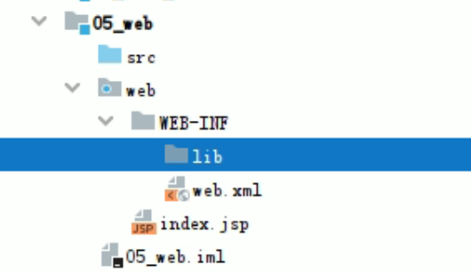

# JavaWeb

## 1 基本概念

## 2 Web 资源的分类

- 静态资源：html、css、js、txt、mp4、jpg
- 动态资源：jsp 页面、servlet 程序

## 3 常用的 Web 服务器

- Tomcat：轻量级的 JavaWeb 容器
- Jboss
- GlassFish
- Resin
- WebLogic

## 4 Tomcat 服务器和 Servlet 版本的对应关系


# Tomcat

## 1 安装

## 2 目录介绍

- `bin`：存放服务器的可执行程序
- `conf`：存放服务器的配置文件
- `lib`：存放服务器的 jar 包
- `logs`：存放服务器运行时输出的日志
- `temp`：存放服务器运行时产生的临时数据
- `webapps`：存放部署的 web 工程（一般这里面每一个目录为一个工程）
- `work`：服务器工作时的目录，存放 Tomcat 运行时 jsp 翻译为 Servlet 的源码，和 Session 钝化的目录

## 3 启动 Tomcat

### 3.1 方式一

双击 Tomcat 中 `bin` 目录下的 `startup.bat` 文件。

在浏览器中输入一下地址进行测试：

- `http://localhost:8080`
- `http://127.0.0.1:8080`
- `http://本机真实ip:8080`

常见启动失败的情况：启动后小黑框一闪而过。

原因：没有配置好 `JAVA_HOME` 环境变量。

### 3.2 方式二

进入 Tomcat 中 `bin` 目录下，执行 `catalina run`。

优点：可以看见错误信息。

## 4 停止 Tomcat

- 直接关闭 Tomcat 服务器窗口
- 把 Tomcat 服务器窗口置为当前窗口，然后按 `Ctrl+C` 结束程序的运行
- 双击 Tomcat 中 `bin` 目录下的 `shutdown.bat` 文件（最常用）

## 5 修改 Tomcat 端口号

> - MySQL 默认的端口号为：3306
> - Tomcat 默认的端口号为：8080

如何修改？

找到 Tomcat 中 `conf` 目录下的 `server.xml` 文件并打开，找到如下位置：

```xml
<Connector port="8080" protocol="HTTP/1.1"
           connectionTimeout="20000"
           redirectPort="8443" />
```

可以修改 `port` 属性为你需要的端口号（1024 - 65535）。

修改完以后需要重启 Tomcat 才能生效。

> Http 协议默认的端口号是：80（浏览器默认访问的端口）
>
> 平时我们访问百度，其实是输入了：`http://www.baidu.com:80`

## 6 部署 web 工程到 Tomcat 上

### 6.1 方式一

把 web 工程的目录拷贝到 Tomcat 的 `webapps` 目录下即可。

访问时在浏览器输入：`http://ip:port/工程名/目录名/文件名`

### 6.2 方式二

在 Tomcat 中 `conf/catalina/localhost` 目录下创建如下配置文件：`xxx.xml`

`xxx.xml` 内容如下：

```xml
<Context path="/abc" docBase="E:\..." />
```

说明：

- `path`：工程的访问路径
- `docBase`：工程目录的位置

## 7 默认工程和页面

- 当我们在浏览器中输入访问地址 `http://ip:port/`，没有工程名，默认访问的是 `ROOT` 工程
- 当我们在浏览器中输入访问地址 `http://ip:port/工程名/`，没有资源名，默认访问的是 `index.html` 页面

## 8 IDEA 整合 Tomcat

在设置里找到 `Application Server` 并添加 `Tomcat Server`。

创建动态 web 工程：

创建一个新模块，如下所示：


创建成功后的目录如下：



说明：

- `src`：存放自己编写的 Java 代码
- `web`：存放 web 工程的资源文件，如：html、css、js 文件
- `WEB-INF`：是一个受服务器保护的目录，浏览器无法直接访问到此目录的内容
- `web.xml`：是整个动态 web 工程的配置部署描述文件，可以在这里配置很多 web 工程的组件
- `lib`：存放第三方 jar 包（还需要自己配置导入）

