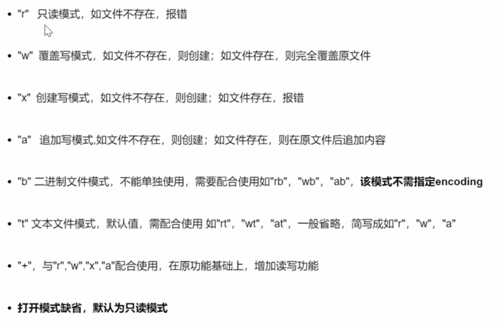
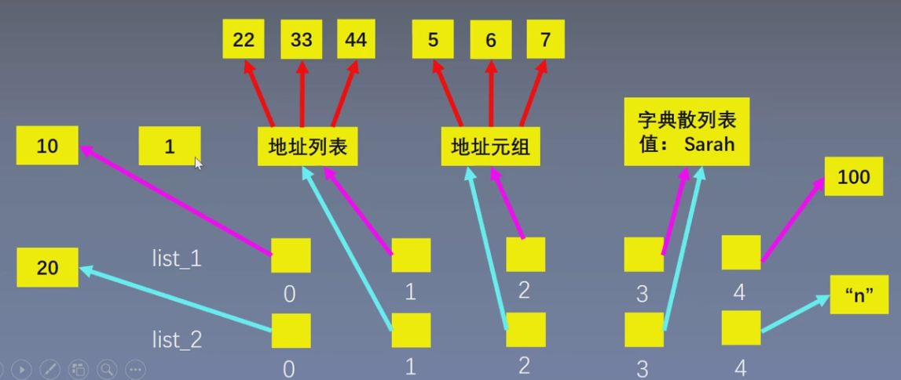

# 基础语法

## 1  数据类型

### 1.1  基本类型

#### 1.1.1  数字

```python
# 1.整型（int）
# 十进制转二进制
a = bin(16) # 0b10000
# 十进制转八进制
b = oct(16) # 0o20
# 十进制转十六进制
c = hex(16) # 0x10

# 转换结果为字符串类型
type(a) # str

# 二进制转十进制
d = int(a, 2) # 16
# 八进制转十进制
e = int(b, 8) # 16
# 十六进制转十进制
f = int(c, 16) # 16

# 2.浮点型（float）
# 计算机采用二进制小数来表述浮点数的小数部分，部分小数不能用二进制小数完全表示，可以四舍五入获得精确解。
(0.1 + 0.2) == 0.3 # False
0.1 + 0.2 # 0.30...04
b = round(0.3, 1) # 只保留1位小数
print(b) # 0.3

# 3.复数（complex）
# j或J都可以
# 虚部为1时，需要显示写出
2+1j
```

> 数据运算：
>
> - 整数与浮点数的运算结果是浮点数。
> - 除法运算的结果是浮点数。（`8/4 = 2.0`）

```python
# 加减乘除
(1+3-4*2)/5

# 乘方
2**3 # 8

# 整数商
13//5 # 2

# 模运算
13%5 # 3

# 绝对值
abs(-5) # 5
abs(3+4j) # 5，对于复数就是求模

# 幂次方
pow(2, 5) # 等价于2**5
pow(2, 5, 3) # 等价于(2**5)%3

# 四舍五入
a = 1.618
print(round(a)) # 2，默认四舍五入为整数
print(round(a, 2)) # 1.62
print(round(a, 5)) # 1.618，位数不足，不会补齐

# 整数商和模运算
divmod(13, 5) # (2, 3)，等价于(x//y, x%y)

# 最大值/最小值
a = [...]
max(a)
min(a)

# 求和
a = [...]
sum(a)
```

#### 1.1.2  字符串

```python
# 用单引号或双引号表示
"abc 123 @ 666"
'abc 123 @ 666'

# 双中有单，单中有双
# 双中有双，单中有单 -> 转义符\ -> 加在"前
print("\"python\" is good")

# 使用转义符\进行换行
s = "py\
thon"
print(s) # python

# 索引
a = "my name is peppa pig"
print(a[0]) # m
print(a[2]) # 空
print(a[5]) # m
# 反向索引
print(a[-1]) # g

# 切片
# 变量名[开始位置:结束位置:间隔]
# 间隔默认为1
# 左闭右开，不包括结束位置
s = "python"
print(s[0:3:1]) # pyt
print(s[0:3]) # pyt
print(s[0:3:2]) # pt
# 起始位置是0时可以省略
print(s[:6]) # python
# 结束位置省略，代表可以取到最后一个字符
print(s[:]) # python
# 可以使用反向索引
print(s[-6:]) # python

# 反向切片
s = "123456789"
# 倒序
print(s[-1:-10:-1]) # 123456789
# 起始位置是-1时可以省略
print(s[:-10:-1]) # 123456789
# 结束位置省略，代表可以取到第一个字符
print(s[::-1]) # 123456789

# 拼接
a = "..."
b = "..."
c = a + b

# 成倍复制
print(c*3)

# 成员运算
# 判断子集
str = "aaa bbb ccc"
"aaa" in str # True
# 遍历元素
for s in "python":
    print(s)

# 长度
s = "python"
len(s) # 6

# 字符编码
# 将中文字库、英文字母、数字、特殊字符等转化成计算机可识别的二进制数
# 每个单一字符对应一个唯一的互不重复的二进制编码
# Python中使用的是Unicode编码
# 字符 -> Unicode码
print(ord("1")) # 49
# Unicode码 -> 字符
print(chr(1010)) # c

# 分割
str = "a b c d"
str_list = str.split(" ") # 按空格进行分割

# 聚合
s = "12345"
s_join = "*".join(s) # "1*2*3*4*5"

# 删除两端特定字符
# 从两侧开始搜索，遇到指定字符执行删除，遇到非指定字符，搜索停止
# 左删除：lstrip
# 右删除：rstrip
s = "   abc   "
print(s.strip(" ")) # "abc"
print(s.lstrip(" ")) # "abc   "
print(s.rstrip(" ")) # "   abc"

# 字符替换
s = "python is good"
s1 = s.replace("python","py")
print(s1) # "py is good"

# 字符统计
s = "python is an excellent language"
print(s.count("an")) # 2

# 全部大写
s.upper()
# 全部小写
s.lower()
# 首字母大写
s.title()
```

#### 1.1.3  布尔

```python
# 布尔值只有True或False
x = 2 < 1 # false

# 只要有一个非0，就是True
# 0 False None 都是 0
print(any([False,1,0,None])) # True

# 全部非0才是True
print(all([False,1,0,None])) # False
```

### 1.2  组合类型

#### 1.2.1  列表

列表（list）：数据有位置顺序。

``` python
a = [1, 2, 3, 4, 5]
a[0] # 1

# 一个列表可以使用多种类型元素
ls = ['python', 1989, True, {"version":3.7}]

# 列表是可变的，可以对元素进行增删改查

# 通过list(可迭代对象)创建列表
# 可迭代对象包括：字符串、元组、集合、range()等。

# 打印0-5，即[0,6)
for i in range(6):
    print(i)
# range(起始数字,终止数字,间隔)
# 起始数字可以省略，默认为0；必须有终止数字；间隔可以省略，默认为1。

# 长度、索引和切片与字符串相同
len(ls)
ls[0]

# 拼接
a = [1, 2]
b = [3, 4]
a + b # [1, 2, 3, 4]

# 成倍复制进行初始化
c = a * 10

# 末尾增加元素
ls.append(...)
# 任意位置插入：insert(插入位置,待插入元素)
ls.insert(1, 8)
# 插入另一个列表
ls.extend([...])

# 根据位置删除元素：pop(删除元素的位置)，默认是删除最后一个元素
ls.pop(1)
# 根据内容删除元素：会删除第一个找到的待删元素
ls.remove(...)

# 查找元素
# 返回列表中第一次出现待查元素的位置：列表.index(待查元素)
languages = ['Python', 'C', 'R', 'Java']
idx = languages.index("R")
print(idx) # 2

# 修改元素
languages[1] = "C++"

# 复制列表（浅拷贝）
# 方式一：copy()
languages_2 = languages.copy()
# 方式二：切片
languages_3 = languages[:]

# 排序（默认递增）
ls = [...]
ls.sort()
# 递减排序
ls.sort(reverse = True)
# 临时排序（原列表保持不变，返回排序后的列表）
ls_2 = sorted(ls)

# 翻转（永久）
ls = [...]
ls.reverse()

# 遍历
for i in ls:
    print(i)
```

#### 1.2.2  元组

元组（tuple）：元素是只读的，不可修改（除了不支持增删改以外，其它的操作和列表完全相同）。

```python
a = (1, 2, 3, 4, 5)
a[0] # 1

# 打包返回
def f(x):
    return x**2, x**3
print(f(3)) # (9, 27)，是一个元组类型
# 解包赋值
a, b = f(3)
print(a) # 9
print(b) # 27

# 打包组合
numbers = [1, 2, 3]
name = ["小明", "小红", "小强"]
list(zip(numbers, name))
# 解包赋值
for number, name in zip(numbers, name):
    print(number, name)
```

#### 1.2.3  字典

字典（dict）：K-V、无序。

```python
students = {111:"小明", 222:"小红", 333:"小强"}
students[111] # 小明

# 长度
len(students) # 3

# 增
students[新键] = 新值

# 删
del students[待删除元素的键]
# 删除的同时获得删除键值对的值
value = students.pop(待删除元素的键)
# 随机删除一个键值对，并以元组返回删除的键值对
k, v = students.popitem()

# 改
students[键] = 新值

# get()
students.get(key, default)

# 分别获取键和值的集合
list(students.keys())
list(students.values())

# 获取键值对的集合并遍历
for k, v in students.items():
    print(k, v)
```

> 注意：字典的键必须唯一，且是不可变类型。
>
> - 不可变类型：数字、字符串、元组。
> - 可变类型：列表、字典、集合。

#### 1.2.4  集合

集合（set）：去重、无序（元素必须是不可变类型：数字、字符串、元组）。

```python
s = {1, 2, 3, 1}
s # {1, 2, 3}

# 取交集
s1 & s2

# 取并集
s1 | s2

# 取s1和s2中的非共同元素
s1 ^ s2

# 取在s1中但不在s2中的元素
s1 - s2

# 增加元素
s.add(...)

# 删除元素
s.remove(...)

# 长度
len(...)
```

## 2  变量

### 2.1  定义

变量的定义：变量名、赋值。

```python
x = 1
```

### 2.2  命名

大写字母、小写字母、数字、下划线、汉字及其组合。

错误命名：

- 第一个字符不能为数字。
- 不能与保留字相同。


命名技巧：

- 变量名、函数名：用 `_` 连接多个单词。
- 类名：驼峰命名。
- 常量：所有字母大写。

### 2.3  赋值

```python
# 1.一般赋值
x = 1 + 2

# 2.增量赋值
x = x + 1
x += 1

# 3.打包赋值
x, y = 1, 2
```

## 3  控制流程

### 3.1  顺序

### 3.2  循环

```python
# for
res = 0
for i in [1, 2, 3, 4, 5]:
    res += i
res # 15

# while
i = 1
res = 0
while i <= 5:
    res += i
    # python没有i++的这种写法
    i += 1
res # 15

# 终止循环：break、continue

# for结合else
# 如果for循环全部执行完毕，没有被break终止，则运行else块。
for i in ...:
    if i == 2:
        break
else:
    # ...

# while结合else（与上面同理）
while ...:
    # ...
else:
    # ...
```

### 3.3  分支

```python
age = 18
if age > 22:
    # ...
elif age > 30:
    #...
else:
    # ...
```

判断是否为空：

```python
# 方式一（最清晰明了）
if x is None

# 方式二
if not x

# 方式三
if not x is None
```

> 注意：在 Python 语言中，`None`、`""`、`0`、`[]`、`{}` 都相当于 `False`。

## 4  IO

### 4.1  读取输入

```python
# input()读取后的数据为字符串类型
x = input("...") # 3
y = input("...") # 4.5
x + y # 34.5
type(x) # str

# 使用eval()去除''
x = eval(input("...")) # 3
y = eval(input("...")) # 4.5
x + y # 7.5
```

### 4.2  打印输出

```python
# 1.一般输出
print("...")
print(123)
x = 123
print(x)
# print()打印后会自动换行
# 使用end控制不换行
print(123, end = 456)
print(789) # 123456789

# 2.组合输出
x = 123
y = 456
print("x = ", x, " y = ", 456) # x = 123 y = 456

# 3.格式化输出
x = 1
y = 2
print("x = {0}, y = {1}".format(x, y)) # x = 1, y = 2
# 保留小数
PI = 3.1415926
print("{0:.2f}".format(PI)) # 3.14
# 百分号
x = 0.81872
print({0:.1%}.format(x)) # 81.9%
# 科学计数法
print({0:.2e}.format(x)) # 8.19e-01
# 进制转换
# ...
```

格式化输出总结：


## 5  函数

### 5.1  定义

函数名使用小写字母、下划线组成。

```python
# 函数的定义
def 函数名(参数):
    # 函数体
    return 返回值

# 函数的调用
函数名(参数)
```

> 注意：多个函数的定义之间一般空两行。

### 5.2  参数

函数的参数：形参、实参。

```python
# 1.位置参数
def function(x, y, z):
    print(x, y, z)
function(1, 2, 3) # x=1, y=2, z=3

# 2.关键字参数
function(y=1, z=2, x=3) # x=3, y=1, z=2
# 混合使用：位置参数必须放在关键字参数的前面。
function(1, z=2, y=3) # x=1

# 3.默认参数
# 位置参数必须在默认参数的前面，调用函数时，可以不对该形参传值。
def register(name, age, sex="male"):
    print(name, age, sex)
register("...", 18)
# 默认参数应该设置为不可变类型（数字、字符串、元组）。
# 默认参数的等号两侧不需要加空格。

# 4.可选参数
def name(first_name, last_name, middle_name=None):
    if middle_name:
        return first_name + middle_name + last_name
    else:
        return first_name + last_name
print("大", "仔")
print("大", "仔", "杰")

# 5.可变长参数
# 不知道会传来多少参数（*args），必须放到参数列表的最后。
def f(x, y, z, *args):
    print(x, y, z)
    print(args)
f(1, 2, 3, 4, 5, 6) # 多余的参数会打包并传递给args
f(1, 2, 3, [4, 5, 6]) # [4, 5, 6]为一个元素
# 实参打散
# 打散的是列表、字符串、元组、集合。
f(1, 2, 3, *[4, 5, 6]) # 4, 5, 6分别是一个元素

# 多余的参数，以字典的形式打包并传递给kwargs。
def f(x, y, z, **kwargs):
    print(x, y, z)
    print(kwargs)
f(1, 2, 3, a=4, b=5, c=6) # {'a':4, 'b'=5, 'c'=6}
# 实参打散
f(1, 2, 3, **{"a":4, "b":5, "c":6}) # {'a':4, 'b'=5, 'c'=6}
```

### 5.3  变量

函数的变量：局部变量、全局变量。

```python
# 使用global在函数体内定义全局变量。
def multipy(x, y):
    global z
    z = x * y
    return z

multipy(2, 9)
print(z) # 18
```

### 5.4  返回值

当函数有多个返回值，使用逗号隔开；函数可以没有返回值。

### 5.5  匿名函数

```python
# 基本形式
lambda 变量: 函数体

# 示例一：排序
ls = [(93, 88), (79, 100), (86, 71)]
ls.sort() # 默认是按每一个元素的第一个数字升序排序
# 使用每一个元素的第二个数字升序排序
ls.sort(key = lambda x: x[1])
# 使用每一个元素两个数字的和升序排序
ls.sort(key = lambda x: x[0]+x[1])

# 示例二：求最大值
# 求每一个元素的第二个数字的最大值
n = max(ls, key = lambda x: x[1])
# 求最小值min同理
```

## 6  面向对象

### 6.1  定义

三要素：类名（驼峰命名法）、属性、方法。

```python
# 创建类
class Cat():
    
    def __init__(self, name):
        self.name = name
        
    def jump(self):
        # ...

        
# 创建对象（实例）   
my_cat = Cat("...")

# 调用属性和方法
print(my_cat.name)
my_cat.jump()
```

> 注意：类的前后都要空两行，清晰美观。

### 6.2  实例

### 6.3  继承

语法：`class 子类名(父类名)`

```python
# 父类
class Car():
    
    def __init__(self, brand, model, year):
        self.brand = brand
        # ...
        self.mileage = 0
        
    def get_main_information():
        # ...
    
    # 其它方法
    

# 子类    
class ElectricCar(Car):
    
    def __init__(self, brand, model, year, battery_size):
        # 声明继承父类的属性
        super().__init__(brand, model, year)
        # 子类特有属性
        self.battery_size = battery_size
        self.electric_quantity = battery_size # 电池容量
        # ...
        
    # 自动继承父类的所有方法（可以重写父类的方法）
    
    # 可以定义子类特有的方法
```

## 7  文件读写

### 7.1  打开文件

#### 7.1.1  通用格式

```python
# 通用格式
with open("文件路径", "打开模式", encoding = "操作文件的字符编码") as f:
    "对文件进行读写"
# with的特点：执行完毕后会自动close文件。

# 示例
with open("E:\ipython\测试文件.txt", "r", encoding = "gbk") as f:
    text = f.read() # 读取文件
    print(text)
```

> 注意：当程序与要打开的文件在同一文件夹下时，可以直接写文件名，省略路径。

#### 7.1.2  打开模式



#### 7.1.3  字符编码

- 万国码：utf-8
- 中文编码：gbk（Windows 系统默认）

> 注意：
>
> - 建议不要缺省  `encoding` 字段。
> - 当使用 `utf-8` 读取中文时，会出现乱码。

### 7.2  读取文件

```python
# 1.读取文件
f.read()

# 2.逐行读取
f.readline()
# 示例
while True:
    text = f.readline()
    if not text:
        break # 读取完了
    else:
        print(text, end="") # 保留原文的换行，使print()的自动换行失效

# 3.读入所有行，以每行为元素形成一个列表
f.readlines()
# 示例
for text in f.readlines():
    print(text)
```

> 注意：
>
> - 文本中的空行实际是一个 `"\n"`，文本的末尾实际是一个 `""`。
> - 原文每行的末尾已经有了一个 `"\n"`，因此需要取消掉 `print()` 的自动换行。
> - 文件较大时，`read()` 和 `readlines()` 占用内存过大，不建议使用，`readline()` 又不太方便，可以直接迭代 `f` 对象：`for text in f: ...`。

### 7.3  写入文件

```python
# 1.写入字符串或字节流（二进制）
with open("...txt", "w", encoding="utf-8") as f:
    f.write("...")
    # ...
    
# 2.追加写

# 3.将一个元素为字符串的列表整体写入文件
ls = ["...", "...", "..."]
with open(...) as f:
    f.writelines(ls)
```

### 7.4  既读又写

- `"r+"`：指针在文件的开头，需要将指针移动到末尾（`f.seek(...)`）再开始写。
- `"w+"`：若文件已存在，会清空原内容。
- `"a+"`：指针在文件的末尾，添加新内容，不会清空原内容。

```python
# 指针偏移
f.seek(偏移字节数, 位置)
# 位置：
# 0：文件开头
# 1：当前位置
# 2：文件末尾
```

### 7.5  数据的读取与存储

#### 7.5.1  csv

```python
# 读取
with open("xxx.csv", "r", encoding="gbk") as f:
    ls = []
    for line in f:
        # 去掉换行符，然后用","进行分割，每行返回一个列表
        ls.append(line.strip("\n").split(","))

# 写入
ls = [...]
with open("xxx.csv", "w", encoding="gbk") as f:
    for row in ls:
        # 用逗号组合成字符串，并在末尾添加换行符
        f.write(",".join(row) + "\n")
```

> 注意：可以使用 `pandas` 库实现对 `.csv` 文件的读取和写入。

#### 7.5.2  json

```python
# 读取
with open("scores.json", "r", encoding="utf-8") as f:
    scores = json.load(f) # 加载整个对象
    for k,v in scores.items():
        print(k,v)
        
# 写入
socres = {...} # 字典（json对象）
with open("scores.json", "w", encoding="utf-8") as f:
    json.dump(scores, f, indent=4, ensure_ascii=False)
# indent：表示字符串换行+缩进。
# ensure_ascii=False：表示显示中文。
```

## 8  异常处理

### 8.1  常见错误

### 8.2  异常处理

```python
try:
    # ...
except NameError:
    # ...
except IndexError:
    # ...
except KeyError:
    # ...
else:
    # 若try语句块执行正常，则执行else中的内容
finally:
    # 不论是否触发异常，都会得到执行
    
# 万能异常：Exception
# 获取错误的值（不能获取错误的类型）
try:
    # ...
except Exception as e:
    print(e)
```

## 9  模块

### 9.1  分类

- Python 内置模块（time、random、collection、itertools）
- 第三方库（numpy、pandas、matplotlib、scikit-learn、Tensorflow）
- 自定义文件（单独文件、包）

### 9.2  导入

#### 9.2.1  导入整个模块

```python
import time

# 调用方式：模块名.函数名或类名
start = time.time()
time.sleep()
end = time.time()
print("程序运行用时：{:.2f}秒".format(end-start))
```

#### 9.2.2  从模块中导入指定的类或函数

```python
from itertools import product

# 调用方式：函数名或类名（不用再指定模块）
ls = list(product("AB", "123"))
print(ls)

# 从某个包中的模块导入类或函数
from function.fun1 import f1
f1()
# 一次导入多个模块
from function import fun1, fun2
# 调用函数时需要指定其所属的模块
fun1.f1()
fun2.f2()
```

「包」：由多个 `.py` 文件组成，并且一定需要有一个 `__init__.py` 文件，该文件可以为空。


> 注意：这里的模块实际上指的就是 `.py` 文件。

#### 9.2.3  导入模块中所有的类和函数（不推荐）

```Python
from random import *

# 调用方式：函数名或类名
print(random())
```

### 9.3  查找路径

优先级从高到低：

1. 内存中已经加载的模块。
2. 内置模块：Python 启动时，会默认加载一些 modules 存放在 `sys.modules` 中。
3. `sys.path` 路径中包含的模块。
   - `sys.path` 的第一个路径是当前执行文件所在的文件夹。
   - 若需将不在该文件夹内的模块导入，则需要将模块的路径添加到 `sys.path` 中。

# 底层实现

## 1  列表

### 1.1  底层实现

列表存储的实际上是其元素的地址，即是一个「引用数组」。

> 引用数组：
>
> - 列表内的元素可以分散地存储在内存中。
> - 地址的存储在内存中是连续的。

### 1.2  浅拷贝

```python
list_1 = [1, [22, 33, 44], (5, 6, 7), {"name": "sarah"}]

# 错误！只是重新取了个别名
list_2 = list_1

# 浅拷贝
list_3 = list_1.copy() # 或：list_1[:]、list(list_1)
list_3[1].append(55)
# list_1、list_2中的第二个元素都变为了[22, 33, 44, 55]
```

初始列表：


将两个列表中的第一个元素分别修改为 10 和 20：



将列表二的第二个元素（地址列表）进行修改，列表一的第二个元素也会发生变化：


将列表二的第三个元素（地址元组）进行修改，列表一的第三个元素却不会发生变化：


原因：元组是不可变的类型，当对其进行修改（例如增加元素）时，会产生一个新的元组。

将列表二的第四个元素（字典散列表）进行修改，列表一的第四个元素也会发生变化。

> 总结：
>
> - 可变类型：如列表、字典，其内容可以发生变化，而地址不变。
> - 不可变类型：如数字、字符串、元组，一旦其内容发生变化，则地址也会发生变化（会创建一个新的）。

### 1.3  深拷贝

```python
import copy

# 深拷贝
list_2 = copy.deepcopy(list_1)
```

## 2  字典

### 2.1  底层实现

通过「稀疏数组」来实现值的存储与访问。

> 稀疏数组：数组的许多元素为空，即稀疏的数组。

### 2.2  创建过程

## 3  字符串

### 3.1  底层实现

通过「紧凑数组」实现字符串的存储，数据（字符）在内存中是连续存放的。

## 4  不可变类型

不可变类型在其生命周期中保持内容不变，如果改变了（如 `+=` 操作）就不是它自己了（创建了一个新的对象），如：数字、字符串、元组。

# 特殊语法

## 1  解析语法

### 1.1  列表推导

列表推导：使用解析语法创建列表。

#### 1.1.1  基本结构

基本结构：`[expression for value in iterable if condition]`

三要素：

- 表达式
- 可迭代对象
- if 条件（可省略）

#### 1.1.2  执行过程

1. 从可迭代对象中拿出一个元素。
2. 通过 if 条件对元素进行筛选（可省略）：
   - 若为 True，则把元素传递给表达式。
   - 若为 False，则继续进行下一次迭代。
3. 将传递给表达式的元素代入表达式进行处理。
4. 将表达式处理的结果加入列表。

```python
# 等价于如下过程：
list = []
for value in iterable:
    if condition:
        list.append(expression)
```

#### 1.1.3  示例

```python
# 创建一个5行10列，元素全为0的矩阵
ls = [[0]*10 for i in range(5)]

# 求20以内的奇数的平方
ls = [i**2 for i in range(1,21) if i%2 == 1]

# 支持多变量
x = [1, 2, 3]
y = [1, 2, 3]
ls = [i*j for i,j in zip(x, y)] # [1, 4, 9]

# 支持循环嵌套
colors = [...]
sizes = [...]
ls = ["{} {}".format(color, size) for color in colors for size in sizes]
# 等价于如下：
for color in colors:
    for size in sizes:
        # ...
```

### 1.2  字典推导

```python
dic = {i: i**2 for i in range(10)}
```

### 1.3  集合推导

```python
set = {i**2 for i in range(10)}
```

### 1.4  生成器表达式

```python
s = (i**2 for i in range(10))
```

> 注意：不存在元组类型的推导，因为元组是不可变的类型。

## 2  条件表达式

```python
# 如果condition成立，则返回expr1，否则返回expr2。
expr1 if condition else expr2
```

## 3  生成器

### 3.1  基本概念

- 惰性计算。
- 无需一次存储海量数据。
- 一边执行一边计算，只计算每次需要的值。
- 实际上一直在执行 `next()` 操作，直到无值可取。

### 3.2  生成器表达式

```python
s = (i**2 for i in range(10000000))
```

### 3.3  生成器函数

原理：在每次调用 `next()` 的时候，遇到 `yield` 语句则返回，再次执行时会从上次返回的 `yield` 语句处继续执行。

```python
# 生成斐波拉契数列
def fib(max):
    n, a, b = 0, 1, 1
    while n < max:
        yield a
        a, b = b, a + b
        n = n + 1

# 获取生成器
fib(10)

# 获取数列
for i in fib(10):
    print(i)
```

## 4  迭代器

### 4.1  可迭代对象

可迭代对象（iterable）：可用于 for 循环的对象，包括：

- 列表
- 元组
- 字符串
- 字典
- 集合
- 文件

可以使用 `isinstance()` 判断一个对象是否是 `Iterable` 类型的对象。

```python
ls = [...]
isinstance(ls, Iterable)
```

### 4.2  迭代器

生成器不但可以用于 for 循环，还可以被 `next()` 函数调用。

```python
# 创建生成器
s = (i**2 for i in range(5))

# 获取生成器中的元素
print(next(s))
# ...
print(next(s))
# 直到没有数据可取，抛出StopIterable异常
```

可以被 `next()` 函数不断调用并返回下一个值，直到没有数据可取的对象就称为迭代器（Iterator）。

> 生成器是迭代器；列表、元组、字符串、字典、集合不是迭代器。

```python
# 可以通过iter()创建迭代器
iter([1, 2, 3])

# itertools里的函数是迭代器
x = [...]
y = [...]
zip(x, y)
# 枚举
nums = [1, 2, 3]
enumerate(nums)

# 文件是迭代器
with open("xxx.txt", "r", encoding="utf-8") as f:
    # 这里的f是一个迭代器
    
# 迭代器是可耗尽的（取不到值时会抛出异常）
```

> 注意：`range()` 不是迭代器，而是一种序列，它不包含任何内存中的内容，而是通过计算来回答问题。

## 5  装饰器

### 5.1  函数对象

函数是 Python 中的第一类对象（class function）：

- 可以把函数赋值给变量。
- 对该变量进行调用，可以实现原函数的功能。

```python
# square是function类的一个实例
def square(x):
    return x**2

pow_2 = square # 相当于给square函数起了一个别名
print(pow_2(5)) # 25
```

### 5.2  高阶函数

- 接收函数作为参数。
- 返回一个函数。

```python
def square(x):
    return x**2

# 高阶函数
def pow_2(fun):
    return fun

f = pow_2(square)
f(8)
```

### 5.3  嵌套函数

嵌套函数：在函数内部定义一个函数。

```python
def outer():
    # ...
    
    # 嵌套函数
    def inner():
        # ...
        
    inner()

    
outer()
```

### 5.4  闭包

「闭包」：延伸了作用域的函数。如果一个函数定义在另一个函数的作用域内，并且引用了外层函数的变量，则该函数称为闭包。

闭包是由函数及其相关的引用环境组合而成的实体（闭包 = 函数 + 引用环境）。

```python
def outer():
    x = 1
    z = 10
    
    def inner():
        y = x + 100
        return y, z
    
    return inner


# 实际上f包含了inner()函数本身 + outer()函数的环境
f = outer()
print(f)
```

一旦在内层函数重新定义了相同名字的变量，则变量成为局部变量。

```python
def outer():
    x = 1
    
    def inner():
        # 这里x成为了局部变量，后面的x在调用时找不到定义，会报错
        x = x + 100
        return x
    
    return inner


f = outer()
f() # 报错
```

使用 `nonlocal` 允许内嵌的函数来修改闭包变量。

```python
def outer():
    x = 1
    
    def inner():
        nonlocal x
        x = x + 100
        return x
    
    return inner


f = outer()
f()
```

### 5.5  装饰器

```python
import time

def timer(func):
    
    def inner():
        start = time.time()
        func()
        end = time.time()
        # 输出end-start
        
    return inner


# 方式一
def f1():
    time.sleep(1)

    
f1 = timer(f1)

# 方式二：语法糖
@timer # 使用注解指定被修饰的方法
def f1():
    time.sleep(1)


f1()
```

当被修饰函数有参数时，使用 `*arg` 和 `**kwargs` 接收参数。

```python
def outer(func):
    
    def inner(*arg, **kwargs):
        # ...
        func(*arg, **kwargs)
        # ...
        
    return inner


@timer
def f1(n):
    time.sleep(n)
    
    
f1(2)
```

当被修饰函数有返回值时，可以先收集结果再进行返回。

```python
def outer(func):
    
    def inner(*arg, **kwargs):
        # ...
        res = func(*arg, **kwargs)
        # ...
        return res
        
    return inner
```

装饰器本身也可以带有参数，以实现对不同函数进行不同的修饰。

```python
def timer(method):
    
    def outer(func):
        
        def inner(*arg, **kwargs):
            
            if method == "origin":
                # ...
            elif method == "double":
                # ...
            # return ...
        
        return inner
    
    return outer


@timer(method="origin")
def f1():
    time.sleep(1)
    
    
@timer(method="double")
def f2():
    time.sleep(1)
    
    
f1()
f2()
```

> 注意：被修饰函数一经装饰（即加上注解），就已经被调用了。

# 标准库

## 1  time

### 1.1  获取当前时间

```python
# 本地时间
time.localtime()

# UTC世界统一时间（北京时间比UTC世界统一时间早8小时）
time.gmtime()

# 本地时间字符串（形式更直观）
time.ctime()
```

### 1.2  时间戳与计时器

```python
# 返回自纪元以来的秒数，记录sleep()
time.time()

# 随意选取一个时间点，记录当前时间到该时间点的间隔秒数，记录sleep
# 精度比time()更高
time.perf_counter()

# 随意选取一个时间点，记录当前时间到该时间点的间隔秒数，不记录sleep
time.process_time()
```

### 1.3  格式化输出

```python
lctime = time.localtime()
time.strftime("%Y-%m-%d %A %H:%M:%S", lctime)
```

### 1.4  休眠

```python
time.sleep()
```

## 2  random

### 2.1  随机种子

- 伪随机数：相同的种子会产生相同的随机数。
- 如果不设置随机种子，以系统当前时间为默认值。

```python
from random import *

seed(10)
print(random) # num1
seed(10)
print(random) # num2与num1相等
```

### 2.2  随机整数

```python
# randint(a, b)：产生[a,b]之间的随机整数
nums = [randint(1, 10) for i in range(10)]

# randrange(a)：产生[0,a)之间的随机整数
nums = [randrange(10) for i in range(10)]

# randrange(a, b, step)：产生[a,b)之间以step为步长的随机整数
nums = [randrange(0, 10, 2) for i in range(10)] # 只取偶数
```

### 2.3  随机浮点数

```python
# random()：产生[0.0, 1.0]之间的随机浮点数
nums = [random() for i in range(10)]

# uniform(a, b)：产生[a,b]之间的随机浮点数
nums = [uniform(2.1, 3.5) for i in range(10)]
```

### 2.4  序列随机元素

```python
# choice(seq)：从序列类型中随机返回一个元素
seq = ['a', 'b', 'c']
choice(seq)

# choices(seq, weights=None, k)：对序列类型进行k次重复采样，可设置权重
choices(seq, k=5)
choices(seq, [4, 4, 2], k)

# shuffle(seq)：将序列类型中的元素随机排列，返回打乱后的序列
shuffle(seq)

# sample(pop, k)：从pop类型中随机选取k个元素，以列表类型返回
sample(seq, k=3)
```

### 2.5  概率分布

```python
# guass(mean, std)：产生一个符合高斯分布的随机数
num = gauss(0, 1)
```

## 3  collections

### 3.1  具名元组

具名元组（`namedtuple`）：构建一个新的元组子类。

定义方法：

- `typename`：元组的名字。
- `field_names`：域名，即元组中元素的名字。

```python
# 点的坐标，仅看数据，很难知道这是一个点的坐标
p = (1, 2)

# 定义具名元组
Point = collections.namedtuple("Point", ["x", "y"])
p = Point(1, y=2)

# 通过域名调用属性
print(p.x)
print(p.y)

# 或者使用元组的方式调用
print(p[0])
print(p[1])

# 赋值
x, y = p
```

### 3.2  计数器

计数器（Counter）：是字典的一个子类。

```python
from collections import Counter

s = "..."
cnt_str = Counter(s)

ls = [...]
cnt_list = Counter(ls)

# 统计n个频率最高的元素和记数
cnt_list.most_common(1)

# 元素展开
list(cnt_list.elements())
```

### 3.3  双向队列

双向队列（`deque`）：可以方便地在队列两边高效、快速地增加和删除元素。

```python
from collections import deque

d = deque('cde')

# 右端增加
d.append(...)
# 左端增加
d.appendleft(...)

# 右端删除
d.pop()
# 左端删除
d.popleft()
```

## 4  itertools

### 4.1  排列组合迭代器

#### 4.1.1  笛卡尔积

```python
from itertools

for i in itertools.product('ABC', '01'): # 共6种组合
    print(i)
    
for i in itertools.product('ABC', repeat=3): # ABC重复3次
    print(i)
```

#### 4.1.2  排列

```python
for i in itertools.permutations('ABCD', 3): # 3是排列的长度
    print(i)
    
for i in itertools.permutations(range(3)) # 0、1、2进行排列
```

> 注意：排列的元素是有顺序（先后）的。

#### 4.1.3  组合

```python
for i in itertools.combination('ABCD', 2): # 2是组合的长度
    print(i)
    
for i in itertools.combination(range(4), 3)

# 元素可重复的组合
for i in itertools.combination_with_replacement('ABC', 2):
    print(i)
```

### 4.2  拉链

#### 4.2.1  短拉链

```python
for i in zip("ABC", "012", "xyz"):
    print(i)
# ('A', '0', 'x')
# ('B', '1', 'y')
# ('C', '2', 'z')

# 长度不一时，执行到最短的对象处就停止
for i in zip("ABC", "012345"):
    print(i)
# ('A', 0)
# ('B', 1)
# ('C', 2)
```

#### 4.2.2  长拉链

```python
# 长度不一时，执行到最长的对象处就停止，缺省元素用None替代
for i in itertools.zip_longest("ABC", "012345"):
    print(i)
    
# 缺省元素用指定字符替代
for i in itertools.zip_longest("ABC", "012345", fillvalue = "?"):
    print(i)
```

### 4.3  无穷迭代器

#### 4.3.1  计数

```python
# 创建一个迭代器，从start开始，返回均匀间隔的值
itertools.count(10)
# 10 11 12 ...
```

#### 4.3.2  循环

```python
# 创建一个迭代器，返回迭代器中所有的元素，无限重复
itertools.cycle("ABC")
# A B C A B C ...
```

#### 4.3.3  重复

```python
# 创建一个迭代器，不断重复object，除非设定参数times，否则无限循环
for i in itertools.repeat(10, 3):
    print(i)
# 10 10 10 ...
```

### 4.4  其它

#### 4.4.1  锁链

```python
# 把一组迭代对象串联起来，形成一个更大的迭代器
for i in itertools.chain('ABC', [1, 2, 3]):
    print(i)
# A B C 1 2 3
```

#### 4.4.2  枚举

```python
# 产出由两个元素组成的元组，结构是(index,item)，其中index从start开始，item从iterable中取
for i in enumerate("Python", start=1): # 是Python内置的
    print(i)
# (1, 'P') (2, 'y') (3, 't') ...
```

#### 4.4.3  分组

```python
# 创建一个迭代器，按照key指定的方式，返回iterable中连续的键和组
# 一般来说，需要预先对数据进行排序
# key为None时，默认把连续重复元素分组
for key, group in itertools.groupby('AAABBBBCCCDDDAAABB'):
    print(key, list(group))
# A ['A', 'A', 'A']
# B ['B', 'B', 'B', 'B']
```

# Numpy

# Pandas

# Matplotlib

# Sklearn
